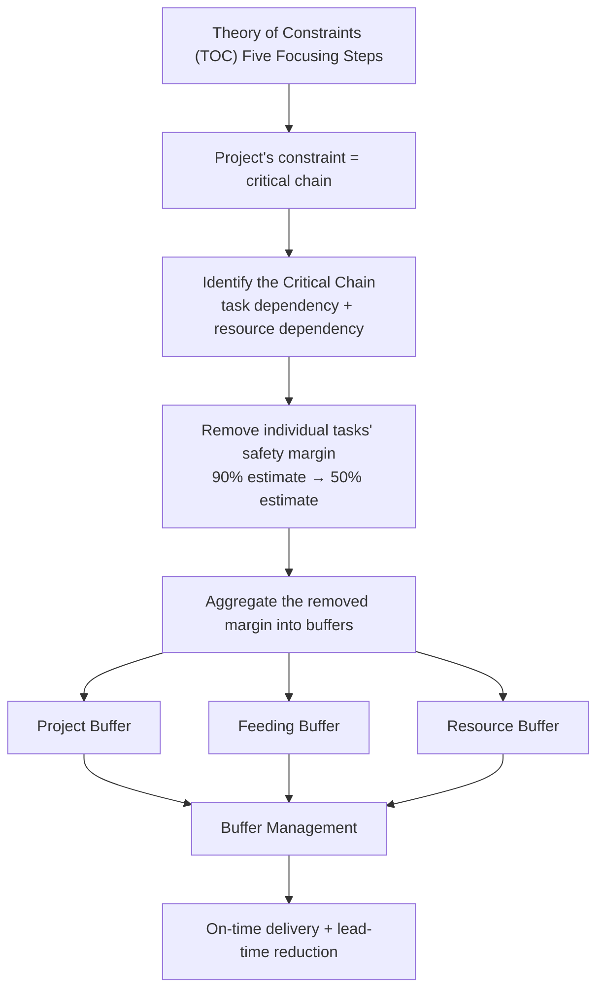
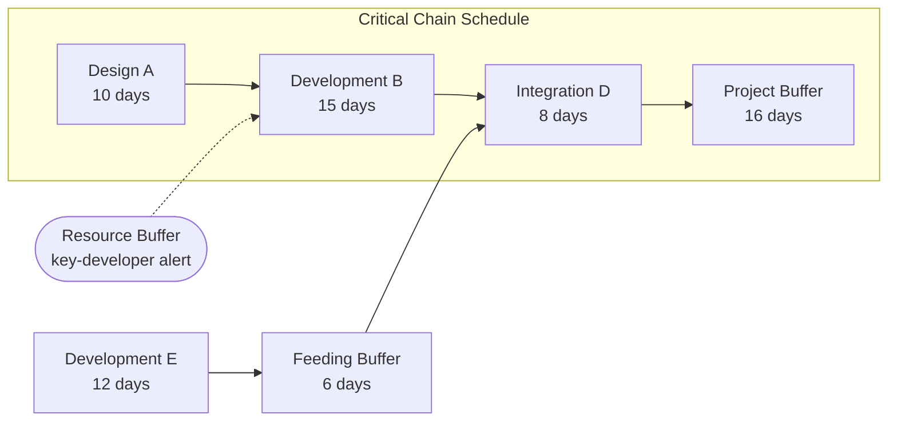
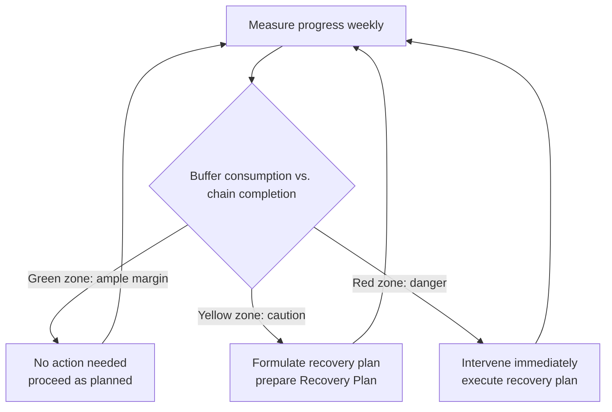

# Critical Chain Project Management (CCPM)

## 1. Overview

> **Definition**: Critical Chain Project Management (CCPM) is a methodology that applies the Theory of Constraints (TOC) to project scheduling. It identifies the **longest chain of dependent tasks (the critical chain), considering not only the precedence relationships among tasks but also resource constraints**, strips out the safety margin hidden in individual tasks, and **aggregates and manages it as shared buffers**, thereby pursuing on-time delivery and lead-time reduction at the same time.

The traditional scheduling techniques CPM (Critical Path Method) and PERT have been the standard of project management since the 1950s, yet in the field the paradox that "even though each task was finished as planned, the whole project is delayed" recurred. In his 1997 book *Critical Chain*, Eliyahu M. Goldratt found the cause in **the excessive safety time customarily included in task estimates, and the structure by which that margin is wasted due to human behavior**. CCPM's core idea is to remove this waste and manage the remaining safety margin in an integrated way at the project level.

Several structural problems lie behind CCPM's emergence. First, an assignee attaches a "just-in-case" margin to their task estimate and usually submits a safe estimate at about the 90% level. Second, the margin thus secured is consumed by the **Student Syndrome**—the behavior of starting only when the deadline is near—and **Parkinson's Law**—work expands to fill all the time given. Third, **bad multitasking**, handling several tasks at once, actually lengthens each task's lead time through switching costs. Fourth, a delay in an upstream task accumulates and propagates to downstream tasks, but the benefit of an early finish upstream vanishes because the downstream task is not ready (delays are passed on and margins are lost). In confronting such behavioral and structural losses head-on, CCPM is less a mere scheduling algorithm than **a management philosophy that combines behavioral science with the Theory of Constraints**.

From a professional engineer's perspective, CCPM is especially effective in projects where resources (key developers, architects) become bottlenecks and schedule risk is large, such as large-scale SI or next-generation system builds. Recently, as it extends into combination with Agile/Kanban and into multi-project portfolio management (multi-project CCPM), its practical implications remain significant.

## 2. CCPM's Conceptual Structure and Its Link to the Theory of Constraints (TOC)

CCPM transplants the Theory of Constraints' thinking system into projects. Under the premise that "a system's performance is determined by its weakest link (the constraint)," TOC maximizes total throughput by finding and intensively managing the constraint (the Five Focusing Steps: Identify → Exploit → Subordinate → Elevate → Repeat). In a project, this constraint corresponds precisely to the **critical chain**, and the rest of the management devices (buffers) are designed as subordinate elements that protect the constraint.

As the diagram above shows, CCPM's logic runs through a single thread: "identify the constraint (critical chain) accurately, protect it with buffers, and control progress by buffer consumption." The fundamental difference from CPM is that the goal is not to keep individual task deadlines (local optimum) but to keep **overall project completion (global optimum)**. For example, even if a task is three days behind schedule, if the project buffer remains sufficient, it is regarded as "normal," and the manager judges the timing of intervention solely by the buffer-consumption trend.

This shift in perspective entails a shift in management metrics. If traditional management asks "did each task meet its deadline?", CCPM asks "how much project buffer is left?". Therefore assignees are freed from individual deadline pressure and induced to work in a **roadrunner (relay-race) manner**—once you receive the baton, run at full speed immediately, and hand it off the moment you finish. This has the effect of structurally suppressing the Student Syndrome and multitasking.

## 3. Identifying the Critical Chain and Its Difference from the Critical Path (CPM)

The best way to understand the critical chain is to see its difference from the critical path. The **Critical Path** is the longest path computed by considering only the logical precedence relationships among tasks. In reality, however, even if two tasks have no dependency, if they require **the same resource (e.g., the only DBA)**, they cannot be performed at the same time. Once this resource conflict is resolved (resource leveling), the chain that actually drags out the project the longest can differ from the critical path. The longest chain thus reflecting **both task dependency and resource dependency is the critical chain**.

In the detailed diagram above, A→B→D is the critical chain considering even resource constraints, and a **project buffer** attaches at the end of this chain. Because the non-critical path E joins the critical chain at point D, a **feeding buffer** is placed before the junction so that E's delay cannot push out the critical chain. Also, a **resource buffer** (a pre-warning signal rather than actual time) is placed so that the key resource to perform task B on the critical chain is deployed on time.

The difference between the critical path and the critical chain is very important in practice. The critical-path technique assumes infinite resources, so in a resource-scarce reality the plan itself may be infeasible. CCPM, by contrast, computes the chain on the premise of resource availability from the start, so it produces a **feasible schedule**. However, the critical chain can itself change if resource allocation changes, which imposes the burden that it is more complex to compute than the critical path and requires recomputation when replanning.

| Category | Critical Path (CPM) | Critical Chain (CCPM) |
|------|--------------|----------------|
| Factors considered | Task precedence only | Task precedence + resource constraints |
| Safety margin | Embedded in each task (90% estimate) | Removed and aggregated into buffers (50% estimate) |
| Management metric | Individual task deadline compliance | Buffer consumption rate |
| Resource assumption | Infinite resources assumed | Finite resources reflected |
| Response to behavioral loss | Not considered | Suppresses Student Syndrome · Parkinson · multitasking |

## 4. Types of Buffers and Sizing Methods

CCPM's success or failure hinges on buffer design. A buffer aggregates the safety margins stripped from individual tasks, and it rests on the principle that, statistically, **combining the uncertainties of several tasks can achieve the same level of protection with a smaller total than the simple sum of individual margins** (a risk-pooling effect based on the central limit theorem). For this reason, gathering safety margin in one place, rather than scattering it across individual tasks, makes the overall schedule shorter while maintaining delivery protection.

**A. Project Buffer**

The project buffer is a time cushion placed at the very end of the chain—that is, just before the project completion date—to protect the entire critical chain. Some portion (conventionally about half) of the total safety margin removed from each task on the critical chain becomes this buffer. No matter which task on the critical chain is delayed, this buffer absorbs the delay, so the project's committed delivery is kept until the buffer is fully consumed.

Several methods are used to size the project buffer. The simplest is the **50% cut-and-paste rule**, which sets the buffer at about 50% of the critical-chain length. For example, if the critical chain is 33 days (A 10 days + B 15 days + D 8 days), the project buffer becomes about 16 days. A more refined method is the **Square Root of Sum of Squares (SSQ)** approach, which sums each task's uncertainty deviation as the square root of a sum of squares; the more tasks and the greater the uncertainty, the more sufficient protection is possible with a relatively smaller buffer.

In practice, a buffer that is too large re-invites Parkinson's Law, while one that is too small causes frequent delivery threats, so **adjustment tailored to the project's characteristics (uncertainty, scale, experience)** is essential. For a next-generation project with a high proportion of new-technology adoption, one takes a conservative approach, such as adding an upward adjustment to the SSQ sizing result.

**B. Feeding Buffer**

The feeding buffer is placed just before the point where a non-critical (feeding) path joins the critical chain. Its purpose is clear: to prevent a delay on the non-critical path from propagating into the critical chain and eating into the project buffer early. In the earlier example, when Development E (12 days) joins ahead of Integration D, even if E is somewhat late, a 6-day feeding buffer absorbs that delay and protects the start time of D on the critical chain.

The feeding buffer protects the critical chain doubly. The first line of defense is the feeding buffer at each junction, and the final line of defense against a delay that breaks through it is the project buffer. Thanks to this layered protection, the risk of a non-critical path being promoted to the critical chain (the phenomenon of becoming the critical chain) can be reduced.

**C. Resource Buffer**

The resource buffer is different in character from the previous two buffers. It is not a cushion that consumes time (schedule) but **a pre-warning signal that ensures the key resource to perform a task on the critical chain is ready on time**. For example, a few days before Development B on the critical chain begins, sending the responsible key developer an alert—"your turn is coming soon, so wrap up other work and stand by"—is the role of the resource buffer. This prevents the situation where a resource, tied up in another project, receives the baton of the critical chain late.

| Buffer type | Location | Character | Purpose |
|-----------|------|------|------|
| Project buffer | End of critical chain | Time cushion | Protect project delivery |
| Feeding buffer | Non-critical → critical junction | Time cushion | Block delay propagation |
| Resource buffer | Before critical-chain resource | Alert signal | Deploy resource on time |

## 5. Scheduling Procedure and Buffer Management

CCPM scheduling proceeds in the following order. ① Based on the WBS, define tasks and precedence relationships, and ② re-estimate each task not as a 90% safe estimate but as a **50% median estimate**. ③ Resolve resource conflicts to identify the critical chain, and ④ insert a project buffer at the end of the critical chain, feeding buffers at junctions, and resource buffers before resources. ⑤ Place each task on the principle of **starting As Late As Possible (ALAP)** rather than by deadline, to reduce work-in-progress (WIP) and the risk of early investment.

The core of the execution phase is **buffer management**. Rather than individual task deadline compliance, the manager tracks "how far the critical chain has progressed" versus "how much of the project buffer has been consumed." What visualizes this is the **Fever Chart**, which places the critical-chain completion rate on the horizontal axis and the buffer-consumption rate on the vertical axis, plots the current state as a point, and distinguishes it by traffic-light color.

The Fever Chart's interpretation rules are intuitive. If the critical chain is 30% along but only 20% of the buffer has been used, there is ample margin, so it is **green (normal)**. Conversely, if the critical chain is 30% along and 60% of the buffer is consumed, it is **red (danger)**, and a recovery plan must be executed immediately. In between is **yellow (caution)**, where you do not yet intervene but prepare a recovery plan in advance. In this way CCPM greatly simplifies management decision-making in that it provides the manager with **an objective signal about "when to intervene."**

The practical benefit of buffer management is that it concentrates the manager's intervention "only at the necessary moment." Whereas traditional management interrogates every task's delay one by one, in CCPM the manager intervenes forcefully only when the buffer turns red, so **management load decreases and the team's autonomy increases**. For example, in an SI project comprising 300 tasks, if the buffer signal is green, there is no need to inspect all 300 individually—one need only watch the critical chain and the buffer trend.

As a concrete numerical example, consider a project whose critical chain is 33 days and whose project buffer is 16 days. If, at the point where the critical chain is 11 days (about 33%) along, Development B is delayed more than expected and 10 days (about 63%) of the buffer has already been used, it is in a red state where buffer consumption is excessive relative to progress. At this point the manager immediately triggers a recovery plan such as reinforcing staff, adjusting scope, or parallel processing. Conversely, if the critical chain is 22 days (about 67%) along and only 6 days (about 38%) of the buffer is consumed, it is green with ample margin, so the manager does not intervene even if an assignee overran an individual task deadline by a few days. That the **relative ratio of buffer to progress** becomes the decision criterion is the core of CCPM progress control.

## 6. Beyond a Single Project: Multi-Project CCPM

Real organizations usually run several projects at once, and here the true bottleneck is not inside a particular project but **the key resource shared across the whole organization (e.g., an architect pool, a performance-testing environment)**. Multi-project CCPM designates this shared bottleneck resource as the **Drum resource** and staggers the start times of projects to match the drum's processing capacity.

Two devices are added here. The **Capacity Constraint Buffer** is a cushion placed so that a delay does not propagate when the drum resource moves from one project to the next, and the **Drum Buffer** ensures that each project's tasks are ready before they reach the drum resource. This approach deliberately reduces the number of concurrently running projects so as to **eliminate bad multitasking**, and paradoxically produces the effect of raising overall completion rate (throughput).

Frequently cited empirical cases are industries with distinct resource bottlenecks, such as aircraft maintenance, heavy industry, and pharmaceutical R&D. For example, it is reported that an aviation-maintenance organization adopted multi-project CCPM and substantially shortened maintenance lead time, which shows the TOC insight that performance comes not from "taking on more work" but from "reducing concurrent work to speed up flow." That said, because effects vary widely by industry and organization, specific figures are best validated by a pilot in the given organization rather than generalized.

## 7. Deep Dive: CCPM in Agile/Hybrid Environments and Likely Exam Directions

Recently software development has shifted its center of gravity to Agile/Kanban, but CCPM's core insight remains valid and is even complementary. Kanban's **WIP (Work-In-Progress) Limit** effectively shares the same goal that CCPM emphasizes—"eliminating bad multitasking and optimizing flow." Indeed, in large-scale projects with strong contractual delivery dates, a **hybrid approach** is increasing that applies CCPM buffer management to high-level milestone/release planning while running lower-level execution with sprints/Kanban. Here, sprint-level uncertainty is absorbed by the release buffer, and the release burndown and the buffer fever chart are monitored in parallel.

CCPM is also sometimes combined with **Monte Carlo simulation** to complement the limits of single-point, expected-value estimation. Reflecting each task's probability distribution to statistically optimize buffer size lets you design a more precise cushion than the 50% cut rule or SSQ. CCPM's thinking also fits well with the trend of PMBOK 7th Edition emphasizing **tailoring** across predictive and adaptive approaches and value/flow-centric principles.

From the perspective of the professional engineer exam, the following exam directions are anticipated for CCPM. First, a type that asks, through a **comparison with CPM/PERT**, about the difference between the critical path and the critical chain and whether resource constraints are reflected. Second, a type that asks you to explain **the roles and sizing methods of the three buffers (project, feeding, resource)** and to draw buffer positions on an example network. Third, a type that discusses **progress control and intervention-timing judgment using buffer management (the fever chart)**. When writing the answer, a high-score strategy is to always draw the concept diagrams (critical-chain network + fever chart) and to describe the behavioral background such as the Student Syndrome and Parkinson's Law and the link to TOC to demonstrate depth.

## 8. Considerations and Implications (Professional Engineer's Perspective)

**First, a change in organizational culture and behavior must be a precondition.** Because CCPM stands on the premise that individual task deadlines need not be met, resistance is large in organizations that have regarded deadline compliance as a virtue. To keep assignees from misunderstanding the 50% estimate as "being forced to fail," educating them that the buffer is an organization-level shared safety net and establishing a culture that **uses buffer consumption as a management signal rather than grounds for blame** determines success or failure.

**Second, setting buffer size is a trade-off.** A large buffer invites Parkinson's Law and lengthened lead time, while a small one causes frequent delivery threats and manager over-intervention. Depending on project uncertainty, scale, and team maturity, **tailor** the appropriate sizing method among 50% cut, SSQ, and Monte Carlo, and iterative calibration that accumulates execution data and feeds it back into the next project is needed.

**Third, accurate resource data and tool support are essential.** Because the critical chain's chain itself changes with resource allocation, if resource availability, capability, and contention information are inaccurate, the plan's reliability collapses. Because recomputation is hard by hand, a dedicated scheduling tool that supports CCPM (e.g., automatic buffer/fever-chart computation) or integration with EVM/PMIS is recommended.

**Fourth, beware of overusing or rigidly applying the methodology.** CCPM shows strength in projects where the resource bottleneck is distinct and schedule risk is large, but it can be excessive for small, low-uncertainty projects. Distinguishing the areas where Agile/Kanban is more suitable from the areas where CCPM is effective, and **combining them as a hybrid** when necessary, is a contingency judgment that falls to the professional engineer.

**Fifth, realign performance-measurement metrics.** When adopting CCPM, KPIs must change from individual-task compliance rate to project throughput, buffer-consumption trend, and multi-project completion rate for the methodology's intent to come alive. If the metrics remain in the old mode, teams still cling to individual deadlines and CCPM's effect is offset.

## References

- Critical chain project management — Wikipedia, https://en.wikipedia.org/wiki/Critical_chain_project_management
- Theory of constraints — Wikipedia, https://en.wikipedia.org/wiki/Theory_of_constraints
- Project Management Institute (PMI), overview of "A Guide to the Project Management Body of Knowledge (PMBOK Guide)" 7th Edition, https://www.pmi.org/pmbok-guide-standards

---
> **In one line**: CCPM applies the Theory of Constraints to project scheduling by identifying a critical chain that considers task and resource constraints together and aggregating and managing individual safety margins into project, feeding, and resource buffers (via the fever chart), thereby reducing Student-Syndrome, Parkinson, and multitasking losses and achieving on-time delivery and lead-time reduction at the same time.
