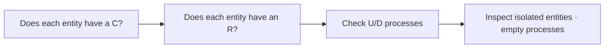

# CRUD Matrix

## 1. Overview

### A. Definition
> A correlation-analysis tool that cross-represents, in a matrix, the **Create · Read · Update · Delete** relationships between an information system's **processes (functions)** and **entities (data)**.

### B. Background and Purpose of Use
In the Information Engineering (IE) methodology, the data model (what to store) and the process model (what to handle) are designed independently from different viewpoints, so a device is needed to verify whether the two actually **mesh**. If there is no process at all that puts values into a given entity, that data remains forever empty; conversely, if a process is designed to reference data that does not exist, execution is impossible. The CRUD matrix reveals such **holes in data-function consistency** in the at-a-glance form of a matrix, identifying omissions, redundancies, and isolations early. Furthermore, it is reused as supporting material for setting transaction boundaries, DB distribution design, access-permission design, and archiving policy.

## 2. Representation Method

Processes are placed in rows and entities in columns, and in each intersecting cell the operation that the process performs on the corresponding data is marked as C/R/U/D. If a single process performs multiple operations, they are written together (e.g., order cancellation updates and deletes the order, so UD). Below is a simple shopping-mall example, where a single row reveals that "order registration" is a composite transaction that reads (R) member and product and creates (C) an order.

| Process \ Entity | Member | Order | Product |
|---|---|---|---|
| **Sign-up** | C | | |
| **Product lookup** | | | R |
| **Order registration** | R | C | R |
| **Order cancellation** | | UD | |

## 3. Consistency Verification Rules

The core of verification is to symmetrically confirm "whether every entity has its full lifecycle" and "whether every process actually handles data." **Each entity column must have at least one C.** An entity with no create process has no path for data to flow in, indicating a design omission. **Each entity column must have at least one R.** Data that no one reads may be unnecessary data with no reason to be stored, so it is subject to re-examination. **The presence or absence of U/D** checks whether state change or deletion is needed for the business. Finally, **every row and column must have at least one mark**: a column with no marks at all is an **isolated entity** that no function uses, and a row with no marks at all is an **empty (phantom) process** that touches no data—both candidates for error. In the example above, if the Product column has no C, one discovers, for instance, that a "product registration" process is missing.

| Check rule | Meaning | On violation |
|---|---|---|
| **Each entity has a C** | Secures a data-inflow path | Create process missing |
| **Each entity has an R** | Confirms data utilization | Suspected unnecessary data |
| **Presence of U/D** | Necessity of state change/deletion | Review management process |
| **Every row/column has ≥ 1** | Prevents isolation/phantom | Isolated entity · empty process |

## 4. Areas of Use

The CRUD matrix does not stop at consistency verification but is broadly used as input for subsequent design. Analyzing the CRUD pattern per process lets you derive the boundary of a single logical unit of work (a transaction), and if several processes perform U on the same data concurrently, it becomes the basis for **concurrency-control (locking)** design. If a specific group of entities is accessed only by a specific group of processes, distributing/partitioning the **DB** along that boundary increases traffic locality. Deciding which CRUD permissions to grant on which data by role also starts from this matrix.

| Area | How it is used |
|---|---|
| **Business/data verification** | Check requirement-data consistency |
| **Transaction analysis** | Design transaction boundaries · concurrency |
| **DB distribution design** | Partition/place based on access patterns |
| **Access-permission design** | Basis for a per-role CRUD-permission matrix |

## 5. Considerations and Implications
- **Automation and tooling**: In large systems with hundreds of entities and processes, manual management is impossible, so use CASE tools or repository-based automatic generation to keep the model changes and the matrix in sync.
- **A foundational deliverable of data governance**: As a starting point for managing data ownership, quality, and lifecycle, it connects to data-lineage management.
- **Application to MSA**: In microservices architecture, CRUD-pattern analysis is applied to defining the **Bounded Context**—the data boundary a service should own—becoming the design basis for the principle that "only the service that owns the data uses that data."

---

> **In one line**: The CRUD matrix *cross-represents the create/read/update/delete relationships of processes and entities in a matrix* to verify data-function consistency (omissions, isolations, phantoms), and it is a correlation-analysis tool that extends even to transaction, distribution, and access-permission design and to defining MSA's Bounded Context.
