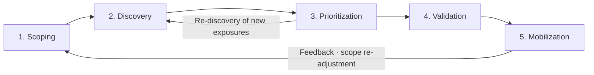
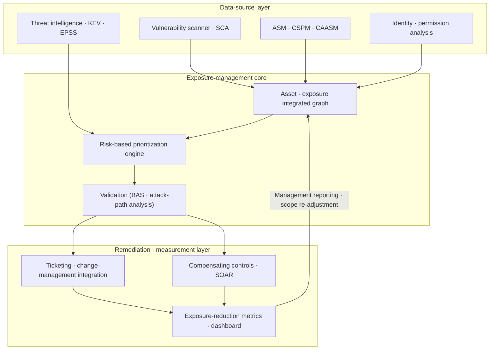

# CTEM (Continuous Threat Exposure Management)

## 1. Overview

> **Definition**: CTEM (Continuous Threat Exposure Management) is a risk-reduction program that operates, as a single repeating cycle, the continuous identification—from an attacker's perspective—of exposures present in an organization's assets, services, and identities; prioritization according to real exploitability and business impact; validation; and then the mobilization of remediation.

Traditional Vulnerability Management has been operated by producing a list of CVEs through quarterly or monthly scans and patching items with high CVSS scores first. However, this approach has three structural limitations. First, the gap between the scan time and the remediation time is large, so exposures already being exploited by attackers are discovered belatedly. Second, CVSS scores alone cannot tell whether a given vulnerability is actually reachable and exploitable in our environment, so resources are wasted on items with low real risk. Third, because it deals only with vulnerabilities (CVEs), it misses non-CVE exposures such as misconfigurations, excessive permissions, exposed credentials, and attack-surface expansion.

With the expansion of cloud, SaaS, remote work, and supply chains, the attack surface constantly changes beyond the organization's boundary, and threats such as ransomware, infostealers, and supply-chain breaches infiltrate by chaining not a single vulnerability but multiple weaknesses into an attack path. In such an environment, the question "what can an attacker actually do to us, and which of those paths is fatal to the business?" has become more important than "how many vulnerabilities have we closed?" CTEM, proposed by Gartner in 2022, has since emerged as a core framework of security strategy, and its essence is that it is not an individual tool but a **program (operational system)** that continuously reduces exposure.

Meanwhile, CTEM has less the character of requiring entirely new technology and more that of realigning, under a single goal, the vulnerability-management, penetration-testing, asset-management, and threat-intelligence capabilities that already exist in the organization. Therefore the key to adoption is not the purchase of expensive new tools but an operational design that weaves scattered activities into a cycle and measures and reports their results in the language of business. In this respect CTEM is both a framework that raises the maturity of the security organization and a communication tool that lets executives and the security department discuss risk with the same metrics.

This answer discusses CTEM's five-stage cyclical structure and reference architecture, the activities and components of each stage, the differences from existing vulnerability management and penetration testing, practical application cases, and the adoption strategy and considerations from a professional engineer's perspective.

## 2. CTEM's Five-Stage Cyclical Structure

CTEM is defined not as a one-time diagnosis but as a cyclical program that repeats the following five stages. Each stage takes the output of the previous stage as input and passes it to the next, and the result of the last stage re-adjusts the scope of the first.

**A. Scoping** — The first stage defines the **protection targets from a business perspective**, not a technical scan scope. Trying to handle all IT assets at once makes the program heavy and prone to failure. Therefore you first choose, as scope, particular areas such as core services directly tied to revenue, regulated personal-data-processing systems, the externally exposed attack surface (External Attack Surface), and SaaS/identity. Agreeing with executives and the business on "what, if breached, causes the greatest loss" at this stage becomes the baseline for later prioritization. Scope is not fixed but re-adjusted each cycle, and is broadened as maturity rises.

**B. Discovery** — Within the set scope, identify assets and exposures as exhaustively as possible. Here, exposure encompasses not only CVE vulnerabilities but also cloud misconfigurations, excessive IAM permissions, exposed APIs and storage buckets, expired/leaked credentials, shadow IT, and dependency vulnerabilities (SBOM perspective). ASM (Attack Surface Management), CSPM, CAASM, and identity-threat-detection tools are combined as data sources, and the key is to integrate the asset inventory and exposure list into a single graph. The goal of discovery is not "finding a lot" but "finding accurately within scope"; if there is much noise, the next stage's prioritization is neutralized.

**C. Prioritization** — Because you cannot remediate every discovered exposure, you rank them by combining real exploitability and business impact. Here, not CVSS alone but EPSS (exploitation probability), the CISA KEV (list of actually exploited vulnerabilities), threat intelligence, asset criticality, and **position on the attack path** are viewed together. For example, even a CVSS 9.8 ranks low if it is on an internally isolated network with no reachable path, while even a CVSS 6.5 becomes top priority if it is a chokepoint on a path leading from an externally exposed asset to domain administrator. Prioritization is the core stage of the "risk-based" approach.

The reason this approach matters is that there is a large gap between the absolute quantity of vulnerabilities and the number of vulnerabilities actually exploited. Published CVEs grow by tens of thousands each year, but the proportion of them observed to be actually exploited stays in the single-digit percentages—a common observation of many threat studies. Therefore, instead of chasing all vulnerabilities in CVSS order, concentrating on the intersection of "high real exploitation probability (EPSS·KEV), reachable in our environment (path analysis), and affecting core assets (asset criticality)" dramatically reduces the remediation targets while the risk-reduction effect actually grows. This is the basis for CTEM aiming at "not more, but more accurate."

**D. Validation** — Safely confirm **whether a high-priority exposure is actually exploitable, and how far infiltration continues**. BAS (Breach and Attack Simulation), automated penetration testing, red teaming, and Attack Path Mapping are used. Validation answers two things. One is "does this exposure really get breached?" (exploitability), and the other is "if breached, which assets does it reach, and do existing detection/blocking controls stop it?" (response effectiveness). Passing through validation turns a theoretical risk list into **proven risks**, clarifying the grounds for remediation resources.

The validation stage also serves to filter out false positives from prioritization. Even an exposure computed as high priority may, in the real environment, have its path severed by other controls or be already mitigated; forcing remediation without validation raises operational risk and business fatigue through unnecessary changes. Conversely, cases where low-severity exposures that would not stand out on priority metrics alone form a fatal path when chained are also revealed in validation. In other words, validation is a feedback device that corrects prioritization results against reality, which is why prioritization (stage 3) and validation (stage 4) mesh especially tightly within the cycle.

**E. Mobilization** — The stage of moving the organization to actually reduce validated risk. The core is not automatic patching but **the coordination of people and processes**. Deliver clear remediation items with grounds and deadlines to the infrastructure, development, identity, and cloud teams; integrate with ticketing and change management; and for items that cannot be patched immediately, apply compensating controls (WAF rules, segmentation, permission revocation). This stage's results are measured again and reflected in the next cycle's scope and priorities.

The five stages do not exist independently but mesh within the cycle's cadence. Discovery and prioritization repeat on a relatively short cycle because the attack surface changes frequently; validation, being resource-intensive, focuses on top risks and runs on a relatively long cycle; and scoping and mobilization align with quarterly/semiannual management reviews. Setting different cycles per stage while connecting them into one loop is the core of CTEM's operational design. Each time the cycle turns once, the organization adjusts the next priorities on the basis of "how much risk has been reduced compared to the previous cycle."

## 3. Reference Architecture and Components

CTEM operates not as a specific product but as an upper layer that integrates several security data sources to manage exposure. Below is the architecture showing the flow from data collection to remediation and measurement.

The components divide broadly into three layers. The **data-source layer** includes vulnerability scanners, SCA/SBOM, ASM/CSPM/CAASM, identity/permission analysis, and EPSS/KEV/threat-intelligence feeds. The **exposure-management core** normalizes and deduplicates heterogeneous data per asset into a single graph, combines threat intelligence and asset criticality to compute priorities, and proves risk through BAS and attack-path analysis. The **remediation/measurement layer** provides remediation workflows (ticketing, change management, SOAR) and exposure-reduction metrics (mean time to remediate, risk-exposure trend, reachability to core assets) on an executive dashboard.

The hardest part here is building the core layer's **asset/exposure integrated graph**. Because vulnerability scanners generate data per IP/host, cloud tools per resource, and identity tools per account/role, the same asset is often recorded redundantly under several names or results from different tools are not linked. To solve this, you must normalize asset-identification criteria and connect exposures into a graph of assets, identities, and paths so you can query "does this exposure lead to that asset?" If the integrated graph is poor, both prioritization and path validation become inaccurate, so the data quality of the core layer becomes the quality of the program.

The table below organizes representative technologies/deliverables used at each stage. However, tools are merely means; integrating so that data does not break between stages determines the program's success or failure.

| Stage | Core activity | Representative tech · data | Main deliverable |
|------|-----------|------------------|-------------|
| Scoping | Define protection targets | Asset criticality, business impact | Scope definition · baseline |
| Discovery | Identify assets · exposures | ASM, CSPM, CAASM, SCA | Integrated exposure inventory |
| Prioritization | Risk-based sorting | EPSS, KEV, threat intelligence | Prioritized exposure list |
| Validation | Prove exploitation · path | BAS, automated pen-test, red team | Proven attack paths |
| Mobilization | Organizational coordination · reduction | SOAR, ticketing, compensating controls | Remediation execution · reduction metrics |

## 4. Comparison with Existing Approaches and Cases

To understand CTEM accurately, you must distinguish, at the principle level, its differences from existing Vulnerability Management (VM) and Penetration Testing. VM focuses on "vulnerability-list management" and operates on a periodic scan-patch cycle, so it has the limits of the gap between scans and CVE-bias. Penetration testing has an expert deeply attempt infiltration at a specific point in time, but being conducted once or twice a year, it lacks continuity and has a narrow scope. Rather than replacing the two, CTEM **binds them at a higher level and operates them continuously**. That is, its differentiator is connecting discovery broadly (ASM), prioritization threat-based, validation via automation (BAS) and red teams, and remediation as an organization-wide cycle.

| Category | Vulnerability Management (VM) | Penetration Testing (PT) | CTEM |
|------|-----------------|--------------|------|
| Target | CVE-centric | Specific system | Vulnerabilities + misconfig + permissions + surface |
| Cadence | Periodic scan | 1–2 times/year | Continuous (cyclical) |
| Prioritization | CVSS-centric | Expert judgment | Exploitability · path · business impact |
| Validation | Mostly none | Yes (manual) | Automated + manual continuous validation |
| Goal | Reduce vulnerabilities | Confirm infiltration possibility | Continuously reduce business risk |

The root cause of the difference lies in the **shift of the evaluation criterion**. Whereas VM looks at the activity metric of "number of vulnerabilities closed," CTEM looks at the outcome metric of "reduction in real reachability to core assets." Because of this, adopting CTEM in practice actually shrinks the remediation-target list. For example, when a financial firm holds tens of thousands of unremediated vulnerabilities, applying EPSS, KEV, and path analysis narrows the actually-exploitable items that reach core assets to the hundreds, letting limited staff concentrate on the real risk.

This outcome orientation also affects reporting. Whereas reporting in the VM era listed activity volume, such as "remediated 8,000 of this month's 10,000 vulnerabilities," CTEM reporting describes the change in risk, such as "the proven paths reachable from the outside to the core payment system decreased from 12 last month to 3." The latter is a point where CTEM elevates security from a technical activity to business-risk management, in that it directly grounds executives' judgment of return on investment and their decision on next priorities.

As a concrete case, the majority of ransomware attacks achieve initial infiltration through a combination of known (patchable) vulnerabilities and exposed remote access / valid credentials. In the discovery stage CTEM catches externally exposed RDP/VPN and leaked credentials; in prioritization it elevates KEV-listed exploited vulnerabilities to the top; in the validation stage it proves via BAS that "this exposure can actually move to the file server"; and in the remediation stage it mobilizes MFA application, account revocation, and segmentation. As another case, in a cloud environment a public storage bucket combined with an excessive IAM role becomes a data-leak path; CTEM connects the CSPM misconfiguration and permission analysis into a single path, visualizing the path "internet → misconfigured function → over-privileged role → data" and prioritizing the blocking of that chokepoint.

## 5. Adoption Roadmap and Maturity Model

CTEM is not a system completed at once but a journey that raises maturity in stages. Early in adoption, data and processes are fragmented, so rather than recklessly targeting all assets, it is important to complete the cycle in a narrow scope and produce evidence that "exposure actually decreased." Below is a three-stage maturity path commonly observed.

**A. Stage 1 — Foundation (secure visibility)**: The goal of this stage is to gather scattered asset and exposure data into one. Organize the asset inventory (CMDB/CAASM) and integrate the external attack surface (ASM) and vulnerability-scan results to see, for the first time at a glance, "what we have and where we are exposed." Prioritization is still CVSS-centric and validation is manual, but integrated visibility itself becomes the foundation of all subsequent stages. Representative metrics for this stage are asset-coverage rate and the accuracy of the external-surface list.

**B. Stage 2 — Risk-based operation (introduce prioritization/validation)**: Combine EPSS, KEV, and asset criticality with discovered exposures to sort risk-based, and begin validating top items via BAS and attack-path analysis. Remediation becomes trackable through integration with ticketing and change management. At this stage the remediation-target list shrinks dramatically, and outcome metrics such as mean time to remediate (MTTR) and reachability to core assets are measured for the first time. This is the segment where most organizations feel a substantial effect.

**C. Stage 3 — Continuous/automated (program embedded)**: The five-stage cycle is regularized, remediation is automated with SOAR playbooks, and the exposure-reduction trend is reported continuously on the executive dashboard. Scope expands to cloud, identity, SaaS, and supply chain (SBOM), and threat intelligence updates priorities in near real time. At this stage CTEM settles into an upper governance system that aligns individual security activities under the goal of "continuous risk reduction."

A common failure factor in raising maturity is adding tools first and fitting processes later. Actual success cases follow the order of setting a narrow scope, completing the cycle, proving the results to executives with outcome metrics, and then expanding budget and scope. In other words, advancing maturity is less a matter of technology than of organizational learning and the accumulation of trust.

## 6. Deep Dive — Recent Trends and Likely Exam Directions

CTEM is recently operating in the security market as an axis that converges individual product families into a single program. First, the trend is distinct in which **ASM, BAS, Risk-Based Vulnerability Management (RBVM), and CAASM**, each an independent product, are integrated into a CTEM platform. Second, as the weight of **identity exposure** grows, combination with ITDR (Identity Threat Detection & Response) and the management of excessive permissions / valid credentials have emerged as core to CTEM discovery and validation. Third, **generative AI** is being used to summarize exposure data, auto-generate remediation guidance, and explain attack paths, while at the same time LLM applications and data pipelines themselves are being incorporated into CTEM scope as new exposure targets (prompt injection, model/data access permissions).

Prioritization metrics are also becoming more refined. To complement the limits of CVSS alone, combining EPSS (probability of exploitation within the next 30 days) and CISA KEV (a list of confirmed exploitation) has effectively become the standard, and multi-layer scoring that adds asset criticality and path analysis is spreading. Linkage with Zero Trust, ASPM (Application Security Posture Management), and SBOM-based supply-chain exposure management is also strengthening.

From the professional engineer's perspective, likely exam directions are as follows. (1) A descriptive type asking you to explain CTEM's five stages with a diagram and write the activities/deliverables of each stage; (2) a comparative type asking you to compare CTEM with existing vulnerability management and penetration testing and discuss the necessity of adoption; (3) an application type asking you to construct an answer for how to apply CTEM in a specific scenario such as ransomware or cloud misconfiguration. As an answer strategy, it is effective to take the five keywords "exposure ≠ CVE," "continuous cycle," "risk-based prioritization," "prove via validation," and "organizational coordination (mobilization)" as axes, and to present a concept diagram and comparison table together.

## 7. Considerations and Implications

First, **an organization- and process-first approach is needed.** Because CTEM is program operation, not tool adoption, targeting all assets from the start leads to failure. It fits the maturity model to succeed with the cycle in a narrow scope such as core services and the external surface, prove results, and then expand in stages. Without executive sponsorship and business participation, the final mobilization stage does not work.

Second, **measurement metrics must shift from activity to outcome.** Rather than "number of vulnerabilities closed," metrics such as "reduction in reachability to core assets," "mean time to remediate (MTTR)," "remediation rate against validated proven risk," and "external attack-surface trend" must be used to prove actual risk reduction. Metrics connect to management reporting and budget justification, ensuring the program's continuity.

Third, **data integration and noise management determine success or failure.** If you cannot normalize the asset/exposure data of multiple tools into a single graph without duplication, prioritization is neutralized. The accuracy of the asset inventory (CMDB/CAASM) is a precondition, and false positives and duplicates lose the business's trust, so they must be filtered out at the validation stage. As connected technologies, SBOM/ASPM (development-stage exposure), ITDR (identity), and CSPM (cloud) are essentially combined.

Fourth, **you must trade off validation safety against automation level.** Because BAS and automated penetration can affect production, you must design safe simulation scope, time windows, and rollback, and complement composite paths that automation cannot catch with red teams. It is realistic to divide roles so that automation handles breadth and people handle depth.

Fifth, **strategic alignment with Zero Trust, SOAR, and threat intelligence is needed.** Paths that CTEM identifies and validates are blocked by Zero Trust segmentation and least-privilege policy, mobilization is automated with SOAR playbooks, and priorities are updated with threat intelligence. In this way CTEM is expected to settle as an upper operational system that aligns individual security activities under the single goal of "continuous risk reduction."

## References

- Gartner, "How to Manage Cybersecurity Threats, Not Episodes" (Continuous Threat Exposure Management), https://www.gartner.com/en/articles/how-to-manage-cybersecurity-threats-not-episodes
- CISA, Known Exploited Vulnerabilities (KEV) Catalog, https://www.cisa.gov/known-exploited-vulnerabilities-catalog
- FIRST, Exploit Prediction Scoring System (EPSS), https://www.first.org/epss/

---

> **In one line**: CTEM is a five-stage cyclical program that continuously discovers, prioritizes, validates, and remediates—from an attacker's perspective—exposures spanning assets, misconfigurations, permissions, and surface; it is a risk-based security operational system whose goal is not "the number of vulnerabilities closed" but "the reduction of real reachability to core assets."
