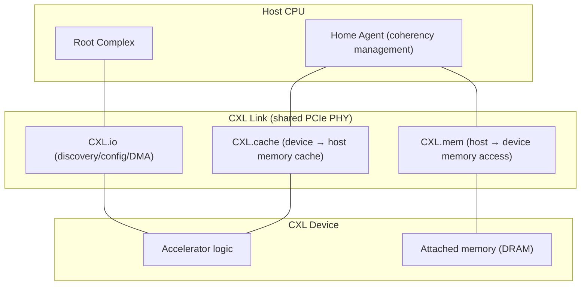
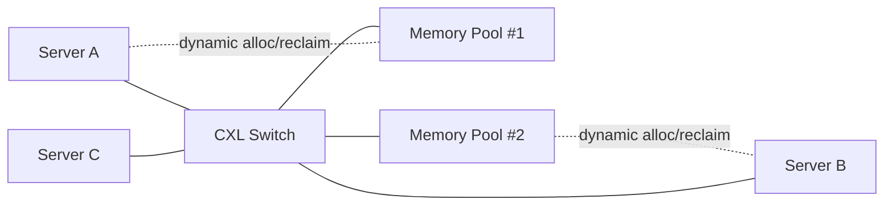

# CXL (Compute Express Link) High-Speed Interconnect

## 1. Overview

### A. Definition
> **CXL (Compute Express Link)** is an open-standard interconnect that operates on top of the PCIe physical layer and enables memory to be shared, expanded, and pooled at low latency between CPUs, accelerators, and memory-expansion devices while maintaining **cache coherency**.

Traditionally, the capacity and bandwidth of memory attached to the CPU (DIMMs) was bound to the number of channels the CPU provides, and devices attached via PCIe (GPUs, NICs, etc.) were fast but **could not share cache coherency with the CPU**, incurring large overhead for copying and synchronizing data. CXL connects these two worlds into one with the idea of "use PCIe's broad ecosystem and physical layer as is, but lay **memory semantics (load/store) and cache coherency** on top of it." That is, it lets the CPU directly access a device's memory as if it were its own, using `load/store` instructions.

### B. Background and Necessity
As AI and HPC workloads grew, two bottlenecks appeared simultaneously. The first is the **wall of memory capacity and bandwidth**. Large language models and in-memory analytics demand terabytes of memory, but the number of DIMM slots per CPU socket is physically limited and can no longer be increased. The second is the **cost of data movement among heterogeneous accelerators**. As GPUs, FPGAs, and smart NICs increase, the approach of giving each device its own memory and copying over PCIe wastes latency and power. On top of this, at the data-center level, over-provisioning memory in every server leaves **an average of 40–50% or more idle and wasted (stranded memory)**. CXL emerged as a standard that seeks to solve these three problems together by disaggregating memory from the CPU and **dynamically allocating and reclaiming it as needed**.

## 2. Protocol Structure and Layers

CXL time-division-multiplexes **three sub-protocols** with different purposes over a single physical link. This separation is CXL's core design—because simple I/O, cache access, and memory access have different coherency and latency requirements.

**CXL.io** is a protocol nearly identical to PCIe; it handles device discovery, configuration (enumeration), interrupts, and DMA, and is **mandatory for all CXL devices**. It serves as the foundation on which the other two protocols attach. **CXL.cache** allows a device to **coherently cache** host memory. For example, if an accelerator reads a certain region of CPU memory, places it in its own cache, and computes, then when the CPU modifies that region, hardware automatically handles invalidation/update. **CXL.mem**, conversely, lets the host access memory attached to a device **as part of its own address space via `load/store`**. Memory expansion and pooling take place precisely on top of this protocol.

### A. Device Type
According to the protocol combination, devices divide into three types. The type distinction is really the question of "does the device have a cache, or does it provide memory?"

| Type | Protocols used | Representative device | Characteristic |
|---|---|---|---|
| **Type 1** | io + cache | Smart NIC · compute accelerator | Coherently caches host memory without its own memory |
| **Type 2** | io + cache + mem | GPU · FPGA accelerator | Has both cache and memory; bidirectional coherency sharing |
| **Type 3** | io + mem | Memory expander · pool | Provides only large-capacity memory without cache (the mainstay of expansion/pooling) |

Type 3 is the center of CXL commercialization today. Plugging an expansion card carrying DDR5 DIMMs into a PCIe slot makes the CPU recognize it as an additional memory tier, allowing capacity to be increased beyond the socket's physical slot limit.

## 3. Memory Pooling and Disaggregation

CXL's ultimate value lies in **memory pooling**, going beyond simple expansion. It is a structure in which multiple servers (hosts) connect to a single shared memory pool through a **CXL Switch**, and are allocated a certain capacity when needed, use it, and return it.

The problem this structure solves is **idle-memory waste**. When Server A momentarily needs a large amount of memory, it borrows from the pool and uses it, and returns it when the job finishes so Server B can use it. Because physical memory no longer needs to be fixed at the maximum in every server, the data center's total memory purchase and power can be greatly reduced. There have been reports from actual cloud-provider analyses that idle memory reaches nearly half of the total, and pooling directly targets this waste. However, passing through one switch stage adds tens to hundreds of ns of latency, so CXL memory is treated as a **remote memory tier** slower than local DRAM, and must be combined with the OS/hypervisor's **tiered memory management (e.g., Linux memory tiering)** to maintain performance.

## 4. Standard Evolution and Comparison with Similar Technologies

CXL evolved rapidly in a short period. Each version has broadened its scope of application while maintaining **backward compatibility** with the preceding generation.

| Version | Base PCIe | Key added features |
|---|---|---|
| **CXL 1.1** | PCIe 5.0 | Single-host memory expansion, definition of Types 1/2/3 |
| **CXL 2.0** | PCIe 5.0 | Single-tier **switching**, **memory pooling**, hot-plug, integrity & encryption (IDE) |
| **CXL 3.0** | PCIe 6.0 (64GT/s) | Multi-tier switching · **fabric**, **memory sharing (hardware coherency)**, 2× bandwidth |
| **CXL 3.1** | PCIe 6.0 | Fabric expansion based on **PBR (Port Based Routing)**, **TSP** (Trusted-Execution-Environment security), memory-expander improvements |

Here, 2.0's "pooling" and 3.0's "sharing" must be distinguished. Pooling is one host occupying a specific region **exclusively** at a point in time, while sharing is multiple hosts accessing **the same region simultaneously** with hardware guaranteeing coherency; their difficulty and utility differ. Also, 3.1's **TSP (Trusted-Execution-Environment Security Protocol)** is a device that encrypts and isolates memory in a Confidential Computing environment to prevent the risk of another host's data remaining and being exposed in memory borrowed from the pool—confronting pooling's security weakness head-on.

The relationship with similar technologies is also important. **PCIe** is CXL's physical-layer foundation but is a pure I/O link with no coherency, and **NVLink** (NVIDIA) and **Infinity Fabric** (AMD) are closed high-speed links that connect a specific vendor's GPUs/CPUs. CXL differs from these in being an **open industry standard** and in standardizing memory semantics around the CPU. Indeed, the assets of the early competing specifications Gen-Z, OpenCAPI, and CCIX were absorbed and integrated into the CXL consortium, so that CXL has effectively established itself as the single standard.

## 5. Considerations and Implications

From a professional engineer's perspective, adopting CXL must be judged comprehensively on the following.

- **Performance-latency trade-off**: Because CXL memory has higher latency than local DRAM, one must approach it with a **hot/cold data-tiering** strategy rather than full replacement. Placement optimization—latency-sensitive workloads local, capacity-oriented workloads (large in-memory DBs, recommendation engines) on the CXL tier—is the key.
- **TCO/power-saving effect**: Memory pooling can reduce idle memory and lower total cost of ownership and power, but the break-even against **additional hardware cost** such as switches and expansion controllers must be calculated according to scale (number of servers, memory variance). The larger the cloud, the more advantageous.
- **Security/isolation**: A pool shared by multiple hosts carries the risk of **residual-data exposure and side channels**, so CXL 3.1's TSP and IDE (link encryption) should be applied and linked with confidential computing.
- **Ecosystem maturity and outlook**: With CPU (Intel, AMD) CXL support and OS (Linux memory tiering) support in place, Type 3 expanders were commercialized first, and expansion toward a **fabric-based fully disaggregated data center (Composable/Disaggregated Infrastructure)** is expected. However, because the real-world maturity of multi-tier switching and memory sharing needs time, a phased adoption roadmap (expansion → pooling → sharing) is recommended.

## References
- CXL Consortium, "Introducing the CXL 3.x Specification" (2025), https://computeexpresslink.org/wp-content/uploads/2025/02/CXL_Q1-2025-Webinar-Presentation_FINAL.pdf
- "An Introduction to the Compute Express Link (CXL) Interconnect", arXiv, https://arxiv.org/pdf/2306.11227

---
> **In one line**: CXL lays cache coherency and memory semantics on top of the PCIe physical layer to connect CPUs, accelerators, and memory at low latency and to expand, pool, and share memory, thereby resolving the memory wall and idle waste of AI and data centers—an open-standard interconnect.
