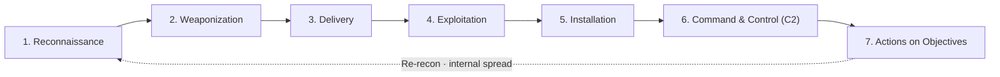
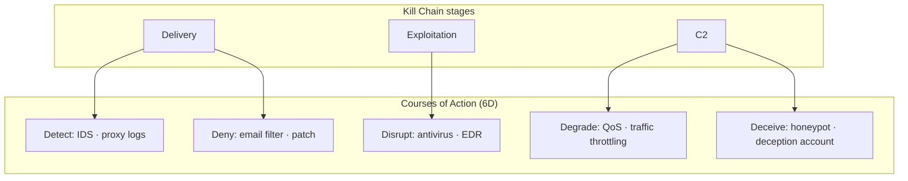

# Cyber Kill Chain

## 1. Overview

> The **Cyber Kill Chain** is a defender-centric threat-analysis framework that models a targeted cyberattack as a seven-stage chain of processes running from reconnaissance to objective achievement, and prevents, detects, and responds to breaches by cutting off each stage early (Break the chain).

Originally the Kill Chain was a military term derived from the U.S. Air Force's targeting doctrine F2T2EA (Find–Fix–Track–Target–Engage–Assess), meaning "the series of stages from finding the enemy to the final strike." In 2011, Lockheed Martin researchers (Hutchins, Cloppert, Amin) applied the concept to APT (Advanced Persistent Threat) defense in the paper *Intelligence-Driven Computer Network Defense*, which established it as a core model of cybersecurity.

Behind this model's emergence was a shift in the defense paradigm. Traditional security was reactive, defending only the "moment of intrusion" with individual controls such as firewalls and antivirus. But because an APT is a multi-stage attack that unfolds stealthily over weeks to months, it cannot be stopped by single-point defense. By decomposing an attack into "a chain of multiple stages," the Kill Chain provides the asymmetric advantage (the defender's advantage) that **the defender can neutralize the entire attack by cutting off just a single stage**. That is, the attacker must succeed at every stage while the defender need only block any one stage, so its core significance lies in transforming defense into an "intelligence-driven," proactive activity.

The Kill Chain also standardizes the attack's stages of progression into a common language, providing a systematic basis for security operations (SOC), threat intelligence, and incident response (IR) organizations to communicate about a breach from the same perspective and to map controls per stage to identify defensive gaps.

## 2. The Seven-Stage Structure of the Cyber Kill Chain

The Kill Chain consists of seven sequential stages through which an attack progresses in time. The earlier the stage, the lower the defense cost and the smaller the damage, so the principle is to **block as far to the left (Left of Boom) as possible**.

Each stage is not merely a sequence but a **chain of necessary conditions** the attacker must complete. At each stage the defender collects and analyzes attack indicators and deploys controls.

### A. Reconnaissance

The preparatory stage where the attacker gathers information about the target organization. They investigate org charts, email addresses, technology stacks, exposed servers, and the like; most of this occurs outside the organization and is hard to detect.

Reconnaissance further divides into **passive reconnaissance** and **active reconnaissance**. Passive reconnaissance is OSINT (Open Source Intelligence) using public sources such as LinkedIn, job postings, corporate websites, social media, search engines (Google dorking), and Shodan; because it makes no direct contact with the target, it leaves almost no trace. Active reconnaissance obtains information by sending packets directly to the target system, as in port scanning, banner grabbing, and vulnerability scanning, leaving traces in IDS/IPS logs. For example, a spear-phishing attack targeting a particular large enterprise begins with reconnaissance that first collects, from LinkedIn, the list of finance-team staff and the email format.

At this stage the defender detects abnormal scans through web-log analysis, minimizes public-information exposure (Attack Surface Management), and catches early, via threat intelligence, indications that they are being targeted.

### B. Weaponization

The stage where, based on the gathered information, an exploit and a backdoor are combined to build an actual attack tool. Typically, malware-embedded PDFs and Office documents (macros), exploit kits that trigger vulnerabilities, and remote-control (RAT) payloads are made.

Because this stage occurs entirely in the attacker's environment, the defender cannot observe it directly. Therefore defense relies on the indirect method of securing, via threat intelligence, the characteristics of the weaponization output (the structural patterns of a malicious document, the signature of a particular exploit kit) and detecting it at later stages. For example, Emotet-family attacks are weaponized in the form of Word documents containing macros, and the structural characteristics of these documents become the detection indicator.

The property that weaponization outputs are unobservable explains why defensive indicators must **shift from static signatures (hashes, strings) to behavior/tactic indicators (TTPs)**. According to David Bianco's "Pyramid of Pain," hashes and IPs are easily changed by attackers and thus low in defensive effect, whereas detecting tool- and TTP-level indicators forces re-armament costs on the attacker and is far more effective. The Kill Chain's weaponization stage precisely highlights the importance of securing these higher-level indicators.

### C. Delivery

The stage of delivering the crafted weapon to the target, and the point where the defender **can first intervene with active defense**. Email attachments (spear phishing) are most common, along with malicious URLs, watering holes (infecting visited websites), USB media, and supply chains (disguised as SW updates).

The reason for concentrating defensive capability at the delivery stage is that blocking it here renders all subsequent stages moot. Email security (anti-spam, sandboxing), web proxies / URL filtering, attachment sanitization (CDR, Content Disarm & Reconstruction), and user security-awareness training are the core controls. Indeed, since 2016 many major breaches began with a single spear-phishing email aimed at the finance or HR team, and the email gateway's sandbox played a decisive role in blocking.

### D. Exploitation

The stage where the delivered weapon executes on the target system and triggers a vulnerability. Software vulnerabilities (e.g., Office remote code execution, browser vulnerabilities) are exploited, or social engineering induces the user to allow macros.

The core of defense is to remove the vulnerability itself or suppress execution. Representative measures are rapid patch management, EDR (Endpoint Detection & Response) behavior-based blocking, exploit-mitigation technologies such as DEP/ASLR, application whitelisting, and stricter macro-execution policy. For zero-day vulnerabilities, signature-based defense is powerless, so EDR's anomalous-behavior detection becomes the practical line of defense.

### E. Installation

The stage where, after a successful exploit, a backdoor, RAT, web shell, or the like is installed on the target system to secure **persistence**. To maintain access even after a system reboot, techniques such as registering a registry Run key, creating a service, registering a scheduled task, and DLL side-loading are used.

From here on, the attacker has secured a foothold inside, so defense shifts to a **detection-and-containment** focus. EDR's file-integrity monitoring (FIM), executable signature verification, the principle of least privilege (PoLP), and analysis of host logs (creation of new services / scheduled tasks) are the core.

### F. Command and Control (C2)

The stage where the installed malware establishes a communication channel with the attacker's external server (C2) to receive remote commands. Through this channel the attacker downloads additional tools and directs internal reconnaissance and lateral movement.

C2 traffic is often disguised (domain fronting) as HTTPS, DNS tunneling, or legitimate cloud services (e.g., collaboration-tool APIs) to evade detection. Defense responds with outbound-traffic analysis, blocking known C2 domains/IPs (threat-intelligence feeds), DNS anomaly detection, network segmentation, and forced proxy routing. **Blocking the C2 channel is a decisive defensive point that severs the attacker's remote control**, and if discovered at this stage there is still room to respond before substantial damage.

Recently attackers evade detection by combining, in commercial/open-source C2 frameworks such as Cobalt Strike and Sliver, jitter that randomizes the beacon's communication interval with legitimate-domain disguise. In response, defenders' countermeasures are advancing toward detecting beacons not by simple signatures but by behavioral indicators such as the regularity of communication intervals, JA3 fingerprints, and abnormal-destination entropy.

### G. Actions on Objectives

The stage where the attacker executes the final objective. This includes data exfiltration, encryption by ransomware, data destruction/tampering, financial fraud via account takeover, and system destruction. Many APTs return to reconnaissance here, forming a repeating cycle that spreads to internal systems.

Defense blocks mass leakage with DLP (Data Loss Prevention), mitigates ransomware damage with backup/recovery systems, and minimizes damage with abnormal-data-transfer detection (UEBA) and incident-response procedures (isolation, evidence preservation, recovery).

### H. Comprehensive Case — Kill-Chain Progression of a Ransomware Breach

An actual ransomware breach is a representative case where the seven stages above are observed in order. ① The attacker identifies a finance-team member using LinkedIn and leaked-account databases (reconnaissance), ② crafts a macro document disguised as a tax invoice (weaponization), and ③ sends it as a spear-phishing email (delivery). ④ When the user allows the macro, a downloader executes (exploitation); ⑤ persistence is secured via a scheduled task (installation); ⑥ additional tools are downloaded over a C2 channel disguised as HTTPS, domain-administrator privileges are seized, and lateral movement occurs (C2); ⑦ data is exfiltrated over several days, and then all systems are encrypted (actions on objectives). The average dwell time per stage ranges from hours to weeks, and the lesson of Kill-Chain analysis is that if the defender had caught anomalous signs and blocked at any point in ③–⑥, the large-scale damage of the final encryption (⑦) could have been prevented.

## 3. Defensive Control Mapping — Courses of Action Matrix

The Kill Chain's practical value lies in the **Courses of Action Matrix**, which maps defensive measures to each stage. Lockheed Martin categorizes defensive actions into six—Detect, Deny, Disrupt, Degrade, Deceive, and Destroy—and arranges them per stage to design Defense-in-Depth.

When the security controls an organization holds are arranged by stage and type, this matrix visually reveals **which cells are empty (defensive gaps)**. For example, if the delivery stage has sufficient detect/deny controls but the C2 stage lacks deceive/disrupt controls, one can diagnose that the capability to stop internal spread after intrusion is insufficient. In this way the Kill Chain is used, beyond a simple attack description, as **a gap-analysis tool for prioritizing defensive investment**.

## 4. Comparison of Similar Frameworks

The Kill Chain is the first systematic attack model, but various subsequent and complementary frameworks have since appeared. The practical standard is to combine them **complementarily** rather than treating them as substitutes.

| Category | Cyber Kill Chain | MITRE ATT&CK | Diamond Model | Unified Kill Chain |
|------|---------------|--------------|-----------------|----------------------|
| Proposed by | Lockheed Martin (2011) | MITRE (2013~) | Caltagirone et al. (2013) | Pols (2017) |
| Perspective | Linear 7 stages (sequential) | Tactics/techniques matrix (non-linear) | 4-element relationship analysis | 18-stage expansion |
| Focus | External intrusion flow | Post-intrusion behavior (TTP) detail | Structural attribution of an event | Kill chain + ATT&CK combined |
| Strength | Intuitive · control mapping | Real-world TTP · detection rules | Threat-intelligence attribution | Covers internal movement too |
| Limitation | Weak on internal / post-perimeter | Flow/priority unclear | Poor defensive-control mapping | Complex · high learning cost |

The Kill Chain intuitively shows an attack's **flow and sequence**, but its stages are too coarse to express the diverse detailed techniques after internal infiltration. MITRE ATT&CK, by contrast, finely describes post-intrusion behavior with 14 tactics and hundreds of techniques but does not present the temporal order or priority among them. Therefore, in practice, a triple combination has settled in: **use the Kill Chain to grasp the big flow of the attack, detail the inside of each stage with ATT&CK techniques**, and attribute the relationship of Adversary, Capability, Infrastructure, and Victim with the Diamond Model. For example, a SOC analyst tags EDR alerts with ATT&CK techniques and then aggregates them into Kill-Chain stages to convey the situational awareness "the current attack has progressed to the installation stage" to executives.

## 5. Deep Dive — Limitations, Evolution, and Practical Application

**Structural limitations of the Kill Chain.** The original Kill Chain was designed on the premise of the 2011 threat environment, namely email-based external intrusion (perimeter-centric). For this reason several fundamental limitations are pointed out. First, due to its **perimeter-defense bias**, the model is powerless against threats already inside (insiders, supply-chain breaches) or attacks that disguise themselves as normal logins after credential theft, because their early stages are not observed. Second, due to the **rigidity of the linear assumption**, real APTs skip stages or perform them in parallel/repeatedly, which the sequential seven-stage model cannot capture. Third, in cloud, SaaS, and serverless environments, the meaning of "installation" or "C2" changes, conflicting with the on-premises premise.

**Evolved models.** To complement these limits, the **Unified Kill Chain** combines the Lockheed Martin model and ATT&CK, expanding to 18 stages, and in particular reorganizes them into **three phases—Initial Foothold, Network Propagation, and Action on Objectives**—explicitly including internal lateral movement. Domain-specific variants such as a ransomware-specialized kill chain and a cloud kill chain have also derived.

**Practical application cases.** The Kill Chain is widely used as a skeleton for organizing the detection rules of SIEM, SOAR, and XDR. Grouping SIEM correlation rules by Kill-Chain stage lets individual alerts be automatically connected into a single attack scenario running "reconnaissance → delivery → installation" (Attack Story), reducing false positives and assigning response priorities. SOAR playbooks likewise define automated responses per stage (email quarantine at the delivery stage, host network isolation at the C2 stage). Domestically as well, financial and public-sector SOCs organize their monitoring dashboards by Kill-Chain stage and adopt the method of triaging threats based on "the most advanced stage" among many alerts. In addition, breach-response reports and Threat Hunting hypothesis formulation also take "how far the attack has progressed" as a common language.

## 6. Considerations and Implications

From a professional engineer's perspective, adopting and using the Cyber Kill Chain must consider the following.

- **Limits of standalone use and a combination strategy**: Because the Kill Chain alone struggles to capture insider threats and cloud attacks, a multi-layer threat-modeling system combined with MITRE ATT&CK (detailed TTPs) and the Diamond Model (attribution) must be built. The key is to complement perspectives mutually rather than exclusively choosing one.
- **Shift-Left strategy and cost trade-off**: The earlier you block, the smaller the damage and response cost, but the reconnaissance and weaponization stages occur outside the organization and are hard to detect. Therefore a balance is needed: concentrate controls at the delivery and exploitation stages where observability is secured, while complementing visibility into the upstream stages with threat intelligence.
- **Linkage with Zero Trust and Defense-in-Depth**: In the era of perimeter collapse, Zero Trust and micro-segmentation—which block internal movement under the assumption that "you are already breached"—reinforce defense of the Kill Chain's latter half (installation, C2, spread). The Kill Chain serves as a map that decides where to place Zero Trust controls.
- **Operational maturity and automation linkage**: Kill-Chain-based defense is effective when SIEM, SOAR, and XDR are linked for per-stage detection and automated response. Without automation that maps and aggregates alerts into stages, the framework remains a documentary concept. The organization's monitoring maturity (people, process, technology) must be raised together.
- **Transition to intelligence-driven defense**: The Kill Chain's original intent is to accumulate and analyze individual breaches at the "Campaign" level to predict the same attacker's re-intrusion early. When you build a virtuous cycle that feeds the per-stage indicators (IoC/TTP) collected in incident response back into campaign intelligence, the Kill Chain functions as a continuous defensive capability beyond a one-off analysis frame.
- **Outlook**: As AI-based attacks (automated reconnaissance, polymorphic malware) and supply-chain attacks spread, dynamic Kill-Chain analysis that uses AI to estimate and predict attack progression in real time—rather than the static seven stages—and attack-scenario simulation and automated response using generative AI, are emerging as directions of development.

## References

- Hutchins, Cloppert, Amin, "Intelligence-Driven Computer Network Defense Informed by Analysis of Adversary Campaigns and Intrusion Kill Chains", Lockheed Martin (2011). https://www.lockheedmartin.com/en-us/capabilities/cyber/cyber-kill-chain.html
- MITRE ATT&CK Framework. https://attack.mitre.org/
- Paul Pols, "The Unified Kill Chain" (2017/2021). https://www.unifiedkillchain.com/

---

> **In one line**: The Cyber Kill Chain decomposes a targeted attack into the seven stages of reconnaissance → weaponization → delivery → exploitation → installation → C2 → actions on objectives, and is a defender-centric framework that neutralizes a breach by cutting off any single stage; combined with MITRE ATT&CK and Zero Trust, it serves as the skeleton of Defense-in-Depth and SOC automated response.
