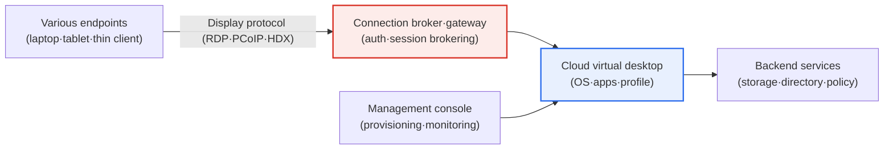
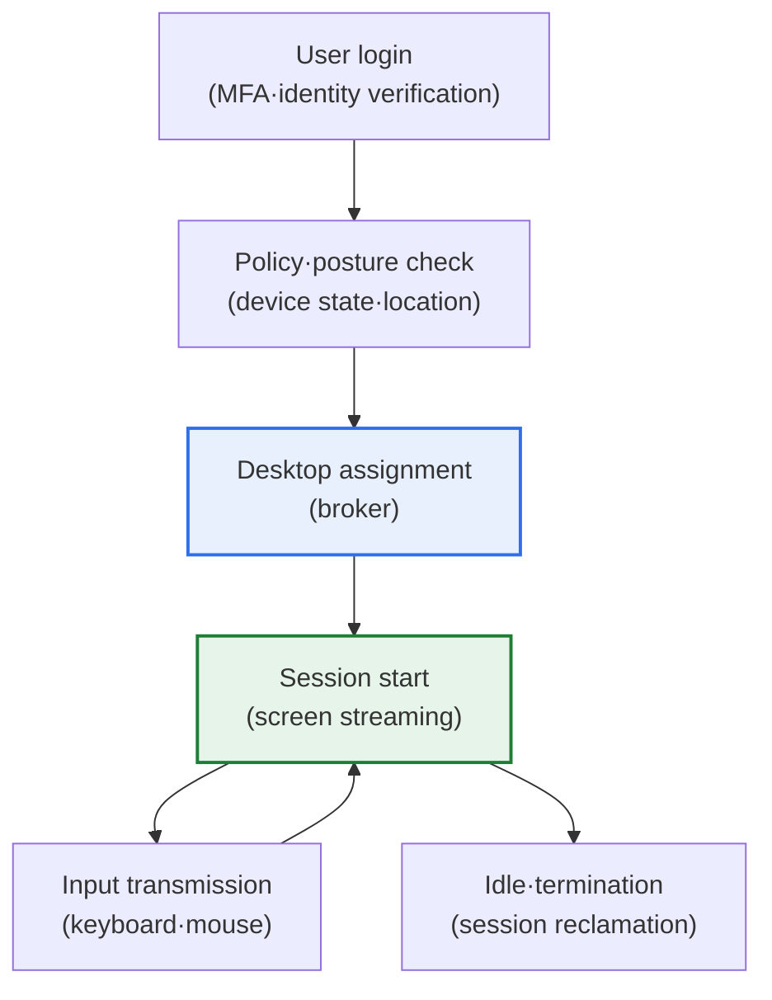

# DaaS (Desktop as a Service)

## 1. Overview

### A. Definition

> **DaaS (Desktop as a Service)** is a subscription-based cloud service that **delivers the desktop environment (OS, applications, user data, and settings) as a virtual instance in the cloud, which users access from any device**. Rather than an enterprise building and operating its own Virtual Desktop Infrastructure (VDI), a cloud service provider (CSP) delivers it as a managed offering.

The core value of DaaS is that it **places the work environment in the cloud rather than on an individual PC**. Traditionally, work data and programs were installed on each person's PC, so losing a PC meant a data breach, it was hard to work consistently across multiple devices, and the IT department had to manage hundreds of endpoints one by one. DaaS inverts this structure by putting the desktop itself in the cloud. A user's screen, OS, apps, and data all reside on cloud servers, and the user connects from any endpoint—laptop, tablet, thin client—receiving only the "screen" to interact with. Since the actual computation and data live in the cloud, the endpoint acts merely as a window that displays the screen and relays keyboard and mouse input.

As a result, three effects arise simultaneously. First is **mobility**—accessing the same work environment from anywhere. Because the office PC and the home laptop look at the same desktop, work continuity is guaranteed. Second is **security**, as the risk of loss or leakage drops because data does not remain on the endpoint. A stolen laptop holds only a screen cache; the actual data stays in the cloud. Third is **management efficiency**, as the IT department centrally creates, patches, and reclaims desktops in bulk. A completed desktop can be provisioned to a new hire in minutes and reclaimed immediately upon departure. It gained particular attention as a means of providing a safe and flexible work environment as remote and work-from-home arrangements spread.

### B. Background and Necessity

The rise of DaaS is the result of three converging trends. First is the **normalization of remote and hybrid work**. As work-from-home became widespread in the wake of the pandemic, accessing company data from uncontrolled home networks and personal devices became routine. DaaS, which handles data only in the cloud without downloading it to the endpoint, structurally lowers this risk. Second is the spread of **BYOD (Bring Your Own Device)**. Demand for working on personal devices grew, but placing company data on personal devices is a security risk. DaaS resolves this dilemma by separating "the device is personal, the data is in the cloud." Third is **avoiding upfront investment**. On-premises VDI demands enormous initial investment in servers, storage, and networking, along with specialized operations staff. DaaS converts this into a subscription-based operating expense (OpEx), enabling even small and mid-sized enterprises to adopt virtual desktops.

Against this backdrop, DaaS is establishing itself beyond a simple "cloud PC," combining with zero-trust security to become one pillar of next-generation work infrastructure that "verifies identity and posture wherever the connection originates, then provides only a controlled environment."

## 2. DaaS Architecture and Components

DaaS consists of the user endpoint, a remote display protocol, the cloud-hosted virtual desktop, and the control plane that manages them. The overall diagram below shows how each element connects.

In this structure, the **Connection Broker** is the key gateway. When a user connects, it first authenticates the identity, then brokers the session to the virtual desktop assigned to that user. The broker also decides which instance a given user connects to when multiple users log in, and when to terminate idle sessions. If the broker becomes a bottleneck or fails, all users lose access, so redundancy and scalability are at the center of the design.

The **remote display protocol** is the second axis that determines usability. Representative examples include RDP (Microsoft), PCoIP·Blast (the Omnissa/VMware lineage), and HDX (Citrix), and they differ in how efficiently they compress and transmit the screen and how smoothly they reproduce video, graphics, and audio. In particular, graphics work (design, video editing) requires GPU acceleration and high-efficiency codecs, so the choice of protocol and instance specification translates directly into user satisfaction.

### A. Session Creation and Profile Management

An often-overlooked aspect of DaaS is **user profile and state management**. Virtual desktops are broadly divided into "persistent" and "non-persistent" types. A persistent desktop gives each user a fixed instance, so personal settings and installed programs are retained as is, but it consumes resources and cost in proportion to the number of instances. A non-persistent desktop spins up a new instance from a standard image on each connection, and per-user data and settings are loaded from a separate profile store and combined. It is highly resource-efficient, but if profile loading is not carefully designed, login delays or setting loss can occur. Which approach to choose is a trade-off decided by weighing cost, personalization needs, and the regulatory environment.

### B. Real-Time Session Flow

The following details the data flow at the moment a user connects and works. The key point is that actual processing and data stay in the cloud, and only the screen and input travel to and from the endpoint.

The notable point in this flow is the **policy and posture check at login time**. Following zero-trust principles, access level is determined dynamically not simply by whether the password is correct, but by evaluating the connecting device's security state (antivirus, patch level, jailbreak status), location, and time zone. For example, connecting from an unmanaged device may permit only a restricted session that blocks file download, clipboard copy, and printing. Because DaaS can enforce security controls at the moment a session begins, it is fundamentally safer than the traditional approach of controlling data scattered across endpoints after the fact.

## 3. Comparison with VDI and Similar Services

DaaS originated from on-premises VDI but differs in its operating entity and cost structure. It is also distinct from services that deliver only applications, and from remote PC access.

| Category | On-Premises VDI | DaaS |
|---|---|---|
| **Infrastructure** | Built and operated in-house | Provided and managed by cloud (CSP) |
| **Cost structure** | Large upfront investment (CapEx) | Subscription (OpEx, usage-based) |
| **Scalability** | Limited by physical resources | Elastic (rapid scale up/down) |
| **Operational responsibility** | Dedicated enterprise IT | Delegated to CSP, simplified |
| **Deployment speed** | Months | Days to weeks |

The fundamental reason DaaS diverges from on-premises VDI is that it **converts capital expenditure into operating expenditure**. Building VDI yourself requires buying servers in advance to match peak usage, and those resources sit idle in normal times. DaaS lets you rent only what you need and pay for what you use, so it responds elastically to seasonal headcount fluctuations (mass hiring of new employees, project-based staffing). That said, if usage is large and stable over the long term, on-premises VDI can be more favorable in terms of total cost of ownership (TCO), so one should avoid concluding that "DaaS is always cheaper."

Meanwhile, the distinctions from similar concepts also need to be clear. Whereas **SaaS/application virtualization** delivers only a single specific app remotely, DaaS delivers a complete desktop including the OS. And unlike "remote access," which remotely controls a personal office PC, DaaS creates the desktop in the cloud without a physical PC, so its scalability and management efficiency are fundamentally different.

## 4. Use Cases

DaaS is especially strong in certain work patterns, and adoption motives differ by industry. The table below summarizes representative scenarios and the core benefit DaaS provides in each, and the following paragraphs explain the context of each case.

| Scenario | Characteristics | Core Benefit of DaaS |
|---|---|---|
| **Call centers·field staff** | Large-scale standardized work, frequent headcount change | Bulk imaging·rapid scaling |
| **Outsourcing·partners** | Temporary access for external staff | No data exfiltration·immediate reclamation |
| **Global·disaster response** | Branches·remote work·emergencies | Identical environment·business continuity (BCP) |
| **Graphics·research work** | Design·video·AI development | GPU sharing·high-spec cost savings |

First, **large-scale standardized work such as call centers and field staff**. In environments where hundreds to thousands of people use the same business apps, providing non-persistent desktops in bulk from a standard image greatly reduces management burden. Rapid scaling is especially effective in seasonal businesses with frequent headcount changes.

Second, **access control for external staff and partners**. If you provide outsourced developers or partners only a controlled cloud desktop rather than handing company data to their endpoints, access can be instantly cut off simply by reclaiming the desktop at contract end. There are many cases in fields like finance and public services where data exfiltration is strictly controlled.

Third, **global and disaster response**. Providing branch and overseas staff the same environment as headquarters via the cloud, and being able to resume work anywhere even when a disaster renders offices unusable, makes DaaS a means of business continuity planning (BCP). In fact, during the surge of remote work, many companies were reported to have adopted DaaS in a short period to complete their shift to work-from-home.

## 5. Deep Dive: The Evolution of Zero Trust and the DaaS Market

The strategic significance of DaaS is that it becomes an **enforcement point for zero-trust architecture**. Zero trust is the principle of "never trust, always verify," and DaaS is a good place to implement it. This is because all access passes through a single control point—the broker/gateway—identity and device state are verified per session, and data does not flow to the endpoint. For this reason, DaaS is establishing itself as a core component of "secure perimeterless work access," combined with SASE (Secure Access Service Edge) and SDP (Software Defined Perimeter).

On the market side, major cloud providers are competitively offering managed DaaS. Representative examples include Microsoft's Windows 365 and Azure Virtual Desktop, Amazon's Amazon WorkSpaces, and cloud offerings from Citrix and Omnissa (formerly VMware End-User Computing). Because billing model (flat monthly vs. usage-based), supported protocols, GPU support, and level of management integration differ by product, careful comparison is needed when selecting. Since specific market-size and share figures vary greatly by research firm, it is safer to understand the direction as "clear growth driven by the normalization of remote work and security demands" rather than asserting particular values.

Another evolution is **GPU-based high-performance DaaS**. In the past, DaaS was suited to lightweight document- and web-centric work, but with the advancement of GPU instances and high-efficiency codecs, cases are increasing where graphics- and compute-intensive work such as design (CAD), video editing, and AI development are accommodated on cloud desktops. This opens a new usage model that lowers cost by sharing cloud resources instead of issuing high-spec workstations to individuals.

## 6. Considerations and Implications (Professional Engineer's Perspective)

1. **Network dependency and latency determine usability.** Because DaaS transmits the screen in real time, network quality is directly the perceived performance. In low-bandwidth or high-latency environments, input responsiveness slows and productivity falls. Low-latency protocols, placement in regions near users (edge), and offline contingency plans must be designed together, and graphics work in particular requires separate review of GPU and codec specifications.

2. **Security and central management are its greatest strengths and a new single point of failure.** Because data does not remain on the endpoint, leakage risk is low, and central patching and policy application simplify management; conversely, if the broker/gateway is breached or goes down, everything is paralyzed. Zero-trust-based access control, session isolation, and management-plane redundancy should preserve the strengths while distributing the concentrated risk.

3. **Cost must be reevaluated according to usage patterns.** DaaS eliminates upfront investment, but if usage is large and stable, it can be more expensive than on-premises VDI in long-term TCO. Optimize cost with a mix of persistent/non-persistent desktops, automatic termination of idle sessions, and autoscaling, and it is advisable to decide via per-scenario TCO simulation before adoption.

4. **Design it as an integrated foundation for zero-trust and remote-work infrastructure.** DaaS is most effective when designed not as a standalone tool but as part of a secure-access framework that integrates with identity management (IAM), MFA, SASE, and EDR. Enforce verification of identity and device posture at the moment of connection, and standardize policies that dynamically adjust access level.

5. **Consider data sovereignty, regulatory compliance, and lock-in together.** Because data and desktops reside with a specific CSP, data residency region, personal-data regulatory compliance, and CSP lock-in risk must be checked in advance. Securing the portability of profiles and images and preparing an exit strategy, so as not to be excessively bound to a specific provider, is the core of the Professional Engineer's perspective in governance design.

## References

- Microsoft, "What is Azure Virtual Desktop?" — https://learn.microsoft.com/azure/virtual-desktop/overview
- Amazon Web Services, "Amazon WorkSpaces" — https://aws.amazon.com/workspaces/
- NIST SP 800-207, "Zero Trust Architecture" — https://csrc.nist.gov/pubs/sp/800/207/final

---

> **In one line**: DaaS is a subscription service that *virtually delivers the desktop environment (OS, apps, data) from the cloud* for access from any endpoint; centered on the connection broker, remote display protocol, and profile management, it elastically replaces VDI, and with strengths in mobility, security (no data residue), and central management it becomes a foundation for zero trust and remote work—while network dependency, concentrated risk, TCO, and CSP lock-in must be managed together.
