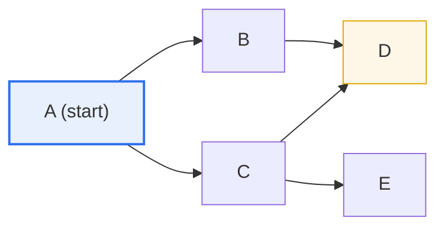
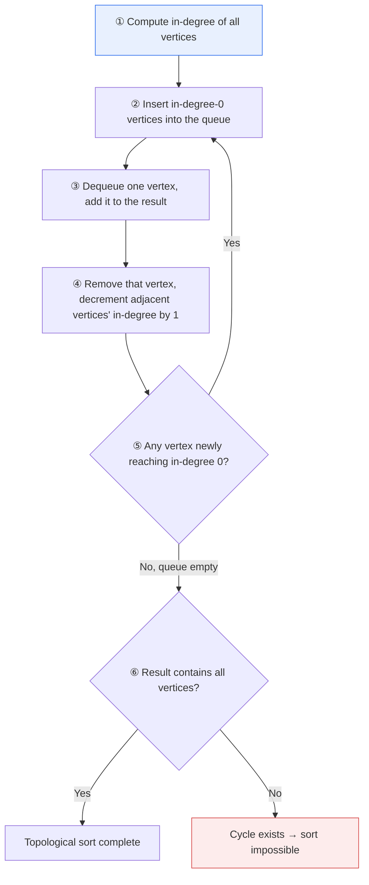

# Directed Acyclic Graph (DAG) and Topological Sort

## 1. Overview

### A. The Concept of a DAG

> A **Directed Acyclic Graph (DAG)** is a graph in which **edges have direction (directed) and there is no cycle that departs from a vertex and returns to itself (acyclic)**. It is a data structure well suited to expressing the precedence and dependency relationships among tasks without contradiction.

The fundamental reason DAGs are widely used across all fields of computer science is that they are **exactly right for expressing work that has ordering and dependency relationships**. That edges have direction means a precedence relationship of "B after A," and that there are no cycles means "there is no circular logical contradiction." If a cycle existed, A would have to precede B while B must also precede A, creating a contradiction that makes it impossible to determine an execution order. Because a DAG structurally excludes such contradictions, **a valid execution order is always guaranteed to exist**.

Thanks to this property, countless real-world "ordered dependency relationships" are modeled as DAGs. Prerequisite course relationships at a university, compile dependencies in a build system (e.g., `main.o` is linked after `main.c` is compiled), project schedule management (the activity network of PERT/CPM), data pipelines (the workflow definition of Apache Airflow), the recalculation order of spreadsheet formulas, and even blockchains and Git commit history (a directed graph pointing to parent commits)—all are DAGs. In other words, a DAG is less a specific algorithm than a **common language for expressing the problem domain of dependency**.

The procedure that actually computes, from such a DAG, "in what order must things be processed to satisfy all dependencies" is precisely **Topological Sort**. Thus it helps to understand the relationship as: the DAG is the model that expresses the problem, and topological sort is the representative algorithm that solves that model.

### B. Background and Necessity

Early software builds and task scheduling had people manually list the order, but as the number of components grew to hundreds or thousands, dependency relationships became complexly intertwined. For example, in a project with hundreds of source files, having a person calculate "what must be compiled first" each time is nearly impossible, and if a circular dependency is hidden, it is hard even to find. To automate this problem, an approach was needed to **express dependencies as a graph and mechanically derive the execution order**, and DAGs and topological sort became its theoretical and practical foundation.

The spread of parallel and distributed processing also raised the importance of DAGs. Tasks that do not depend on each other can be executed simultaneously, and analyzing a DAG structure can accurately identify "which tasks are mutually independent and thus parallelizable." That is, a DAG goes beyond simple ordering to provide the basis for **maximizing resource utilization by finding the maximum degree of parallelizability**.

### C. Characteristics

| Characteristic | Content | Practical Implication |
|---|---|---|
| **Directed** | Edges express precedence/dependency | Specifies "B after A" |
| **Acyclic** | No cycles → a contradiction-free order exists | Excludes deadlock and circular dependency |
| **Topologically sortable** | Can always be arranged in a linear order | Automatically derives execution order |
| **Partial Order** | Order among independent vertices is free | Identifies room for parallel execution |

## 2. The Concept and Structure of Topological Sort

> **Topological sort** is **arranging all vertices of a DAG in a line so that every edge points front→back (a preceding vertex comes before its succeeding vertex)**. In other words, it is the operation of extending a partial order to a total order without contradiction.

Below is an overall diagram showing one DAG and the meaning of its topological sort.

In the DAG above, topological sort is the task of lining up vertices "so that all arrows point left→right." For example, several solutions are possible, such as **A → B → C → D → E** or **A → C → B → E → D**. The key is that before any vertex is listed, all preceding vertices that point to it must appear first. D can appear only after both B and C have been processed, and E can appear after C has been processed.

The notable point here is that there is no edge between B and C. Since there is no precedence constraint between them, both B coming first and C coming first are valid as topological sorts. Because **the order of a pair of unconstrained vertices is free, the result of a topological sort is not unique**, and this degree of freedom is precisely the opportunity for parallel execution. From the execution engine's standpoint, B and C are candidates that can be processed simultaneously.

### A. Kahn's Algorithm (In-Degree Based)

A representative topological sort algorithm is **Kahn's algorithm**, which repeatedly finds and removes vertices whose in-degree (number of incoming edges) is 0. An in-degree of 0 means "there is not a single preceding task left that must come before this vertex," which means it is a vertex that can be executed right now.

Let us apply this procedure to the earlier example DAG. Initially, the only vertex with in-degree 0 is A (nothing points to A). Adding A to the result and removing it makes the in-degree of both B and C 0. Now B and C become execution candidates, and the result diverges according to the order in which they are dequeued. Processing B and C makes D's in-degree 0 (both edges from B and C are removed), and E also becomes 0 at the moment C is processed. Finally we obtain, for example, the order **A, B, C, D, E**.

An important side effect of Kahn's algorithm is **cycle detection**. If the procedure ends but the number of vertices in the result is fewer than the total number of vertices, the remaining vertices point to one another cyclically, so their in-degree never reaches 0. That is, "topological sort failed = the graph has a cycle" holds. The time complexity is **O(V + E)** with respect to the number of vertices V and edges E; since every vertex and edge is visited only a constant number of times, it is efficient even for large graphs.

### B. DFS-Based Topological Sort

Another approach uses **Depth-First Search (DFS)**. Perform DFS from each vertex, but push a vertex onto a stack at the moment the exploration of all its children (successor vertices) finishes (post-order, the moment of backtracking out). After all exploration is finished, popping the stack in reverse order yields the topological sort result.

The reason this approach works is intuitive. If there is an edge from a vertex u to v, DFS necessarily finishes exploring v before it finishes exploring u (since v is a descendant of u). Therefore v is pushed onto the stack before u, and reading the stack in reverse places u before v, automatically satisfying the topological sort condition that "predecessors come first." The DFS approach also visits each vertex and edge once, so the time complexity is likewise **O(V + E)**, and if during exploration it encounters a back edge pointing to a vertex not yet finished exploring (a gray vertex), it determines that a cycle exists.

The two algorithms have identical performance but differ in character. Kahn's algorithm is implemented iteratively using a queue, so there is no risk of stack overflow, and when there are multiple vertices with in-degree 0 it naturally reveals parallel-execution candidates—an advantage that makes it suitable for workflow schedulers. The DFS approach, on the other hand, is implemented concisely with recursion and combines well with other graph analyses such as strongly connected component (SCC) decomposition.

## 3. Use Cases

Topological sort does not remain in theory; it operates inside the engines of tools we use every day. The cases below all share the same principle: "express dependencies as a DAG and derive the execution order via topological sort."

| Field | Use | Concrete Example |
|---|---|---|
| **Build·compile** | Determine source dependency order | The target graphs of Make, Bazel |
| **Task scheduling** | Precedence order·critical path | PERT/CPM, MS Project |
| **Data pipeline** | Dependency execution·parallelization of tasks | Apache Airflow, Dagster |
| **Package management** | Install·dependency resolution order | apt, npm, Maven |
| **Prerequisite·curriculum** | Determine order of completion | University course registration systems |

The most representative case is **data pipeline orchestration**. Apache Airflow literally calls a workflow a "DAG," defining each task (e.g., extract data → clean → aggregate → load) as a vertex and dependency relationships as edges. The scheduler topologically sorts this DAG to set the execution order, while running tasks that do not depend on each other (e.g., extraction from two different sources) simultaneously to shorten processing time. In a pipeline made up of hundreds of tasks, if a circular dependency is mistakenly defined, Airflow rejects it at the DAG registration stage—this is the real-world application of cycle detection via topological sort failure.

The second case is a **build system**. Google's Bazel and the traditional Make compose the dependency relationships among sources, headers, and libraries as a DAG and compile in topological sort order. Here, if the results of unchanged vertices are cached (incremental build), even a large codebase of tens of thousands of files can rebuild only the changes and the parts that depend on them, reducing build time from minutes to seconds. Here too, targets with no dependencies are distributed across many CPU cores for parallel compilation.

The third case is **project schedule management (PERT/CPM)**. In a DAG that places activities as vertices and precedence relationships as edges, computing the earliest and latest start times of each activity in topological sort order finds the **Critical Path** that determines the overall project duration. For example, in a project made up of 20 activities, if an activity on the critical path is delayed by one day, the entire project is delayed by one day, so the manager concentrates resources on this path.

## 4. Deep Dive: Parallel Scheduling and Cycle-Handling Strategies

In modern systems, the value of topological sort lies less in simple ordering than in **optimizing parallel execution**. By modifying Kahn's algorithm to process all in-degree-0 vertices in each round as "one bundle (level)" simultaneously, a DAG can be divided into multiple levels. Vertices within each level are mutually independent, so they can be executed in parallel, and the number of levels becomes the minimum number of steps required for parallel execution. This concept is used directly in GPU computation-graph scheduling, distributed batch processing, and combinational-logic delay analysis of hardware circuits.

Meanwhile, in practice the problem "it should be a DAG but a cycle arises" occurs frequently. Examples include circular call dependencies among microservices, modules with circular references, and circular-reference formulas in spreadsheets. In such cases, strategies used are (1) detect and warn about the cycle via topological sort, (2) contract each strongly connected component (SCC) into a single super-vertex (condensation graph) so that at least the remaining part can be processed as a DAG, or (3) refactor to break the dependency (interface separation, event-based asynchronization) to remove the cycle itself. The computation graph of a deep learning framework is also a DAG for forward propagation, but a recurrent neural network (RNN) is unrolled along the time axis, converted into a DAG, and then subjected to backpropagation.

DAGs are also a core abstraction in the big-data and AI domains. Apache Spark composes the user's transformation operations as a DAG, then divides it into multiple stages to optimize the execution plan, and the automatic differentiation of TensorFlow and PyTorch traverses the forward-propagation computation graph (DAG) in reverse to propagate gradients. This pattern—"express computation as a DAG and execute/differentiate in topological order"—has established itself as a common design principle across the entire modern data and AI stack.

## 5. Considerations and Implications

1. **Use it as a tool for cycle detection and deadlock prevention.** Since whether a topological sort is possible amounts to a decision on the graph's acyclicity, it can serve as a verification means to detect dependency cycles, resource deadlock, and circular references early. When designing large-scale systems, a strategy of periodically topologically sorting the dependency graph and managing circular dependencies as an architecture quality metric is effective.

2. **Quantitatively identify room for parallelization to optimize resource utilization.** The partial-order property of topological sort reveals which tasks are independent, so through level partitioning one can compute the maximum degree of parallel execution and the length of the critical path. This becomes a quantitative basis for scheduling, resource allocation, and performance prediction.

3. **A strategy is needed to control the non-uniqueness of the result.** Because a topological sort has multiple solutions, if a reproducible build or deterministic execution is needed, a secondary criterion (vertex name, priority, cost, etc.) must be applied to enforce a deterministic order. Conversely, if optimization is the goal, this degree of freedom is harnessed for scheduling optimization.

4. **Consider incremental processing for dynamic change.** Because vertices and edges are added and removed frequently in a real system's DAG, incremental topological ordering—recomputing only the affected range rather than re-sorting the whole each time—is needed. This is a core design point that determines the responsiveness of incremental builds and real-time pipelines.

5. **Understand it together with related data structures and algorithms.** Topological sort is tightly connected to graph representation (adjacency list/matrix), queues and stacks ([[stack-queue-list]]), DFS/BFS, and shortest/critical path computation. From the Professional Engineer's perspective, it is more important to internalize the problem-solving paradigm of "model a dependency problem as a DAG and solve it via topological sort" than to memorize individual algorithms.

## References

- Wikipedia, "Topological sorting" — https://en.wikipedia.org/wiki/Topological_sorting
- Wikipedia, "Directed acyclic graph" — https://en.wikipedia.org/wiki/Directed_acyclic_graph
- Apache Airflow Documentation, "DAGs" — https://airflow.apache.org/docs/apache-airflow/stable/core-concepts/dags.html

---

> **In one line**: A DAG is a *directed, acyclic graph* that expresses precedence and dependency relationships without contradiction, and topological sort *arranges vertices so that every edge points front→back* (Kahn: remove from in-degree 0, or reverse of DFS post-order, both O(V+E)) to determine execution order in builds, scheduling, and data pipelines while revealing both room for parallelization and cycles.
