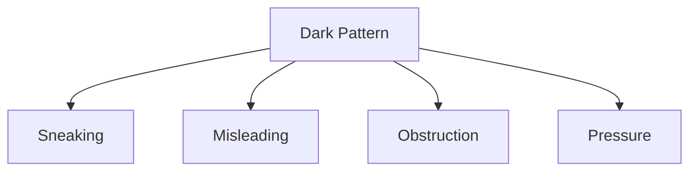

# Dark Pattern

## 1. Overview

### A. Definition
> A UI/UX technique designed to serve the operator's interest by **deceiving, misleading, obstructing, or pressuring users into irrational choices**. Also called "deceptive design."

The essence of a dark pattern lies in **exploiting human cognitive biases and habits**. People leave default settings as they are (status-quo bias), decide impulsively when under time pressure, and give up midway when they encounter complex procedures. A dark pattern targets these psychological weaknesses, deliberately twisting the interface so that users make choices contrary to their true interest (unwanted payment, giving up on cancellation).

### B. Background and Problems
As e-commerce and especially the **subscription economy** spread, harm from dark patterns surged. The subscription model is structured so that the operator's revenue grows the more "easy to sign up, hard to cancel" it is made, so there is a strong economic incentive built in that induces dark patterns such as cancellation obstruction. As harm accumulated—spending that occurs without the consumer's awareness, such as automatic conversion to paid after a free trial or hidden extra fees—the Korea Fair Trade Commission, the EU, the U.S. FTC, and the OECD are trending toward tighter regulation. The core of the problem is that it is hard for an individual consumer to recognize the loss, and even when recognized, the cost of responding is high, so it tends to be left unaddressed.

## 2. Detailed Types

Dark patterns are divided into four types by the way they deceive the user, and each type attacks a different psychology. The **sneaking type** slips in payments or additional purchases without the user's awareness, targeting gaps in attention. The **misleading type** induces wrong judgments with false information; a typical example is displaying a false list price to create the illusion of a discount. The **obstruction type** deliberately makes the actions the user wants (cancellation, withdrawal) difficult in order to induce them to give up; the "roach motel," where sign-up is a single click but cancellation is by phone only, is representative. The **pressure type** drives impulsive decisions by stoking urgency, scarcity, and guilt. For example, phrases like "3 people are viewing this product right now" or confirmshaming such as "Are you sure you want to give up this benefit?" fall into this category.

| Type | Targeted Psychology | Specific Technique | Example |
|---|---|---|---|
| **Sneaking** | Gaps in attention | Hidden renewal, sneaking | Inadequate notice of auto-conversion to paid after free trial |
| **Misleading** | Wrong information judgment | False discount, disguised ads, bait and switch | Discount illusion via false list price |
| **Obstruction** | Procedure fatigue·giving up | Complicated cancel/withdrawal process (roach motel) | Sign-up one-click, cancellation phone-only |
| **Pressure** | Urgency·guilt | Almost sold out, confirmshaming | "3 viewing now," guilt-inducing refusal wording |

## 3. Nudge vs. Dark Pattern (Comparison)

To understand dark patterns, it is effective to contrast them with the opposite concept, the **Nudge**. Both are similar on the surface in that they guide user choices through the interface, but they diverge on **whose interest it serves**. A nudge, like default registration for organ donation, makes a good choice easy for the interest of the user and society while guaranteeing the freedom to make other choices. A dark pattern, by contrast, misleads and pressures the user for the operator's interest and substantively infringes freedom of choice. Therefore the decisive criterion that separates the two is **whether the consumer's interest is infringed and whether freedom of choice is substantively guaranteed**.

| Category | Nudge | Dark Pattern |
|---|---|---|
| **Purpose** | User/social interest, helping choice | Operator interest, deceiving consumers |
| **Transparency** | Guarantees freedom of choice, clear information | Misleading·pressuring, concealing information |
| **Criterion** | **Whether consumer interest is infringed · substantive guarantee of freedom of choice** | |

## 4. Countermeasures

Dark patterns are hard to catch through ex-post regulation alone and must be **paired with proactive prevention**. Ex-post regulation only punishes and corrects harm that has already occurred, but new dark patterns keep evolving. So at the institutional level, amend the E-Commerce Act to specify prohibited types and secure deterrence through fines and corrective orders, while at the design level, prevent dark patterns from being created in the first place through fair UX guidelines and self-regulation. Operators should adhere to transparent price display, "cancellation as easy as sign-up," and explicit consent (opt-in), and consumers need the awareness to periodically review their subscription and payment history. Effectiveness arises only when these four actors move together.

| Actor | Countermeasure |
|---|---|
| **Institution (ex-post)** | Amend E-Commerce Act, **specify prohibited types**, fines·corrective orders |
| **Technology·design (proactive)** | Fair UX guidelines, clear notice·consent, self-regulation |
| **Operator** | Transparent pricing·cancellation process, adhere to opt-in (explicit consent) |
| **Consumer** | Raise awareness, periodically review payment·subscription history |

## 5. Considerations and Implications (Professional Engineer's Perspective)
- **Combine ex-post regulation + proactive ethical design**: Since regulation lags, the fundamental remedy is to embed UX ethics (Ethical Design) in organizational culture and filter them out at the design stage.
- **Responding to global rules**: Because the EU Digital Services Act (DSA) and the U.S. FTC explicitly regulate dark patterns, global services must satisfy each country's standards together.
- **Ethics of A/B testing**: A/B tests that chase only conversion rates can unconsciously drift into dark patterns, so governance that also reflects "whether consumer interest is infringed" in the metrics is needed.
- **Trust is long-term profit**: Because deception for short-term conversion erodes brand trust, a shift in perspective is required—that transparent design ultimately leads to sustainable growth.

---

> **In one line**: Dark patterns are designs that deceive consumers by exploiting cognitive bias through *sneaking, misleading, obstruction, and pressure*; the criterion distinguishing them from nudges is whether consumer interest is infringed, and a multi-layered response of **institutional regulation (ex-post) + transparent design·UX ethics (proactive) + consumer awareness** is needed.
