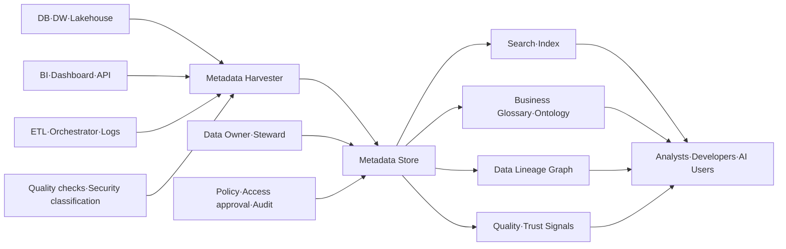
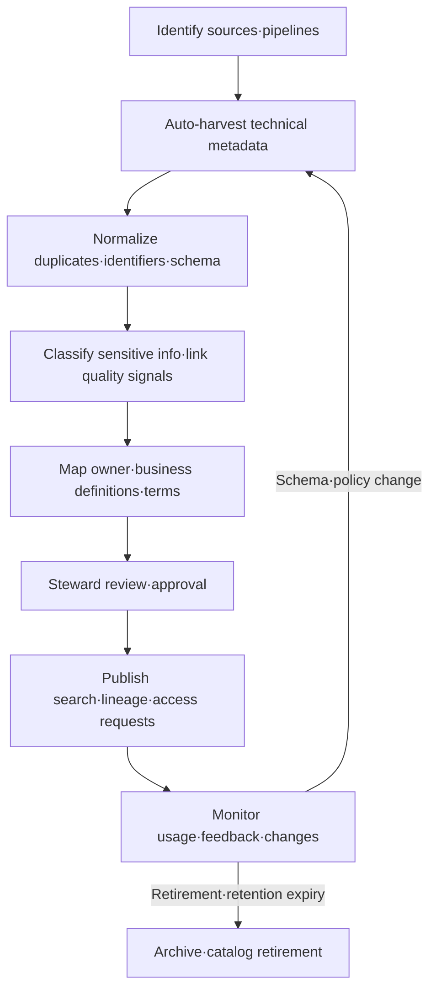

# Data Catalog and Metadata Management

## 1. Overview

> A **Data Catalog** is a management system that connects and provides technical metadata, business metadata, operational metadata, and governance information so that an organization can search, understand, trust, and use the data assets it holds and shares.

As databases and data lakes multiply, knowing merely where data exists is not enough for actual use.

The same name `customer_id` can mean a customer number, a membership number, or an anonymized identifier depending on the system, and a table's "latest time" may differ depending on whether it is the load time or the business-event time.

A data catalog is not a repository that stores copies of the data itself, but a metadata discovery and control layer that makes the descriptions of and relationships among data assets browsable.

Users check a dataset's definition, owner, refresh cycle, quality status, personal-data classification, usage-approval process, and upstream/downstream lineage in the catalog before moving to the actual source.

Therefore the catalog's goal is not simple cataloging but supporting decisions, from "what data exists" all the way to "for what purpose and under what conditions it can be used."

Metadata is data that describes data, and technical metadata alone cannot express business meaning and responsibility.

ISO/IEC 11179-1:2023 treats metadata as a description of data and provides the basis for a conceptual understanding of a metadata registry ([ISO/IEC 11179-1:2023](https://www.iso.org/standard/78914.html)).

A data catalog can be seen as a practical platform that connects this standard's metadata-management perspective, data governance's responsibility/policy perspective, and the data quality and lineage management perspective.

For a catalog to succeed, what matters is not the number of registered entries but whether users actually search and reuse it and use it for change-impact analysis and auditing.

Conversely, if it is filled only with auto-harvested schemas while definitions, owners, and quality information are empty, the catalog becomes just another document repository that has lost its currency.

This answer organizes, in essay form, the data catalog's components, metadata types, harvest/curation processes, lineage and quality linkage, and standards and adoption strategy.

## 2. Background and Necessity

### A. Data Silos and Discovery Cost

When business systems, file servers, SaaS, log platforms, data warehouses, and lakehouses each use different naming conventions and access procedures, data consumers first spend time finding "where it is."

Even if a data engineer finds the source, they must re-confirm column definitions and refresh timing with the person in charge, which lengthens the time to start analysis.

When this process depends on people's memory and messengers, knowledge disappears when the person in charge moves, and multiple teams redundantly produce the same dataset.

A catalog reduces discovery cost by providing a search index and a business glossary, but meaning is not automatically created by search functionality alone.

The organization must decide core data domains and priority use cases, and designate required metadata and responsible parties.

For example, when the marketing team searches for "monthly active customers," they should be able to search together not just the table name but the standard term, the calculation formula, the base date, exclusion conditions, and the approved data product.

### B. Reliability and Regulatory Compliance

Data quality problems can lead not only to analysis errors but also to wrong customer notifications, regulatory reporting errors, and model bias.

If the catalog links quality signals such as the latest success time, null ratio, duplicate ratio, schema changes, and recent incidents, consumers can judge the data's fitness.

For personal and sensitive information, metadata access can be separated by disclosing only the fact of existence while not exposing the original text.

For example, the fact that a column contains a "resident registration number" can be shown to the security officer, while the sample of original values and value preview are hidden from general analysts.

Because the catalog itself can expose sensitive structural information, the catalog's search permissions, audit logs, API tokens, and metadata retention policy are also objects of protection.

## 3. Conceptual Structure of a Data Catalog

A data catalog binds asset, meaning, relationships, responsibility, quality, and policy into a single discovery experience.

In the following structure, the harvester reads metadata from source systems, the storage/indexing layer supports search and relationship exploration, and the governance layer manages ownership and policy.

### A. Data Assets and Metadata Entities

Assets can be subdivided into databases, schemas, tables, columns, files, topics, APIs, dashboards, reports, ML features, and models.

Asset identifiers should not use only per-system names but be managed as global identifiers that include environment, domain, and platform.

For example, merging `prod.crm.customer` and `dev.crm.customer` into the same asset causes confusion between the quality and permissions of production data and test data.

A metadata record can have an asset's name, description, creation/change time, schema, location, owner, tags, classification, usage, quality results, and lineage relationships.

ISO/IEC 11179-3:2023 defines the conceptual data model for the information to be recorded in a metadata registry, and is the 4th edition published in 2023 ([ISO/IEC 11179-3:2023](https://www.iso.org/standard/78915.html)).

For a catalog implementation, it is more realistic to first define and then extend the core attributes that fit the organization's search/audit/sharing purposes than to copy every item of the standard verbatim.

### B. Types of Metadata

Technical metadata refers to information the system can extract directly, such as database·table·column·type·partition·file format·schema version.

Business metadata refers to semantic information that people must read and agree on, such as term definitions, business rules, KPI calculation formulas, domains, and data-product descriptions.

Operational metadata refers to execution context such as load success/failure, last refresh, execution time, usage, query frequency, cost, and SLA violations.

Governance metadata includes owner, steward, personal-data grade, retention period, access policy, approval status, and audit history.

Lineage metadata represents the flow from source through transformation to tables·dashboards·models, and column-level transformations.

The five types are not substitutes for one another.

Even with a schema, without business definitions you cannot interpret search results, and even with a definition, without currency and quality signals you cannot judge whether to use it.

| Type | Main Attributes | Harvest·Management Method | Judgment It Gives the Consumer |
|---|---|---|---|
| Technical | Schema, type, location, partition | Auto-harvest via connector·API | Where and in what structure it exists |
| Business | Term, definition, KPI, rule | Glossary·steward approval | What it means |
| Operational | Currency, execution, usage, cost | Pipeline·log linkage | Whether it can be trusted and used now |
| Governance | Owner, grade, retention, policy | Classification·workflow·approval | Who manages·uses it under what conditions |
| Lineage | Source·transform·downstream relations | SQL·event·manual supplementation | What is affected when it changes |

### C. Principles of Search and Discovery

Searching by technical name is valid for users who know the exact asset name, but business users explore using business terms such as "churned customer," "delinquency risk," and "monthly revenue."

Therefore the catalog should provide synonyms, abbreviations, term hierarchies, tags, domains, owners, quality grades, popularity, and recent usage as search filters.

Search results should show, rather than a simple link, the definition, currency, owner, sample schema, quality metrics, access method, and approval process together.

However, compressing the quality score into a single number can cause consumers to misunderstand the basis of its calculation.

It is preferable to expose the basis for judgment as explainable signals, such as "refreshed within the last 24 hours," "null ratio 0.3%," "contains personal information," and "an approved data product for the settlement business."

W3C DCAT 3 is an RDF vocabulary that helps interoperability between data catalogs on the web, supporting descriptions of catalogs, datasets, and data services, and search across distributed catalogs ([W3C DCAT 3](https://www.w3.org/TR/vocab-dcat-3/)).

## 4. Harvest·Refine·Share Process

Catalog operation is not a one-time registration project but a lifecycle that repeats the creation, verification, distribution, change, and retirement of metadata.

### A. Automatic Harvesting

Automatic harvesting is the stage of reading metadata from database catalogs, cloud storage, BI tools, orchestrators, message brokers, and ML platforms.

The harvest cycle varies with the asset's rate of change.

Event-based harvesting suits event topics with frequent real-time schema changes, while batch harvesting may be enough for a monthly settlement table.

The harvester should use only read permission on the source system and should not excessively store passwords or data contents as metadata values.

Distinguish schema harvesting from sample profiling.

The schema can be obtained just by reading column names and types, but null·distribution·pattern checks query part of the actual values, so they carry greater personal-data and cost risk.

### B. Normalization and Identification

Because the names and hierarchies of databases, tables, datasets, and reports differ by tool, they must be normalized to the catalog's internal common asset model.

If the same table is harvested multiple times as aliases, replicas, views, and physical partitions, duplicate search results and incorrect usage occur.

Storing the global identifier, source system ID, environment, asset type, version, and last harvest time together secures idempotency on re-harvesting.

Rather than forcibly consolidating asset names into one, separating the source name from the standard display name maintains both source traceability and business searchability.

Schema changes must be distinguished into additions, deletions, type changes, and meaning changes.

Adding a column is not always compatible, and a case where the same column name is changed to a different meaning is a more dangerous, semantically breaking change.

### C. Curation and Approval

Automatic harvesting alone cannot decide the definition of "customer" or the calculation formula for "net revenue."

The domain data owner bears business responsibility, the data steward manages definitions·tags·quality criteria, and the platform operator is responsible for the availability of the harvester and store.

Business definitions and sensitivity classifications should have states of draft, review, approval, and expiry or retirement.

Whether to make unapproved assets searchable, or to expose only approved assets in the official list, is a balancing problem between the organization's freedom of exploration and strength of control.

In practice, it is useful to separate "explorable" and "officially recommended for use" as states.

### D. Lineage and Impact Analysis

Lineage expresses where data came from, what transformations it went through, and where it is consumed.

Table-level lineage is advantageous for quickly grasping the broad structure, and column-level lineage is advantageous for analyzing the propagation of personal information and the impact of changing a specific metric.

Not all lineage can be obtained accurately by SQL parsing alone.

When dynamic SQL, user-defined functions, external files, manual uploads, or API calls are involved, execution events or developers' supplementary input are needed.

OpenLineage is an approach that aims to collect the inputs·outputs and execution context of data-processing jobs as standard events, and the catalog can connect such runtime lineage as asset relationships.

Lineage should be used for change decisions rather than for the diagram itself.

For example, before changing the retention policy of `customer_phone`, one should be able to find the linked reports, ML features, and external APIs, adjust the deployment order, and notify the relevant owners.

## 5. Governance·Quality·Security Linkage

### A. Ownership and Stewardship

The data owner is the role that decides the business responsibility and use-approval criteria of the data, and the data steward is the role that executes and coordinates definitions and quality rules.

The technical platform person manages harvest failures and store performance, but cannot decide the business meaning of all data on everyone's behalf.

If roles are not separated, the catalog becomes an incomplete list entered by the tech team, or the central governance organization becomes a bottleneck for all approval requests.

Federated operation, in which domain-specific responsible parties and a central standards committee coexist, suits large organizations.

### B. Quality Signals and Trust Scores

The catalog does not replace the quality rules themselves but plays a hub role that conveys quality-measurement results to consumers.

Dimensions such as completeness, uniqueness, validity, consistency, timeliness, and accuracy can be mapped to datasets·columns·business rules.

For example, order data manages a sudden drop in row count, an increase in the proportion of negative amounts, load delay, and duplicate order numbers each as a separate check.

Quality results should include the check time, target version, threshold, failure cause, exception approval, and recovery state.

Display freshness and quality checks together so that an old success result is not mistaken for the latest quality.

### C. Personal Data·Access Control

Metadata can also contain sensitive information such as personal data, security configuration, and the locations of vulnerable assets.

Apply role-based access control to the catalog UI and API, and differentiate search·profile·sample·download permissions according to classification tags.

Even if de-identified column descriptions are disclosed, one must review whether the original-value sample and lineage details, when combined, become a clue for re-identification.

Use automatic sensitive-information classification as a means of suggesting candidate tags, and place steward review and periodic re-checks in areas with large false positives/negatives.

Access-approval history and metadata-change history should be retained separately to trace who changed the classification, definition, or policy and on what basis.

## 6. Comparison and Cases

### A. Comparing the Data Catalog with the Data Dictionary·Glossary

A data dictionary is closer to an artifact that structures the definitions, formats, and allowed values of attributes.

A business glossary is a semantic layer that manages the meaning and relationships of terms agreed upon by the organization.

A data catalog can include both of these, but differs in that it is an operational platform that connects everything through to the search·ownership·quality·lineage·access requests of actual assets.

| Category | Data Catalog | Data Dictionary | Business Glossary |
|---|---|---|---|
| Central Object | Actual data assets and relationships | Structure·spec of data elements | Business terms and meanings |
| Main Users | Analysts·developers·governance | Modelers·developers | Business·planning·governance |
| Automation | Harvest·lineage·usage·quality | Schema generation·validation | Auto-suggest then approve |
| Core Question | What to use, where, under what conditions | What are this field's format and allowed values | What is the business meaning of this metric and term |
| Operational State | Currency·quality·access rights | Version·standard compliance | Approval·change·synonyms |

The three tools can be operated separately, but connecting identifiers and term relationships is necessary to reduce redundant descriptions.

For example, the glossary's "customer" should link to `customer_id` in several datasets, and those datasets' lineage and quality status should be shown in the catalog for business meaning to lead to actual use.

### B. Case 1: Regulatory Reporting at a Financial Institution

At a financial institution, customer·account·transaction data are scattered across multiple channels and core banking systems, and the definitions of regulatory reporting metrics are strict.

If the catalog links each reporting metric's standard definition, source tables, transformation SQL, approver, base date, and personal-data grade, one can check the scope of impact when reporting changes.

If a core-banking column name changes, downstream risk-management models and report lists can be found automatically, the person in charge notified, and an approved alternative dataset recommended.

However, for regulatory reasons, access rights to the original data and metadata permissions visible in the catalog must be separated.

### C. Case 2: Manufacturing Data Platform

On the manufacturing floor, sensor topics, equipment events, production results, and quality-inspection data have different cycles and reliability.

The catalog can display sensor data's unit, measurement location, collection cycle, missing-value handling, equipment version, and stream retention period.

The predictive-maintenance model owner does not simply select a "temperature" column but must compare equipment ID, sensor calibration date, missing rate, latest collection time, and fitness for model training.

If a sensor ID changes due to equipment replacement, updating the asset relationships and lineage allows early detection of a break in model input.

### D. Case 3: Generative AI and Data Products

When RAG or an agent searches internal documents·tables, the catalog's descriptions, access policies, and quality·currency information can become search context.

However, a description registered in the catalog does not mean it is the correct data.

The AI retriever should apply approval state, data grade, business domain, currency, and user permissions as filters, and the answer should record the assets and points in time used.

If catalog metadata becomes stale, the AI may recommend the wrong asset, so metadata freshness also becomes an object of model evaluation and operational monitoring.

## 7. Deep Dive: Standards·Open Metadata and Data Products

### A. The Roles of ISO/IEC 11179 and DCAT

The ISO/IEC 11179 family is a basis that organizes the concepts and procedures for what items a metadata registry describes and how, and how they are registered.

W3C DCAT, on the other hand, is an RDF vocabulary that helps the exchange and interoperability of catalogs, datasets, and data services on the web.

The two are not competing standards that mean one product version, but differ in their focus of application.

Internal definitions of data elements and registration procedures can be organized from the 11179 perspective, and inter-agency public data-catalog linkage can be combined by considering DCAT profiles.

When adopting a standard, rather than exposing standard terms directly on the screen, one should decide the internal common model, mapping rules, JSON/RDF exchange format, and responsible parties.

### B. The Data Product Perspective

A data product is a data-delivery unit that is discoverable and has clear quality·SLA·ownership for a specific consumer and purpose.

The catalog can be both the specification and the product portal for a data product.

A data-product page displays the purpose, input·output contract, schema version, refresh cycle, quality targets, usage examples, cost·quotas, owner, and retirement policy.

Doing so makes the catalog a marketplace of offerings for which domain teams are responsible, rather than a manual registration list of a central team.

That said, creating data products does not require productizing every table.

Productizing core data first—data that is repeatedly used and needs a stable interface—while setting a low lifecycle and disclosure scope for temporary analysis tables and experimental assets, controls cost.

### C. Metadata Quality in the AI Era

Because AI search and agents use relationships·definitions·policies more than asset names, the catalog's semantic layer is becoming more important.

At the same time, as auto-generated descriptions increase, so does the risk that definitions not approved by a human circulate as if they were official information.

AI-suggested summaries·tags·lineage should record the generation source, generation time, confidence, reviewer, and original-text link, and be distinguished as a "suggestion" state before approval.

Separate the permissions of metadata the model can access from metadata the user can see, to prevent prompt injection, policy bypass, and exposure of sensitive structure.

## 8. Adoption Strategy and Performance Measurement

The first step is not to register all enterprise assets at once but to select the highest-cost decisions and data domains.

For example, select one of regulatory reporting, Customer 360, or root-cause analysis, and define success criteria as search time, reuse rate, and impact-analysis time.

Second, decide the minimum metadata contract for core assets.

Make asset name, description, domain, owner, refresh cycle, sensitivity, quality state, access method, and retirement date mandatory, and increase additional attributes according to the use case.

Third, run automatic harvesting and human curation in parallel.

Automate technical metadata, and assign a domain owner to business definitions and policy approval.

Fourth, operate the access flow and feedback that leads from search results to the actual source.

Finally, measure usage and quality.

| Perspective | Measurement Example | Caution in Interpretation |
|---|---|---|
| Discoverability | Search success rate, average exploration time | Must be broken down by search term·domain |
| Reuse | Approved-asset usage, reduction of duplicate datasets | Increased usage does not mean quality |
| Trust | Ratio of up-to-date metadata, owner-assignment rate | Targets are needed by asset importance |
| Impact Analysis | Time to grasp change impact, ratio of missing lineage | Distinguish auto lineage from manual supplementation |
| Governance | Classification·approval processing time, policy violations | Strengthened control can cause business delay |
| Cost | Harvest·storage·query cost, tool operating cost | Compare with the catalog's own ROI |

## 9. Considerations and Implications

### A. Manage Fitness Alongside, Not Just Currency

Even if metadata was harvested today, it is more dangerous if the business definition is wrong.

Display technical currency, business-definition approval, and quality-check time separately, and let fitness be judged by purpose of use.

### B. The Limits of Automation and Human Review

Schemas and execution logs are easy to automate, but meaning, sensitivity, responsible parties, and exception rules require contextual judgment.

A human-in-the-loop structure, in which AI/rule-based classification quickly produces candidates and a domain steward approves, is safer.

### C. Trade-off Between Lineage Accuracy and Cost

Column-level lineage is strong for impact analysis but has large parsing·storage·query costs and can be missed in dynamic logic.

Manage core regulatory data in detail, but adjust depth by importance rather than harvesting even every temporary table to the same depth.

### D. Security and Privacy

Even if the catalog does not hold the original data, it exposes asset location and sensitivity information.

Least privilege, action auditing, masking, API authentication, metadata retention period, and retirement procedures should be included in the catalog's operating criteria.

### E. Standards and Vendor Lock-in

Depending only on a specific tool's internal model makes platform replacement and inter-agency linkage difficult.

Design global identifiers, exchange APIs, open lineage events, and standard term mappings, and place tool-specific features behind an adapter layer.

### F. Organizational Change and Operational Responsibility

The catalog is not a tool-adoption project but an organizational change that puts data responsibility into daily work.

Unless owner assignment, definition approval, quality-exception handling, and retirement review are tied to performance and operational processes, it quickly goes stale after the initial registration.

### G. Comprehensive Implication from the Professional Engineer's Perspective

The data catalog is a metadata control plane that connects data governance, data quality, privacy protection, data products, and AI reliability.

The success criterion is not the number of registered assets but the ability to discover the right asset faster, reuse it safely, and control change impact.

Therefore, in adoption design, one must present the target domain, minimum metadata, automatic harvesting, business approval, permission model, lineage depth, and performance metrics as a single operating model.

## References

- [ISO/IEC 11179-1:2023 — Metadata registries](https://www.iso.org/standard/78914.html)
- [ISO/IEC 11179-3:2023 — Metadata registries conceptual model](https://www.iso.org/standard/78915.html)
- [W3C Data Catalog Vocabulary (DCAT) Version 3](https://www.w3.org/TR/vocab-dcat-3/)
- [OpenMetadata — open metadata management platform](https://open-metadata.org/)
- [OpenMetadata Lineage documentation](https://docs.open-metadata.org/v1.13.x/how-to-guides/data-lineage)

---

> **In one line**: A data catalog is a metadata operating system that connects technical·business·operational·governance metadata with assets·quality·lineage·policy to enable the discovery, trust, reuse, and change control of data.
