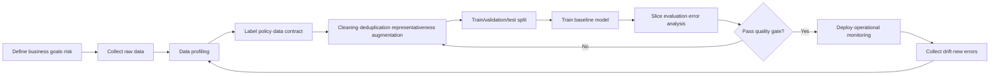
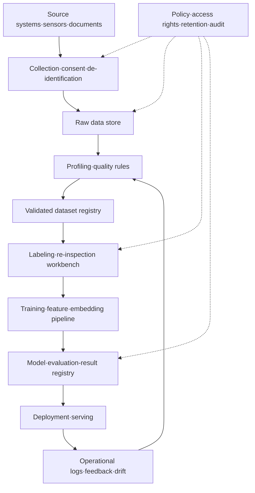

# Data-Centric AI and Training-Data Quality Engineering

## 1. Overview

> **Definition**: Data-Centric AI (DCAI) is an approach that raises the performance and reliability of AI systems by systematically designing training and validation data suited to the problem and iteratively improving quality, instead of advancing only the model architecture and code.

Traditional machine learning projects often used a Model-Centric approach that, given the same dataset, changes the model's number of layers, hyperparameters, loss function, and ensemble method. This approach is valid for algorithm research, but when the cause of performance degradation in practice is label errors, omissions, duplicates, bias, or failure to reflect the field distribution, changing only the model yields a small improvement. The data-centric approach does not mean unconditionally fixing the model; it means viewing data as a system asset equal to the model and operating explicit quality goals and improvement loops.

From the Professional Engineer's perspective, DCAI is not a simple preprocessing technique. It is a combined problem of data governance and MLOps that connects data collection, definition, labeling, inspection, version control, training, evaluation, and post-deployment monitoring. Therefore the engineer should include in the answer not just a single accuracy number but also data fitness for the business purpose, representativeness, traceability, privacy protection, and operational sustainability.

The background can be summarized in three points. First, as the performance of open and pretrained models has leveled up, differences in data determine the result on the same model. Second, actual business data has different distributions at training time and operating time due to seasonality, equipment changes, and shifts in user behavior. Third, generative AI and multimodal AI, without tracking the source, copyright, personal data, duplication, and contamination of the raw data, magnify not only model performance risk but also legal and ethical risk.

The purpose of DCAI is not to collect a lot of data but to secure data suited to the purpose. 1,000 representative samples showing rare fault types can be more useful than 100,000 samples that repeat only the normal state. Conversely, expanding only a few cases when the sample size is insufficient causes overfitting and misjudgment in the real environment, so the balance of quality and quantity must be verified by experiment.

## 2. The Concept and Execution Structure of Data-Centric AI

### 2.1 Difference from the Model-Centric Approach

The model-centric approach views the dataset as a relatively fixed input and improves the model's expressiveness and optimization method. In contrast, DCAI improves performance by changing the dataset version, label policy, sample composition, and error types even when the model version is the same. The important point is that the two approaches are not either/or. It is practical to fix a baseline model to measure the effect of data changes, and to pursue model improvement in parallel after reaching a certain level of data quality.

In DCAI, data quality means both a database's general quality and AI's training fitness together. Even if values are formally filled in, if they cannot explain the actual classification boundary, quality is low from the AI perspective. For example, even if all pixels of a manufacturing image are high-resolution, if the defect area is obscured or only defect-free samples are included, it is not suitable for on-site judgment.

The following table condenses the difference between the two approaches. Use the table's items not as conclusions to memorize but as criteria that determine the direction of the improvement activities explained later.

| Category | Model-Centric AI | Data-Centric AI |
|---|---|---|
| Main Improvement Target | Architecture, parameters, loss function, inference code | Collection, labels, representativeness, error·duplication, data distribution |
| Basic Assumption | Dataset is relatively fixed | Dataset is also designed·improved iteratively |
| Performance Measurement | Model-metric-centric | Linkage of model metrics and data-quality metrics |
| Core Role | ML engineers·researchers | Domain experts·data engineers·labelers·governance personnel |
| Main Risk | Overfitting, compute cost, generalization failure | Label bias, drift, unknown provenance, personal data·copyright |
| Operating Method | Training-pipeline-centric | Version·validate·monitor data and model together |

The advantage of the model-centric approach is that it provides a fast breakthrough in situations where a new model architecture greatly improves the expressiveness for the problem. However, if the cause of errors is semantic inconsistency in the data, a larger model may learn the errors in a more complex way. DCAI is not an argument to simplify the model but an argument to manage the causes and context of the data fed to the model.

### 2.2 Overall Execution Flow

DCAI is not a one-time cleaning task but a closed loop that discovers and improves data errors and then re-evaluates. In the following structure, the quality gate is a device that halts the pipeline while also being an audit point that leaves evidence of which criteria were passed.

In the first step, define the loss structure of the business decision rather than an accuracy target. If the cost of missing a defective product differs from the cost of classifying a normal product as defective, recall, precision, and cost-weighted loss should be used rather than simple accuracy. Without this goal, the data team makes only nicely balanced data and misses the important failure types of the business.

Data profiling is the activity of grasping the schema, missing rate, value range, duplicates, distribution, time range, and provenance. For images, check resolution·lighting·shooting equipment·file corruption; for text, check language·character encoding·length·inclusion of sensitive information. Profiling results become the basis for setting the data-quality baseline and subsequent improvement priorities.

A label policy is not a document that decides only label names. It also includes how to judge boundary cases, whether multiple labels are possible, whether to hold uncertain samples, and who decides when labelers disagree. Because a policy change can alter the meaning of past and new data, the label-schema version must be managed together.

In the cleaning step, do not delete unconditionally. First confirm the cause—whether an outlier is a measurement error or an actual rare case. Deleting rare cases improves average metrics but fails to learn the tail risk of the operating environment. Therefore record in the data lineage which action was taken among deletion, correction, holding, weight adjustment, and additional collection.

### 2.3 The Combined Asset of Data and Model

AI reproducibility is not secured by code and model files alone. The data snapshot used for training, the preprocessing rules, the label policy, the feature extractor, the evaluation set, and the execution environment must be preserved together to reproduce the same result. If the data version changes, the model version must also be treated as a separate release candidate.

A Data Contract is a device by which producers and consumers agree on schema, meaning, quality thresholds, and the change-notification method. For example, one can declare that a customer event's `event_time` is in UTC and must arrive within 5 minutes, and the identifier must be a token rather than raw personal data. Because a contract violation can lead to training failure or operational misjudgment, it is checked automatically in the CI stage.

## 3. Data Quality Engineering

### 3.1 Quality Dimensions and Measurement

The quality dimensions needed for AI vary with the purpose and data type. The following table organizes representative dimensions, but in an actual project one selects measurement items by connecting business risk and model error analysis.

| Quality Dimension | Meaning | Representative Measurement Example |
|---|---|---|
| Accuracy | Degree to which values match the actual target·business rules | Reference-data match rate, label-inspection rate |
| Completeness | Degree to which required values and needed cases exist without omission | Missing rate, required-field fulfillment rate |
| Consistency | Degree to which meaning is not contradictory across records·sources·time | Number of rule violations, unit-mismatch rate |
| Uniqueness | Degree to which duplicates of the same event·entity are controlled | Duplicate rate, near-duplicate detection rate |
| Timeliness | Degree to which it arrives at the point needed for business decisions | Latency, currency |
| Representativeness | Degree to which the operating target's groups·conditions·boundaries are sufficiently reflected | Distribution difference, per-group coverage |
| Label Reliability | Degree to which it matches the criteria and inter-labeler agreement is high | Re-inspection rate, Cohen's kappa |
| Lineage·Traceability | Degree to which provenance and transformation can be reproduced | Lineage missing rate, provenance coverage |

The missing rate can be defined as the number of records missing a specific field divided by the total number of records. However, more important is whether the missingness itself is random or concentrated in a specific customer group·equipment·time slot. Filling selectively-occurring missing values with the mean can prevent the model from learning the cause of missingness or increase the bias of a specific group.

The duplicate rate measures the problem of counting the same event repeatedly. In text and images, one must detect not only exact matches but also semantically similar near-duplicates. If duplicate data is split across training and test sets, the metrics can be inflated by data leakage rather than actual generalization.

Representativeness does not mean only that the whole data matches the real-world proportions. Also check whether rare conditions that are costly in operation were deliberately included in sufficient quantity. For example, even if night·rain·low-light conditions are 5% of the total, if they are linked to safety accidents they should be managed as a separate evaluation slice.

### 3.2 Label Quality and the Role of People

In supervised learning, a label is not a fact itself but the result of applying a business rule. Because the label can differ depending on the policy interpretation even when viewing the same medical image or customer inquiry, label quality depends on the labeler's skill and the clarity of the guidelines. When it is hard for domain experts to label all data directly, cost is allocated via sample re-inspection and focused inspection of hard cases.

The label guide includes positive·negative examples, boundary cases, hold criteria, multi-label priority, and personal-data masking rules. A simple list of label names does not reduce inter-labeler variance. When the guide changes, record the reason, the point of application, and the affected data version, and if necessary re-map past labels.

Inter-labeler agreement is not a single number that substitutes for the ground truth. Low-agreement cases can be a signal that the problem itself is ambiguous or the guidelines are insufficient. Rather than removing such cases, the meaning can be preserved through uncertainty labels, distinction between majority vote and expert judgment, and low weight in model training.

### 3.3 Representativeness·Bias·Data Splitting

Splitting data by shuffling randomly is not always safe. Time-ordered demand forecasting must be split by time so that future information does not mix into past training. If derivatives of the same user·same equipment·same document go into multiple sets, group-based splitting must be applied.

After splitting, look not only at the overall average but also at per-slice metrics by region, gender, age, equipment, language, time slot, and business type. Even if the overall F1 score is high, if the recall for a minority group is low, service-quality and fairness problems arise. Slice does not mean unnecessarily expanding the collection of personal data, but means designing aggregation criteria that can diagnose risk within a lawful and necessary scope.

Data augmentation can supplement lacking conditions but can damage the meaning of the original distribution. One must verify whether image rotation is irrelevant to object orientation, whether text substitution preserves the sentence's intent, and whether generated data reflects actual error patterns. Distinguish augmented data from raw data and record the generation rules and quality inspection.

### 3.4 Error Analysis and Active Data Collection

Post-training error analysis does not stop at listing the wrong samples but classifies errors into source·label·representation·distribution·model boundary. If the same error recurs, before enlarging the model, add samples that show that error well or revise the label policy. Here, the error-classification scheme becomes the unit of the data-improvement backlog.

Active Learning is a strategy that prioritizes labeling samples the model judges as uncertain or of low representativeness. In domains with high labeling cost, it can be more efficient than random labeling, but it can keep excluding areas the initial model misses. Therefore, draw uncertainty-based samples and random·rare-condition samples together to mitigate exploration bias.

Hard negatives are cases the model frequently misidentifies but that are actually a different class. When adding hard negatives, one must be able to explain the reason for the misidentification. Simply repeating difficult images can overfit the dataset to specific shooting conditions, so check coverage by class·environment·time slot together.

## 4. Lifecycle·Architecture·Governance

### 4.1 Quality-Improvement Architecture

The following is a logical architecture connecting the data store, quality validation, labeling, training, and operational feedback. The key is not the name of a data lake or storage technology, but a structure in which a responsible party, version, and quality result are connected to every transformation and judgment.

At the collection layer, reduce collection beyond the purpose and confirm consent·legal basis·retention period. Because re-identification is possible when de-identified data is combined with other information, access rights, exfiltration control, and logs must be designed together. Data-centric AI is not an approach of collecting more data to raise quality, and does not conflict with the principle of minimal data suited to the necessary purpose.

The validated dataset registry manages a dataset's version, schema, statistics, label policy, quality results, approver, and usage restrictions. Connecting it to the model registry allows querying which model was trained with which data version. This connection is important for quickly narrowing the scope of impact during an incident or regulatory inquiry.

Operational feedback can consist of users' correction of ground truth, business rejection, monitoring alerts, and samples from a new environment. Putting feedback directly into training causes the problem that an attacker injects contaminated data or the input of an incorrect user is trusted. Therefore separate retraining candidates by criteria of reliability·inspection state·provenance.

### 4.2 DataOps and MLOps Integration

DataOps manages the quality·reproducibility·deployment of data flows, and MLOps manages model training·deployment·observation. In DCAI, if the two pipelines are operated separately, the impact of data changes on model performance is missed. Data-snapshot changes must be connected as a trigger for model re-evaluation, and model-performance drops as a trigger for data error analysis.

In the CI stage, check schema, required fields, value ranges, duplicates·leakage, personal-data detection, and label distribution. In the CD or training-deployment stage, check performance versus the baseline model, per-slice performance, fairness criteria, explainability, and inference cost. An automatic gate does not replace human judgment but blocks repeated violations early and standardizes the exception-approval procedure.

Data drift is a change in the input distribution, and concept drift is a phenomenon where the relationship between input and ground truth changes. Even if the input distribution does not change, concept drift can arise if the business policy changes. Therefore statistical distribution checks alone are not enough, and where possible, monitor the actual error rate considering label delay and business KPIs together.

### 4.3 Privacy·Security·Accountability

Data-centric AI has the risk of increasing the collection and reuse of original data. Include collection purpose, minimal collection, retention period, access rights, processing records, and response to deletion requests in the design. For training data containing sensitive information, do not view de-identification alone as a cure-all but combine pseudonymization·access control·encryption·secure analysis environment·output inspection.

A data poisoning attack is one in which an attacker inserts malicious samples or incorrect labels into the training data to change the model's general performance or its behavior under specific conditions. To defend, check provenance reliability, change history, approved collection paths, anomalous label patterns, and performance change against baseline data. A dataset hash or signature provides evidence of integrity but does not guarantee the semantic accuracy of the data.

Check the license, purpose of use, and redistribution conditions of generated and external data. If data provenance cannot be traced, explaining the model's output and responding to rights becomes difficult. Specifying the data composition, limits, known biases, and evaluation scope in a datasheet or model card lets users and auditors use the system within the correct scope.

## 5. Comparison and Cases

### 5.1 Comparing Data-Quality Improvement and Model Tuning

Model tuning adjusts the learning rate, regularization, architecture, and ensemble to raise expressiveness and generalization performance on the same data. Data-quality improvement fixes label errors and omissions, fills gaps in the distribution, and removes duplicates and leakage, thereby changing the very signal the model learns. One can explain that the former changes the model's function space and the latter changes the reliability and coverage of the input signal.

If the cause of stalled performance is biased labels, the return on investment of label re-inspection can be higher than experiments that change the model. Conversely, when the data is sufficiently cleaned and a complex nonlinear boundary is needed, model tuning is more effective. The engineer should present that one does not conclude either side is the answer but selects the improvement direction through error decomposition and experiment design.

| Situation | Priority Action | Confirmation Metric |
|---|---|---|
| Both training and test performance low | Check labels·features·problem definition | Label agreement, per-class recall |
| Only training performance high, test performance low | Check leakage·duplication·representativeness·overfitting | Cross-set duplication, slice performance |
| Overall high but specific condition low | Augment·re-split data by condition | Per-group metrics, coverage |
| Drops only in operation | Analyze drift·sensor·policy change | PSI/distribution change, business error rate |
| Label cost high and many candidates | Active learning·priority labeling | Performance gain per sample, cost |

### 5.2 Hypothetical Manufacturing Defect-Inspection Case

The following is a hypothetical case for illustrating principles. Assume a manufacturing line judges surface defects from camera images. The initial data is 120,000 images, but most are daytime·daylight lighting and normal products, with almost no samples from a new camera or of fine defects. The baseline model's overall accuracy is high, but defect misses are frequent on the new line.

First, use data profiling to divide the distribution by shooting equipment·line·time slot·defect type. Second, remove the leakage where continuous shots of the same product went into both training and test. Third, have a domain expert re-inspect 5,000 defect boundary cases to create a label guide and hold labels. Fourth, deliberately collect additional data of the new camera and low-light conditions, but manage the ratio of normal to defect separately.

Fifth, compare the overall score along with defect recall, per-line recall, and low-light-slice recall. Sixth, prioritize inspecting hard negatives the model frequently gets wrong, and include only high-reliability cases from operational feedback in the next dataset version. This process is a typical DCAI loop that can reduce defect misses by improving the data's representativeness and label consistency without changing the model architecture.

When reporting results, do not write only "accuracy improved." Record the data version, added conditions, label agreement, whether the test set was fixed, and the per-slice improvement and cost together. Only then can one distinguish whether the improvement is accidental optimization to a specific test set or an actual improvement in operational quality.

## 6. Deep Dive: Recent Trends and Exam Linkage

DCAI does not mean the work of a data-labeling company. Recently, it is evolving toward automating data preparation, labeling, augmentation, error analysis, and data validation and connecting the results to the MLOps pipeline. However, because labels generated by an automation model can also be erroneous, risk-based operation that requires human inspection and sample audits is appropriate.

In standardization trends for evaluating data quality, there is a tendency to look not only at accuracy·completeness·consistency but also at AI-specific aspects such as representativeness, traceability, label quality, and personal data together. A data-quality model such as ISO/IEC 25012 can be referenced as the organization's quality criteria, but applying the same threshold to all characteristics raises cost. One must select the core quality dimensions and measurement cycle to fit the service risk and data use.

In generative AI, document cleaning and deduplication, chunk quality, metadata, search fitness, and verification of personal data and copyright are important. To raise RAG answer quality, one must improve the currency, document permissions, chunk boundaries, and evidence linkage of the retrieval corpus rather than tuning only the model. That is, the target of DCAI is expanding from traditional labeled data to search·evaluation data and prompt data.

In exam-linked answers, it is logical to develop in the order "definition-necessity-structure-quality metrics-lifecycle-governance-cases-considerations." Connecting data governance, DataOps/MLOps, AI reliability, privacy protection, data contracts, and model monitoring to explain the relationships among technologies makes it a design-type answer rather than memorization of a single term.

## 7. Considerations and Implications

### 7.1 Decide the Target Metrics First

More data-quality metrics are not better. Analyze the business failure cost and model error types to decide priorities among accuracy, representativeness, label agreement, and currency. Documenting each metric's definition·numerator·denominator·measurement cycle·responsible party reduces the problem of comparing different numbers across teams.

### 7.2 Protect the Test Set and Evaluation Protocol

Looking into the test set during the process of iteratively improving data causes overfitting. Fix the test set as much as possible, and separate the validation set for improvement and the operational monitoring set. If the distribution changes greatly, add a new test set but maintain continuity with the existing baseline set.

### 7.3 Place Domain Experts in the Quality Loop

Label policy and error causes are hard to decide by the data team alone. Domain experts interpret the meaning of hard cases and define business-critical failures. It is efficient for experts to focus on writing guides, auditing samples, resolving disputes, and defining error types rather than processing all samples directly.

### 7.4 Manage the Limits of Automation

Data-validation rules and auto-labeling reduce repetitive work but can miss semantic errors not expressed in the rules. Place a confidence and exception path on automatic judgments, and control high-risk changes with human approval and sample re-inspection. Rather than making the automation rate itself the goal, evaluate the balance of quality·cost·processing time.

### 7.5 Include the Scope of Privacy and Rights in the Design

A strategy of collecting more data can expand privacy infringement and use beyond the purpose. Review the purpose and retention period before collection, and do not copy unnecessary original text into the training store. Record the license and provenance of external and generated data, and track the impact of deletion requests or usage restrictions on the model·data pipeline.

### 7.6 Set Retraining Criteria That Respond to Operational Change

Retraining immediately when a drift alert occurs can learn contaminated data or a temporary event. Decide whether to retrain after confirming the alert's duration, actual label verification, business impact, and data-provenance reliability. Prepare a comparison of the baseline model before and after retraining and a rollback version.

### 7.7 Calculate the Investment Effect at the Data Level

Connect the cost of label re-inspection, additional collection, and adopting quality tools to performance improvement. Calculate the label cost per sample, data-preparation time, the business-cost savings from error reduction, and the retraining cost together. One must present how much a 1%p accuracy improvement actually reduces business loss for it to lead to management decisions.

### 7.8 The Engineer Presents Evidence and a Responsibility Structure

Good DCAI design is not a declaration that "we use clean data" but a system in which who approved by what criteria and which version was used when can be reproduced. Leave a dataset card, label guide, quality report, lineage, model card, access log, and exception-approval record. This evidence raises the system's explainability not only in incident response but also in audits·regulation·disputes.

## References

1. [Data-Centric Artificial Intelligence, arXiv](https://arxiv.org/html/2212.11854v4) — the definition of data-centric AI, comparison with the model-centric approach, and the data cleaning·augmentation perspective.
2. [ETSI TR 104 180: Data Quality Metrics](https://www.etsi.org/deliver/etsi_tr/104100_104199/104180/01.01.01_60/tr_104180v010101p.pdf) — reference on data-quality measurement dimensions and metricization.
3. [NIST AI Risk Management Framework](https://www.nist.gov/itl/ai-risk-management-framework) — reference on AI reliability·risk management and the lifecycle perspective.
4. [The Principles of Data-Centric AI, Communications of the ACM](https://cacm.acm.org/research/the-principles-of-data-centric-ai/) — reference on the data-centric improvement loop and error-analysis perspective.

---

> **In one line**: Data-Centric AI is a methodology that, rather than a larger model, iteratively improves the quality·representativeness·lineage of data suited to the purpose and connects this to MLOps·governance to build trustworthy AI.
