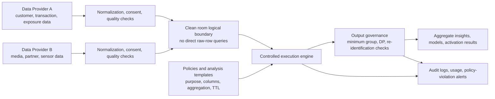
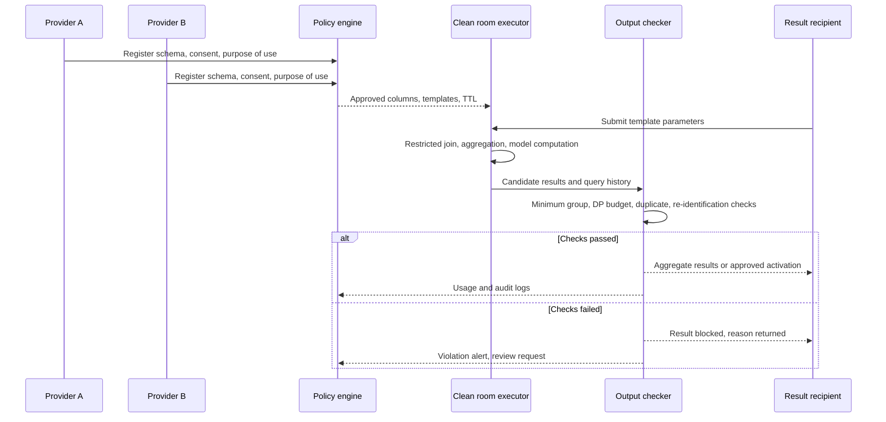

# Privacy-Preserving Data Collaboration Based on Data Clean Rooms

## 1. Overview

> **Definition**: A Data Clean Room (DCR) is a controlled analysis environment in which two or more organizations use joint data within pre-agreed analysis, matching and activation operations and output policies, without directly disclosing or copying their raw data to each other.

Digital services repeatedly encounter problems — advertising performance measurement, fraud detection, supply chain analysis, medical research — where accuracy improves only when data from multiple organizations is combined. However, raw data contains sensitive attributes such as customer identifiers, purchase history, location, and financial or medical information, so the traditional data exchange of handing files to the counterparty increases the risk of leakage and use beyond the stated purpose. A clean room reframes the problem from "should we share the data?" to "how do we share only the results of permitted questions?"

AWS describes Clean Rooms as "a space to analyze and collaborate on collective datasets without sharing or copying one another's underlying data" ([AWS Clean Rooms overview](https://aws.amazon.com/clean-rooms/)). Snowflake likewise presents a structure in which collaborators cannot query raw rows directly and receive only permitted templates and aggregate results ([Snowflake Data Clean Rooms](https://docs.snowflake.com/en/user-guide/cleanrooms/about)). A DCR should therefore be understood not as a simple encrypted repository or a separate database product name, but as a governance pattern that jointly designs the boundaries of data, computation, output and audit.

### 1.1 Background and Need

First, the value of data arises from combinations that cross organizational boundaries. An advertiser can measure conversions only by combining its own purchase data with media exposure data, and a manufacturer can improve failure prediction models only by aligning data from equipment makers and operators. Looking only at a single organization's data breaks the link between cause and effect and increases analytical bias.

Second, exchanging direct identifiers easily conflicts with the principle of data minimization. Even if emails or phone numbers are hashed, identical inputs produce identical hashes, so re-identification is possible through dictionary attacks or linkage with external data. Therefore, one should not conclude that data is "anonymous" merely because identifiers have been transformed; control must extend to who performs which operation when, and how results for small groups are blocked.

Third, as dependence on cookies and mobile advertising identifiers declines, measurement and matching between consented first-party data have become important. Google Ads Data Hub describes an approach in which privacy checks and aggregation are applied inside a Google-owned project before results are written to the customer's project ([Introduction to Ads Data Hub](https://developers.google.com/ads-data-hub/guides/intro)). The key point of this example is not that all data is gathered in one place, but the analysis boundary that never exports raw events as-is.

### 1.2 Goals and Non-Goals

The goal of a DCR is to preserve the analytical value of collaboration while reducing unnecessary exposure of raw data, cross-purpose reuse, and the return of individual-level results. Success is therefore measured not by "how much raw data was copied" but by "whether the minimum results needed for the permitted purpose were produced reproducibly."

Conversely, a DCR does not automatically eliminate all risk. Even permitted aggregate queries can allow inference about individuals when repeated many times or combined with external auxiliary data. If the operator misconfigures policies or participants load inappropriate data, only the name "clean room" remains. A DCR is one component of privacy by design and does not replace legal basis, consent, retention periods, access control or incident response.

## 2. Core Concepts and Reference Architecture

### 2.1 Roles and Trust Boundaries

A clean room typically involves a data provider, an analysis requester (consumer), a platform operator, and a result approver or data protection officer. One organization can hold several roles, but it is safer to separate roles and specify permissions and responsibilities.

The data provider decides its raw data, the purpose of use, the keys available for matching, and the permitted types of analysis. The analysis requester submits the necessary questions and result schema but has no permission to browse raw rows. The operator manages the execution environment and logs, but technical and administrative separation is applied so that it does not access raw data in the course of its duties. The result approver checks whether small groups, abnormal queries or out-of-purpose columns are being output.

There are three important boundaries. The storage boundary confirms that raw data remains in each participant's account or controlled zone. The execution boundary confirms that joins and aggregations are performed only in permitted engines and templates. The output boundary restricts minimum group size, noise, columns, and download or activation targets. Even if storage is separated, the practical protection level of a DCR is low if execution and output are open.

### 2.2 Overall Reference Architecture

In the structure above, the "clean room" does not mean a single central repository. The engine may read participant data where it resides in the original accounts, or data may be loaded in a limited way into an encrypted standard zone. Whatever arrangement is chosen, there must be no path for arbitrarily querying or exporting raw rows.

In the data onboarding stage, the schema, data owner, collection basis, consent status, retention period, refresh cycle, and missing/duplicate ratios are registered. Rather than simply hashing emails with SHA-256, it is more important to unify normalization rules and the party that generates keys, and to record the purpose of key use and disposal procedures. If keys are reused across multiple collaborations, data for different purposes can be linked, so collaboration-specific tokens or one-time matching identifiers should be considered.

The policy layer declares which columns are used for which operations. For example, campaign measurement may allow only aggregation by campaign, period and region, excluding raw user identifiers and detailed timestamps from the results. Pre-approving analysis templates reduces combination attacks arising from arbitrary SQL, but the range of template parameters and repeated executions must also be restricted.

### 2.3 DCR Data Flow

1. Each participant confirms the purpose and legal basis, then selects the minimum necessary fields.
2. Schema, code values, time zones and identifier normalization rules are aligned, and data quality is measured.
3. Shared raw data or linkable keys are registered in the policy, and a refresh path is prepared to reflect consent expiry and deletion requests.
4. Participants, analysis purposes, permitted queries, result recipients, retention periods and sub-processing conditions are finalized in a collaboration agreement.
5. Analysts enter only the parameters of approved templates, and the engine performs joins, filters, aggregation and privacy checks.
6. The output checker verifies minimum group size, differential privacy budget, duplicate queries and abnormal combinations.
7. Only approved aggregate results or model metrics are exported, and every execution and the reasons for approval or rejection are recorded in the audit log.
8. When the purpose ends, results and intermediate artifacts are classified for retention or deletion, and collaboration keys and permissions are revoked.

This flow must be designed around "what leaves after matching" rather than "whether matching succeeded." Even with a high match rate, it is a failure if rare attributes of a specific customer group appear as-is in the results. Conversely, even if results are somewhat coarse, the design can be fit for purpose if it is sufficient for decision-making and protects individuals.

## 3. Privacy-Preserving Controls and Execution Principles

### 3.1 Output Restrictions and Aggregation Rules

The most basic control is a k-minimum group size (threshold). If the number of records in a result group is below the threshold, the result is not returned or is merged with other groups. For example, if there are only 5 customers in a particular campaign-region-age combination, the conversion rate for that group is not exported. However, a threshold alone is not sufficient. To prevent differencing attacks that back-calculate small-group values by comparing results under different conditions, query history and overlap between groups must also be managed.

Rounding, bucketing and suppression lower result precision while leaving usability. Time can be provided in days or weeks rather than seconds, and location in administrative districts rather than detailed addresses. The resolution needed for the analytical purpose and the re-identification risk should be determined experimentally; making everything coarse unconditionally destroys business value.

### 3.2 Differential Privacy

Differential Privacy (DP) is a mathematical framework that adds noise so as to limit the effect of including or excluding a single individual's data on the result distribution. AWS Clean Rooms documents features that add calibrated noise to aggregate results and apply a finite privacy budget to the entire collaboration ([AWS Differential Privacy](https://docs.aws.amazon.com/clean-rooms/latest/userguide/differential-privacy.md), [privacy policy](https://docs.aws.amazon.com/clean-rooms/latest/userguide/dp-settings.html)).

When applying DP, one must explain the meaning of the budget rather than the mere fact that noise was added. Generally, the smaller \(\varepsilon\) is, the stronger the protection but the greater the uncertainty of results. Because the budget accumulates as queries are repeated, budgets are allocated per user, table, period and analytical purpose, and further execution is blocked once the budget is exhausted. Practitioners compare raw figures with DP results and agree in advance on an error range that does not distort decision-making.

DP is not a technique that permits a small number of precise individual-level lookups. It suits use cases whose results are inherently group-level, such as aggregates, statistics, benchmarking and experiment metrics. If noise magnitude, clipping range and repeated-query limits are not recorded, result reproducibility and auditability weaken.

### 3.3 Cryptographic Matching and Computation Protection

To avoid exchanging matching keys as-is, collaboration-specific tokens, pseudonymous identifiers and secure matching protocols can be used. Simple hashing is vulnerable for low-entropy emails and phone numbers, so salt management, keyed hashing, tokenization or two-party computation protocols should be considered. However, the more stably a token is reused, the more data for different purposes can be linked, so purpose-based separation and token lifetime management are necessary.

When stronger protection is required, multi-party computation (MPC), homomorphic encryption (HE) and trusted execution environments (TEE) can be combined. MPC lets participants compute a joint function without revealing inputs, HE enables certain operations on ciphertext, and TEE restricts plaintext processing to a hardware-isolated execution area. Each has different computational cost, supported operations and hardware trust assumptions, so they must not be replaced by the single sentence "it is encrypted."

### 3.4 Controlled Execution and Result Export

Analysis queries are not opened without limit as in an ordinary database. Template inputs are also validated against allow lists, period ranges, join keys and result row counts, and patterns that repeatedly query the same population with small changes are detected. Not only the numbers in the results but also model files, embeddings, debug logs and error messages can be export targets, so the same output policy applies to them.

Activation refers to delivering aggregate results to advertising, CRM or recommendation systems. Activation targets are restricted to pre-consented segments or campaign signals rather than lists of individuals, and the receiving system's access rights, retention period and linkage with deletion requests are verified. Purposes can be separated by, for example, exporting measurement results as anonymous aggregates while requiring a separate purpose and separate approval for activation.

## 4. Implementation Design and Operational Lifecycle

### 4.1 Data Preparation and Quality

A clean room project starts with data contracts rather than analysis SQL. The meaning, unit, allowed values, source system, refresh time, missing-value handling, owner and personal-data classification of each field are registered in the data catalog. For example, if "purchase date" differs between payment approval date and delivery completion date, the conversion window in join results is distorted.

Before matching, the identifier normalization rate, duplicate rate, match rate and collision rate are measured. Adding unnecessary identifiers to raise the match rate increases both risk and cost. If a low match rate is found, first improve raw data quality, consent scope and key generation rules, and do not estimate individuals through aggressive probabilistic matching.

Unifying time and location standards is also important. Simply joining events from different time zones by date can reverse the causal order of exposure and conversion. A dual-layer approach that preserves source precision while lowering result resolution in the clean room analysis layer lets quality and protection be handled together.

### 4.2 Policies, Permissions and Templates

A policy should include at least the purpose, participants, datasets, permitted operations, result columns, thresholds, DP budget or noise rules, export targets, retention period, review cycle and violation response. Permissions are refined from "can one enter the clean room?" to "which operations can access which data?"

Analysis templates standardize reusable business questions. Templates such as campaign overlap reach, conversion rate by group, and supply chain delivery delay rate allow only parameters to change, while free-form SQL goes through restricted administrator review. Template changes must have code review, approval, versioning and rollback procedures.

Expressing policy as code enables automatic verification at execution time. But a policy file does not by itself guarantee protection, so policy tests should include small groups, repeated queries, boundary values, consent expiry, deletion requests and join explosion cases. Keeping not only what the policy "allows" but also "questions that must be blocked" as test cases is the key point from a Professional Engineer's perspective.

### 4.3 Security and Audit

Encryption in transit and at rest, customer-managed keys, secrets management, network isolation and multi-factor authentication for administrators are baseline controls. On top of these, raw data access logs, template versions, input parameters, executor, output approver and download/activation history are linked. Log masking and retention periods are designed separately so that identifiers or sensitive query values do not end up in the logs themselves.

Operators observe the query graph to distinguish normal analysis from exploratory attacks. Queries that change conditions only slightly within a short time, cross-filters that narrow down to a specific individual, and repeated results just above the threshold can be treated as alert targets. Because automatic blocking can disrupt business, risk-based responses such as alert, hold and manual approval are provided.

Audit does not look only at result accuracy. It checks whether the purpose approved by the data provider matches the actual templates, whether data with withdrawn consent is excluded from the next batch, whether result recipients are the contracted organizations, and whether deletion and retention policies were executed. An independent auditor must be able to verify with reproducible samples.

### 4.4 Performance, Cost and Operational Metrics

Because of privacy controls, a DCR can have higher query latency and cost than a general analytics platform. Cost is managed through partitioning and filtering before joins, predefined aggregation units, re-identification review of caches, and separation of batch and interactive analysis. However, broadly replicating raw rows or retaining caches for a long time to improve performance weakens the protection boundary.

Recommended metrics are not the match rate alone. For data quality, look at freshness, missing rate, duplicate rate and schema violation rate; for privacy, blocked-query rate, budget utilization, attempts to expose small groups and time to recover from policy violations; and for analysis, result latency, error range, reproducibility and improvement in business decisions. When metrics conflict, renegotiate the purpose and result precision rather than lowering the protection level.

## 5. Comparison with Similar Technologies

Data lakes and data warehouses are storage and processing structures for analyzing multiple sources in one place. They are efficient for internal integration, but external collaboration may require copying raw data and broad permissions. A DCR focuses on restricting the operations and results exposed to collaborators rather than on whether data is centralized.

| Category | Data Clean Room | Data Lake/Warehouse | TEE-based Processing | MPC/Homomorphic Encryption | Federated Learning |
|---|---|---|---|---|---|
| Main purpose | Multi-party data collaboration and result control | Integrated storage and analysis | Isolated plaintext execution | Joint computation without revealing inputs | Learning while keeping raw data in place |
| Output control | Templates, aggregation, thresholds, DP | Raw/detailed results possible depending on permissions | Depends on program and output policy | Depends on protocol and result function | Defense against model/gradient leakage needed |
| Performance | Practical for aggregation and matching | Strong for general analytics | Hardware and memory constraints | High computation and communication cost | Training communication and non-IID data costs |
| Trust assumptions | Operator, policies, participant contracts | Repository operator and access control | CPU, firmware, attestation scheme | Cryptographic protocol, key distribution | Clients and server/aggregator |
| Suitable cases | Ad measurement, benchmarking, joint segments | Internal BI and data products | Limited computation on sensitive data | High-risk matching among few participants | Joint model training across multiple hospitals |

The important difference in this table is not the technology name but what is protected. A DCR directly addresses "who asks which questions and receives which results." TEE can strengthen the confidentiality of the execution area, but unattested code and permitted outputs remain risky. MPC and HE provide strong cryptographic protection but require review of supported operations and operational complexity. Federated learning can also leak information through model updates or rare classes, so secure aggregation and DP are needed.

Therefore, rather than insisting on a single method, combine them according to risk. General campaign aggregation starts with templates, minimum groups and query history; high-risk matching adds collaboration-specific tokens, MPC and TEE; and joint model training considers federated learning, secure aggregation and DP. The trade-off that key management, failure response, performance measurement and audit responsibility become more complex as combinations grow must also be recorded.

## 6. Application Cases

### 6.1 Advertising Campaign Measurement

An advertiser wants to measure reach and conversion rate by combining its own purchase and membership data with a media company's exposure and click events. In a DCR, both sides convert consented matching keys into collaboration-specific tokens, and only aggregation dimensions such as campaign, period and region are allowed in templates. Results below the minimum group size are blocked, and a DP budget is applied to repeated queries.

Here, returning a "list of converted customers" can go beyond the measurement purpose. Using aggregate results to adjust advertising budgets and blocking individual-level activation without a separate legal basis and approval constitutes purpose separation. Google Ads Data Hub's privacy checks and aggregation policies are a reference case for understanding this output-centric design ([Ads Data Hub policies](https://developers.google.com/ads-data-hub/resources/policies)).

### 6.2 Joint Fraud Analysis by Financial Institutions

Even if several financial institutions want to find common fraud patterns, they cannot provide customers' account and transaction details to each other. Each institution provides permitted features or incident indicators according to collaboration rules, and the clean room can provide only aggregate results such as common patterns, incidence by period, and model performance.

Because fraud detection can lead to individual-level blocking, false positives, disputes and explainability must be managed together. Raw transactions are not over-shared on the grounds of improving model performance, and separate review and human examination are required before results are used for actual actions. Due to differences in data distribution across institutions and the rare-event problem, the statistical uncertainty of results is also included in reports.

### 6.3 Manufacturing Supply Chain Benchmarking

Manufacturers and parts suppliers can compare delivery delays, defect rates and equipment utilization to find supply chain bottlenecks. By sharing only aggregates, medians and quantiles by industry, region and period, without disclosing each supplier's cost and production volume, improvement targets can be found while reducing exposure of competitive information.

In this case, contracts and output policies matter more for the data clean room than simple anonymization. Region-part combinations with only one supplier are blocked from results, and comparative queries that could back-calculate the metrics of a few companies are restricted. If participants do not agree on metric definitions, even the same "defect rate" will have different denominators and lead to wrong decisions.

## 7. Advanced Topic: Interoperability and Combining Privacy-Enhancing Technologies

As the clean room market grows, interoperability among data providers, analytics platforms and measurement tools — without lock-in to a specific vendor's API — becomes important. In 2025 IAB Tech Lab released ADMaP 1.0 for advertising attribution measurement, addressing interoperability of matching and measurement across data clean rooms using cryptographic techniques ([IAB Tech Lab ADMaP introduction](https://iabtechlab.com/secure-matching-measurement-for-data-clean-rooms/), [ADMaP 1.0 PDF](https://iabtechlab.com/wp-content/uploads/2025/02/ADMAP-Version-1.0-FINAL.pdf)).

This trend leads us to view a DCR not as a single product feature but as a combination of protocols, policies, attestation and audit. Standardized matching messages and result representations make participant replacement and multi-cloud collaboration easier, but a standard does not by itself guarantee privacy. Implementation and contracts regarding which identifiers are linked to which purposes, and how small groups and repeated queries are restricted, remain necessary.

Going forward, a structure that combines DCR, differential privacy, secure matching, TEE, MPC and federated learning on a risk basis is realistic. Handling simple aggregation with low-cost policies and adding cryptographic protection only for highly sensitive joint computations balances performance and protection. Conversely, wrapping all data in every PET can make computational cost and operational complexity exceed analytical value, so phased application based on data classification and threat models is needed.

## 8. Considerations and Implications

### 8.1 Purpose Limitation and Data Minimization

Bundle analysis questions, fields, results and retention periods per purpose, and perform new approvals and impact assessments when the purpose changes. Blanket collection "kept just in case for future analysis" does not fit the intent of a clean room.

### 8.2 Re-identification Threat Model

Assume attack paths including repeated internal queries, linkage with externally published statistics, sparse groups, auxiliary identifiers, and export of models and logs. Validate the combination of thresholds, DP and tokenization against real attack scenarios, and inspect even unprotected metadata.

### 8.3 Linkage with Consent, Legal Basis and Deletion

If consent wording and purposes of use differ by participant, matching sets must not be merged. Use data lineage to track whether consent withdrawal, access and deletion requests propagate to raw data, derived results, caches, model features and activation systems.

### 8.4 Key and Identity Management

Distinguish the owners and lifetimes of collaboration-specific tokens, keyed hashes, encryption keys and TEE attestation certificates. Reusing one stable identifier with all partners can increase cross-organization traceability, so token separation, rotation and revocation should be the default.

### 8.5 Output Policy and Repeated Queries

Do not stop at setting minimum groups and noise; treat query history, overlapping groups, differenced results, model files and error messages as output. When allowing exceptions for analytical productivity, record the approver, expiry date and post-hoc verification.

### 8.6 Trade-off Between Accuracy and Protection

Because noise and bucketing can make results fluctuate, agree first with business owners on the error range and minimum practical accuracy. Rather than lowering protection to gain accuracy, it is preferable to adjust question resolution, aggregation period and model purpose to meet the required level of decision-making.

### 8.7 Platform Lock-in and Sustainability

Manage data contracts, templates, policies and log schemas in portable form, and regression-test matching, output and deletion behavior when changing platforms. Estimate total cost of ownership including cloud costs, specialized hardware, cryptographic computation costs and specialized operations staff.

### 8.8 Implications for the Professional Engineer Answer

In a Professional Engineer answer, defining a DCR only as "a technology that combines data in a safe place" is insufficient. The full lifecycle — stakeholders, data lineage, trust boundaries, permitted operations, output control, audit and deletion — must be presented in a structural diagram.

Also, data quality and privacy protection should not be separated into distinct tasks; schema, consent, keys, accuracy, noise and use of results should be connected into a single control plane. A phased proof-of-concept that increases PETs starting from high-risk purposes is an appropriate build order, and the success criterion for a pilot is not the match rate but safely reproducible decision-making value.

## References

- AWS, “Data Collaboration Service - AWS Clean Rooms” — https://aws.amazon.com/clean-rooms/
- AWS Documentation, “What is AWS Clean Rooms?” — https://docs.aws.amazon.com/clean-rooms/latest/userguide/what-is.html
- AWS Documentation, “AWS Clean Rooms Differential Privacy” — https://docs.aws.amazon.com/clean-rooms/latest/userguide/differential-privacy.md
- AWS Documentation, “Differential privacy policy” — https://docs.aws.amazon.com/clean-rooms/latest/userguide/dp-settings.html
- Snowflake Documentation, “About Snowflake Data Clean Rooms” — https://docs.snowflake.com/en/user-guide/cleanrooms/about
- Google for Developers, “Introduction | Ads Data Hub” — https://developers.google.com/ads-data-hub/guides/intro
- Google for Developers, “Ads Data Hub Policies” — https://developers.google.com/ads-data-hub/resources/policies
- IAB Tech Lab, “Secure Matching & Measurement for Data Clean Rooms” — https://iabtechlab.com/secure-matching-measurement-for-data-clean-rooms/
- IAB Tech Lab, “ADMaP Version 1.0 FINAL” — https://iabtechlab.com/wp-content/uploads/2025/02/ADMAP-Version-1.0-FINAL.pdf

---

> **In one line**: A data clean room is a privacy-preserving collaboration architecture that produces joint insights within approved matching, analysis and output policies without unrestricted sharing of raw data, and it must be designed together with minimal collection, differential privacy, cryptographic protection, audit and deletion.
