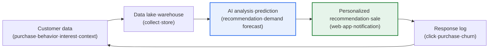
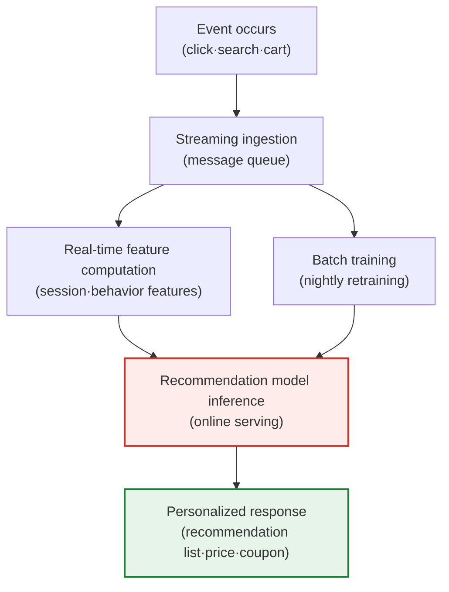

# Data Commerce

## 1. Overview

### A. Concept

> **Data Commerce** is a data-driven commerce approach that **collects and analyzes customer data (purchases, behavior, interests, context) to recommend and sell personalized products and services at the moment they are wanted**. Data becomes the core asset that replaces the product shelf and marketing, and rather than "what you sell," "to whom, when, and what you propose" becomes the source of competitiveness.

The core idea of data commerce is to **understand the customer through data and propose what they want at the moment they want it**. Traditional commerce exposed the same products to all customers in the same display order. This approach assumes an "average customer," but in reality the average customer does not exist. Some are price-sensitive, others have high brand loyalty, and even the same person wants different things in the morning versus the evening, on the commute versus the weekend. Data commerce confronts this diversity head-on. It analyzes each individual customer's data to predict "what does this customer want right now" and makes a tailored proposal.

What makes this possible is big data and AI technology. It collects and stores vast customer data (big data), predicts an individual's tastes and demand (recommendation algorithms, machine learning), and sends out the optimal proposal at the moment a behavior occurs (real-time processing). As a result, the customer gets an experience suited to them without search cost, and the company raises conversion rate, average order value, and repurchase rate. In other words, data commerce is an evolution of commerce in which **data-analysis capability is itself sales power**, and today it has established itself as the growth engine across e-commerce, content, finance, and retail.

### B. Background and Necessity

Behind the rise of data commerce lie three overlapping structural changes. First is the **explosion of digital touchpoints**. As customers' clicks, dwell time, carts, and search terms accumulate by the second through web, app, kiosk, and IoT, even "intent before purchase," previously unknowable, became observable as data. Second is the **paradox of over-choice**. When the number of products reaches millions, customers instead churn because they don't know what to buy. Here, personalized recommendation functions as "curation" that reduces the search burden. Third is **intensifying competition**. As price and logistics leveled out, the axis of differentiation shifted to "who understands better and proposes better." These three trends converged, making data not an add-on feature but the central asset of commerce.

### C. Key Technologies

Each technology does not operate independently but is organically connected on the data pipeline. The table below organizes the components, and Section 3 explains in prose "why" each element is needed.

| Technology | Content | Role in Commerce |
|---|---|---|
| **Big data analytics** | Collect·store·analyze large-scale customer data | Secure the raw material for understanding customers |
| **Recommendation system** | Collaborative filtering·content-based·hybrid recommendation | Decide per-customer product exposure |
| **Machine learning·AI** | Demand prediction·churn prediction·LTV prediction | Proactive proposals·retention |
| **Real-time processing** | Streaming·event-based reaction | Instant proposal at the moment of behavior |
| **Dynamic pricing** | Price optimization based on demand·inventory·competitor price | Optimize revenue and conversion simultaneously |

## 2. How Data Commerce Works

Data commerce has a cyclic structure of "collect → store·process → analyze·predict → personalized proposal → feedback learning." The faster and more accurate this cycle, the higher the personalization quality, and the better the personalization, the richer the response data that accumulates—forming a virtuous cycle (data flywheel).

The most important thing in the structure above is the **feedback loop**. After a recommendation goes out, whether the customer clicked, purchased, or ignored it is recovered as data again and retrains the model. Even if the recommendation is clumsy at first, accuracy improves as this loop repeats. Conversely, if feedback recovery is slow or distorted (e.g., a bias where exposing only popular products makes their popularity more entrenched), personalization actually regresses. Therefore the design of data commerce depends as much on "how honestly and quickly feedback is reflected in learning" as on the algorithm itself.

### A. The Three Branches of Recommendation Systems

The recommendation system is the heart of data commerce. Methods are broadly divided into three, and because each has distinct pros and cons, they are combined in practice.

**Collaborative Filtering** recommends "what people similar to me liked." It finds similar users or similar items in the user-item interaction matrix to make predictions, with the advantage that it works without knowing the product content. However, it has the **cold start** problem, where recommendations are difficult for new customers or new products because there is no interaction data. This method is the basis of the early recommendations of Netflix and Amazon.

**Content-based Filtering** recommends "products with attributes similar to what I liked." It vectorizes product attributes such as genre·brand·price range·keywords and computes similarity. It is relatively strong against cold start, but has the risk of the **filter bubble**, where it repeatedly recommends only things similar to what the customer has already seen, reducing diversity.

**Hybrid and deep-learning recommendation** combines the two methods or learns complex patterns with neural networks. Recently, sequential recommendation that learns the user's behavior sequence as a time series, graph-neural-network-based recommendation, and generative-AI-based conversational recommendation are spreading. Actual large commerce ensembles the results of multiple models and reflects business rules (inventory·margin·promotions) as post-processing to decide the final exposure.

### B. Real-Time Personalization Architecture

No matter how accurate a recommendation is, it is useless if it's "late." Conversion happens only when a related proposal is made within the very session in which the customer searched for a specific product. Below details the processing flow of real-time personalization.

The key to this structure is the **separation of online serving and batch training**. Heavy model training is handled by nightly batch, but at service time inference results must be returned in milliseconds. To this end, precomputed user·product embeddings are loaded into a cache, and only the real-time features arising during the session (the category just viewed, the current cart amount) are combined on the fly. For example, if the cart amount is close to the free-shipping threshold, a low-priced product is recommended as an add-on to raise the average order value. Because perceived performance degrades sharply once latency exceeds 100ms, the crux is coordinating the trade-off between accuracy and response speed at the architecture stage.

## 3. Application Areas and Concrete Cases

Data commerce is not confined to a specific industry. However, the focus of use differs by industry, because each industry's revenue structure and the nature of its customer touchpoints differ.

| Area | Use | Representative Effect |
|---|---|---|
| **E-commerce** | Personalized recommendation·dynamic pricing·cart-abandonment prevention | Rise in conversion rate·average order value |
| **Content·media** | Content recommendation·thumbnail personalization·viewing retention | Dwell time·subscription retention |
| **Finance** | Tailored product recommendation·credit scoring·fraud detection | Cross-selling·risk management |
| **Retail** | Demand prediction·inventory optimization·offline linkage | Reduced stockouts·excess inventory |

First, **Amazon** is known to generate a substantial portion of sales from its recommendation engine, and collaborative-filtering-based exposure such as "customers who bought this also bought" drives cross-selling. Because exact figures vary across public sources it is hard to assert them, but that recommendation is a core axis of sales is consistently observed in the industry.

Second, **Netflix** not only recommends content by viewing history but also applies personalization that exposes different thumbnail images for the same title depending on the customer's taste. The goal is to raise the content-discovery rate to lower churn (cancellation), and because a recommendation failure leads directly to subscription cancellation, recommendation accuracy is directly tied to the survival of the business.

Third, in **retail and logistics**, demand-prediction data optimizes inventory per store and per SKU. By learning the pattern that different products sell well depending on region·day of week·weather, it simultaneously reduces stockouts and excess inventory. Here, in that "aggregate demand prediction" rather than personalization is the core, the focus differs from e-commerce.

## 4. Comparison with Similar Concepts

Data commerce is often used interchangeably with "e-commerce" and "retail media," but the focus differs. Understanding the differences makes clear what question each concept aims to answer.

| Category | Traditional E-Commerce | Data Commerce | Retail Media |
|---|---|---|---|
| **Central asset** | Product·logistics | Customer data·model | Customer data·ad inventory |
| **Core question** | What to sell | To whom, when, what | To whom to advertise what |
| **Revenue source** | Product margin | Conversion·AOV·retention | Ad fees |
| **Success factor** | Price·delivery | Data quality·recommendation accuracy | Targeting·inventory |

If traditional e-commerce is "moving transactions to digital," data commerce is "optimizing transactions with data." The fundamental reason for the difference lies in **whether data is seen as a byproduct or an asset**. Traditional e-commerce also accumulates data, but if it stops at using it for after-the-fact reporting, data commerce feeds data back as input to real-time decisions. Meanwhile, retail media can be seen as an extension of data commerce's revenue model in that it sells accumulated customer data externally as an "advertising product" rather than for its own sales. Amazon and Coupang making large profits from advertising on their own platforms is representative, and this shows that recycling data assets creates a new revenue source.

## 5. Deep Dive: Evolution to Generative AI and Conversational Commerce

The biggest recent change in data commerce is **the combination with generative AI**. If existing recommendation was "which to expose among a fixed product list," generative AI converses with the customer in natural language to grasp intent and generates comparisons, summaries, and explanations to propose. For example, **Conversational Commerce** is emerging that, to the question "recommend a family camping tent for a family with two kids in the 500,000-won range," understands the conditions to narrow candidates and explain pros and cons.

This change has three implications. First is **mitigation of cold start**. Because intent can be grasped from conversation alone even without interaction history, it partly resolves the longstanding difficulty of personalizing for new customers. Second is **long-tail discovery**. Natural-language queries can capture fine-grained needs hard to express with structured categories ("low-noise, allergy-safe dog food"), giving reach opportunities even to poorly selling products. Third is **hallucination risk**. If generative AI fabricates a nonexistent product spec or price, trust collapses, so controlling factuality with Retrieval-Augmented Generation (RAG), which generates answers grounded in the actual product catalog, is establishing itself as the practical standard.

Meanwhile, the regulatory environment is also evolving. As third-party cookies disappear with strengthened privacy protection, the value of **first-party data**, collected directly by the company, has surged. **Data Clean Room** technology, which safely combines and analyzes a company's own consent-based data, is drawing attention as an alternative that reconciles personalization and privacy. In other words, the future competitiveness of data commerce is shifting to "how well you utilize high-quality consented data" rather than "more data."

## 6. Considerations and Implications (Professional Engineer's Perspective)

1. **The balance of data quality and privacy determines success or failure.** Accurate personalization requires abundant data, but excessive collection and use invite violations of the Personal Information Protection Act and GDPR and customer churn. Make minimal collection·purpose specification·explicit consent·pseudonymization the principle, and design "the coexistence of personalization and protection" with data clean rooms and privacy-enhancing technologies (PET). A shift in perspective is needed—approaching privacy as a trust asset rather than a regulatory-compliance cost.

2. **Recommendation accuracy and bias management are themselves competitiveness.** Inaccurate recommendations rather cause aversion, and bias that repeatedly exposes only popular products kills the long tail, damaging both diversity and sales in the long run. Continuously validate algorithms with A/B tests, manage exposure-diversity and fairness metrics in parallel, and deliberately embed exploration logic that mitigates the filter bubble.

3. **Real-time data architecture and MLOps capability are prerequisites.** Personalization holds only when streaming ingestion·online serving·model retraining run stably. Without an MLOps system that monitors data drift (where model performance worsens over time) and automates retraining·deployment, initial results do not last. This is both a matter of technology investment and organizational capability.

4. **When combining generative AI, factuality and explainability must be controlled.** Conversational commerce raises conversion but carries hallucination·exaggeration risk. Maintain trust by equipping RAG that generates answers grounded in the actual catalog, XAI that explains the reason for recommendations to the customer, and guardrails that filter out inappropriate recommendations.

5. **Strategically review secondary monetization of data assets (retail media).** Accumulated customer data is an asset expandable not only for one's own sales but also into advertising and insight products. However, since data sales entail privacy·competition-law issues, they must be pursued under governance with a clear consent scope and level of anonymization to be sustainable.

## References

- Netflix Research, "Recommendations" — https://research.netflix.com/research-area/recommendations
- Google Cloud, "What is a data clean room?" — https://cloud.google.com/bigquery/docs/data-clean-rooms
- Personal Information Protection Commission, Guidelines on Processing Pseudonymized Information — https://www.pipc.go.kr

---

> **In one line**: Data commerce is data-driven commerce that *analyzes customer data with AI to recommend and sell personalized products and services at the right time*, turning the data flywheel with big data·recommendation·real-time processing·dynamic pricing as its axes; it has recently evolved by combining with generative AI·data clean rooms, while the balance of data quality·privacy and management of recommendation bias determine success or failure.
