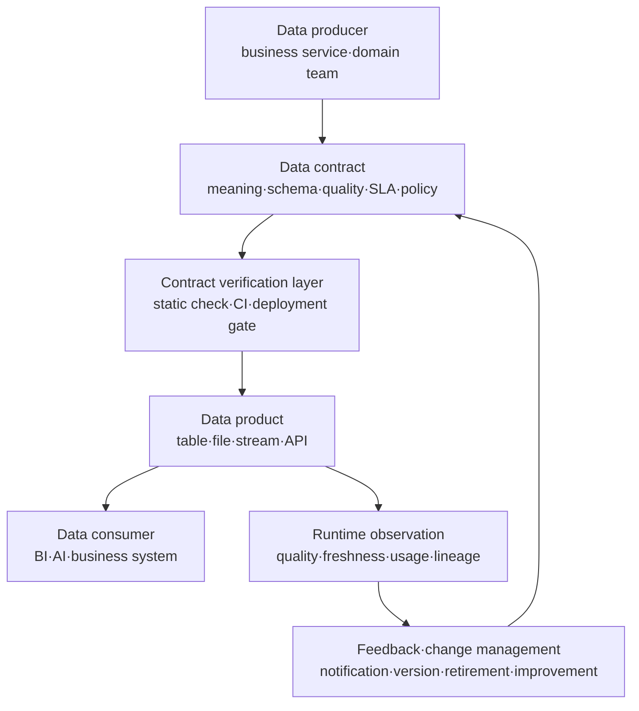
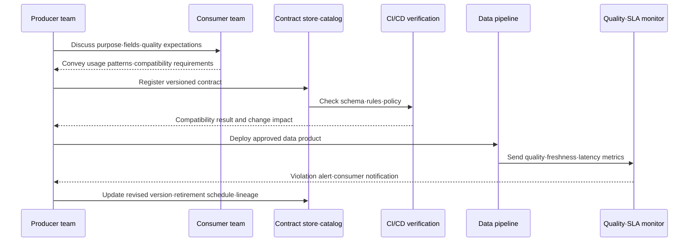
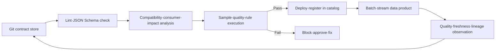

# Data Contract and Data-Product Reliability

## 1. Overview

> A **Data Contract** is the interface convention of a data product by which data producers and consumers explicitly agree on the data's meaning, structure, quality, refresh/availability, security/access conditions, and change procedure, and execute it through documentation and automated verification.

As a data platform grows, a data error is not a problem of a single database but propagates to multiple teams and business processes.
If the order service changes `customer_id` from a string to an integer, or the revenue aggregation changes the time zone from UTC to local time, the producing team's deployment can succeed while the dashboard, recommendation model, and settlement system quietly produce wrong results.
In such a distributed data pipeline, it is hard for the consumer to know the producer's internal implementation, and hard for the producer to grasp who depends on which field.
A data contract places at this boundary an explicit promise: "we will provide certain data with a certain meaning and quality."

A simple schema document and a data contract are not the same.
A schema document focuses on telling the column names and types, but a contract includes what those fields mean, when they are refreshed, what quality they must satisfy, and who is responsible for incidents.
Therefore a data contract is a technical interface and, at the same time, an operational contract between organizations.
The core of a contract is not the act of writing a document but the executability of discovering violations before deployment, monitoring quality and freshness after deployment, and managing changes according to a compatibility policy.

The background for needing data contracts is also related to changes in how data is consumed.
In a structure where a central data team controls all transformations, the central schema and ETL rules are a relatively strong control point.
However, in an environment like a data mesh where domain teams directly own data products, or where multiple clouds·warehouses·streaming platforms are used together, producers and consumers are separated organizationally and technically.
Here the contract becomes a common language that makes dependencies between teams transparent and lets data products be treated like reusable services.

In an essay answer, it is important not to reduce a data contract to "schema freezing."
One should present the five layers of schema·meaning·quality·operations·governance together, and connect the closed loop of contract-at-design → CI verification → deployment → runtime observation → change·retirement.
Also, the stronger the contract, the higher the change safety, but producer development speed and operating cost increase, so a risk-based strategy that does not apply the same strength to all data is needed.

### A. Background and Necessity

First, one must reduce data silos and handover cost.
The consuming team should be able to understand the meaning and use conditions of a dataset without reading the producing team's code, so that the development bottleneck of analysis·AI·business systems is reduced.
A contract raises discoverability by gathering a dataset's description, responsible party, examples, and access method in one place.

Second, silent failures of the pipeline must be blocked at the front end.
There are cases where the load job itself succeeds even though a column is missing or a type has changed.
Putting contract verification into the CI or pre-deployment stage lets one judge whether the produced output matches the contract's shape before a downstream incident occurs.

Third, the responsibility for data quality must not be pushed onto the consumer.
If the consumer re-checks missing rate·duplicate rate·freshness every time, the same check is duplicated across many teams, and even when a quality problem is found it is hard to find the responsible team.
When the producer includes quality metrics and service levels in the contract, ownership of quality moves to the point where the data is generated.

Fourth, changes must be managed in a predictable way.
Deleting a field or changing its meaning is a compatibility-breaking change that directly affects consumers.
Defining contract versions, change approval, consumer notification, and parallel-provision and retirement periods as operating rules reduces situations that "break only after deployment."

## 2. The Scope and Components of a Data Contract

A data contract does not mean a single YAML file or one table.
So that the organization's agreement is reflected in the actual data product, it is composed hierarchically from business meaning down to physical connection information.
The structure below shows how the promise between producer and consumer connects to the execution path.



### A. Business Meaning and Dataset Identifier

The first part of a contract defines what the dataset represents.
Writing only the name `orders` does not reveal whether it is order-creation events or payment-completed orders, or whether it includes canceled orders.
Therefore, meaning that changes the interpretation result—such as purpose, in/out-of-scope, base point in time, and whether amounts are in which currency and whether tax is included—must be stated in sentences.
Even for the same physical table, if the consumption purpose differs, it is safer to separate it into a distinct logical data product.

The identifier is designed as a combination of domain, product name, dataset name, and version so that the dataset can be stably referenced within the organization.
For example, `commerce.order.completed` conveys the meaning of the order domain's completed orders, and the logical identifier can be maintained even if the physical store changes.
The contract also includes metadata needed for responsibility and control, such as the owning team, technical contact, inquiry channel, and data classification.
Without this information, even when a contract violation is found, one cannot decide who will judge and recover.

### B. Schema and Semantic Constraints

The schema layer defines field names, logical types, physical types, whether required, primary keys, relationships, and allowed code values.
A logical type expresses a business meaning like "customer identifier," and a physical type expresses the storage·transmission format like `string`, `integer`, `timestamp`.
Separating the two types keeps the meaning from being lost when the same business meaning is mapped to per-system physical types.
For example, even if an order number consists only of digits, since it is not a target of arithmetic, treating it as a string rather than an integer can be safer.

Field definitions include a description and examples together.
Writing that `status` allows only `P`, `C`, `X` and writing that it "means payment pending·completed·canceled" are contracts of different levels.
The former enables format validation, and the latter guarantees consistency of business interpretation.
If sensitive information may be included, the personal-data grade, masking method, retention period, and restriction on use beyond purpose must also be linked next to the schema.

### C. Data Quality and Service Level

Data quality is turned into measurable rules such as accuracy·completeness·consistency·validity·uniqueness·timeliness.
"Providing accurate data" cannot be verified, but "the `order_id` missing rate of completed orders is 0% and the duplicate rate of the same order number is under 0.1%" can be verified.
Quality rules should record the measurement target, computation window, threshold, severity, action on violation, and exception-approval authority together.

The service level describes the data's operational promise.
For example, one can set that daily batch data is provided by 06:00 each day, streaming events must arrive within 5 minutes of creation, and on failure the last-normal-data time and recovery target are announced.
Writing only availability misses the problem where data exists but is stale, so freshness·latency·completeness·support hours should be managed together to fit the purpose.

The following table organizes the representative components of a contract and their design questions.
The key is to convert the items listed in the table into actual operating statements and verification rules.

| Area | What to Include in the Contract | Verification·Operating Question |
|---|---|---|
| Identity·ownership | Dataset ID, domain, version, producer, responsible party | Are the parties for incidents and change approval clear |
| Business meaning | Purpose, scope, base point, terms, in/out rules | Do producer and consumer interpret the same value the same way |
| Schema | Field names, logical·physical types, required, keys, code values | Is the deployment result compatible with the declared structure |
| Quality | Missing·duplicate·validity·accuracy rules, thresholds | At what point and with which query is it measured |
| Freshness·SLA | Refresh cycle, latency, availability, recovery·notification targets | Can consumers know when data is late or interrupted |
| Access·security | Authentication, permissions, encryption, classification, retention·deletion | Are least privilege and purpose limitation applied |
| Lineage·support | Source, transformation, consumers, inquiry·escalation | Are impact analysis and incident contact possible |

## 3. How the Contract Works and Its Lifecycle

A data contract is not a document to file after writing but a control point that runs through the data product's lifecycle.
After the contract draft is made, one confirms consumer requirements, implements verification rules to match the storage·transmission format, and connects it to the deployment pipeline and runtime monitoring.
The flow below shows the general closed loop when changing a contract.



### A. Discovery and Negotiation

Making contracts for every dataset across the enterprise from the start only increases documents and weakens substantive agreement.
Select candidates starting from shared data products with many consumers or high incident cost, and investigate the actual consuming SQL·dashboards·model inputs.
Because there is a gap between the intent the producer knows and the practices the consumer expects, contract authoring must be a negotiation process, not a one-way schema announcement.

In the negotiation stage, ask for each field, "can it be absent," "what breaks if the value changes," and "is past data reprocessed."
For example, if it is unclear whether `customer_id` is retained after withdrawal, whether `created_at` is the event-creation time or load time, or whether the amount is in KRW or the payment currency, then even with a contract the analysis will be wrong.
Connecting the domain glossary and lineage together at this stage develops the data contract beyond a simple schema file into a common semantic model.

### B. Verification and the Deployment Gate

A contract file is checked in the order of syntax verification, schema verification, compatibility verification, and data-sample verification.
Syntax verification checks the YAML·JSON format and required keys, and schema verification checks column types·required·code values.
Compatibility verification judges whether the new version breaks existing consumers' queries, and sample verification confirms whether actual records satisfy the declared rules.

Verification does not end on the developer's laptop but must become a deployment gate in the CI/CD pipeline.
For example, one can fail on detecting the deletion of an existing field, allow adding an optional field only when consumers can ignore it, and send a change that lowers a quality threshold to an approval step.
That said, whether a database constraint is actually enforced differs by storage platform, so one must distinguish "declared in the contract" from "enforced at runtime."

### C. Version and Compatibility

The contract's version strategy considers the type of change and the consumer impact together.
Changing the meaning·type of an existing field and deleting a field are generally non-backward-compatible, breaking changes.
On the other hand, adding an optional field can be backward-compatible if the consumer ignores unknown fields and the producer guarantees a default value.
However, not all formats and consumers automatically guarantee this principle, so actual consumption patterns must be checked.

Compatibility differs between the producer's and the consumer's perspectives.
The producer may think adding a new field is safe, but a consumer that parses `SELECT *` results by position can break due to the increased number of columns.
Therefore contract verification should not look only at the data format but connect to registered consumers·queries·pipelines.
If a breaking change is unavoidable, provide the new version in parallel, track consumer migration status and the retirement date, and then remove the old version.

| Change Example | General Compatibility Judgment | Safe Response |
|---|---|---|
| Add optional field | Compatible if consumers ignore unknown fields | Confirm default·docs·consumer tests |
| Add required field | Existing records·consumer inputs may fail | Provide as optional, then phase in as required |
| Delete field | Breaking change that may fail existing queries and models | New version·parallel provision·retirement notice |
| Type change | Parsing·computation·storage precision differ | Switch via a new field or new version |
| Meaning·unit change | Analysis result changes even if the format is the same | Treat meaning change as a breaking change |
| Narrow allowed code values | Existing data may become invalid | Consumption-impact analysis and grace period |

### D. Runtime Observation and Violation Response

CI verifies the structure at deployment time but does not guarantee post-deployment latency·missing·duplicate·distribution changes.
Therefore at runtime one must connect a data-quality monitor and a contract monitor.
Turn each contract rule into a measurement metric, and compare a baseline and threshold to judge normal·warning·critical states.

When a violation is detected, decide in advance the policy of whether to unconditionally block the data product or to warn the consumer and provide the last-normal version.
For data where the cost of wrong values is high, like payments and settlement, safe halting and reprocessing take priority, while for exploratory-analysis data a strategy of partial provision with a delay notice is possible.
The important thing is that the consumer must be able to know the fact of the violation and its scope of impact.
An alert includes the contract ID, violated rule, first-occurrence time, affected consumers, last-normal point, responsible party, and expected recovery time.

## 4. Implementation Architecture and Example

A data-contract implementation can be designed as a connected form of a contract store, schema·quality validators, a data catalog, a pipeline orchestrator, and a runtime monitor.
The contract store manages versions with Git, and the catalog makes the contract and lineage·users·access policies searchable.
The validator performs static checks before deployment and sample·real-data checks, and the orchestrator uses whether verification passed as a condition for executing the next stage.



The following is not a complete example of a specific standard but a conceptual contract example to describe a completed-order data product.
In an actual organization, convert it to match the field names of the standard and platform in use, but the meaning·quality·operational promises must be expressed together.

```yaml
apiVersion: data.example/v1
kind: DataContract
id: commerce.order-completed
version: 2.1.0
owner:
  team: commerce-data
  contact: data-commerce@example.org
purpose: A data product for analysis and settlement of payment-completed orders
schema:
  - name: order_id
    logicalType: string
    physicalType: varchar
    required: true
    unique: true
  - name: completed_at
    logicalType: timestamp
    physicalType: timestamp_tz
    required: true
  - name: amount
    logicalType: decimal
    physicalType: decimal(18,2)
    required: true
    description: Amount in the payment currency after tax and discounts applied
quality:
  - rule: not_null
    column: order_id
    threshold: 100%
  - rule: freshness
    maxDelay: 5m
serviceLevel:
  availability: 99.5%
  support: business-hours
```

In the example above, the uniqueness of `order_id` is not expressed by a simple type but verified by a quality rule.
`amount` must specify not only the numeric format but also the tax·discount·currency basis together so the consumer can interpret revenue correctly.
`freshness` measures, separately from whether the data exists, how late the last event arrived.
Thus a contract must be designed so that schema, quality, and operational goals complement one another.

For example, if 0.5% of 1 million daily orders are missing, 5,000 items of analysis·settlement targets disappear.
The mere fact that the production pipeline returned a "success" state cannot detect this loss.
Including a completeness threshold, a missing-detection method, and a reprocessing procedure in the contract lets one reveal the problem in post-batch quality verification and calculate the scope of impact.
For settlement data, a safe-failure strategy that, on threshold violation, does not refresh the consuming table but maintains the previous day's normal snapshot can also be connected as the contract's operating policy.

## 5. Comparison with Similar Concepts

A data contract is not a single tool that replaces data-quality tests or a data catalog.
Each technology addresses a different problem of the data lifecycle, and the contract plays the role of the agreement and interface that connects them.
Failing to distinguish these leads one to misunderstand that uploading a document to the catalog means a contract is applied, or to write many tests yet miss producer responsibility and the change procedure.

A **schema registry** mainly manages the schema and serialization compatibility of events·messages.
A data contract, on the other hand, broadens the scope to business meaning, quality, SLA, ownership, and access policy.
The schema registry is the technical basis for streaming compatibility, and the data contract can be seen as a product-level operational promise spanning streams and batch·tables·files.

**Data-quality tests** are executable rules that verify the content and distribution of actual data.
The contract declares what must be guaranteed, and tests implement with which query·profiling·statistics that guarantee is confirmed.
If a quality item declared in the contract is not connected to a test, the contract remains a document; if only tests exist, why that threshold is needed and who is responsible are unclear.

A **data catalog** is a knowledge system for searching datasets and exploring metadata·lineage·users.
A contract can be displayed in the catalog, but having a catalog does not automatically enforce the contract.
The catalog raises discoverability and impact analysis, and the contract defines predictable provision conditions and change control.

An **API contract (OpenAPI, etc.)** defines a synchronous service interface centered on request·response.
A data contract is likewise an interface, but it also considers the quality·freshness·reprocessing·retention characteristics of large batches·event streams·tables.
When a data product is exposed as an API, connect the API contract and the data contract, but it is better not to cram all requirements into just one of them.

| Category | Data Contract | Schema Registry | Quality Test | Data Catalog | API Contract |
|---|---|---|---|---|---|
| Main Object | Data product·producer·consumer agreement | Message schema | Actual data state | Data discovery·metadata | Service request·response |
| Core Question | What is provided under what conditions | Is this message format compatible | Does data satisfy the rules | Where and what data exists | Is the API call format correct |
| Scope | Meaning·structure·quality·SLA·responsibility | Structure·serialization | Missing·distribution·consistency, etc. | Description·lineage·owner | Path·method·response |
| Execution Point | Design·CI·deployment·runtime | Production·consumption time | Periodic·batch·pipeline | Mainly lookup·impact analysis | Call time |
| Change Management | Version·compatibility·retirement·notification | Compatibility mode | Rule change | Metadata update | API version·deprecated |

## 6. Cases and Adoption Strategy

### A. Retail Order Data-Product Case

Assume a retail company provides completed-order data to the analysis·settlement·recommendation teams.
Initially, because the analysis team queried the operational DB directly, a schema change immediately led to dashboard errors, and teams interpreted differently whether delivery cancellations were included in revenue aggregation.
The data-product-owning team separates the order-completed event and the settlement table, and records in the contract the base point·status definition·amount formula·freshness·owner·retirement policy.

Suppose in contract version 1, `amount` supported only KRW, but a currency code became necessary for overseas sales.
Changing the meaning of the existing `amount` to a foreign-currency amount is a breaking change because the meaning changes even though the format is the same.
The safe way is to newly add `amount_local` and `currency_code`, provide the conversion basis and exchange-rate time as separate fields, and then migrate consumers.
If a settlement consumer uses only the previous version's KRW amount, run both versions in parallel for a period so as not to conflict with the financial closing cycle.

### B. Machine-Learning Feature Pipeline Case

Suppose a recommendation model uses `customer_7d_order_count` as input.
If the producing team changes the aggregation window from "last 7 days" to "last calendar week," the meaning of the model changes even though the column type and name are the same.
Therefore the contract must specify the aggregation window's boundary, time zone, a leakage-prevention rule that future data must not mix in, the missing-value handling method, and the generation-delay target.
When a model-performance drop occurs, checking only the schema would find no cause, but observing the meaning and distribution baseline together allows tracing the point of change.

In this case the contract is not a document to block the model team's development.
Rather, agreeing on the feature's meaning and generation conditions reduces training-serving inconsistency and provides a basis for judging model retraining or rollback.
That said, assigning the same SLA to all features raises cost, so classify core features used in real-time inference and experimental features to differentiate verification strength.

### C. Phased Adoption Roadmap

In the first step, select the most-shared data products with high incident cost.
Confirm owners and consumers, and measure the current schema·quality·freshness·lineage as a baseline.
Rather than declaring perfect target values from the start, transparently recording the current state and then managing improvement goals as a separate version lowers organizational resistance.

In the second step, connect the contract to a Git store and CI.
Automate required fields·types·basic quality rules·compatibility checks, and on failure show which consumers are affected.
In the third step, connect the catalog and the runtime monitor to check contract·lineage·quality·usage on one screen.
Finally, spread standard templates and training, but prioritize shared·sensitive·regulated data.

## 7. Deep Dive: Linkage with Data Mesh·dbt·ODCS

In a data-mesh environment, a data contract is a practical device that specifies the boundaries of per-domain data products.
Even if a domain team owns production, meaning·quality·access rules usable across the whole organization are needed.
Providing the contract as a template of the self-service platform lets each team register responsible party·lineage·quality·SLA consistently without redesigning the format.
That said, federated governance is not a way for a central team to approve all fields but must combine common minimum rules and per-domain extension rules.

dbt's model contract specifies the structure of the dataset a model returns, and when the contract is enforced, it is used in a way that checks whether column names and types match expectations at build time (preflight) and fails the build on mismatch.
The dbt docs also recommend the approach of defining contracts on public models that downstreams depend on, but explain that whether constraints are actually enforced can differ depending on the data platform and materialization method.
Therefore, when adopting dbt contracts, one must check the differences among contract declaration, data tests, and warehouse constraints.

The Open Data Contract Standard (ODCS) is an open YAML structure for expressing data contracts, defining categories such as fundamentals·schema·references·data quality·support channels·pricing·team·roles·SLA·servers·custom properties.
Applying this standard can create an exchange format not dependent on a specific catalog or warehouse, but the existence of a standard file does not automatically complete quality verification or SLA enforcement.
The organization must combine an expression format like ODCS, verification tools like dbt·Great Expectations, and catalog·monitoring platforms according to their roles.

The direction of the latest data platforms is to expand the contract from a design document into policy code and product metadata.
When a contract change is proposed as a pull request and automatic impact analysis·quality sampling·document generation·catalog update·consumer notification execute in a chain, the deployment safety of the data product rises.
Conversely, since automation cannot fully judge meaning changes, changes where business context matters—such as amounts·personal data·model features—must leave a domain owner's approval.

## 8. Considerations and Implications

### A. Balancing Contract Strength and Development Speed

The stricter the contract, the higher the consumer's predictability but the slower the producer's experimentation and change.
A risk-based distinction is needed—applying strong blocking and approval procedures to core settlement·regulatory data, and a warning-centered, flexible policy to exploratory·experimental data.
The purpose of a contract is not to prohibit changes but to make change cost and impact visible in advance.

### B. Separating the Semantic Contract from the Format Contract

Even if you verify types and columns, if the calculation basis of "revenue" or the definition of "active user" differs, the result differs.
Therefore the glossary, example records, calculation formulas, units, time zone, and inclusion·exclusion conditions must be included in the contract's description layer.
Because meaning changes may not be caught by a code diff, keep the producer·consumer negotiation and approval records separately.

### C. The Measurability of and Responsibility for Quality Metrics

Quality rules operate only when they have a measurement query and computation window.
Unless one agrees on whether the denominator of the missing rate is all rows or rows of a specific status, and whether the base time of freshness is event creation or load, different results come from the same data.
Map each metric to an owner·alert level·recovery target·exception approver to connect the quality dashboard to the responsibility system.

### D. Compatibility and Retirement Policy

Compatibility rules are decided not by format alone but according to how consumers use the data.
Consumers using `SELECT *`, position-based parsing, and hard-coded code values can be affected even by adding an optional field.
Grasp the actual scope of impact through consumer registration and usage instrumentation, and operate new-version parallelism·migration support·a clear retirement date.

### E. Internalizing Privacy·Security·Regulation

A data contract can be a quality contract and, at the same time, the starting point of protective measures.
Link sensitivity, access roles, encryption, masking, retention period, handling of deletion·correction requests, and cross-border transfer restrictions to the data-product metadata.
However, since merely writing "encrypted" in the contract does not complete the control, IAM policy·key management·access logs·audit evidence must be verified against the actual system.

### F. Separating the Standard from the Platform

Adopting a specific tool's config file directly as the enterprise standard can lose contract assets when the platform changes.
Separating the logical contract from per-platform execution settings, and placing an adapter layer that converts from standard fields to dbt·streaming schemas·warehouse constraints, is advantageous for portability.
That said, excessive abstraction can hide the platform's actual enforcement limits, so one must specify which rules are only declared and which are actually blocked.

### G. Adoption Judgment from the Professional Engineer's Perspective

The engineer should judge a data contract not as a tool-adoption project but as a change in the data operating model.
First evaluate data-product candidates and failure cost, and design standard templates·ownership·change management·quality measurement·platform linkage as a single governance system.
Performance metrics should not merely count the number of registered contracts but be set as outcome metrics such as reduction of incidents due to schema changes, mean time to recovery, the pre-detection rate of quality violations, and consumer onboarding time.

## References

- dbt Developer Hub, "Model contracts": https://docs.getdbt.com/docs/mesh/govern/model-contracts
- dbt Developer Hub, "contract configuration": https://docs.getdbt.com/reference/resource-configs/contract
- Open Data Contract Standard v3.1.0: https://bitol-io.github.io/open-data-contract-standard/v3.1.0/
- Bitol Open Data Contract Standard repository: https://github.com/bitol-io/open-data-contract-standard

---

> **In one line**: A data contract is an interface by which producers and consumers agree on the data's meaning·structure·quality·operating conditions and execute it through CI·runtime verification, raising the change safety and reliability of distributed data products.
