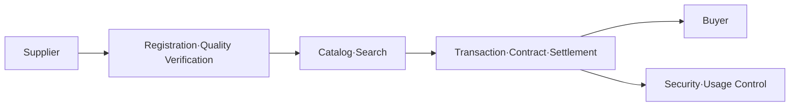

# Data Exchange/Marketplace

## 1. Overview

### A. Definition
> An **intermediary platform** that consistently supports registration, search, pricing, distribution, settlement, and usage control so that data suppliers and buyers can **trade data as a product (asset)**.

A data exchange is essentially a "market" for data. Just as a traditional market gathers the discovery, price formation, contracting, and payment of goods in one place to lower transaction cost, a data exchange also gathers scattered data into a catalog to **lower discovery cost, form prices through valuation, and complete transactions through standard contracts and settlement**. In other words, the reason a data exchange exists is that the platform absorbs, on behalf of individual companies, the high transaction cost of finding data sources one by one and negotiating, contracting, and settling.

### B. Background and Necessity
As AI-training and analysis demand exploded to the point where data is called "the oil of the 21st century," the very data that is needed was locked inside individual companies and institutions and could not be distributed—a large **data silo** problem. There were two decisive obstacles blocking distribution. The first was legal uncertainty about privacy protection and ownership, and the second was the absence of a standard for judging "how much this data is worth." In Korea, the **amendment of the three data laws (2020)** established the basis for using pseudonymized information, and the **Data Industry Promotion Act (2022)** established the legal basis for data trading, analysis provision, and safety zones, creating the institutional foundation for distribution. As a result, data exchanges emerged as infrastructure that circulates fragmented data through market mechanisms.

## 2. Components

A data exchange supports the flow from product registration to settlement on four axes. The **data catalog** is the heart of the exchange; it registers metadata such as the data's source·schema·refresh cycle·quality metrics in a standard form so that buyers can judge fitness without actually opening the data. If the catalog is poor, "not knowing what exists" causes a discovery failure and the transaction itself does not form. **Pricing·settlement** is the function of converting the data's value into a monetary unit and charging·settling according to downloads, API call volume, and so on. **Transaction·contract** codifies conditions such as purpose of use·period·resale prohibition as a license to prevent disputes. **Security·usage control** prevents contract violations and personal-data leakage through access-rights management, pseudonymization·de-identification, and usage-history tracking.

| Component | Role | Problem If Poor |
|---|---|---|
| **Data catalog** | Register·search metadata·quality info | Transaction fails to form due to discovery failure |
| **Pricing·settlement** | Valuation, charging·settlement | Lowered price trust, shrinking trade |
| **Transaction·contract** | Manage usage conditions·licenses | Misuse·abuse, ownership disputes |
| **Security·control** | Access control, pseudonymization·de-identification, usage tracking | Personal-data leakage·re-identification |

## 3. Types of Traded Data and Trading Methods

The objects of trade span a wide spectrum, from **raw data** before refinement to **processed datasets** that have gone through analysis·labeling, and the higher the degree of processing, the greater the buyer's immediate usability and thus the higher the price formed. The trading method varies with the data's sensitivity. Non-sensitive data is handed over as-is via **file download** or **API integration**, but sensitive data containing personal information uses a method that does not exfiltrate the original—performing analysis only within a controlled **data safety zone** and exfiltrating only the results. Prices are calculated by combining a **cost-based** approach grounded in the cost of building the data, a **market-based** approach that references the going rate of similar data, and an **income-based** approach that estimates future revenue the data will create; but because of the intangible, copyable nature of data, none of them is complete on its own, so valuation remains a difficult problem.

## 4. Key Issues

The issues blocking the activation of data exchanges are intertwined with one another. On the **privacy** side, even individually de-identified data carries a **re-identification risk** where an individual is specified again when combined with other data, so pseudonymization and PET (privacy-enhancing technologies) must be a prerequisite. On the **price·quality** side, because there is no authoritative valuation standard, the same data has different prices at different exchanges, making it hard to earn trust, and the quality system to guarantee the data's accuracy·currency is also inadequate. On the **trust·standard** side, the attribution of data ownership·copyright and the scope of licenses are ambiguous, and there is a problem where metadata formats differ across exchanges so they are not interoperable. For example, a substantial part of the early poor trading performance of domestic platforms such as the Korea Data Exchange (KDX) or the Financial Data Exchange stemmed from these valuation·quality-trust problems.

| Issue | Cause | Response |
|---|---|---|
| **Privacy** | Re-identification through combination | Pseudonymization·PET·safety zone |
| **Price·quality** | Absence of valuation standard, unguaranteed quality | Valuation standards·quality certification |
| **Trust·standard** | Ambiguous ownership·license | Standard metadata·contract templates |

## 5. Considerations and Implications
- **Standardizing valuation·quality is the key to activation**: If there is no common price·quality standard the market trusts, transactions do not occur. Establishing a valuation guide and quality-certification system jointly by government and industry is the prerequisite task.
- **Combine with a safe distribution architecture**: Linking pseudonymized-data combination, data safety zones, and PET (differential privacy·homomorphic encryption), a structure of "use it but do not hand over the original" should be made the default.
- **An axis of the national data ecosystem**: Together with MyData (individual-led distribution) and the Data Dam (aggregation of public data), the data exchange is infrastructure that completes the circulation of the data economy, and is expected to expand into data trusts and data spaces (EU Data Spaces).

---

> **In one line**: A data exchange is an intermediary platform that *registers, searches, trades, and settles data as a product*; it must equip a catalog·valuation·contract·security control and solve the standardization problems of re-identification·quality·valuation to be activated, and is an axis of the national data ecosystem linked with safety zones·PET·MyData.
