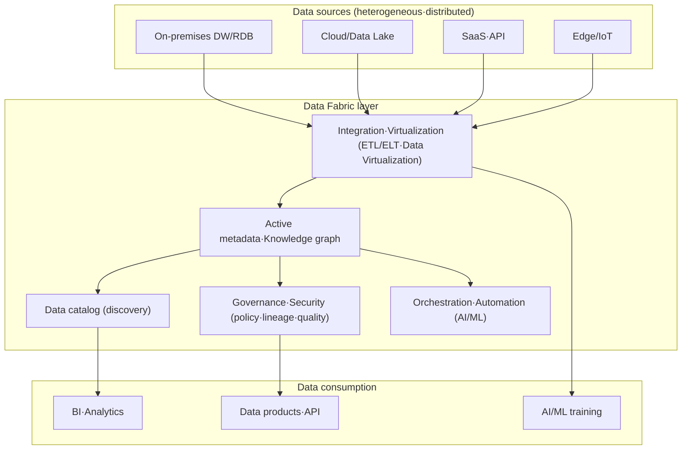
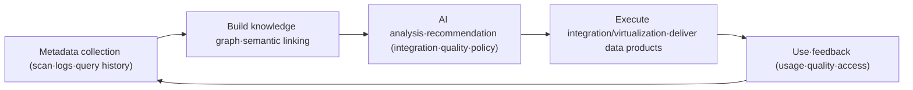

# Data Fabric

## 1. Overview

### A. Definition

> A **Data Fabric** is a data-management architecture and design concept that, without physically gathering into one place the data assets scattered across distributed·heterogeneous environments, weaves discovery·integration·governance·delivery into a single consistent logical layer by leveraging **active metadata, a knowledge graph, and AI/ML-based automation**.

A data fabric does not refer to a single specific product; it is an architecture pattern that combines multiple integration·catalog·governance technologies around metadata so as to automatically answer "where is what data, and how can it be trusted·connected·used."
Traditional data integration was a structure in which people designed ETL pipelines by hand for each source, and each time data moved, new copies and new pipelines multiplied.
A data fabric aims to replace this repetitive labor with a method that **observes and learns metadata to semi-automatically recommend and execute integration**.

The core perspective is not "replicate data more to grow a central store," but **leave data in its original place (virtualization-first), see through the whole via metadata, and move it only when necessary**.
Therefore a data fabric is not a storage-technology problem but a Professional-Engineer-type subject in which metadata·automation·governance must be designed together.

### B. Background and Necessity

First, the explosive distribution of data.
As data scattered across on-premises DWs, multiple public clouds, SaaS, data lakes, and the edge, the centralization strategy of gathering everything into one store hit limits in cost·latency·regulation.
A logical layer that handles data integratively without moving it became necessary.

Second, the non-scalability of manual integration.
The more source·consumption combinations increase, the more the number of pipelines grows combinatorially, and a handful of data engineers cannot keep up with all schema changes and quality issues.
An approach that analyzes metadata to auto-recommend and self-heal integration is required.

Third, the pressure of governance and regulatory compliance.
The Personal Information Protection Act, GDPR, and the like require proving the lineage·purpose·access history of data.
The more data scatters, the harder lineage tracking and consistent policy application become, so a structure that combines policy with global metadata for automatic enforcement is needed.

Fourth, the demand for self-service and time-to-value in realizing data value.
For business analysts and AI teams to find and use trustworthy data themselves without going through the IT department, a searchable catalog and an automated preparation·delivery layer must underpin it.

## 2. Architecture and Core Components

A data fabric can be understood as a structure that stacks, on top of the physical layer (various sources), multiple logical layers centered on metadata.
The conceptual diagram below shows what layers make up a data fabric from source to consumption.

### A. Active Metadata and the Knowledge Graph

The heart of a data fabric is **active metadata**.
If conventional passive metadata was statically recorded in a catalog and only looked up by people, active metadata is **living metadata that triggers action** by continuously collecting and analyzing system logs·query history·pipeline execution·access patterns.
For example, it learns the join patterns of a specific table to recommend new relationships, or automatically optimizes the performance of a dataset whose usage has surged.

These metadata are connected in the form of a **knowledge graph**.
Representing tables·columns·terms·policies·users·pipelines as nodes and the semantic relationships among them (derived-from·belongs-to·similar-to·depends-on) as edges lets one answer "which source did this metric come from and what transformations did it go through" through graph traversal alone.
Only with this semantic layer do integration·governance·recommendation become automated with context.

### B. Data Catalog and Discovery

The catalog is the layer that indexes all of the organization's data assets to make them searchable and explorable.
It is not a simple list; based on metadata, it provides each asset's meaning·owner·quality score·lineage·sensitivity grade together, so consumers can judge for themselves "the data to trust and use."
Combined with active metadata, actual usage frequency·reliability is reflected in search rankings, so discovery quality improves as organizational knowledge accumulates.

### C. Integration and Data Virtualization

A data fabric supports integration methods to fit the situation together.
Large historical data is physically loaded via ETL/ELT, but when real-time is important or moving cost is high, **data virtualization** queries immediately through a logical view without moving the source.
When streaming is needed, CDC (Change Data Capture) reflects source changes in real time.
Auto-recommending and switching which method to use based on metadata is the fabric's aim.

### D. Governance·Security and Orchestration

By combining global policies (masking·access control·retention period·classification) with metadata, they are enforced consistently and automatically wherever the data is.
Because lineage is managed as a graph, regulatory response and impact analysis become faster.
The orchestration layer leverages AI/ML to automate the creation·scheduling·self-healing of integration pipelines and detects and responds to anomalies (schema drift, quality degradation).

## 3. Operating Procedure (Design·Operation Flow)

The process by which a data fabric actually creates value can be seen as a closed loop that starts from metadata collection and cycles through automated delivery·learning.

First, scan sources across the organization to collect technical·business·operational metadata, and connect them into a knowledge graph to create a semantic layer.
On top of that, AI recommends integration methods·quality rules·security policies, and automatically executes the approved ones to deliver them as trustworthy data products.
Usage·quality·access feedback arising during use is again absorbed as metadata, forming a virtuous cycle that raises the accuracy of the next recommendation.
The more this closed loop repeats, the less human intervention and the higher the level of automation.

## 4. Data Fabric vs. Data Mesh (Comparison)

Data fabric and data mesh are frequently compared and confused because they are different answers to the same problem of "how to handle distributed data."
The core difference lies in **whether the problem is solved by technology or by organization**.
A data fabric, with a **technology-centered** approach of metadata and AI automation, tries to let machines handle integration on our behalf, while a data mesh, with an **organizational·socio-technical-centered** approach of distributing ownership to domains, tries to remove bottlenecks.

| Category | Data Fabric | Data Mesh |
|---|---|---|
| Essence | Technology·architecture-centered integration layer | Organizational·operating model (socio-technical) |
| Integration Method | Auto-integration via active metadata·AI | Autonomous provision of per-domain data products |
| Governance | Centralized automatic enforcement | Federated governance |
| Ownership | Central/platform-centered | Domain-distributed ownership |
| Core Driver | Metadata·knowledge graph·automation | Domain ownership·data productization |

The important thing is that the two are not mutually exclusive.
Because the self-service platform and federated governance a data mesh requires can be **implemented with a data fabric's automation technology**, in actual organizations a form combining "the mesh's organizational principles + the fabric's technical foundation" is increasing.
Therefore, in an answer, the Professional Engineer's perspective is to conclude not with "which is superior" but with "how to combine them according to organizational maturity and the nature of the problem."

## 5. Application Case

At a global logistics·manufacturing company, dozens of ERP·MES·warehouse-management systems were distributed by country, and it took several weeks to secure enterprise-wide inventory visibility.
By adopting a data fabric to connect each system's metadata into a knowledge graph and integrating large historical data via ELT and real-time inventory via data virtualization, it was able to provide an integrated inventory dashboard without physically gathering the data.
As a result, the type of effect reported was that the onboarding period for a new data source was shortened from weeks to days, and because lineage was managed as a graph, the time to respond to regulatory audits was greatly reduced.
Thus the value of a data fabric appears in the combination of "minimized movement + metadata-based automation + consistent governance."

## 6. Considerations and Implications

First, **metadata quality determines success or failure.** Because all of a data fabric's automation depends on the accuracy of active metadata, without first establishing a metadata collection·refinement·management system, automatic recommendation instead spreads wrong integration. The maturity of catalog·lineage management is a prerequisite.

Second, **the trade-off between virtualization and physical loading must be designed.** Virtualization reduces movement·replication cost, but source load and latency grow for complex joins·large aggregations. A hybrid strategy that mixes physical/virtual/streaming according to workload characteristics (real-time·volume·frequency) and performance monitoring are needed.

Third, **the reliability and explainability of governance automation must be secured.** The more policy is automatically enforced based on metadata, the more one must be able to explain and audit why a specific access was blocked·masked, and a human-in-the-loop verification gate must be placed on AI-recommended integration to control the risk of misapplication.

Fourth, **a strategy of phased adoption and linkage with existing assets is realistic.** A data fabric is not a product built at once but a journey matured in the order catalog→lineage→virtualization→automation. Approach existing DWs·lakehouses·integration tools in the direction of weaving them with metadata rather than replacing them, and if domain ownership is valued, it is desirable to combine data-mesh principles and evolve to match organizational maturity.

Fifth, **look at standards·interoperability and lock-in risk together.** Being tied to a specific vendor's metadata model lowers portability, so prioritizing open metadata standards·APIs and securing the portability of the knowledge graph is advantageous for long-term strategy.

---

> **In one line**: A data fabric is a technology-centered architecture that, without physically gathering distributed·heterogeneous data, weaves discovery·integration·governance·delivery consistently through active metadata·knowledge graph·AI automation, and it takes effect when combined complementarily with the organization-centered data mesh.
