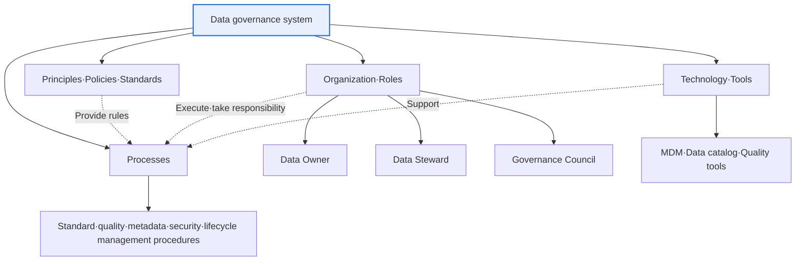
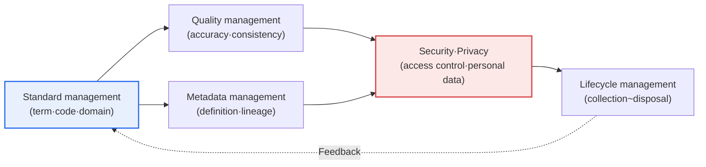

# Data Governance

## 1. Overview

### A. Definition
> **Data Governance** is an enterprise-wide management system that **establishes and continuously controls the policies, standards, organization, and processes** for data management in order to **secure the Availability, Usability, Integrity, and Security** of data. Its goal is to manage data not as the byproduct of an individual department but as a **trustworthy enterprise-wide shared asset**.

The fundamental reason data governance is needed lies in the paradox that data is a **shared enterprise asset yet its owner is unclear**. Data is created and used by each department, but if "who is ultimately responsible for the accuracy and security of this data" is not fixed, quality degradation·duplication·inconsistency·security incidents recur. For example, if the sales department's "customer" and the finance department's "customer" are aggregated by different criteria, the same company's revenue report can differ by department. Governance builds the trust foundation for data utilization by clearly defining "who owns and is responsible for the data, and by what rules and standards it is managed."

In particular, as data becomes a core management asset and a powerful regulatory object with the spread of the three data laws·MyData·generative AI, the limits of individual, scattered management have become clear. The quality of an AI model cannot exceed the quality of its training data ("Garbage In, Garbage Out"), and violating privacy regulations leads to enormous fines and loss of trust. For this reason, governance that manages data's quality·standards·security·compliance as a single integrated control system has emerged as core to corporate competitiveness and risk management.

### B. Background and Necessity
The necessity of data governance grew as three trends overlapped. First, as systems were built separately by department and by period, **data silos and inconsistency** accumulated. Because each system used its own codes·terms without a unified standard, the single source of truth from an enterprise-wide perspective disappeared. Second, as **data-driven decision-making and the reliability of AI came to depend on data quality**, a standing system to define·measure·improve quality was required. Third, with **strengthened privacy protection·regulation**, control and tracing (lineage) over the entire process of data collection·use·storage·disposal became a legal obligation. These three trends came to require an integrated management system spanning standards·quality·security—namely, data governance.

## 2. Components

Data governance works with several elements organically interlocking. Adopting tools (MDM·catalog) is often mistaken for governance, but in reality it must be a structure in which "principles-organization-process-technology" support one another, and in particular, if the organization·roles of "who is responsible" are missing, no matter how good the policies and tools are, it does not work.

### A. Principles·Policies·Standards — The Rules of Management
Principles·policies set the rules and standards for "how data will be managed." This includes data-management principles (e.g., maintain a single source, minimal collection·minimal retention), term·domain·code standards, and a data-grade classification (public/internal/sensitive) policy. Policies must not stop at abstract declarations but be concretized into actual system-design·operating rules to have effect. For example, only when the principle "customer identifiers use an enterprise-wide common key" is documented as a standard and enforced in the new-system review (design review) stage can the occurrence of silos be prevented.

### B. Organization·Roles — The Locus of Responsibility
Organization·roles establish the entities that actually execute governance. The **Data Owner** is the substantive responsible party for a specific data area (mainly a business manager), holding the decision-making authority and responsibility for the data's definition·quality·access rights. The **Data Steward** is the practical manager who enforces the owner's policies in the field, in charge of standard compliance·quality checks·issue remediation. The **Governance Council** is a decision-making body that decides standards·priorities when interests conflict across departments. Without this triangular structure, even when a data issue occurs, it tends to be left unaddressed with "that's not our department's responsibility." In other words, the success or failure of governance depends not on tools but on **the establishment of the responsibility system (stewardship)**.

### C. Processes — The Procedures of Management
Processes are repeatable procedures that actually manage standardization·quality·metadata·security. New-data-standard registration·change-approval procedures, periodic quality diagnosis and improvement procedures, data-access-rights grant·revocation procedures, and privacy-impact-assessment procedures belong here. Without processes, governance ends as a one-time project, and over time data quality degrades again. Processes play the role of connecting the organization (who) and policies (what) into an actual work flow (how).

### D. Technology·Tools — The Support for Execution
Technology extends and automates the preceding three elements. **MDM (Master Data Management)** manages core reference data such as customers·products as a single source, the **data catalog** makes where what data is and what it means searchable, and **data-quality tools** automatically detect errors rule-based. However, technology is a support means only, and one must note that adopting only tools without clear policies and a responsibility system results in an "expensive shell."

| Component | Content | Symptom If It Fails |
|---|---|---|
| **Principles·Policies** | Data-management principles, standards·rules, grade policy | Each department manages differently, silos |
| **Organization·Roles** | Data owner, steward, governance council | Unclear responsibility, issues left unaddressed |
| **Processes** | Standard·quality·metadata·security management procedures | Re-degradation after one-time improvement |
| **Technology** | MDM, data catalog, quality tools | (Without policy) only tools remain, useless |

## 3. Management Areas and Execution Processes

Data governance integratively manages several areas of data management within a single system. The core is that individual areas are not each optimized separately, but quality·metadata·security·lifecycle are consistently connected on the basis of standards.

**Standard management** is the activity of unifying terms·domains·codes, and is the starting point of all other areas. Without standards, you can neither define quality nor integrate data. **Quality management** is the activity of securing accuracy·completeness·consistency·timeliness, diagnosing and improving errors against the standards. **Metadata management** manages the definition and lineage of data (where it came from and how it was transformed·moved), providing the basis for reliability and regulatory response (traceability). **Security·privacy** handles access control and personal-data protection, applying encryption·de-identification·access logging according to data grade. **Lifecycle management** prescribes the entire process of collection·storage·use·retention·disposal, so that unnecessary data is not left unattended and regulations (retention periods, etc.) are complied with.

| Area | Content | Representative Artifact·Means |
|---|---|---|
| **Standard management** | Standardize terms·domains·codes | Data standard dictionary, naming conventions |
| **Quality management** | Secure accuracy·consistency·completeness | Quality rules, diagnostic reports, improvement metrics |
| **Metadata** | Manage data definition·lineage | Data catalog, lineage map |
| **Security·Privacy** | Access control·personal-data protection | Grade classification, de-identification, access logs |
| **Lifecycle** | Collection~disposal management | Retention·disposal policy, archiving rules |

### A. Dimensions of Data Quality — What to Measure
Among the management areas, quality management most directly shows the results of governance, so one must define and measure "what to regard as good quality" as dimensions. Typically, **Accuracy** is whether the data correctly reflects reality, **Completeness** is whether needed values are filled in without omission, **Consistency** is whether values across multiple systems do not contradict one another, **Timeliness** is whether the latest data is provided at the needed point, **Uniqueness** is whether the same entity is managed without duplication, and **Validity** is whether values keep the defined format·range (domain).

The reason these dimensions matter is that if you speak of quality vaguely as "good/bad," you cannot set improvement priorities. For example, only by measuring with per-dimension metrics like "customer email completeness 92%, validity 97%" can you decide which item to improve with which rule. The steward periodically diagnoses·reports these metrics, and for items below target, identifies the cause (input error·non-compliance with standards·system defect) and executes improvement actions. In other words, in that you need standards (what is correct) to make rules, rules to measure per dimension, and measurement to sustain improvement, standards·rules·measurement·improvement form a single cyclic loop.

### B. Governance Maturity — Establish It in Stages
Governance is not completed at once but goes through maturity stages. Early on it is an informal (ad-hoc) stage where management depends on individuals·departments; then it passes through a formalization stage where policies·standards are documented and owners·stewards are designated, then a managed stage where processes take root across the organization and are managed by metrics, and finally an optimization stage where it is continuously improved based on metrics and automated (DataOps). Diagnosing one's current maturity and setting a roadmap to the next stage is the way to avoid the failure of falling into formalism by trying to adopt the ideal model all at once.

## 4. Comparison·Case — Relationship with Data Management·MDM·Data Architecture

In practice, data governance is frequently confused with Data Management·MDM. One must distinguish the differences to avoid misunderstanding the roles. If **data management** is the general term for all execution activities that handle data, **data governance** is the higher-level control·decision-making system that governs that execution. **MDM** is a concrete execution means among them, focused on reference data (master data). In other words, if governance is "the rules and the referee," MDM·quality tools correspond to "the players and equipment."

| Category | Data Governance | Data Management | MDM |
|---|---|---|---|
| Nature | Control·decision-making system | General term for execution activities | Reference-data execution means |
| Concern | Policy·standards·responsibility·compliance | Storage·integration·processing·operation | Consistency of masters like customer·product |
| Output | Policy·standards·organization·process | Pipelines·DB·services | Single reference data (Golden Record) |

As a concrete case, consider a financial company that solved, through governance adoption, the problem where each department managed customer information separately so the same customer was aggregated at a different grade in each system. First it fixed the standard definition and common identifier of "customer" (standard management), designated the owner of customer data (organization), built a single reference data with MDM (technology), and enforced through the design-review process that new systems reference this reference data (process). The practical implication is that governance works not by a specific tool but by the combination of the four elements.

## 5. Deep Dive — Evolution to Data Mesh·DataOps and AI Governance

Traditional data governance was **centralized**, with a central organization monopolizing standards and control. However, as data scale and domains exploded, it became hard for a central organization to deeply understand and control all domains' data, which bred bottlenecks and formalistic compliance. As an alternative, the **Data Mesh** emerged. A data mesh distributes ownership·management of data by domain ("Data as a Product"), while sharing common standards·policies for interoperability at the enterprise level—aiming at **Federated governance**. In other words, the balance of autonomy (domain ownership) and control (common standards) is the latest trend.

Also, **DataOps** internalizes quality verification·governance rules into the data pipeline as code, so that quality·policy are automatically enforced in the process of data flowing rather than by after-the-fact inspection. This shifts governance from being document·meeting-centered to "automated·always-on."

The most recent expansion is **AI/ML governance**. As the source·copyright·bias·personal data of training data became new regulatory·risk issues with the spread of generative AI, there is a clear trend of expanding the quality·lineage·security that traditional data governance covered to AI training·inference data. In particular, data lineage is becoming more important as the basis of accountability for tracing "with what data was this AI trained." That said, since related standards·regulations (e.g., the EU AI Act) are still being organized, it is accurate to understand the detailed requirements as "a trend where the scope of data governance expands to AI data" rather than asserting them.

## 6. Considerations and Implications (Professional Engineer's Perspective)

1. **Data stewardship is the core of sustainability.** Without a clear responsibility system (owner·steward), governance ends as a tool-adoption project and soon re-degrades. Only by assigning explicit responsibility (R&R) to people and linking it to evaluation·reward is data quality managed on a standing basis. Organizational·responsibility design precedes technology adoption.
2. **Standardization is the starting point of everything.** Without data standards, you cannot define·measure quality and integration is impossible. Establish term·code·domain standards first and enforce them in new-system design reviews to fundamentally block the recurrence of silos.
3. **Phased pursuit linked to business value is needed.** Trying to build complete enterprise-wide governance at once easily falls into formalism. It is realistic to apply first to core data domains with high regulatory risk or high utilization value, prove results (quality metrics·regulatory response), and spread.
4. **It should evolve toward a balance of central control and domain autonomy (federated governance).** The larger the scale, the more central monopolistic control becomes a bottleneck, so one should consider a data-mesh-type model where the center defines common standards·policies but domains own data like products responsibly. Automatically internalizing governance into pipelines with DataOps is also a key to securing sustainability.
5. **Prepare for lineage·accountability in the AI era.** Strengthen metadata·lineage management so that the source·bias·personal data of AI training·inference data can be traced, and prepare a roadmap that expands the scope of data governance to AI governance.

## References
- DAMA International, DMBOK2 (Data Management Body of Knowledge): https://www.dama.org/cpages/body-of-knowledge
- Zhamak Dehghani, Data Mesh Principles: https://martinfowler.com/articles/data-mesh-principles.html
- Korea Data Agency (K-DATA) data management·governance materials: https://www.kdata.or.kr/

---

> **In one line**: Data governance is a control system that integratively manages data's standards·quality·metadata·security·lifecycle through *policy·organization·process·technology* to make data a trustworthy enterprise-wide asset; its success depends not on tools but on data stewardship (the responsibility system) and standardization, and it has recently been evolving into data mesh·DataOps·AI governance.
