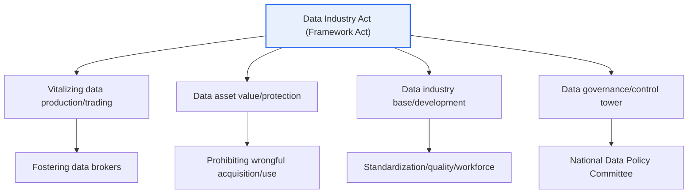
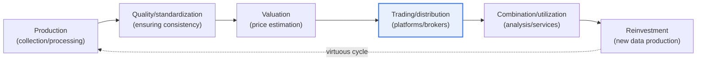

# Framework Act on Data Industry Promotion and Utilization (Data Industry Act)

## 1. Overview

### A. Purpose
> The **Data Industry Act** is a framework act in the data field, enacted to promote the production, trading, and utilization of data, thereby **fostering the data industry and contributing to improving national life and developing the national economy**.

The fundamental reason the Data Industry Act was enacted lies in the recognition that "**in an era where data has become a core factor of production, an institutional foundation was needed to trade and utilize data as an asset**." Although data has become a core economic resource, often called "the oil of the 21st century," the legal framework for actually buying, selling, and using data as an asset was inadequate. There was no unified basis for how to recognize the economic value of data, how to protect transactions, and how to nurture data-driven industries.

An essential distinction to make here is the **division of roles between "protection legislation" and "promotion legislation."** If the Personal Information Protection Act focuses on "protection"—safeguarding the rights of individuals embedded in data—then the Data Industry Act is a framework act focused on the "**utilization and industry promotion**" of data. A framework act (基本法) is one that declares the policy direction and basic principles of a specific field and provides an overarching structure that other individual laws and policies must follow. In other words, the Data Industry Act is a foundational law with constitutional standing across data policy as a whole; it treats data as an asset to promote its production, trading, and distribution, supports and protects data transactions, and lays the groundwork for nurturing the data industry ecosystem (data brokers, analytics providers, trading platforms).

In sum, the Data Industry Act is the institutional foundation underpinning the Data Economy. Its orientation is to promote—at the levels of law, policy, and infrastructure—the entire lifecycle in which data is produced and distributed, combined and analyzed to create new value, and traded in the market for that value (production → distribution → utilization).

### B. Background and Necessity
The first pillar of the background is the **rapid rise of the data economy**. The proliferation of AI, cloud, and IoT has caused the volume and value of data to surge, and services and industries that use data as raw material have established themselves as a new engine of economic growth. However, unlike physical goods, data has the characteristics of being intangible, non-rivalrous, and easily replicable, making it difficult to fully address ownership, trading, and value recognition within the existing property-rights framework. If the basis for data transactions and protection against wrongful acquisition are not clear, market participants cannot buy and sell data with confidence.

The second pillar is the **need to integrate fragmented data legislation**. Until now, data-related regulation was scattered across the Personal Information Protection Act (protection), the Public Data Act (opening public data), and the amendment of the three data acts (utilization of pseudonymized information), and there was no overarching law to oversee "how to grow the data industry itself." A control tower and basic principles encompassing industry promotion, workforce development, standardization, and transaction support were required, and thus the Data Industry Act was enacted as a framework act in the data field. This also carries the aim of establishing a control tower for data policy and aligning promotion policies scattered across ministries and agencies.

## 2. Main Contents and Implementation Framework

The overall structure of the act consists of "the object of promotion (data assets) – the means of promotion (trading, valuation, infrastructure) – the actors of promotion (governance)." The broad structure can be diagrammed as follows.

### A. Vitalizing Data Production and Trading
The act creates a trading foundation so that data can circulate smoothly in the market. The key means are to **foster specialized personnel and businesses (such as data brokers) that intermediate and support data transactions**, and to lower transaction costs and dispute risks through standard data transaction contracts and transaction support programs. Because data varies widely in quality, scope, and usage conditions, transaction negotiations are complex; standardized procedures and specialized intermediation make trading more active.

This point is important because of the "trust" problem in the data market. After handing over data, a seller worries about unauthorized redistribution, and a buyer finds it hard to be sure of the actual quality and usefulness of the data before purchase. To alleviate this information asymmetry, an institution is needed that supports and intermediates transactions and clarifies usage conditions, and the act provides that basis. For example, once data trading platforms and standard contracts are in place, even small and medium-sized enterprises can secure the data they need on reasonable terms without their own bargaining power.

### B. Value and Protection of Data Assets
To trade data, its "status as an asset" must first be recognized. The act views data as an asset with economic value and establishes a basis for **prohibiting the wrongful acquisition, use, and disclosure of data assets**. It also supports **data valuation**, which assigns a value to data. This is because for data to become an object of accounting, collateral, or investment as an asset, there must be a reliable method for estimating its value.

The practical issue that arises here is the "property-rights nature of data." Because data is easily replicated and reused, exclusive ownership is hard to enforce, and there is a broad gray zone not fully covered by existing rights such as copyright or trade secrets. In this gap, the act regulates the wrongful acquisition of data in a manner close to unfair competition prevention, deterring "the act of acquiring or using another's data without just compensation." This gives data producers the expectation of recouping their investment, creating an incentive to produce data.

Because the methodology for data valuation is still being established, it is more accurate to understand it from the perspective of "support and promotion" rather than describing it definitively. Perspectives such as the cost approach (collection and processing costs), the market approach (prices of comparable transactions), and the income approach (future revenue the data will generate) are discussed, and only when this valuation infrastructure matures do subsequent financial activities such as data-collateralized loans and data assetization become possible.

### C. Building the Data Industry Base
For the data market to be sustainable, industrial infrastructure beyond individual transactions is needed. The act mandates that the state support **data standardization, data quality management, workforce development, support for startups and SMEs, and the development of data-based technologies**. Because combining and analyzing data is difficult if formats and meanings vary, standardization is a prerequisite, and because low-quality data has no trading or utilization value, a quality management system is also required.

The emphasis on workforce and SME support stems from the goal of broadening the base of the data industry. Large enterprises have their own data and personnel, but SMEs and startups lack both data acquisition and analytical capabilities. When the state lowers entry barriers through programs such as data vouchers (subsidizing the costs of data purchase and processing), new services using data can be created by a variety of players. This increases the diversity and resilience of the industrial ecosystem.

### D. Governance and Implementation Framework
The act establishes the **National Data Policy Committee** (a cross-ministerial deliberation and coordination body) as a control tower to oversee and coordinate data policy, and mandates the establishment and implementation of a basic plan for data industry promotion. This is because data policy spans several ministries (the Ministry of Science and ICT, the Personal Information Protection Commission, industry, finance, etc.), and without a coordinating body, policies tend to overlap and conflict.

The effectiveness of governance depends on "coordinating power." When the committee does not remain a mere consultative body but substantively aligns the basic plan, budget, and standards, scattered promotion policies converge in a single direction. In particular, collaboration with the Personal Information Protection Commission, which oversees protection legislation, is key: only when "promotion that encourages utilization" and "protection that safeguards individual rights" mesh without conflict can the data economy grow on a foundation of social trust.

### E. The Full Lifecycle of Data Trading and Utilization
Viewing the object the act seeks to promote from a process perspective, data goes through a single lifecycle from production to utilization. The structure is one in which law and policy intervene at each stage to resolve bottlenecks.

This lifecycle perspective is important because bottlenecks in the data industry are concentrated at specific stages. Even if production is active, low quality and standards prevent it from leading to trading; even if trading occurs, the absence of valuation criteria causes price negotiations to collapse. The reason the act regulates quality management, standardization, valuation, and transaction support across the board is that supporting only one stage leaves the entire flow blocked. In particular, the data industry grows self-sustainingly only when the final virtuous cycle of "utilization → reinvestment → re-production" is formed, and the act plays a priming role in promoting that cycle.

## 3. Expected Effects and Cases

The expected effects of the act can be summarized as vitalizing data trading, creating new industries and jobs, promoting data utilization, and strengthening data sovereignty. However, the table is merely an aid; the key is how each effect actually manifests in industry.

| Effect | Content |
|---|---|
| **Vitalizing data trading** | Forming a market to buy and sell data as an asset |
| **Creating new industries/jobs** | Data-based services, analytics, brokerage businesses |
| **Promoting data utilization** | Expanding data access, combination, and use |
| **Data sovereignty** | Strengthening the data rights and interests of data subjects and enterprises |

Looking at the concrete flow, when data trading platforms are vitalized, data from various fields such as finance, retail, and healthcare is combined to create new services. For example, combining card-spending data with commercial-district data enables commercial-area analysis and location-recommendation services, which lead to follow-on industries such as MyData and data commerce. When SMEs secure external data at low cost through data voucher programs, even firms lacking their own data can experiment with data-based new products.

Furthermore, when the prohibition of wrongful acquisition of data is stipulated in law, data producers face reduced risk of unauthorized copying and resale, increasing the incentive to invest in data. This becomes an institutional primer for a virtuous cycle in which "more high-quality data is produced → more is supplied to the market → utilization increases, which in turn promotes further production."

### A. Comparison of Protection–Opening–Promotion Legislation
To clarify the position of the Data Industry Act, one must understand the difference in roles from adjacent legislation. The three laws differ in their objects of regulation and purposes, and they are complementary rather than substitutes.

| Category | Personal Information Protection Act | Public Data Act | Data Industry Act |
|---|---|---|---|
| Focus | Protection (individual rights) | Opening (using public data) | Promotion (industry development) |
| Object | Personal information | Data held by public institutions | Data in general (including private) |
| Key means | Consent/safeguards | Open lists/provision | Trading/valuation/infrastructure |

The practical implication revealed by this comparison is that a single data service sits at the intersection of the three laws. For example, when public data (opening) is combined with private data to create a service targeting individuals (protection) and sold in the market (promotion), the requirements of all three laws must be satisfied simultaneously. Therefore, understanding the Data Industry Act in isolation cannot map the regulatory landscape of an actual business; one must design the touchpoints with protection and opening legislation together. The fundamental reason the differences arise is that each law was created to target a different risk (privacy infringement, monopolization of public information, industrial underdevelopment).

## 4. Deep Dive — The Data Legislation Landscape and Linkages to Related Topics

In a professional engineer's answer, a high-scoring point for the Data Industry Act is to **position it within the entire landscape of data legislation** rather than describing it in isolation. Data legislation can be understood as three broad pillars. The first is the **protection pillar**, comprising the Personal Information Protection Act and its amendments (the basis for pseudonymized information and MyData); the second is the **opening pillar**, comprising the Public Data Act (opening and use of public data); and the third is the **promotion pillar**, comprising the Data Industry Act. These three form a triangular structure of protection–opening–promotion.

Within this landscape, the Data Industry Act functions as the overarching basis for promotion and connects organically with the utilization of pseudonymized information under the three data acts (amendments to the Personal Information Protection Act, the Network Act, and the Credit Information Act) and with MyData under the Credit Information Act (the personal credit information management business and the right to demand data transmission). In other words, the Data Industry Act can be seen as institutionally opening the exit through which "data that can be safely used as pseudonymized information" and "data that a data subject moves by demanding its transmission" flow into actual trading and industry.

Likely exam directions frequently address: (1) the relationship between the Data Industry Act and the Personal Information Protection Act (promotion vs. protection) and ways to harmonize them; (2) the property-rights nature of data assets and the significance of prohibiting wrongful acquisition; (3) the challenges of valuation, standardization, and governance for vitalizing data trading; and (4) linkages with MyData and the three data acts and the data economy strategy. When composing an answer, developing it along the flow of "why was it needed (background) → what does it contain (main contents) → how does it operate (governance/linkages) → challenges and outlook (considerations)" makes the logic sound. However, because detailed facts such as article numbers and amendment dates carry variability and uncertainty, it is safer to write centered on principles and intent rather than definitive statements.

## 5. Considerations and Implications (Professional Engineer's Perspective)

1. **Harmonizing protection and utilization is the top priority.** The Data Industry Act (utilization/promotion) and the Personal Information Protection Act (protection) must work complementarily. Utilization should be promoted while balancing it with personal information and privacy protection, and a technical foundation of "utilizing while protecting" should be built by combining pseudonymization, privacy-enhancing technologies (PET), and privacy-preserving computation (federated learning, homomorphic encryption, etc.).

2. **Building the trust infrastructure of the data trading ecosystem is key.** A real market becomes vitalized only when platforms, standard contracts, valuation, and quality management systems for safely trading data are in place. In particular, transaction support, intermediation, and dispute resolution systems that resolve information asymmetry (quality and redistribution risks) must mature.

3. **The property-rights nature of data assets is a difficult problem.** Because data is intangible, non-rivalrous, and easily replicable, exclusive ownership and trading clash with the existing property-rights framework. While the prohibition of wrongful acquisition provides a production incentive, excessive exclusivity can hinder the sharing and utilization of data, so the proper point between protection and opening must be continually adjusted.

4. **Coherent linkage with MyData, the three data acts, and public data.** The legal foundation of the data economy is completed through the collaboration of several laws. The right to demand transmission (MyData), the utilization of pseudonymized information (the three data acts), and the opening of public data must be aligned with the promotion policies of the Data Industry Act so that the entire lifecycle from production to utilization operates smoothly.

5. **Governance execution capability and international coherence.** A control tower such as the National Data Policy Committee must substantively coordinate policies across ministries. Furthermore, coherence with international norms—cross-border data flows, data sovereignty, sovereign cloud, and the like—must also be considered for the domestic data industry to be competitive in the global market.

---

> **In one line**: The Data Industry Act is *a framework act in the data field that promotes the production, trading, and utilization of data to foster the data industry*; it underpins the data economy by encompassing the value and protection of data assets (prohibiting wrongful acquisition), the vitalization of trading, the building of an industrial base, and governance (the National Data Policy Committee), and it achieves a harmony of protection–opening–promotion together with the Personal Information Protection Act (protection), the three data acts, and MyData.
