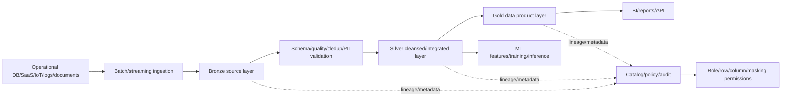
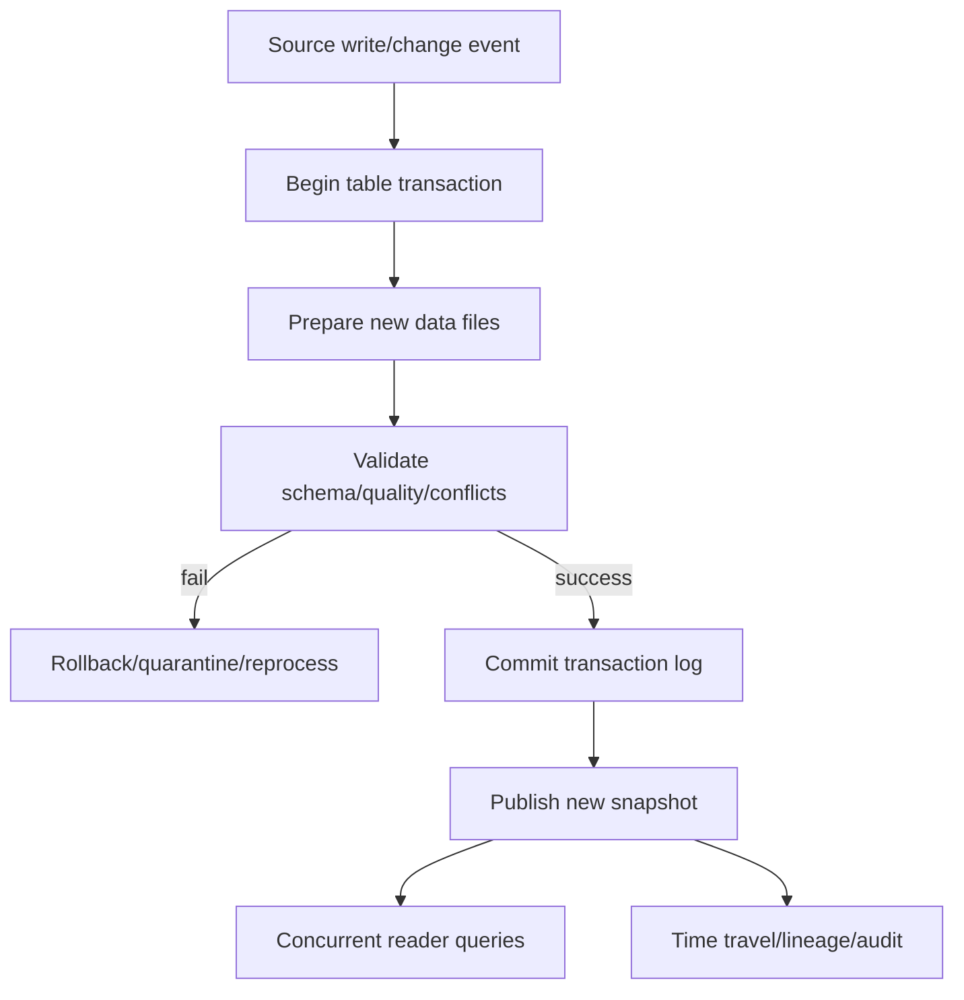

# Data Lakehouse Architecture and Governance

## 1. Overview

### A. Definition

> A **Data Lakehouse** is a data management architecture designed so that batch, streaming, BI, AI, and machine learning can use common data, by combining the scalability and openness of an object-storage-based data lake with the consistency, manageability, and analytical performance of a data warehouse.

A data lake can inexpensively store source data in various formats, but if the management of schema, quality, and concurrency is weak, it can degenerate into a Data Swamp.
Conversely, a traditional data warehouse is strong for structured data and reports but has cost and flexibility limitations for unstructured data, large-scale source retention, and rapid experimentation.
A lakehouse is not merely a repository that glues these two together, but an integrated operating model that combines transactions, metadata, catalog, permissions, and lineage on top of a common storage layer.

The essence is not "pile all data in one place."
It lies in preserving the reprocessability of source data while progressively assigning quality, meaning, and access policies that consumers can trust, and separating computing to suit analytical purposes.
Therefore, a lakehouse is a professional-engineer-level topic that must be designed together with the data platform, data engineering, analytics/AI, and governance.

### B. Background and Necessity

First, enterprise data is not described by structured tables alone.
Operational databases, mobile events, sensor streams, application logs, documents/images/audio, and external open data all flow in simultaneously.
If this data is separated into different repositories for each source format, replicas increase, and the definitions of the same customer or product differ across systems, causing analytical results to conflict.

Second, the data requirements of BI and AI meet on a single platform.
BI wants stable dimensions/measures and fast queries, while AI/ML demands large volumes of source history, feature reproducibility, and unstructured material.
A lakehouse lets you choose engines and serving models per workload based on a common data copy, reducing redundant movement.

Third, data reliability has become a precondition for business decision-making.
The fact that a file is stored does not mean the data is accurate or current.
Managing schema changes, duplicates, late-arriving events, deletion requests, PII masking, and pipeline failures requires transaction logs, quality rules, and lineage.

Fourth, as cloud object storage and disaggregated computing have become common, the independence of storage and processing has become important.
Table state must not break even when multiple clusters read and write together, and SQL, streaming, and ML compute resources must scale independently according to usage.

### C. Goals and Characteristics

The goal of a lakehouse is to achieve a balance between the flexibility of a data lake and the reliability of a data warehouse.
To this end, it combines open file formats, transactional table formats, a central catalog, fine-grained access control, quality automation, and history/lineage tracking.
More important than a specific product's feature list is the design principle of "along what boundaries to divide storage, processing, and governance responsibilities."

The table below is useful for quickly organizing the design goals of a lakehouse in an answer, but each goal carries trade-offs with the others.
For example, retaining source data for a long time improves reproducibility and auditability, but increases storage/retention/deletion costs and the burden of personal information management.

| Goal | Design direction | Effect gained | Trade-off to watch |
|---|---|---|---|
| Openness | Use standard files/catalogs/connectors | Reduced engine lock-in | Managing compatibility verification and feature gaps |
| Reliability | ACID, schema validation, quality rules | Concurrent processing and reproducibility | Transaction log/compute cost |
| Scalability | Object storage and disaggregated compute | Handling data/user growth | Network/file-count/metadata bottlenecks |
| Integration | Common data for BI/AI/streaming | Reduced redundant copies | Resource/policy conflicts across workloads |
| Governance | Catalog/permissions/lineage/audit | Accountability and regulatory compliance | Balancing central control and domain autonomy |

## 2. Overall Architecture and Data Flow

### A. Constituent Layers

A lakehouse is generally divided into data source, ingestion, storage/table, processing/quality, catalog/governance, and consumption layers.
These layers do not necessarily mean physically separate products; they are a logical decomposition to clarify responsibilities and interfaces.

### B. Data Source and Ingestion Layer

Sources are classified as relational operational DBs, SaaS, file/object storage, message brokers, IoT devices, external APIs, and so on.
Because each source has a different change-detection method, unifying everything as a simple "copy files once a day" causes problems with currency, duplication, and deletion reflection.
Relational systems require Change Data Capture (CDC), event systems require offsets/partitions, files require arrival events and checksums, and APIs require cursors and retry policies—all designed together.

If you try to perfectly cleanse source data immediately at the ingestion stage, failures propagate between the source system and the analytics system.
Therefore, preserve the raw payload, ingestion time, source identifier, event key, partition, and schema version, and load into the source layer after only minimal format, virus, and access checks.
Source preservation does not mean the quality is low; it means securing evidence and a reprocessing basis so that you can recompute even if rules change later.

| Ingestion pattern | Suitable situation | Key controls | Representative risk |
|---|---|---|---|
| Batch | Daily/hourly business extraction | Watermark, re-run, partition | Latency and duplication |
| CDC | Near-real-time reflection of DB changes | Log position, order, delete events | Source load and schema changes |
| Event streaming | Click/sensor/order events | Offset, partition key, reprocessing | Duplication/out-of-order |
| File-arrival-based | Large files/external delivery | Checksum, atomic completion marker | Partial files and retransmission |
| API ingestion | Partner/public APIs | Cursor, rate limit, backoff | Omission/call limits |

### C. Separation of Storage and Compute

Data files can be placed in scalable object storage, and SQL, streaming, notebook, and ML jobs can be separated to use compute clusters at the point they are needed.
This structure is advantageous when stored data and query demand grow at different rates.
However, separating compute does not make network latency and file-management problems disappear.
If too many small files are created or partitions are skewed, the cost of metadata lookups and file opens grows, potentially slowing the entire query.

The table format defines "the currently valid set of files" through the combination of data files and a transaction log.
A write operation prepares new files and then commits atomically to the log, and readers read the committed snapshot.
Here, cleaning up old files and the time-travel retention period must be managed together.
If cleanup is too aggressive, files needed for past-version queries, reproducibility, or deletion audits may disappear.

## 3. Medallion Architecture and Data Products

### A. Bronze Source Layer

Bronze is the layer that preserves the fidelity of source data.
Store the source system's fields and events as-is as much as possible, and attach provenance such as ingestion time, source, file name, message offset, and schema version.
The important thing here is not "perform no checks at all," but to place minimal validation and quarantine policies that prevent source corruption.

Because discarding all erroneous records makes it impossible to explain the cause of omissions later, it is advantageous for reprocessing and auditing to preserve normal, error, and undetermined records separately.
For example, if the amount field of a payment event comes in as a string, keep the original in Bronze and record the parsing-failure reason and quarantine location as metadata.
Then, when the rule is corrected, the entire source history can be fed back into Silver.

### B. Silver Cleansed/Integrated Layer

Silver is the layer that assigns quality and meaning so data can be used for analysis and modeling.
It performs type conversion, deduplication, handling of missing/outlier values, code standardization, key mapping, correction of late-arriving data, and joins across multiple sources.
However, if you perform all business aggregation in Silver, reusability declines, so it is better to preserve atomic, non-aggregated cleansed records first.

Silver's quality rules should not be hidden inside pipeline code alone but managed together with the rule ID, expected range, failure rate, check time, and responsible domain.
When a quality failure occurs, whether to unconditionally halt the entire pipeline or to quarantine errors and allow partial success is decided according to business criticality.
The policy should differ for data where consistency is paramount—like a financial ledger—versus data where some loss is acceptable, like ad clicks.

### C. Gold Data Product Layer

Gold is the data product layer where meaning is organized to answer specific business questions.
It provides metrics with agreed-upon definitions and dimensions/aggregations—such as sales, customer activity, and inventory turnover—and optimizes performance so that BI, executives, business APIs, and ML features can use it directly.
The important perspective is that Gold is not a tier where data is "better," but a contract published to suit a purpose and consumer.

A Gold data product specifies its owner, description, update cadence, quality SLO, allowable latency, access scope, lineage, and change-compatibility policy.
For example, if "daily sales" is not defined—whether it is based on order date or payment-completion date, when refunds are deducted, and what time zone is used—then even if the numbers exist, they cannot be used for decision-making.
Therefore, technical metadata and a business glossary must be operated together.

| Layer | Data character | Main processing | Consumers | Quality criteria |
|---|---|---|---|---|
| Bronze | Source/reproducible | Ingestion/minimal validation/raw preservation | Engineers/auditors | Ingestion omission/file integrity |
| Silver | Cleansed/integrated/non-aggregated | Type/dedup/key/missing/late handling | Analysts/data scientists | Accuracy/uniqueness/referential integrity |
| Gold | Business meaning/aggregated/published | Metrics/dimensions/security views/perf optimization | Executives/BI/services/ML | Freshness/definition consistency/response time |

## 4. Transaction, Schema, and Quality Design

### A. ACID and Concurrency

A lakehouse's table transactions are the foundation that keeps readers from seeing an incomplete set of files even when multiple writers work concurrently.
Atomicity makes an entire operation either succeed or fail, and consistency prevents states that violate the defined schema, constraints, and quality conditions.
Isolation keeps concurrent operations from contaminating each other's intermediate states, and durability ensures that committed results can be reconstructed even after a failure.

However, ACID does not automatically guarantee every distributed system's business transactions from the source system to the BI screen.
Distributed transactions that update two external systems simultaneously, model-serving caches, and message-broker delivery guarantees require separate design.
Even if a table commit within the lakehouse is atomic, duplication, latency, and compensation-handling problems remain between external payment approval and data loading.

### B. Schema Management and Evolution

A schema comprises not only column names and types but also requiredness, code systems, meaning, allowable ranges, personal-information classification, and compatibility rules.
The source layer should leave room to accept unexpected changes, but Silver/Gold must strictly enforce contracts, and when a change is detected, impact analysis and consumer notification must follow.

Unlike backward-compatible column additions, column deletions, type narrowing, and code-meaning changes can break consumers.
Using a schema registry, data contracts, automatic validation, version fields, and deprecation-notice periods can reduce implicit dependencies between pipelines.
"Supporting schema evolution" does not mean allowing any change, but making explicit the boundaries of allow, warn, and block.

| Change type | Example | Default verdict | Response |
|---|---|---|---|
| Backward-compatible | Adding an optional column | Allowable | Confirm consumer impact/documentation |
| Incompatible | Deleting a required column | Block | New version contract/migration |
| Meaning change | Changing the definition of a code value | Very dangerous | Glossary/conversion rules/recomputation |
| Type change | Integer → string | Conditional | Precision/parser/sample validation |
| PII change | General value → sensitive-info classification | Immediate control | Review masking/permissions/retention policy |

### C. Data Quality and Observability

Quality does not end with accuracy alone.
Completeness means whether needed records are all present, uniqueness means whether there are no duplicates, validity means whether format/range is correct, consistency means whether definitions are the same across systems and periods, and timeliness means whether data arrived within the promised time.
Because the importance and thresholds of quality dimensions differ by business, you must not manage all data by the same 100-point standard.

Data observability monitors the state of the data beyond whether a pipeline execution succeeded.
It tracks freshness lag, sudden changes in row counts, distribution shifts, schema changes, null ratios, referential-key failures, and Gold metric fluctuations, and when an anomaly occurs, it connects—via lineage—which source, transformation, or consumer is affected.
This allows you to detect silent failures where "the job succeeded but the data is wrong."

## 5. Governance, Security, and Personal Information Protection

### A. Catalog and Lineage

A catalog is not a list that gathers table names, but an operational system that supports the discovery, understanding, access, and accountability of data.
In technical metadata, record schema, location, partition, owner, update time, and quality results; in business metadata, record term definitions, metric formulas, data classification, and purpose of use.

Lineage connects where data came from, what transformations it went through, and which reports/models it was used in.
When personal information deletion or a metric error occurs, column- and row-level lineage is useful for quickly grasping the scope of impact and securing the reproducibility and audit evidence of model-training data.
However, because lineage collection itself is an operational burden, it is better to prioritize important data products first rather than managing every ephemeral artifact at the same level.

### B. Access Control and Personal Information

Because the source layer may contain sensitive raw data, you must not set the same disclosure scope across layers.
Implement least privilege by combining role-based access control (RBAC), attribute-based policies (ABAC), row/column-level filters, dynamic masking, tokenization, encryption, and network boundaries.
If a data scientist does not need the raw resident-registration numbers for model training, provide only de-identified identifiers and the necessary derived features.

Retention periods and deletion requests must consider time travel, backups, derived Gold, and training data.
The fact that source preservation is advantageous for auditing cannot justify indefinite retention beyond the purpose.
The lifecycle of classification → purpose/basis confirmation → access approval → masking/encryption → retention/disposal → audit log must be included in the design of the data product.

| Control area | Application example | Verification evidence |
|---|---|---|
| Identity/permissions | SSO, MFA, RBAC, ABAC | Permission matrix/access log |
| Confidentiality | At-rest/in-transit encryption, masking | Key management log/sample checks |
| Minimal collection | Load only necessary columns/periods | Purpose/field mapping |
| Lineage/audit | Data/query/policy history | Change/access audit log |
| Retention/disposal | Retention period, deletion propagation | Disposal jobs and exception records |
| Supply chain | Connector/library verification | SBOM/vulnerability remediation history |

## 6. Comparison with Data Lakes and Warehouses

A data lake has the greatest flexibility regarding source format and scale, but tends to place a heavy burden on consumers to judge quality and meaning themselves.
A warehouse is strong for repeated reports thanks to integrated schema and query optimization, but limitations arise in the storage/processing of unstructured sources, long-term history, and large-scale experimental data.
A lakehouse narrows the gap through common storage and table management, but it does not automatically obtain all the performance of a warehouse and all the flexibility of a lake.

The choice should be determined not by trends but by the business's latency requirements, data formats, regulations, operational capabilities, and query patterns.
For example, month-end financial closing values strong consistency and approved meaning, so a Gold warehouse-style model may take priority, while anomaly-detection research on sensor sources values the long history of Bronze/Silver and streaming processing.
Even within a single platform, running different models per layer in parallel is a realistic approach.

| Category | Data lake | Data warehouse | Data lakehouse |
|---|---|---|---|
| Main purpose | Preserving source/large-scale/diverse data | Structured analysis/reporting | Integrating BI/AI/streaming |
| Schema | Mostly schema-on-read | Mostly schema-on-write | Flexible/strict in parallel by layer |
| Transactions | Varies by file/implementation | Strong table management | Strengthened via table format/log |
| Users | Engineers/researchers | Analysts/business users | Shared use by role |
| Advantages | Low cost/openness | Consistency/query performance | Copy/platform integration |
| Risks | Data swamp/unclear quality | Replication/movement/high cost | Complex operations/vendor lock-in |

## 7. Implementation Procedure and Operating Model

### A. Phased Buildout

Phase 1 is to define business goals and candidate data products.
Rather than "let's build one lake," specify consumers, decisions, allowable latency, and quality SLOs, such as Customer 360, real-time inventory, or fraud detection.
Phase 2 is to identify the source inventory, classification, owners, legal basis, and retention periods, and to create Bronze ingestion and metadata standards.

Phase 3 is to select CDC, streaming, and batch ingestion to suit the data characteristics, and implement re-run, duplication, ordering, latency, and failure-quarantine policies.
Phase 4 is to agree with the domains on Silver's common keys and quality rules and Gold's metric contracts.
Phase 5 is to embed catalog, permissions, lineage, audit, and cost tags into the pipeline deployment process.

After the transition to operations, observe freshness, quality, cost, and usage per data product, and verify incident-response runbooks and consumer notices.
Rather than building the data platform and then handing it off to an operations team, a model in which engineers, domain experts, security, audit, and analytics consumers share responsibility throughout the product lifecycle is more suitable.

### B. Data Product Operational Metrics

| Area | Example metric | Meaning |
|---|---|---|
| Freshness | Last successful load time, latency p95 | Was the promised update kept? |
| Quality | Null rate, duplicate rate, validity failure rate | Is the data usable? |
| Reliability | Pipeline success rate, reprocessing rate | Are operations stable? |
| Performance | Query p95, file count, scan volume | Can consumers use it fast enough? |
| Cost | Storage/compute/transfer cost per product | Is cost reasonable relative to value? |
| Governance | Unclassified assets, excessive permissions, lineage coverage | Are controls actually applied? |
| Utilization | Active users, reused queries, product adoption rate | Is the value of the investment realized? |

### C. Cost and Performance Optimization

Object storage is inexpensive, but query cost and time vary greatly depending on storage format, compression, partitioning, file size, and scan scope.
Partitioning by time/region/business key too finely causes the partition count to explode, whereas partitioning too coarsely increases unnecessary data scans.
Determine partitioning and clustering by observing actual filter patterns and data distribution, and periodically compact small files without harming concurrent writes and time-travel retention.

Cost optimization is not simple deletion.
Find unused Gold views and reduce computation, use caches/materialized results for repeated queries, separate development/verification/production environments, and distinguish data that truly needs streaming from data for which periodic batch is sufficient.
Lowering the freshness SLO of a data product can reduce cost, but that trade-off must be presented transparently through metrics and budgets so that the business owner agrees.

## 8. Comparison Cases and Practical Application

### A. Case 1: E-commerce Customer/Order Analysis

In e-commerce, the order DB, payment events, app clicks, product catalog, and shipping status are updated at different rates.
Bronze preserves source events and CDC logs, Silver reconciles order/customer/product keys, and Gold provides daily-sales, conversion-rate, and repurchase-rate data products.
Because payment approvals and order status can arrive late, Silver preserves both event time and ingestion time and must have a recomputation policy for late events.

The executive dashboard uses Gold's approved sales definition, and the recommendation model uses Silver's behavioral history and a separate feature view.
Because they share the same source, the problem of differing numbers by channel can be reduced, but personal-information access and use for marketing purposes must be separated.
A failed pipeline shows the last successful snapshot, and the operational rule of notifying consumers of the data delay is also included in the product.

### B. Case 2: Manufacturing Equipment Predictive Maintenance

Sensor data occurs several times per second, and the equipment master and maintenance history change in batch.
Bronze preserves sensor raw data, device identifiers, ingestion time, and message order, and Silver performs unit conversion, out-of-range checks, missing-value interpolation, and joins with the equipment master.
Gold provides per-equipment failure rates, recent vibration characteristics, scheduled maintenance, and model input features.

Simply discarding late sensor arrivals or device clock errors may erase precursors of failure.
Design event-time windows, watermarks, and reprocessing scope, and record the generation version and quality results of model-training data.
Field operators demand the latest alarms, while analysts demand source history and reproducibility, so streaming serving and long-term Silver retention are run in parallel.

## 9. Deep Dive: Linkage with Data Mesh and MLOps

A lakehouse is the technical foundation of a central platform, while Data Mesh is an organizational/operational principle emphasizing domain-centric ownership and a data-product perspective.
Adopting a lakehouse alone does not automatically create owners, quality responsibility, or term agreements, and the central team can become the bottleneck for all pipelines.
Conversely, emphasizing only domain autonomy can fragment common identifiers, security, lineage, and quality standards.

A realistic model is one in which the central platform team provides storage, catalog, permissions, observability, and templates, while domain teams take responsibility for the meaning, quality SLOs, and change contracts of Gold data products.
Operating this as federated governance enforces common policies while letting domains decide business meaning and priorities.

When linking with MLOps, do not stop at storing only the data versions of Silver/Gold; record the training snapshot, feature definitions, code version, parameters, evaluation results, and approval status together.
Only then can you reproduce a model's prediction results and, when data drift occurs, trace which source, transformation, or period the problem began in.
In particular, training data containing personal information, copyright, or sensitive attributes must connect access permissions and deletion propagation all the way to the model artifacts.

## 10. Considerations and Implications

### A. Purpose- and Value-Centered Phased Adoption

Pursuing a lakehouse as a technology-platform-replacement project delays the data products that users feel and the return on investment.
Select one or two high-priority business cases, measure the baseline of current replication cost, latency, quality errors, and report inconsistencies, and then verify the improvement effect.
Expanding common templates and standards based on those results carries lower risk than a big-bang transition.

### B. Making Explicit the Boundaries of Transactions and the Level of Consistency

Do not confuse table ACID with the overall consistency of a business process.
Document which segments—between source systems, brokers, the lakehouse, and dashboards—are close to exactly-once, where deduplication/idempotency is needed, and how compensation is handled on error.
Without designing reprocessable keys and snapshots, duplicate aggregations and manual corrections recur during failures.

### C. Not Controlling Security and Personal Information After the Fact

Broadly exposing sensitive information in the source layer and masking only at Gold is dangerous.
Classification and minimal collection at ingestion time, purpose-based access, de-identification of development data, key management, audit logs, and retention/disposal propagation should be placed as the default path of the architecture.
Apply asset registration and automatic policy checks so that ephemeral files and derived models not registered in the catalog do not become control blind spots.

### D. Making Data Contracts and Quality SLOs Operational Contracts

Do not leave quality rules as a declaration of "good data"; concretize them into metrics, thresholds, measurement cadence, owners, and actions on violation.
When a Gold product's freshness or definition changes, notify consumers of the impact and effective time, and provide a version-transition period if compatibility breaks.
This protects data-consumer trust in the same way as contract testing of software APIs.

### E. Balancing Cost, Performance, and Environmental Impact

Processing all data in real time, indefinitely, and at the highest resolution is not always best.
Design low-business-value data with batch, low-cost storage, and short retention, and provide high-performance computing and fast updates only for core products.
Allocating storage/scan/transfer/training costs per product clarifies responsibility for optimization and reduces unnecessary replication and excessive retraining.

### F. Balancing Openness and Platform Lock-in

Even when using open files and standard interfaces, the catalog, optimization, permissions, workflow, and ML features can be tied to a specific platform.
Confirm the portability of core data, metadata export, disaster recovery, and an exit plan at contract termination during the procurement and architecture-review stages.
Conversely, abstracting all features may forfeit the performance and security advantages of the current platform, so divide areas where lock-in is allowed from areas where it is prohibited according to business criticality.

## 11. References

- Databricks, "What is the medallion lakehouse architecture?": https://docs.databricks.com/aws/en/lakehouse/medallion
- Delta Lake Documentation, "Welcome to the Delta Lake documentation": https://docs.delta.io/
- Microsoft Learn, "What is a data lakehouse?": https://learn.microsoft.com/en-us/azure/databricks/lakehouse/
- Databricks, "What are ACID guarantees on Databricks?": https://docs.databricks.com/aws/en/lakehouse/acid
- Databricks, "Phase 6: Design Delta Lake architecture": https://docs.databricks.com/aws/en/lakehouse-architecture/deployment-guide/delta-lake

---

> **In one line**: A data lakehouse is an integrated data architecture that combines ACID tables, medallion quality layers, catalog, lineage, and fine-grained security on top of common object storage, enabling BI, AI, and streaming to jointly use trustworthy data products.
