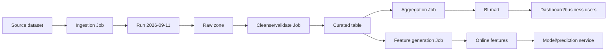
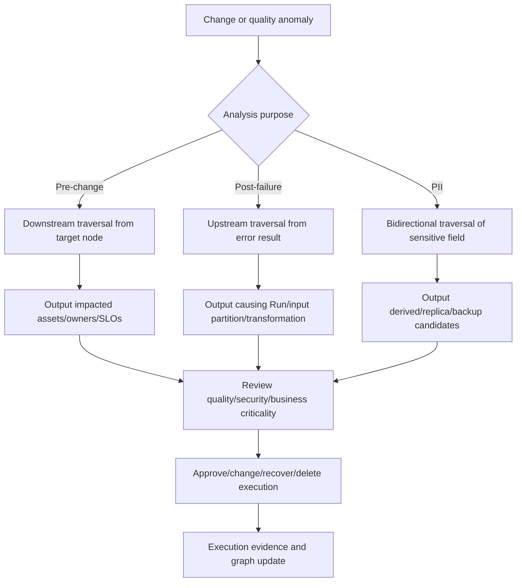

# Data Lineage and Impact Analysis

## 1. Overview

> **Data Lineage** is a system that tracks—via metadata and a relationship graph—what processing and systems data has passed through as it moves from its point of origin through collection, transformation, storage, analysis, service, and disposal.

Data does not stay in the source system; it passes through ETL/ELT, streaming, data warehouses, data lakehouses, BI, and machine-learning pipelines, being reproduced in various forms. Looking only at a result table or dashboard, you can confirm the value, but it is hard to know which source that value came from, what transformation rules and execution version it went through, and which consumers are affected. Lineage connects this disconnect through metadata.

Lineage is not merely a screen feature. It is a data-governance operational capability that binds data assets, processing jobs, execution instances, schemas, owners, quality metrics, and security classifications with common identifiers, and collects, stores, queries, and validates their relationships. Therefore, if a catalog helps you "find" assets, lineage explains "how assets are made and where they are used."

The reason lineage is especially needed in practice is that the ripple effects of changes have grown. Renaming a source column or changing a personal-information retention policy can simultaneously affect dozens of pipelines, reports, recommendation features, and training datasets. Impact analysis is the activity of traversing the graph in the downstream direction from a specific data asset or column to identify the scope of impact of changes, failures, and deletions.

Conversely, root-cause analysis moves upstream from the erroneous result to find where the initial contamination, omission, or transformation error began. You must operate a single system's lineage bidirectionally to perform both pre-change impact analysis and post-failure cause analysis.

The goal of data lineage is not to draw all relationships prettily but to secure the trust and traceability needed for decision-making. Therefore, you must manage together the scope, level, currency, collection gaps, and potential for security exposure of the lineage.

### A. Background and Necessity

First, as data platforms became distributed, processing paths grew complex. When on-premises DBs, SaaS, message brokers, object storage, and cloud DWs are connected, the logs of a single tool alone cannot explain the entire flow. End-to-end lineage is achieved only when different systems use a common metadata model and identification rules.

Second, regulatory, audit, and personal-information-protection requirements have expanded to the origin and purpose of data use. To confirm which reports and models specific personal information was used in, or where data past its retention period was replicated, data classification and lineage must be connected. However, because lineage alone cannot prove every replica, it must be complemented with access logs, asset inventories, and backup inventories.

Third, in analytics and AI operations, data quality and the reliability of model results are linked. If part of the training data was created from an incorrect join or a delayed partition, the cause of degraded model performance may lie not in the model code but in the data lineage. Recording the relationships among features, training data, models, and prediction results increases the reproducibility and auditability of MLOps.

Fourth, the speed of change management and incident response has become important. Manually investigating affected dashboards delays deployment approvals and failure recovery. If you can immediately query the downstream assets and owners of the change target from the lineage graph, you can reduce the review scope and communication costs.

### B. Distinguishing Lineage from Adjacent Concepts

A data catalog is an asset inventory that provides the name, description, owner, classification, and search information of data assets. Lineage provides the creation/transformation/usage relationships among assets, so it is often combined with the catalog's relationship information, but catalog and lineage are not identical.

Data provenance is a concept that broadly expresses evidence such as the origin, creation process, responsible party, and timing of data. Lineage can be seen as an implementation that operationally collects and queries the data-flow aspect of provenance. W3C PROV-O provides an ontology model that can express such provenance and responsibility relationships centered on Entity, Activity, and Agent.

A data contract is a design-time promise in which data producers and consumers agree on schema, quality, freshness, and change rules. Because lineage records the facts of actual job execution and data movement, combining the two lets you compare "how it should be" with "how it actually was."

Data observability is an operational perspective that monitors anomalies in freshness, volume, distribution, schema, and quality, while lineage is a relationship perspective that explains through which path that data was created and consumed. Connecting quality-anomaly events to the lineage graph lets you grasp both the asset where the error occurred and the affected consumers.

| Category | Key question | Representative output | Relationship to lineage |
|---|---|---|---|
| Data catalog | What exists and who is responsible? | Asset inventory/definitions/owners | Provides lineage's nodes and metadata |
| Data lineage | Where did it come from and where does it go? | Flow graph/execution history | Connects asset/job/run relationships |
| Data provenance | With what evidence and responsibility was it made? | Origin/timing/agent records | Extends lineage's meaning/audit scope |
| Data contract | What quality/schema must be kept? | Contracts/validation rules | Compares design lineage with execution lineage |
| Data observability | Is it arriving normally right now? | Quality/freshness/volume metrics | Connects anomaly events to the graph |

## 2. Structure and Model of Data Lineage

### A. Graph-Based Composition

Lineage is generally a directed graph that represents data assets as nodes and transformation jobs and executions as relationships or intermediate nodes. Preserving the structure in which an input dataset leads through a job to an output dataset enables upstream/downstream traversal. In actual implementation, you must distinguish a job itself from a single run of a job to distinguish execution failures, reprocessing, and version-specific results.

The simplest graph has the ternary relationship `input dataset → job → output dataset`. However, an operational model additionally records the execution time, run ID, code version, schema version, quality results, owner, and security classification. Because even the same job processes a different partition each day and can produce different execution results, merging Job and Run reduces reproducibility.

OpenLineage's object model treats Job, Run, and Dataset as core entities and extends additional metadata with Facets. A Job is a processing unit that consumes/produces data, a Run is a specific execution of that Job, and a Dataset is an abstract representation of a data unit such as a table, file, or object. This model is used as a common language for exchanging lineage events among multiple orchestrators and processing engines, rather than a specific storage product.

W3C PROV-O's Entity·Activity·Agent model expresses the meaning of lineage more broadly. A Dataset can correspond to an Entity, a transformation to an Activity, and an execution subject or organization to an Agent. Through relationships such as `wasDerivedFrom`, `wasGeneratedBy`, `used`, and `wasAttributedTo`, it models the basis of transformation, responsibility, and usage. Because a product's data model and a standard ontology have different purposes, you should define the scope of interoperability you need rather than unconditionally unifying them into one.

### B. Layers of Metadata

Technical lineage represents the connections of physical assets such as databases, files, topics, tables, and columns. For example, the fact that `orders_raw` became `sales_daily` through a SQL transformation is technical lineage. It is easy for systems to collect automatically and suits initial construction, but it does not automatically guarantee business meaning.

Column-level lineage represents which input columns and expressions a specific output column derived from. If `customer_grade` is generated from a combination of `customer.score` and `rule_table.grade_code`, this relationship cannot be known from table-level connections alone. Column level is useful for the propagation of personal-information fields and schema-change impact analysis, but the cost of collection and the potential for gaps grow due to SQL parsing, UDF analysis, and dynamic-query interpretation.

Business lineage explains how business terms and metrics like "sales," "active customers," and "risk grade" connect to which data assets and calculation rules. Even with technical lineage, a metric of the same name can be computed with different definitions across departments, so the business glossary and metric definitions must be connected to the graph for decision-makers to understand.

Execution lineage records the input partitions read in an actual Run, the output partitions written, the execution time, the status, and quality results. If design lineage is the declaration "this Job reads A and writes B," execution lineage is the evidence "in this run, it read A's September 10 partition and produced a specific version of B." In incident analysis, showing the difference between the two layers is important.

| Layer | Example | Strength | Main limitation |
|---|---|---|---|
| System/asset level | A table in DB A moves to DW B | Broad scope, easy to automate | Detailed columns/transformation formulas not visible |
| Table/file level | `orders_raw` → `sales_daily` | Basic unit of operational impact analysis | May overestimate partial column changes |
| Column level | `orders.amount` → `sales.revenue` | PII propagation/precise impact analysis | High cost of SQL/UDF/dynamic-query interpretation |
| Business level | Sales metric → executive dashboard | High user understanding and accountability | Requires definition agreement and manual curation |
| Execution level | Run/partition/snapshot/quality results | Reproducibility and failure-cause analysis | Requires event-gap and retention management |

### C. Attributes to Include in Nodes and Edges

Into a dataset node, put not just the name and location but the system, environment, schema version, owner, classification, retention period, quality SLO, and creation/modification times. For identifiers, designing them to avoid collisions across environments takes priority over making names human-readable. OpenLineage also uses a combination of namespace and name to identify Jobs and Datasets.

Into a Job node, you can connect the code repository and commit, the orchestrator's DAG/task, the execution subject, and the SQL or model version used. Into a Run, record the unique run ID, start/end times, status, error message, input/output partitions, and quality metrics. With this information, you can distinguish a normal run of the same DAG from a reprocessing run.

Into edges, you can put not only direction but also transformation type and confidence. For example, distinguishing `DERIVES`, `COPIES`, `AGGREGATES`, `FILTERS`, and `JOINS` makes impact-analysis results easier for people to interpret. Recording the source and collection time—whether a relationship was inferred by a parser or confirmed by execution logs—lets you assess the graph's confidence.

The classification of sensitive data can propagate through nodes and edges, but you must not treat automatic-propagation results as confirmed facts. Review whether masking, aggregation, or anonymization actually removed identifiability, and manage the classification-propagation rules and exception-approval records together.

## 3. Collection, Storage, and Utilization Procedures

### A. Collection Methods

The first method is design-based collection. Analyze pipeline definitions, SQL, DAGs, data contracts, and IaC to register the planned inputs and outputs. It has the advantage of allowing impact-scope review before deployment, but it is hard to fully know runtime conditional branches, dynamic table names, and exception paths.

The second method is execution-based collection. Record actual inputs and outputs using job-execution events, query audit logs, orchestrator callbacks, DB CDC, and storage events. Its actuality is high, but operational problems arise, such as log retention periods, sampling, permissions, and handling of failed runs.

The third method is parsing/inference-based collection. Analyze SQL AST, code, schema changes, and query plans to infer column relationships. It is useful for structured SQL, but inference can be incomplete for UDFs, external APIs, and dynamic SQL assembled from strings. Therefore, you must distinguish the status of "auto-generated relationships" from "reviewed relationships."

The fourth method is application instrumentation. Insert an SDK or agent so that processing code publishes start/completion/input-output Dataset information as standard events. Standard events increase interoperability across tools, but platform guardrails are needed to ensure all teams follow the same identification rules and versioning policies.

Rather than choosing only one collection method, it is desirable to operate design lineage and execution lineage together. Use design lineage to quickly compute the pre-change impact scope, and use execution lineage to verify actual runs and quality anomalies. If there is a collection gap, do not silently leave an empty connection in the graph; display the coverage and confidence status.

### B. Standard Events and Storage

The minimal structure of a standard event is the relationship of Job (meaning a job), Run (a single execution of the job), and Dataset (the input/output datasets). OpenLineage distinguishes RunEvent, which represents execution status, from JobEvent/DatasetEvent, which represent design-time metadata. The same runId must be used for multiple status events of the same Run, and metadata of different character—like a Dataset's static schema versus per-run partition information—should be separated into appropriate Facets.

An event collector can deliver events to a central metadata service via a message broker or HTTP API. Place asynchronous buffers and retransmission policies so the pipeline itself is not interrupted even if a network failure occurs. However, because a graph that appears complete while events are lost produces incorrect impact analysis, manage transmission-failure rate and latency as separate metrics.

The storage model can be composed of a combination of a graph DB, a relational metastore, and a search index. If graph queries are frequent and relationship traversal is key, a graph model is convenient, but for large-scale execution history and time-series quality metrics, columnar/relational storage may be efficient. What matters more than product choice is first fixing node identifiers, event idempotency, the time/version model, and the retention policy.

Because events may be retransmitted, implement idempotent processing using keys such as `event_id`, `run_id`, and Dataset version. Storing duplicates of the same event inflates the graph and miscounts downstream impact. Conversely, when an asset of the same name is created with a different schema or partition version, you must preserve the version relationship rather than simply deduplicating.

### C. Impact Analysis and Root-Cause Analysis

Impact analysis is the task of traversing the graph in the downstream direction from the change-target node. When deleting a column or changing its meaning, it outputs together which tables, features, models, reports, and external transmissions are affected and what the owner and business criticality of each asset are. Rather than simply counting the number of reachable nodes, you must evaluate criticality, freshness, regulatory classification, and execution currency together.

Root-cause analysis traverses upstream from the anomalous result. If a data-quality alert occurs at `sales_daily`, check the recent successful Run, input partitions, schema changes, and upstream quality results in chronological order. If the graph lacks execution times and versions, even if the upstream connection exists, it is hard to pinpoint the run that caused the failure.

A personal-information deletion request is a bidirectional use case. First, query the upstream origin and downstream derived assets of the sensitive column, and separately confirm online caches, model-training data, backups, and externally provided files as separate assets. Lineage is a basis for narrowing the candidate scope, not a device that automatically proves deletion completion, so you must preserve the actual deletion logs and verification results.

Graph traversal requires depth limits, time ranges, version conditions, and asset-type filters. Traversing all past runs without limit makes the result too large and mixes in discarded assets unrelated to current operations. You must concretize the question—like "successful Runs of the last 30 days," "production environment," "column-level confirmed relationships"—so the analysis result becomes an actionable list.

### D. Lineage Quality Management

Lineage itself should be regarded as a data product and operated with quality metrics. Representative metrics are lineage coverage of core pipelines, event-collection latency, orphan-node ratio, unidentified-Dataset ratio, the agreement rate between design lineage and execution lineage, and the column-relationship verification rate. The fact that a lineage screen has many nodes is not evidence of quality.

Coverage can be distorted if computed only as "the number of connected assets relative to the total number of assets." Weight core data products and regulated data with high business criticality, and measure separately at the asset, column, and execution levels. It is also necessary to distinguish auto-inferred relationships from owner-approved relationships and display a confidence grade.

Lineage currency can be checked by the difference between the last event time and the actual data-change time. If the pipeline runs while events are not being collected, the screen shows stale relationships. Therefore, set the metadata-collection latency itself as an SLO, and attach a warning to impact-analysis results when it is violated.

## 4. Comparison and Application Cases

### A. Comparison of Manual Documentation and Automatic Lineage

Manual documentation explains business meaning and exception rules well but must be updated with every change and easily diverges from actual execution. Automatic lineage quickly reflects execution facts but may miss business rules outside code, hand-written files, and external delivery. Therefore, rather than viewing automation as a replacement for manual curation, a realistic approach is to make automatic collection the baseline and have people supplement the core meaning and exceptions.

| Category | Manual data-flow documentation | Automatic lineage |
|---|---|---|
| Currency | Change reflection can lag | Quickly reflected per events/logs |
| Meaning level | Details business rules and exceptions | Technical-relationship-centered, needs meaning supplement |
| Scope | Core flows selected by the author | Scope of collectable systems |
| Reliability | High if there is an approval process | Needs verification of gaps/parsing errors/duplicates |
| Operational cost | Cost of initial authoring and ongoing updates | Cost of platform buildout/instrumentation/observation |
| Suitable use | Policy/business definition/exception explanation | Impact analysis/incident response/reproducibility |

The difference between the two methods arises not from the level of automation but from the nature of the evidence. Documentation holds intent and meaning, and execution events hold facts that actually occurred. From a professional engineer's perspective, rather than choosing one of the two, you should design a system that connects data contracts, catalog, standard events, and approval workflows to detect discrepancies between intent and fact.

### B. Comparison of Table Level and Column Level

Table-level lineage has broad collection scope and quickly shows connections between systems. It may be sufficient for initial construction or for grasping the operational flow of a large-scale platform. However, it is hard to judge from table level alone where a specific personal-information column propagates or which consumers a single column's type change affects.

Column-level lineage is more precise but must accurately interpret all transformations. Simple column mapping is easy to automate, but for aggregations, joins, conditional branches, and UDFs, the meaning of "which input contributes to the result" differs. Providing overly precise relationships inaccurately makes users hold false confidence, so you must clarify the confirmed, inferred, and uncollected statuses.

### C. Case: Changing a Commerce Sales Dashboard

Suppose a hypothetical commerce company changes the type of the `discount_amount` field of the order source from integer to decimal. First, impact analysis starts from the source column and traverses downstream to the cleansed table, daily sales aggregation, financial dashboard, and promotion-analysis model. Using table level only flags all related order columns as impact targets, but combining column level and transformation expressions lets you prioritize reviewing only the consumers that actually participate in amount calculation.

The change approver checks the SLOs and owners of downstream assets and performs a regression test on whether past Runs can handle the new type. They confirm whether the dashboard performs rounding, whether the financial system expects integer units, and whether the schema contract of the model-training data is fixed. In this way, lineage is not a tool for auto-approving changes but a tool that quickly presents the questions to review and the people responsible.

### D. Case: AI Training Data Anomaly

Suppose the recent AUC of a recommendation model has dropped, but the model code has not changed. Moving upstream from the model input features, you can find that the input partition of a recent Run arrived later than usual, and that the cleansing Job replaced empty values with 0. Connecting the null ratio in the quality Facet with the partition information in the execution lineage lets you explain the model-performance degradation and the data anomaly with a single chain of evidence.

At this point, if there are multiple candidate causes, you must not simply confirm the nearest upstream node as the cause. You must cross-check the pipeline's execution time, data-quality alerts, code commits, model version, and the online/offline consistency of the feature store. Lineage narrows the candidate causes and impact scope, but confirming the cause requires quality verification and the operator's judgment.

## 5. Deep Dive: Linkage with Standards, AI, and Data Governance

OpenLineage aims not at a specific database product but at a common event model and integration ecosystem for lineage metadata. Using Job, Run, Dataset, and Facets, schedulers and processing engines can exchange basic relationships even in different environments. When adopting a standard, you must first decide version pinning, namespace rules, event idempotency, and the governance of custom Facets to maintain long-term interoperability.

A provenance model like PROV-O becomes a foundation for expressing the meaning of responsible parties and activities beyond simple data movement. For example, recording which approved data product model-training data derived from and which organization operated the pipeline can be used for AI audits and reproducibility review. However, adopting ontology expression does not automatically produce agreement on business definitions, so a data glossary and a responsibility matrix are also needed.

In generative AI and agent systems, prompts, retrieved documents, tool calls, model versions, and the basis of outputs become new lineage targets. For this information, events and execution context matter more than traditional table lineage, and storing sensitive prompts or responses as-is can expose personal information or trade secrets. Therefore, you should consider the principle of minimal collection—recording hashes, classification, retention periods, and access permissions instead of the raw input/output.

In data-mesh/data-product environments, domain teams own data assets and the central platform provides standards and search/observation features. Here, lineage suits a federated model in which each domain publishes standard events and the central catalog enforces common identifiers and quality policies, rather than the central team manually managing all connections. Include lineage coverage and operational SLOs in domain evaluation metrics so that distributed ownership does not turn into distributed irresponsibility.

In likely exam questions, you can connect the components of data governance, metadata management, impact analysis, personal-information propagation, and AI data reliability into a single answer. An answer should not merely present definitions; it is better to explain together the virtuous cycle of `collection → standardization → storage → traversal → impact analysis → quality verification → governance feedback` and the trade-offs of technology, organization, and security.

## 6. Considerations and Implications

### A. Define Scope and Priorities

Trying to build complete lineage of all systems and all columns at once causes cost and complexity to explode. Select core paths first from domains with high business/regulatory criticality—like sales, customer, personal information, and AI training data—and set asset/column/execution-level goals progressively. Documenting the built scope and the uncollected scope is more important than an excessive claim of completeness.

### B. Standardize Identifiers and Versions

Because tables of the same name can exist simultaneously in development, verification, and production environments, define rules for namespace, environment, system, and dataset version. Connect partitions, snapshots, code commits, and model versions to events so you can distinguish re-runs from rollbacks. If identification rules waver, the graph fragments or different assets are merged together.

### C. Disclose Confidence and Currency

Showing auto-parsed relationships, execution-log relationships, and owner-approved relationships in the same color makes users misunderstand all connections as confirmed facts. Display the collection time, source, coverage, whether it is inferred, and the last successful Run, and operate a metadata-collection SLO. You should not hide the gaps in the graph but provide the uncertainty itself as information.

### D. Apply Security and Personal Information to Lineage Too

Lineage metadata can include table names, column names, SQL, users, and file paths, so sensitive business information can be exposed even without the original data. Apply role-based access control, column-name masking, tenant isolation, audit logs, and retention periods, and disclose only the minimal level operators need. Do not assume data-access permissions and lineage-viewing permissions are the same; design them as separate policies.

### E. Connect Change Management and SLOs

Impact-analysis results should lead not to a mere graph but to change approval, testing, notification, and rollback plans. Combine the freshness/availability/accuracy SLOs of core consumers with the criticality of the change target to create a risk-based review order. Because unconditionally blocking changes just because lineage exists slows innovation, pass low-risk changes through automatic verification and standard deployment, and concentrate human approval on high-risk changes.

### F. Secure Organizational Accountability and Operational Capability

Lineage does not take root simply because a platform team installs a tool. Define the responsibilities of data producers, consumers, stewards, and security/audit staff with a RACI, and include the responsibility for event publishing and exception correction in the product lifecycle. The operational process of regularly reviewing lineage quality and onboarding missing pipelines must persist longer than the technical implementation.

## References

- OpenLineage, "About OpenLineage" — https://openlineage.io/docs/
- OpenLineage, "Object Model" — https://openlineage.io/docs/spec/object-model/
- Apache Atlas, "Data Governance and Metadata framework" — https://atlas.apache.org/
- W3C, "PROV-O: The PROV Ontology" — https://www.w3.org/TR/prov-o/
- OpenLineage GitHub, "An Open Standard for lineage metadata collection" — https://github.com/OpenLineage/OpenLineage

---

> **In one line**: Data lineage is a foundation that connects Dataset, Job, Run, and execution evidence to explain the origin and impact scope of data; when operated together with standardization, quality, security, and organizational accountability, it improves change management and AI reliability.
