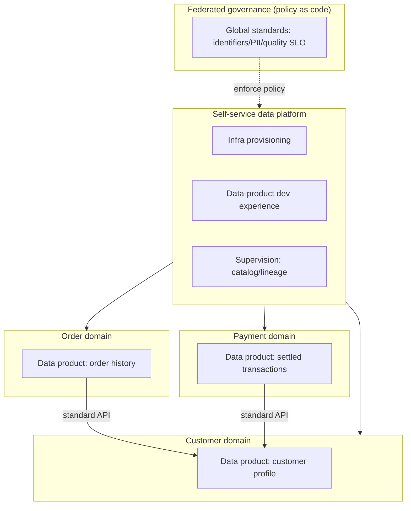
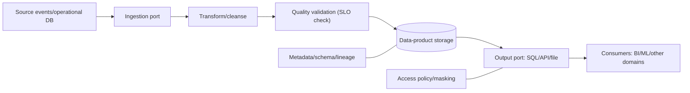

# Data Mesh and Distributed Data Architecture

## 1. Overview

### A. Definition

> **Data Mesh** is a **distributed, sociotechnical data-architecture paradigm** that transfers the ownership, production, and quality responsibility for data from a central data team to each business domain, treats data not as a single managed file but as a **product provided to consumers (Data as a Product)**, and underpins this with a self-service platform and federated governance.

Data Mesh is not a specific product or repository but a combination of an organizational operating model and architectural principles.
Traditional centralized data architectures (the data warehouse, and later the data lake) were structures in which all source data was pulled into one platform and a small central data team exclusively handled collection, cleansing, modeling, and serving.
This structure is efficient when data scale and sources are small, but when domains and consumption use cases grow explosively, the central team becomes a bottleneck.
Data Mesh frames this bottleneck as an organizational-structure problem and extends to the data domain the decentralization that microservices achieved in application development.

The essence is not "let's gather data in one place better," but a shift in perspective: **let the domain that knows the data best take responsibility for it and provide it like a product**.
Therefore, Data Mesh is a professional-engineer-level topic in which not only storage technology but also organization, governance, platform, and culture must be designed together.

### B. Background and Necessity

First, the structural bottleneck of the central data team.
When every domain's data requests converge on a single central team, engineers without domain knowledge must interpret the meaning of the sources, and wait times grow long due to priority competition.
In an environment where data-consumption demand grows faster than the organization, it is hard to resolve this bottleneck by adding personnel alone.

Second, the separation of responsibility and knowledge.
The domain operating the source system knows the meaning of the data best but bears no responsibility for analytical data quality, while the central team bears the responsibility but does not know the source context.
As a result, schema changes silently break pipelines, and identifying and fixing the cause of data-quality problems is delayed.

Third, the limits of scalability.
Placing all domains in a single lake/warehouse turns the pipeline into a giant monolith, so a change in one domain affects the whole, and deployment and testing become difficult.
This is isomorphic to the monolith problem microservices tried to solve.

Fourth, the demand for time-to-value in realizing data value.
As AI/data-driven decision-making became common, reducing the lead time to discover, trust, and use data became a competitive advantage.
Data Mesh distributes ownership to create value in parallel while maintaining interoperability through standards and governance.

### C. The Four Principles and Characteristics

Data Mesh is summarized by the four principles proposed by Zhamak Dehghani.
Importantly, these principles do not exist individually but complement one another, and adopting only one instead increases chaos.

| Principle | Core content | Effect gained | Trade-off to watch |
|---|---|---|---|
| Domain ownership | Attribute responsibility for analytical data to the domain | Context-based quality/fast response | Risk of cross-domain duplication/silos |
| Data as a product | Provide data as a discoverable, trustworthy product | Improved reusability/consumer experience | Increased product ownership/operational burden |
| Self-service platform | Abstract common infrastructure as self-service | Domain autonomy/reduced redundant development | Requires platform-team capability/initial investment |
| Federated governance | Enforce global standards via automation | Interoperability/regulatory compliance | Balancing central control and autonomy |

## 2. The Four Principles in Detail

### A. Domain-Oriented Decentralized Ownership

The starting point of Data Mesh is transferring the ownership of and responsibility for analytical data to the business domains that know the sources well (e.g., orders, payments, logistics, customers).
Each domain takes end-to-end responsibility for the collection, transformation, quality, serving, and lifecycle of the data it produces.
This is a design that reverse-leverages Conway's Law, aligning organizational boundaries with data boundaries to reduce communication costs.

Domain ownership becomes clear when understood by dividing data into three types.
Source-aligned data is factual data derived directly from operational systems; consumer-aligned data is data processed to suit a specific use case (e.g., recommendation, reporting); and aggregate data is data combining multiple domains.
Because the pitfall of distributed ownership is siloing, exposing cross-domain data through standard interfaces so that other domains can consume it is a prerequisite.

### B. Data as a Product

Treat data not as a byproduct of a pipeline but as a product with clear consumers.
A product has a data-product owner and comes with SLAs/SLOs (freshness, accuracy, availability), documentation, and contracts.
The attributes a good data product should possess are often summarized as **DATSIS**.

- Discoverable: searchable and explorable in a catalog
- Addressable: accessible via a standardized unique path
- Trustworthy: specifies and keeps quality metrics/SLOs
- Self-describing: provides schema/meaning/examples as documentation
- Interoperable: complies with global standards (identifiers/formats)
- Secure: access control/policies embedded in the data

A data product is designed not as a mere table but as an **architectural quantum** that encapsulates data, metadata, access API, quality-validation code, and infrastructure definition together.
For example, if the payment domain provides a "settled transactions" data product, it includes schema, SLO, samples, and consumption methods so that other domains can consume it without code changes.

### C. Self-serve Data Platform

Having each domain build data infrastructure from scratch causes duplication and inefficiency.
To prevent this, the platform team abstracts and provides common capabilities—storage, processing, catalog, monitoring, access control—as self-service.
The goal is to let domain developers, not just data engineers, easily build, deploy, and operate data products, lowering the domain's cognitive load.

The platform is designed by dividing it broadly into three planes.
The data-infrastructure provisioning plane automatically allocates storage/compute/accounts, the data-product developer-experience plane provides workflows for creating/testing/deploying data products, and the data-mesh supervision plane makes visible the global catalog, lineage, and policy-compliance status.
The platform does not "enforce policy via documents" but "embeds policy as code and templates by default" so that domains easily take the right path.

### D. Federated Computational Governance

Complete decentralization destroys interoperability.
In federated governance, representatives of each domain and platform/security experts gather to set global standards (identifier system, data format, personal-information policy, quality criteria) and embed these as **automated policy (policy as code)** in the platform to enforce them, instead of people inspecting them every time.
The word "computational" emphasizes that governance is not a committee's document but code that is automatically executed and verified in pipelines.

The key balance is setting the boundary between global standards (what to unify) and domain autonomy (what to delegate).
Personal-information masking, access policies, and interoperability identifiers are generally enforced globally, while internal modeling and technology choices are delegated to the domains.

## 3. Internal Structure and Interaction of a Data Product

An individual data product encapsulates the consumption interface, data storage, transformation logic, quality validation, and metadata/policy into a single deployment unit.
The diagram below shows the process by which one data product receives source input, passes through validation, and provides it to consumers via a contracted output port.

The quality-validation stage acts as a gate so that a data product is not published to consumers if it fails to meet its contract (SLO).
For example, if the freshness SLO is "within 1 hour" and a delay occurs, it can be designed to notify consumers of the delayed state rather than exposing stale data as-is.
In this way, a data product is characterized by enforcing an explicit contract (data contract) with consumers as code.

## 4. Comparison with Data Lakes/Warehouses and Data Fabric

Data Mesh should be understood not as a replacement for existing architectures but as a difference in the **organizational/ownership model**.
If a data lakehouse is the answer to "what to store/process with (technology layer)," Data Mesh is the answer to "who is responsible and how it is organized (operating model)."
In fact, each domain's data product can internally use a lakehouse or warehouse as storage technology, so the two are not exclusive and can be combined.

| Category | Central lake/warehouse | Data fabric | Data mesh |
|---|---|---|---|
| Access perspective | Centralized storage | Metadata/automation-centric integration | Domain-decentralized ownership |
| Ownership | Central data team | Central + automation layer | Each business domain |
| Core axis | Technology platform | Intelligent metadata/AI | Organization/process |
| Scaling method | Add personnel/clusters | Automation scaling | Parallel domain scaling |
| Main risk | Central bottleneck | Dependence on metadata quality | Silos/duplication/governance complexity |

The difference from data fabric is often confused.
Data fabric focuses on **technically** connecting distributed data through metadata and automation (active metadata, AI-based integration), whereas Data Mesh focuses on the **organizational** decentralization of ownership and responsibility.
That is, fabric means "technology automates integration" and mesh means "people and organizations take responsibility for decentralization," so they can be combined complementarily.

## 5. Deep Dive: Adoption Strategy and Practical Application

Adopting Data Mesh wholesale when organizational maturity is low carries high failure risk.
Organizations with large-scale data domains—such as Netflix, Zalando, and JPMorgan Chase—applied it early to resolve bottlenecks, and they commonly emphasize **incremental adoption** and **up-front platform investment**.

Practical adoption recommends the following order.
First, start a data-product pilot in a few high-value domains with clear boundaries to create success cases.
Second, abstract repetitive infrastructure work into a self-service platform to lower the domains' entry barrier.
Third, automate the minimal global standards (identifiers/PII/quality) first as policy as code, and progressively expand the standards.
Fourth, institutionalize the data-product-owner role and performance metrics (product adoption rate, SLO compliance rate, lead time).

A caveat is that when the organization's scale and data complexity are low, a centralized approach is instead more efficient.
Data Mesh is justified when domains and consumption use cases are so numerous that the central team becomes a bottleneck; indiscriminate adoption can only bring redundant infrastructure and governance confusion.
Therefore, a judgment about "whether mesh is needed" (organization scale, number of domains, data maturity) must come first.

## 6. Considerations and Implications

From a professional engineer's perspective, Data Mesh must be considered comprehensively as follows.

- **Organizational/cultural preconditions**: Because Data Mesh is not technology adoption but a reallocation of ownership, without the domains' acceptance of data responsibility and the cultivation of data-product owners, only the principles remain and it fails. Organizational restructuring, role definition, and incentive design must be reviewed before the architecture.
- **Trade-off with platform maturity**: If ownership is distributed while the self-service platform is immature, redundant pipelines and quality variance arise across domains. A phased roadmap that matches platform investment with the speed of decentralization is needed.
- **Balance of governance and autonomy**: Enforcing global standards excessively erases the benefits of decentralization, while being too loose collapses interoperability. The key is boundary design that enforces PII/security/identifiers as policy as code while delegating modeling and technology choice to the domains.
- **Cost/duplication management**: As per-domain infrastructure and data products increase, storage/compute cost and duplicate data can grow, so FinOps-perspective cost visibility and reuse of common platforms must proceed in parallel.
- **Criteria for adoption judgment**: Because centralization is advantageous for small-scale, low-complexity organizations, diagnose the number of domains, consumption use cases, and the degree of central-team bottleneck to decide whether to adopt, and if needed, choose a hybrid strategy combining a lakehouse and data fabric.

## References

- Zhamak Dehghani, "Data Mesh Principles and Logical Architecture", martinfowler.com — https://martinfowler.com/articles/data-mesh-principles.html
- Zhamak Dehghani, "How to Move Beyond a Monolithic Data Lake to a Distributed Data Mesh", martinfowler.com — https://martinfowler.com/articles/data-monolith-to-mesh.html
- AWS, "What is a Data Mesh?" — https://aws.amazon.com/what-is/data-mesh/

---

> **In one line**: Data Mesh is a sociotechnical distributed data architecture that decentralizes ownership of analytical data to domains, treats data as a product, and maintains interoperability through a self-service platform and policy-as-code-based federated governance; it is a strategy for resolving central bottlenecks in large-scale data environments that have the organizational and platform maturity.
