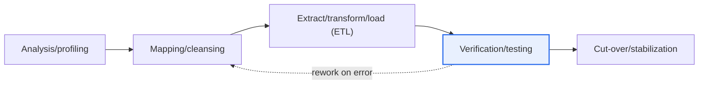
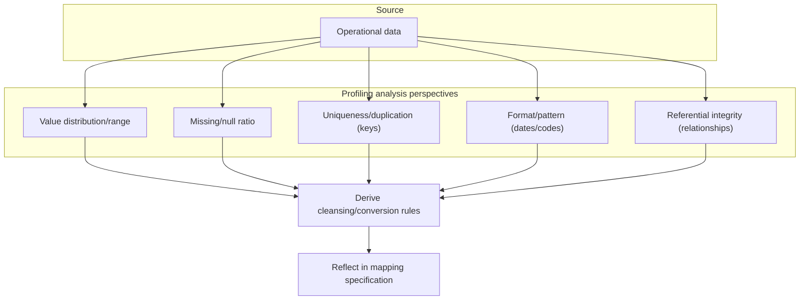

# Data Integration and Migration — Ensuring Integrity and Consistency

## 1. Overview

### A. Definition and Background
> **Data Migration** is a series of activities that move source data to a target system during processes such as replacing legacy systems, integrating systems, or transitioning to the cloud, and its success or failure hinges on **ensuring integrity and consistency** so that data is transferred accurately without loss or distortion. Because data is a company's core asset, migration errors directly damage service trust.

The fundamental reason data migration is trickier than other development work lies in its irreversibility: "**once you move something incorrectly, it is hard to undo, and that error continues to affect the service**." In new development, if a defect is found, you can fix the code and redeploy, but in migration, once the already-moved data begins to be used in operations, the time gap with the source widens, and recovery becomes impossible through simple re-migration. When moving large volumes of data accumulated over years into a new system structure, the data formats and rules (schema, code systems, encoding) of the source and target differ, so values are truncated or distorted, some are omitted, and the relationships among interconnected data easily break.

In particular, because relational data has a referencing structure, partial errors cascade. For example, if the Order data was moved but the linked Customer data was omitted, an "orphan record"—an order referencing a nonexistent customer—arises, and referential integrity breaks. Such data manifests belatedly after go-live in forms such as errors on inquiry screens or amounts diverging in batch aggregations. That is why migration must be not merely copying data but a systematic process of **verifying that data is accurate, complete, and mutually consistent** before and after the transfer.

Forcing go-live without such verification becomes a major cause of large-scale system failures. The fact that a significant portion of go-live delays and failures in large financial next-generation systems and public information systems stem from data-migration quality problems suggests that migration should be treated not as an incidental task late in a project but as an independent task with its own methodology and verification system.

### B. The Difference Between Integrity and Consistency
The two concepts are often confused but have different focuses. **Integrity** is a "**vertical**" quality—data being accurate, valid, and satisfying its rules (constraints) in itself—while **consistency** is a "**horizontal**" quality—data in multiple places agreeing with one another without contradiction. If integrity asks "is this single value correct?", consistency asks "do the source and target, or interconnected tables, not diverge from each other?"

The typical integrity violation is an error in the value itself: a negative number entered in an age column, a required NOT NULL value left empty, or a value not defined in the code domain being mixed in. A consistency violation, by contrast, is a case where each individual value keeps its rules but a contradiction arises in the relationships among data—for instance, 1 million source records ending up as only 998,000 in the target so the counts diverge, or the total amounts of the source and target differing. Migration verification is difficult because both axes must be upheld; looking only at integrity misses count omissions, and looking only at consistency misses incorrect values.

| Category | Integrity | Consistency |
|---|---|---|
| **Focus** | Accuracy/validity of the data itself | Agreement among data/no contradiction |
| **Direction** | Vertical (individual values/records) | Horizontal (source↔target, across tables) |
| **Example** | Age is not negative, required value exists, domain compliance | Source and target counts/totals match, references valid |
| **On violation** | Incorrect value/rule violation | Data mismatch/contradiction/orphan record |
| **Verification means** | Constraints/domain checks | Count/aggregate/checksum comparison |

## 2. Migration Procedure and Architecture

Migration typically goes through the stages of "analysis → mapping/cleansing → ETL → verification → cut-over/stabilization," and if verification finds errors, it returns to the mapping/cleansing stage and iterates. Because each stage is a precondition that determines the quality of the next stage, doing a preceding stage poorly comes back at several times the cost later.

In the **analysis/profiling** stage, you diagnose the actual state of the source data and finalize the migration scope. Because the documented schema of the source system often does not match the actually stored values (e.g., a string 'N/A' mixed into a documented date column), you must build the plan based on real data, not documents. The **mapping/cleansing** stage is the heart of the design, where you define the correspondence between source and target columns (1:1, 1:N, code conversion) and establish cleansing/conversion rules for the erroneous data discovered in profiling.

**ETL (Extract, Transform, Load)** is the execution stage that actually moves the data according to the defined rules. The larger the volume, the more you may combine an initial load—moving most data in advance before go-live—with an incremental (CDC, Change Data Capture) approach that catches up only the changes, in order to reduce total downtime. **Verification/testing** proceeds in multiple layers, as detailed below, and the final **cut-over/stabilization** is the segment where you hand the actual service over to the new system (cut-over) and monitor and stabilize early errors.

## 3. Diagnosing Data Values — Key Analytical Perspectives of Profiling

**Data Profiling**, which diagnoses the actual state of the source data before migration, is an activity that quantitatively grasps "what is dirty" before moving, providing the basis for cleansing/conversion plans. Skipping profiling leads to moving erroneous data as-is and discovering it belatedly in the verification stage, causing rework costs to explode. Profiling analyzes values from the following different perspectives.

**Value distribution/range analysis** looks at the minimum, maximum, and distribution of column values to find outliers and out-of-range values. For example, it checks whether 999 is mixed into an age column or whether negative numbers exist in an amount, filtering out domain-rule violations in advance. **Missing/null analysis** measures the ratio of NULL/empty values per column. If a column that must be required has a high missing rate, you cannot apply an integrity constraint after migration, so you must decide cleansing policies—default-value substitution, business confirmation—in advance.

**Uniqueness/duplication analysis** checks the duplication and uniqueness violations of primary keys and business keys. If a business-registration number that must logically be unique in the source is stored redundantly, loading fails when applying a unique constraint in the target, so merge/cleanup rules are needed. **Format/pattern analysis** examines the consistency of notation for dates ('2026-09-16' vs '20260916' vs '2026.9.16') or code systems to derive conversion rules. Finally, **referential-integrity analysis** confirms whether the relationships of data connected by foreign keys are actually valid—that is, whether the referenced target exists—to identify orphan records in advance.

In this way, profiling is the stage of "**honestly facing the source before moving it**," and the figures it yields (e.g., "customer-code missing rate 3.2%, order-customer orphan records 12,000") become the basis for cleansing/conversion rules and the verification baseline.

## 4. Migration Verification Testing Methods

Verification is the process of cross-checking at multiple levels whether the migrated data satisfies integrity and consistency. Because a single method alone misses certain types of errors, defense in depth is the principle. For example, matching only counts misses value distortion, and comparing only values misses relationship collapse.

| Method | Content | Error types caught |
|---|---|---|
| **Count verification** | Confirm source-target record counts match | Omitted/duplicate loads |
| **Value comparison** | Compare sample/full values (checksum/hash) | Value distortion/truncation/encoding errors |
| **Aggregate verification** | Match aggregates such as sums/averages | Partial omission/conversion errors |
| **Referential integrity** | Verify relationship/foreign-key validity | Orphan records/relationship collapse |
| **Business verification** | Confirm results with actual business scenarios | Anomalies from a business-rule perspective |

**Count verification** is the most basic yet powerful. It compares whether the record counts of the source table and target table match, and counting them separately by filter/join conditions pinpoints in which segment omissions occurred. **Value comparison** confirms whether individual values were transferred exactly; for large volumes where full comparison is burdensome, it efficiently achieves the effect of full verification by computing checksums (hashes such as MD5) per column/row and comparing whether the source and target hashes match. Because even a single character difference changes the hash, even minute truncation/encoding errors are detected.

**Aggregate verification** computes aggregates such as sums, averages, and counts separately in the source and target and compares them. Especially for data whose totals must be preserved from a business standpoint, like amounts and quantities, matching totals is strong evidence that there is no partial omission or duplication. **Referential-integrity verification** confirms whether data connected by foreign keys all have valid parents, rooting out orphan records. Finally, **business verification** goes beyond technical matching: it runs actual business scenarios (e.g., inquiring a specific customer's transaction history for the last 6 months, monthly closing settlement) so that the business staff visually confirm the results, filtering out data that is technically valid but business-wise odd.

## 5. Deep Dive — Practical Transition Strategies and Recent Trends

The practical challenge of migration converges on "**how to safely perform a near-zero-downtime transition**." For small scale, a Big-bang transition—briefly stopping the service and moving everything at once—is simple, but for 24-hour services or large volumes, the allowable downtime is short and a different approach is needed. Here, **CDC (Change Data Capture)**-based parallel operation, which catches up only the source's changes in real time after the initial load, is widely used. Reading the source DB's transaction logs (redo/binlog) and reflecting the changes to the target can shorten the pre-go-live downtime to minutes.

Another practical strategy is a **parallel run**. You run the new and old systems simultaneously for a period, compare the outputs of the two systems (e.g., daily closing reports), and once the results are confirmed to match, decommission the old system. This is a method commonly adopted in financial next-generation projects; it raises verification confidence at the trade-off of increased operating cost and duration. As cloud transitions have become common, managed migration services such as AWS DMS and GCP Database Migration Service provide CDC and schema conversion out of the box, and the "codification of data quality"—managing verification rules (assertions) as code with tools such as dbt and Great Expectations—is also spreading. However, because the detailed features of specific tools/versions keep changing, it is advisable to re-confirm via official documentation at the time of adoption.

Broadening the perspective, migration adjoins data governance and standardization. Using the migration as an opportunity to organize data standards (code systems, naming conventions) and clean up master data turns it into an occasion to raise data quality itself, beyond a mere transfer.

## 6. Considerations and Implications (Professional Engineer's Perspective)

1. **Verification determines the success or failure of migration.** More than the migration execution itself, post-migration integrity/consistency verification is the core; you must cross-verify count, value, aggregate, referential integrity, and business scenarios in multiple layers to avoid being biased toward one type and missing errors. Set the verification baseline quantitatively based on profiling figures.
2. **Rehearsals and rollback plans are not optional but mandatory.** Before the actual transition, repeatedly rehearse under conditions identical to production to check the procedures, elapsed time, and errors, and verify that it finishes within the designated downtime. Agree in advance on a rollback plan and rollback-decision criteria (go/no-go) to immediately revert if problems arise, controlling risk.
3. **Cleansing the source data must always come first.** Moving dirty data discovered in profiling without cleansing it transfers the problem as-is to the new system—"garbage in, garbage out." Because migration is itself an opportunity to raise data quality, include cleansing/standardization in the migration task.
4. **Consider irreversibility and audit trails.** Because migration is hard to undo, leave the mapping/conversion history—by what rules which values were converted how—as audit logs so that when problems arise later, cause tracing and accountability are possible.
5. **Manage the trade-off between performance/downtime and verification intensity.** Full verification has high confidence but takes a long time, while CDC/parallel run reduces downtime but raises operational complexity and cost. Choosing verification intensity and transition method in a balanced way, matched to the data's criticality, scale, and allowable downtime, is the professional engineer's area of judgment.

## References
- AWS Database Migration Service overview — https://aws.amazon.com/dms/
- Google Cloud Database Migration Service — https://cloud.google.com/database-migration
- Great Expectations (data-validation framework) — https://greatexpectations.io/

---

> **In one line**: The core of data migration is ensuring *integrity (accuracy of values) and consistency (agreement among data)*; you honestly diagnose the source through profiling, cross-verify in multiple layers—count, value (checksum), aggregate, referential integrity, and business scenarios—and transition safely with rehearsal, rollback, CDC, and parallel run.
