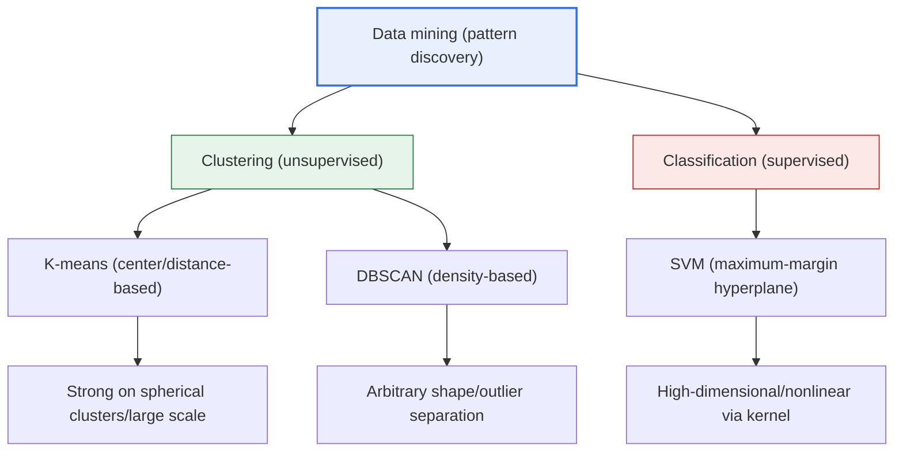
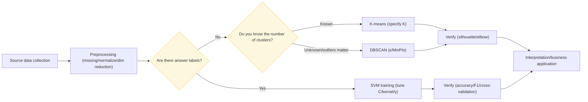

# Data Mining Techniques: K-means · DBSCAN · SVM

## 1. Overview

### A. Definition
> Data Mining is the core stage of the knowledge-discovery process (KDD, Knowledge Discovery in Databases) that **discovers meaningful patterns, rules, and knowledge that are hard for humans to know in advance** from large volumes of data; this topic covers the representative **clustering (K-means · DBSCAN)** and **classification (SVM)** algorithms.

The first gateway to understanding data mining is the axis of "**whether or not there are answers (labels)**." If the training data has answers attached, the model learns a boundary to mimic those answers—this is **Supervised Learning**; if it discovers structure from the similarity of the data alone without answers, it is **Unsupervised Learning**. K-means and DBSCAN are unsupervised clustering that groups similar things together without answers, while SVM is supervised classification that learns answers to draw a boundary separating two classes. Studying the three techniques as one topic lets you organize at a glance how algorithms diverge according to "whether there are answers, and how similarity is defined."

The second gateway is the "**definition of similarity**," which further diverges within clustering. K-means follows a **distance-based** mode of thinking—"things close to a cluster center go together"—while DBSCAN follows a **density-based** mode of thinking—"things densely gathered together go together." This fundamental difference determines the strengths and weaknesses of the two algorithms. K-means finds clusters that spread roundly around a center well but is vulnerable to elongated or crescent-shaped clusters and outliers, whereas DBSCAN distinguishes clusters of arbitrary shape together with outliers. In the end, which technique is right depends on the shape, scale, and purpose of the data, so from a professional engineer's perspective, the key is the discernment to judge "when to use what."

### B. Background and Necessity
Behind the rise of clustering and classification techniques lies data explosion. The customer, transaction, and log data a company accumulates are too vast to scan by eye to find rules, and it is hard to formulate analytical hypotheses in advance. Here, unsupervised clustering provides an **exploratory approach**—"let's first see into what clumps the data divides itself"—while supervised classification provides a **predictive approach**—"let's predict the class of new data based on answers we already know." For example, when a telecom carrier divides tens of millions of subscribers into marketing segments, there is no answer, so it uses clustering; when judging whether a credit-card transaction is legitimate or fraudulent, it uses classification that has learned past labels.

## 2. K-means Clustering

> A centroid-based clustering technique that divides data into a **predetermined K clusters and iteratively updates the centers to minimize the sum of squared errors (SSE, Sum of Squared Errors) between each cluster's center (centroid) and its member data**.

K-means's operation is intuitive and can be summarized as four iterative steps. First, randomly place K initial centers (initialization), assign each data point to the nearest center (assignment), recompute the centers as the mean coordinates of the assigned data (update), and repeat assignment and update until the centers no longer move (convergence). Because this process monotonically decreases SSE, it always converges, but the key limitation is that there is no guarantee its convergence point is the global optimum.

K-means's biggest weakness is **dependence on the initial centers and the need to specify K in advance**. If the initial centers are set poorly, it gets trapped in a local optimum and produces wrong clusters, and the analyst must decide K in advance. To alleviate this, **K-means++** initialization, which places the initial centers far apart from each other, is widely used, and today major libraries such as scikit-learn adopt it as the default. Representative practical techniques for finding an appropriate K are the **Elbow method**, which increases K and finds the point where the SSE decrease bends, and the **Silhouette coefficient**, which considers cluster cohesion and separation together.

K-means is computationally light at O(n·K·iterations) and easily scales to large data, so it is the clustering technique tried first in practice. For example, a campaign in e-commerce that divides customers into 5 segments (K=5) along three axes—purchase frequency, amount, recency (RFM)—to distinguish premium customers from churn-risk customers is typical. However, because K-means implicitly assumes each cluster is spherical and of similar size, performance drops on data with elongated clusters, clusters of greatly differing density, or mixed-in outliers, as the centers become distorted. It is also sensitive to the distance metric, so **feature-scale normalization (standardization)** is practically essential.

Seen in numbers, the understanding becomes clear. For example, if you use together—without normalization—an axis where monthly purchase amount is in the millions of won and an axis where purchase count is a single digit, the Euclidean distance essentially reflects only the amount axis and ignores the count information. So only after standardizing both axes to mean 0 and standard deviation 1 do the two features contribute to clustering in a balanced way. Also, plotting SSE while varying K over 3·4·5·6 usually shows an "elbow" at a certain K where the decrease sharply flattens; the practical procedure is to take this point as a candidate for the appropriate K and cross-check it with the Silhouette coefficient (usually good if 0.5 or above).

## 3. DBSCAN

> A density-based clustering technique that **forms clusters based on density (the number of neighboring points within a specific radius)**, expanding high-density regions into a single cluster and separating low-density points that belong nowhere as noise (outliers). DBSCAN stands for Density-Based Spatial Clustering of Applications with Noise.

DBSCAN operates with two parameters: the radius **ε (epsilon)** that defines the neighborhood, and the minimum number of neighbors **MinPts** required to become a core point. If a point has at least MinPts points within its ε radius, it is regarded as a **core point**, and its neighbors are absorbed into the same cluster, expanding the cluster in a chain. A point that is a neighbor of a core point but is not itself a core point is a **border point**, and a point that is not a neighbor of any core point is classified as **noise**. Because it keeps extending as long as density is connected, it naturally finds clusters of **arbitrary shape**, such as crescents or spirals.

DBSCAN's strengths can be summarized in three points. First, the number of clusters is automatically determined from the data without needing to specify K in advance. Second, because it filters outliers as noise without separate handling, it is used directly for **anomaly detection**. Third, it captures non-convex arbitrary shapes. In practice, it is used to automatically derive dense commercial districts from GPS coordinates, or to segment objects and remove noise from LiDAR point clouds. For example, grouping delivery-order locations with DBSCAN automatically reveals dense delivery zones without knowing K.

On the other hand, DBSCAN's weakness is **parameter sensitivity and density variance**. If ε and MinPts are set poorly, clusters lump into one or everything becomes noise, and if clusters of greatly differing density are mixed within one dataset, it is hard to capture them all with a single ε. To alleviate this problem, **HDBSCAN** (Hierarchical DBSCAN), which reflects a density-hierarchy structure, has been proposed and its practical use is growing. Also, in high-dimensional data, the concept of distance is diluted by the "curse of dimensionality," reducing the utility of density-based approaches.

A widely used practical technique for setting ε is the **k-distance plot**. If you compute, for each point, the distance to its k-th nearest neighbor and sort them in ascending order, most points are gentle and then a "knee" appears where they sharply spike in the noise segment; the distance corresponding to that knee is taken as an ε candidate. MinPts usually starts at roughly twice the data dimensionality (e.g., about 4 for 2 dimensions) and is adjusted. In this way, DBSCAN pays a different cost—ε·MinPts tuning—instead of specifying K, and in return gains the ability, which K-means lacks, to find arbitrary-shape clusters and separate outliers.

## 4. SVM (Support Vector Machine)

> A supervised classification technique that finds the **optimal hyperplane** separating two classes, while **maximizing the margin**—the gap to the nearest data points (support vectors)—to improve generalization performance.

The reason SVM finds not just any boundary separating the two classes but specifically the "maximum-margin" boundary is **generalization performance**. The farther the boundary is from the training data and the larger the room (margin), the less new unseen data crosses the boundary even if it shifts a little, reducing misclassification. What determines this boundary is not the entire dataset but only a small number of points nearest the boundary—the **support vectors**—which is both the elegance of SVM and the source of its efficiency. Because real data is not perfectly separable, SVM uses a **soft margin** that allows some misclassification but controls its degree with the hyperparameter **C**. A large C strongly penalizes misclassification, narrowing the margin, while a small C widens the margin but is lenient about misclassification.

Data that cannot be separated linearly is handled with the **kernel trick**. When data tangled in the original space is mapped to a high-dimensional feature space, it becomes separable by a linear hyperplane, and the key is to obtain that effect using only a kernel function (inner product) without actually computing the high-dimensional coordinates. Representatively, the radial basis function—the **RBF kernel**—flexibly creates nonlinear boundaries and is frequently used as a practical default; polynomial and sigmoid kernels are also used. Tuning γ (gamma), which sets RBF's width, together with the aforementioned C (grid search/cross-validation) is the heart of practical SVM.

SVM is especially powerful on **high-dimensional, small-scale data** where the number of features exceeds the number of samples. It long showed strong performance in classifying cancer status from gene-expression data (thousands of genes versus hundreds of samples) or separating text into spam/legitimate. It was one of the strongest classifiers of the pre-deep-learning era, with the advantages of a solid theoretical basis (structural risk minimization) and relative robustness to overfitting. However, its limitations are that training cost grows sharply once samples exceed hundreds of thousands, it does not directly give probability outputs (requiring separate calibration), and tuning the kernel, C, and γ is labor-intensive.

Because SVM is originally a binary classifier separating two classes, when handling three or more classes it combines multiple binary classifiers via the **One-vs-Rest** or **One-vs-One** strategy. There is also **SVR (Support Vector Regression)**, which extends it to regression problems, replacing the margin concept with a tolerance for error (ε-tube) to predict continuous values. In this way, SVM is accurately understood not as a single algorithm but as a family sharing the idea of margin maximization, and the degrees of freedom in kernel selection and hyperparameter tuning are both its flexibility and its operational burden.

## 5. Comparison

The differences among the three techniques diverge not merely as a list of table items but inevitably along two axes: "**the presence of answers and the definition of similarity**." K-means and DBSCAN are alike in having no answers, but they show opposite tendencies in outlier handling and cluster shape depending on whether they view similarity as distance or density. SVM is on a different level from the former two in that it learns answers outright; it does not create clusters but draws boundaries for already-defined classes. Therefore, the three questions "Do you know the number of clusters? Must you filter outliers? Do you have answer labels?" become the decision tree for technique selection.

| Category | K-means | DBSCAN | SVM |
|---|---|---|---|
| **Learning type** | Unsupervised (clustering) | Unsupervised (clustering) | Supervised (classification) |
| **Key criterion** | Distance to center (SSE) | Density (ε·MinPts) | Maximum-margin hyperplane |
| **Number of clusters/classes** | K specified in advance | Automatically determined | Given by labels |
| **Outliers** | Sensitive (center distortion) | Automatically separated as noise | Absorbed via soft margin (C) |
| **Cluster shape** | Spherical assumption | Arbitrary shape | Nonlinear boundary via kernel |
| **Main parameters** | K, initialization | ε, MinPts | C, kernel, γ |
| **Strength area** | Large-scale, fast | Anomaly detection, arbitrary shape | High-dimensional, small-scale |
| **Representative weakness** | Sensitive to initial value/K | Density variance, high dimensions | Slow training on large volumes |

Below is a procedure diagram showing how the three techniques are actually selected and applied in an analysis pipeline. After cleansing and normalizing the raw data, it branches according to the purpose and the presence of labels, and the results are always verified with quantitative metrics.

## 6. Deep Dive: Practical Application and Recent Trends

In practice, these three techniques are combined as **one stage of a pipeline** rather than used alone. A representative flow is "first grasp the data structure with unsupervised clustering → use the obtained cluster labels as features or remove outliers → build a prediction model with supervised classification." For example, in financial fraud detection, DBSCAN or density-based anomaly detection first filters out obvious noise, and then an SVM or tree-based classifier is trained on the remaining data to raise precision. In manufacturing quality control, sensor logs are divided into normal-operation-pattern clusters with K-means, and then observations far from any cluster are alarmed as anomaly signals.

The latest trends in technique development also deserve mention. First, **HDBSCAN**, which complements DBSCAN's density-variance weakness, has spread via libraries (hdbscan, built into scikit-learn 1.3+) and is establishing itself as density clustering with low parameter sensitivity. Second, for high-dimensional/unstructured data, deep clustering—**learning a low-dimensional representation with an autoencoder/embedding and then applying K-means**—has become standard, rather than clustering the raw data directly. Third, SVM has ceded ground to deep learning and gradient boosting on very large data, but it remains an efficient option in bio/text domains with few samples and many features, and in lightweight embedded environments. In a professional engineer's answer, it is effective to maintain the perspective that "there is no universal algorithm (No Free Lunch), and the essence is technique selection matched to data characteristics and verification."

## 7. Considerations and Implications

1. **Data-characteristic-based selection comes first.** If you know the number of clusters and they are largely round, K-means is suitable; if you do not know the number of clusters or need arbitrary shapes/outlier detection, DBSCAN; if you have answer labels and a high-dimensional classification with clear boundaries, SVM. Approach it as "which assumptions fit this problem" rather than "which technique is best."

2. **Preprocessing and normalization determine performance.** Because all three techniques are based on distance/inner product, if feature scales differ, the axis with larger values dominates the result. Standardization (z-score), dimensionality reduction (PCA), and missing-value handling are as important as algorithm selection, and feature selection to alleviate the curse of dimensionality is essential in high dimensions especially.

3. **Results must always be backed by quantitative and qualitative verification.** For clustering, confirm the appropriate clusters with the silhouette coefficient/elbow and validate soundness with domain experts' interpretation; for classification, guard against overfitting with precision, recall, and F1 in addition to accuracy, plus cross-validation. Do not rely on a single metric or a single run.

4. **Secure robustness through ensembles and combination.** Rather than relying on a single technique, use clustering results as input features for classification, or cross-check the results of multiple algorithms to raise confidence. A pipeline combining unsupervised (structure discovery) and supervised (prediction) is the practical standard.

5. **Consider the trade-off between interpretability and operational cost.** SVM's kernel decisions are hard to interpret, K-means's K setting can be arbitrary, and DBSCAN incurs parameter-tuning cost. In regulated/audited domains, you must select techniques by evaluating not only accuracy but also explainability and reproducibility.

## References

- scikit-learn User Guide — Clustering (K-means · DBSCAN): https://scikit-learn.org/stable/modules/clustering.html
- scikit-learn User Guide — Support Vector Machines: https://scikit-learn.org/stable/modules/svm.html
- HDBSCAN documentation: https://hdbscan.readthedocs.io/

---

> **In one line**: K-means (center/distance-based) and DBSCAN (density-based) are unsupervised clustering without answers, and SVM (maximum-margin hyperplane) is supervised classification that learns answers; the key is to select them according to the data's shape, number of clusters, outliers, and presence of labels, and to raise robustness through preprocessing, verification, and ensembles.
