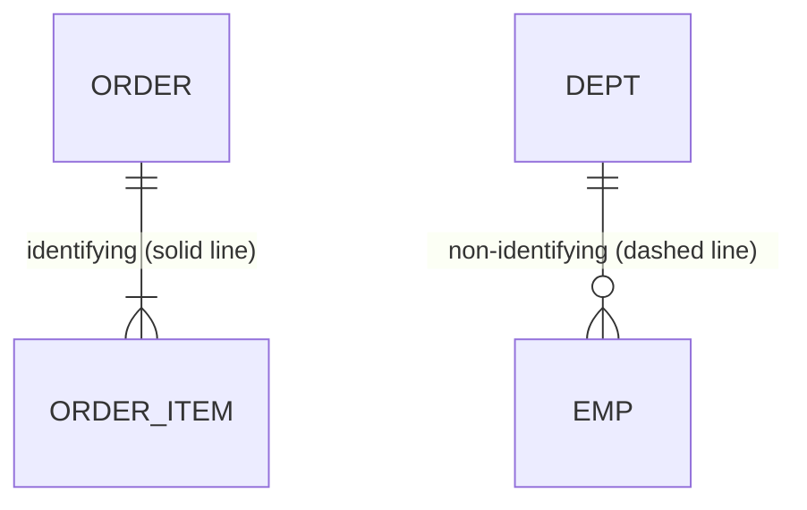

# RDBMS Data Modeling (Identifying vs. Non-Identifying Relationships)

## 1. Overview

### A. Definition
> The process of **abstracting and structuring** real-world business and data into a relational DB structure so as to ensure the data's **integrity, consistency, and reusability**.

Data modeling is not merely drawing tables but the work of embedding business rules into the data structure so that **incorrect data cannot enter in the first place**. Because structure is itself the rule, modeling quality determines the complexity, performance, and maintainability of the subsequent application.

### B. Tasks Performed at Each Modeling Stage
Modeling proceeds through three stages from an abstract perspective to a concrete implementation: **conceptual → logical → physical**. The reason for dividing into these stages is that reusability and portability improve when you first capture the essence of the business without being bound by a specific DBMS's constraints, and then concretize it progressively.

| Stage | Tasks performed | Output |
|---|---|---|
| **Conceptual** | Identify core entities/relationships, reflect business rules (DBMS-independent) | Conceptual ERD |
| **Logical** | Define attributes/identifiers, **normalization**, set relationships/cardinality | Logical ERD |
| **Physical** | Reflect DBMS characteristics (data types/indexes/partitions/denormalization) | Table schema |

The conceptual stage answers "what do we manage," the logical stage refines data into a structure free of anomalies through normalization, and only at the physical stage do you apply indexes, partitions, and denormalization considering performance and storage characteristics.

## 2. Identifying vs. Non-Identifying Relationships

In relational modeling, when a parent's primary key (PK) is inherited by the child, it splits according to **whether that key is used as part of the child's PK (identifying) or only as an ordinary foreign key (non-identifying)**. This choice is not a matter of notation but of how you define the **existence dependency of the two entities**.

### A. Identifying Relationship
A relationship in which the parent PK is included in the child PK, so that the child **cannot exist at all without the parent**. For example, an `Order Item` is meaningful only if it belongs to some `Order`, so the PK of `Order Item` becomes a composite key including the parent key, like `(order number + item sequence)`. It has the advantage that the parent key keeps propagating to the child, making join conditions natural, but the disadvantage that **the PK of lower tables keeps swelling** if inheritance continues through many levels. In an ERD, it is denoted with a solid line.

### B. Non-Identifying Relationship
A relationship in which the parent PK is inherited only as an **ordinary attribute (FK)** of the child, and the child has its own PK. It is used when the child can **exist independently** of the parent. For example, an `Employee` has its own `employee number` as PK and references `department number` only as an FK, so the employee record exists independently even if the department is unassigned or changed. It has the advantage that the PK stays simple, and in an ERD it is denoted with a dashed line.

| Category | Identifying | Non-Identifying |
|---|---|---|
| **Concept** | Parent PK inherited **as part of the child PK** | Parent PK inherited **as an ordinary FK of the child** |
| **Notation (ERD)** | Solid line | Dashed line |
| **Dependency** | Strong dependency — child impossible without parent | Weak dependency — child can exist independently |
| **PK composition** | Includes parent key (composite key) | Child has its own PK |
| **Example** | Order ↔ Order Item | Department ↔ Employee |
| **Impact** | Simplifies joins, risk of PK swelling | Simple PK, uses FK when joining |

The selection criterion is ultimately **whether the child holds up without the parent in business terms**. The principle is to choose identifying if it cannot hold up (strong dependency) and non-identifying if it can (weak dependency); indiscriminate overuse of identifying relationships causes lower-table PK swelling and degraded join performance.

## 3. Considerations in Data Modeling

Normalization and denormalization are the representative tools for coordinating the **trade-off between integrity and performance**. Normalization removes duplication to prevent anomalies (data inconsistency on insert/update/delete) but may degrade query performance as joins increase, while denormalization allows intentional duplication to speed up queries but increases the burden of managing update integrity.

| Category | Considerations |
|---|---|
| **Normalization** | Remove anomalies (insert/update/delete), minimize duplication via 1NF~BCNF |
| **Denormalization** | Allow intentional duplication in frequently queried segments, **balance** with normalization |
| **Integrity** | Enforce entity/referential/domain/business integrity as constraints |
| **Key design** | Surrogate key vs. natural key, identifier stability/immutability |
| **Standardization/history** | Naming standards, history/change management, securing extensibility |

In key design, using a surrogate key (e.g., an auto-increment ID) keeps relationships stable even if the natural key changes, but because it has no business meaning, a separate uniqueness constraint is needed. Choosing a stable, unchanging identifier becomes the foundation of join and referential integrity.

## 4. Considerations and Implications
The practical design principle is to **first secure integrity through normalization, and then apply denormalization selectively only in segments where actual performance requirements are confirmed**. Denormalizing for performance from the start only increases integrity risk. Identifying/non-identifying relationships must likewise be judged by comprehensively considering dependency, PK propagation, and join performance, and one must guard against habitually using only one side. Furthermore, in large-scale/distributed environments, the direction from a professional engineer's perspective is to scale horizontally through **partitioning/sharding** beyond the limits of a single RDBMS, or to extend to a polyglot design that **mixes in NoSQL** for unstructured/very-large-volume areas.

---

> **In one line**: Data modeling proceeds through the stages *conceptual → logical → physical*; an identifying relationship inherits the parent PK into the child PK (strong dependency, solid line) and a non-identifying relationship uses an ordinary FK (weak dependency, dashed line), chosen according to existence dependency, and normalization, denormalization, integrity, and key design are handled in a balanced way from a trade-off perspective.
