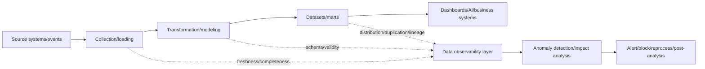
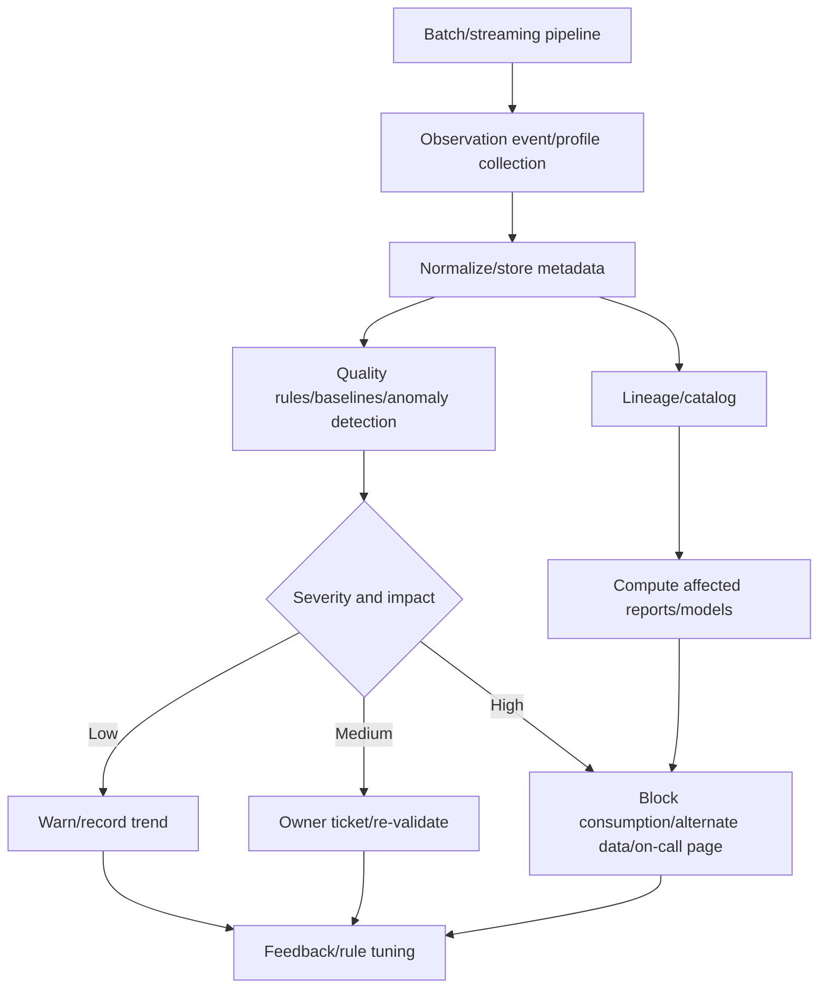

# Data Observability and Data Reliability Management

## 1. Overview

> **Definition**: Data Observability is the operational capability to continuously infer the current state of data pipelines and datasets through signals such as freshness, completeness, validity, consistency, distribution, and lineage, and, when anomalies occur, to find the scope of impact and the cause and recover.

As data warehouses, data lakes, lakehouses, and real-time streaming have spread, data has become not an asset that is stored once and done but a product that is continuously created, transformed, and consumed.
In application operations, we monitor whether a service is alive, whether responses are slow, or whether errors have increased, but the fact that a data pipeline terminated normally does not guarantee its result is usable for analysis.
For example, even if a batch job finished successfully, a time-zone error in the source system can cause the previous day's data to be loaded in duplicate, or a schema change can cause the entire sales column to become null.

The reason this problem is hard to solve with simple data-quality checks alone is that the state of data changes with time and context.
The row counts of yesterday and today may differ, and a higher-than-usual missing rate during a specific campaign period may be normal.
Therefore, observability must not merely indicate the pass/fail of static rules but detect anomalies based on expected ranges and lineage and explain even the business impact.

From a professional engineer's perspective, data observability is not a tool-adoption problem but a governance problem of managing data reliability (Data Reliability) at a service level.
Data owners, platform operators, analysts, and privacy officers must agree on who is responsible for which quality signals, and design operational procedures from failure detection to reprocessing and post-incident analysis.

### 1.1 Background and Necessity

First, because of the distribution and complexity of data pipelines.
When one metric passes through API collection, a message queue, streaming processing, object storage, a transformation model, and a data mart, it is hard to know at which stage a problem occurred from simple success/failure logs alone.
If, upon discovering an anomaly in a downstream dashboard in a multi-stage pipeline, you cannot trace back to the upstream source, failure-recovery time grows long.

Second, because the volatility of data has increased.
Schema and distribution change according to source-application deployments, policy changes, seasonality, events, and shifts in user behavior.
Using fixed thresholds alone can mistake normal variation for a failure or miss slowly progressing quality degradation.
Data observability reduces such false positives and false negatives by using temporal context and business expectations together.

Third, because the cost of failure in AI and business decision-making has grown.
Missing training data or distribution shifts affect model performance and fairness, and errors in financial/regulatory reporting data lead to legal and reputational risks.
If you verify only the results of dashboards and models without confirming whether the data is trustworthy, you cannot find the cause of a problem, so the data itself must be included as an operational target.

## 2. Constituent Concepts of Data Observability

When explaining data observability, it helps to use five core questions.
First, freshness (Freshness), asking whether the data arrived on time.
Second, completeness (Completeness), examining whether the needed data all exists.
Third, validity (Validity), confirming whether values conform to business rules and types.
Fourth, distribution stability (Distribution), examining whether distributions by time/organization/source have abnormally changed compared to usual.
Fifth, lineage (Lineage), showing where this data came from and which consumers it affects.

### 2.1 Freshness and Timeliness

Freshness means the difference between the time the data was last updated (or the event-occurrence time) and the current time.
For a daily sales batch, data should arrive within a certain time after the previous day's closing, and for real-time transactions, latency may be managed with second/minute-level targets.
Because simply looking at a file's modification time can miss a situation where old data was retransmitted from the source, event time and processing time must be recorded separately.

Freshness rules differ according to business criticality.
For statutory reporting data, completeness at the closing point is important, while for click events of a recommendation service, a continuous flow may matter more than latency.
Therefore, rather than applying the same threshold to all pipelines, agree on the SLO and allowable latency per data product.

### 2.2 Completeness and Validity

Completeness is a quality axis that confirms whether expected records/fields/partitions are not missing.
Row-count comparison, null ratio of required columns, existence of partitions per date, and count comparison between source and destination are representative methods.
However, because even matching row counts may hide duplicated identical records, key-duplication rate and uniqueness must also be examined together.

Validity evaluates whether values satisfy the defined types, domains, and business rules.
Rules such as whether an amount is a number and negatives are disallowed, whether a country code is in the allowed list, and whether an end date is not earlier than a start date belong here.
For validity checks, whether to halt the entire pipeline, quarantine only problematic rows, or continue after a warning must be decided according to the data product's risk grade.

### 2.3 Distribution and Volume Change

Volume is the change in the number and size of records ingested/processed over a period.
If the average order volume suddenly halves, it may be a source failure, but it may also be a sales-policy change or a holiday effect.
Therefore, design volume alerts with a baseline that considers day-of-week, time-of-day, and seasonality rather than a single absolute value.

Distribution observation tracks statistical characteristics of specific columns, such as the mean, quantiles, min/max, number of distinct values, and null ratio.
For example, an originally diverse status value converging to a single value can be a stronger signal of a schema-mapping error than a slight change in the average customer age.
Collect distribution statistics at an aggregate level that does not expose raw personal information, and manage sensitive attributes' access permissions and retention periods separately.

### 2.4 Schema and Lineage

Schema observation detects column additions/deletions/renames/type changes/nullability changes.
A schema change is technically a successful deployment but can change the meaning of downstream queries, so compatibility policies and change-approval procedures must be connected to data contracts.
Because platform reliability drops if downstream consumers learn of a change only after discovering it, operate advance notification and contract testing.

Lineage expresses from which source data started, through what jobs and transformations it passed, and how it arrived at the current tables and reports.
With lineage, you can compute the affected dashboards/models/organizations when a failure occurs and perform impact analysis before a change.
OpenLineage is an open approach to collecting and exchanging the execution metadata of jobs and datasets, and can be used to connect lineage information across different tools.

## 3. Data Observability Architecture and Processing Flow

The data observability layer consists of collection targets, a profiler, a rule engine, a metadata store, alerting/impact analysis, and response automation.
Separating pipeline code and observability code makes it easy to swap tools, but checks with business meaning are better defined declaratively so that the data-product owner can manage them.

### 3.1 Collection and Profiling

An observation event includes the dataset identifier, pipeline run ID, schema version, processing start/end times, record count, quality-check results, and lineage identifier.
Without a run ID, it is hard to distinguish retries from duplicate runs, and combining different batch results can produce incorrect alerts.
For streaming, record per-window latency, throughput, and the ratio of late-arriving events together.

Profiling computes statistical characteristics of the data to summarize its current state.
Rather than copying all raw values to the observation platform, transmitting only purpose-appropriate metadata—counts, null ratios, hashed schema, distribution summaries—is safer in terms of personal information and cost.
Set profiling frequency to match the data's change cadence and risk, and expensive full checks can be sampled periodically.

### 3.2 Rule Engine and Baseline

The rule engine runs explicit data-quality rules and statistics-based anomaly detection together.
Deterministic rules like `an order ID must be unique` have high reproducibility but are limited in finding new types of anomalies.
Conversely, baseline-based detection can reflect past time-of-day/seasonality but is hard to explain and requires sufficient normal history.

Therefore, rule results should leave the observed value, expected range, baseline period, severity, and rationale together, rather than a simple pass/fail.
When the data owner reviews an alert and classifies whether it is an actual failure or a business change, the quality of the baseline also improves.
Even if thresholds are learned automatically, blocking decisions for important financial/regulatory data must leave an approvable policy and human review.

### 3.3 Alerting and Response Automation

Alerting all anomalies identically causes alert fatigue.
Compute severity by combining the number of affected consumers, business criticality, data delay, error duration, and personal-information/regulatory relevance, and group duplicate alerts into a single incident.
Send low severity to a trend dashboard and connect high severity to a responder page and consumption block.

Automated responses start with reversible and safe operations.
Retrying failed partitions, providing cached last-known-good data, quarantining problematic records, and pausing downstream jobs are representative.
Operations that automatically delete source data or correct it without approval require separate approval and audit logs, because a wrong recovery can damage the original evidence.

## 4. Key Metrics and Service Levels

To operate data reliability, you must connect technical metrics and business metrics.
Even if the pipeline success rate alone is high, if the data is late or wrong, consumers feel it has failed, so include dataset-level freshness, quality, and impact scope in the SLO.

|Category|Representative metric|Interpretation and operational question|
|---|---|---|
|Freshness|Last-update lag, event lag p95|Is it usable within the promised time?|
|Completeness|Required-column null rate, missing-partition ratio|Did the needed data arrive without omission?|
|Validity|Domain-violation rate, type-error rate|Do values keep the business rules and contract?|
|Consistency|Source-destination count difference, referential-integrity violation|Do different datasets state the same fact?|
|Distribution|Baseline deviation of mean/quantile/distinct/volume|Is the data-generation process the same as usual?|
|Lineage|Number of affected assets, ratio of unconnected datasets|Can you trace the source and downstream of a problem?|
|Response|Detection time, recovery time, recurrence rate|How quickly do you notice and fix anomalies?|

For example, if you set the SLO of a sales dashboard updated by 7 a.m. daily, you do not merely record batch success or failure.
Define together the update rate before 7 a.m., the null rate of core sales columns, the allowable volume change versus the previous day, and the responder-awareness time and recovery time after an error.
Separating these metrics according to the criticality of the data product reduces the problem of the platform team applying excessive control to all data.

## 5. Comparison of Data Observability, Data Quality, and Pipeline Monitoring

Data quality is an attribute/activity that evaluates whether data satisfies requirements, and pipeline monitoring is an operational activity that watches whether jobs execute and use resources.
Data observability includes both of these while being closer to a higher-level operational capability that connects cause, impact, and response using temporal change and lineage.
Building only one of the three leaves blind spots.

|Category|Data quality management|Pipeline monitoring|Data observability|
|---|---|---|---|
|Main question|Do values satisfy requirements?|Did the job execute and finish?|Why is it anomalous and whom does it affect?|
|Target|Records/columns/rules|Job execution/resources/error logs|Data/pipeline/lineage/consumers|
|Time perspective|Quality at check time|Execution status/latency|Baseline/change/cumulative impact|
|Response|Failure report/quarantine|Retry/operational alert|Cause tracing/impact blocking/recovery/learning|
|Limitation|Lacks operational context and cause|Misses data meaning and value errors|Requires metadata quality and cost management|

For example, consider a case where a transformation job terminated normally but one column of the input file is all empty strings.
Pipeline monitoring can report success, and with only a single null check the problem can be found.
Data observability additionally finds the financial dashboard and recommendation model using that column, notifies the responsible person of the impact scope, and, if necessary, blocks consumption.

## 6. Application Procedure

### 6.1 Data Products and Criticality Classification

The first step is not to make a list of tables but to define data products based on consumers and decisions.
Monthly financial reporting, customer notifications, recommendation models, and an internal exploration sandbox have different allowable latency and error costs.
Record per-product owner, consumers, update cadence, sensitivity, retention period, and failover means in the catalog.

Once criticality classification is done, rather than applying the same checks to all columns, collect minimal signals starting from core datasets.
Apply freshness/completeness/validity/lineage first to core data, and after stabilization, expand distribution and cost optimization.
Adopting it in phases this way prevents observability itself from becoming another large-scale failure source of the data platform.

### 6.2 Defining Expected State and Data Contracts

A data contract is not a document that fixes the schema alone but includes the meaning, quality, change notification, and responsibility agreed upon by producer and consumer.
The contract specifies the meaning and units of columns, allowable nulls, update cadence, keys, valid ranges, compatibility rules, and quality SLOs.
Only with a contract do observability rules reflect business expectations, and alerts do not stop at simple number comparisons.

Establish a bidirectional procedure in which the producer validates the contract and the consumer confirms changes in advance.
Backward-compatible changes can be deployed automatically, but column deletions or meaning changes proceed after impact analysis and approval.
Do not treat a contract violation as an unconditional pipeline failure; distinguish block/quarantine/warn policies according to consumer criticality and error type.

### 6.3 Detection, Action, and Post-Incident Analysis

Define the operational procedure as a cycle of detection, classification, cause analysis, response, verification, and post-incident analysis.
On detection, secure the run ID, the last-normal point, and the change history together, and compute the affected datasets and reports through lineage.
The responsible person classifies whether it is a source failure, a schema change, a transformation-logic bug, or a normal business change.

After action, re-run the same quality checks to verify that the recovery actually restored the consumer state.
Manage idempotency keys and processing segments so that reprocessing does not create duplicates, and record the original, corrector, correction reason, and time on corrected data.
In post-incident analysis, register detection misses, alert delays, wrong thresholds, ownership ambiguity, and recurrence-prevention items in the improvement backlog.

## 7. Industry Application Cases

### 7.1 Financial/Financial-Reporting Data

For financial institutions or corporate finance teams, consistency among the transaction source, the accounting core, the data warehouse, and the reporting mart is important.
Observe the daily transaction count and amount total, currency unit, base date, and duplicate transactions, and operate a data-freshness SLO at the closing point.
When a contract violation occurs in a core reporting table, a suitable approach is to automatically block report generation and deliver evidence to the responsible accountant/data owner.

Here, a simple row-count check does not reflect the business meaning of cancellations, refunds, and split transactions.
Model the source system's business rules and accounting standards as quality rules, and preserve the reconciliation results and change history together.
Observability is not a substitute for financial controls but a technical foundation for quickly confirming whether controls are performed and tracing exceptions.

### 7.2 Recommendation/Personalization Models

In a recommendation system, if user events are late or missing from a specific channel, the distribution of model inputs changes, affecting recommendation quality and fairness.
You must observe together event-collection latency, per-user contribution caps, the null rate of major features, the ratio of new/existing users, and the training/serving distribution difference.
Because investigating data only after model performance drops makes cause distinction hard, connect feature lineage and training-data versions.

For profiling events containing personal information, prioritize aggregation and pseudonymization that do not expose raw identifiers.
Evaluate whether distribution statistics could re-identify a minority group, and restrict the access permissions and retention periods of observation metadata.
The purpose of data observability is not to collect more personal information but to judge reliability with minimal metadata.

### 7.3 Manufacturing/IoT Streaming

Factory sensor data may arrive late or intermittently drop out depending on per-device collection cadence and network conditions.
Observe per-sensor collection rate, the difference between event time and processing time, missing segments, the physical range of values, and the timing of device firmware changes.
Because a sudden freezing of values may be an equipment failure or a sensor-connection problem, analyze data lineage and device-status events together.

In real-time operations, halting the stream for every anomaly can cause a greater loss to production.
Quarantine values outside safety thresholds and use substitute values, but a policy of marking the quarantine fact in the training data of the predictive-maintenance model is needed.
Observability design must agree with field operators on the priorities of latency, accuracy, and safety.

## 8. Deep Dive: Combining Data Contracts, Lineage, and AI Operations

Recently, data platforms are evolving in a direction that does not leave data-quality checks only as a batch job at the last stage of the pipeline, but computes the impact of changes in advance through producer-consumer contracts and lineage events.
When a schema changes, it automatically shows which models and reports are affected, and when a quality SLO breaks, it goes beyond a simple alert to restrict consumption or switch to alternate data.
This structure is highly effective when combined with Data Mesh's domain ownership, the responsibility of data products, and the platform's common standards.

As generative AI and natural-language analysis spread, the data-observability metadata itself becomes a query target.
When a user asks "why did sales decrease this week?", the answering system must not merely show values but present the update delay, source change, quality alerts, and lineage as the basis.
To keep AI from confirming its inferred cause as if it were fact, distinguish observation events from inference results, and provide links and run IDs that a person can reproduce.

In a professional engineer's answer, presenting data observability in connection with data quality, DataOps, data contracts, data lineage, and MLOps increases systematicity.
However, the more observability tools there are, the more metadata standards, event duplication, storage cost, personal-information exposure, and ownership ambiguity also grow.
Therefore, common identifiers, the principle of minimal collection, per-data-product SLOs, and the approval boundaries of automation must be designed together.

## 9. Considerations and Implications

### 9.1 Business-SLO-Centered Design

Rather than collecting many technical metrics, you must first decide when and what quality the data consumer needs.
Applying the same rules to products with different priorities of freshness and accuracy increases cost and alert fatigue.
Set per-data-product SLOs and error budgets, and improve the pipeline structure and ownership for items that are repeatedly violated.

### 9.2 Cause/Impact Analyzability

If only alerts sound without lineage and run IDs, the operator must manually check multiple systems.
Connect the source, transformation jobs, versions, consumers, and last-normal point in the metadata to reduce the mean recovery time.
When lineage is incomplete, do not conclude "no impact"; a conservative policy of marking the unconfirmed scope is needed.

### 9.3 Personal Information and Security

The data-observability platform must use minimal profiles and aggregation to judge state without replicating raw data.
Because column names, value statistics, and even sample data can contain personal information or trade secrets, apply masking, role-based access control, encryption, and retention periods.
Audit access to the observability logs themselves, and clearly define the data-movement boundaries among development, operations, and external tools.

### 9.4 Safe Boundaries of Automation

Automatic retries and quarantine reduce recovery time but carry the risk of a wrong rule blocking normal business.
High-impact actions like block/substitute/correct must include approval, rollback, phased application, and post-verification.
Use AI-based anomaly detection as an auxiliary judgment, and let people confirm the evidence of the cause and action.

### 9.5 Cost and Scalability

Profiling every value of every column at every run can make observability cost exceed data-processing cost.
Design check frequency, sampling, aggregate metadata, and retention periods according to data criticality, and limit high-cardinality tags.
When discarding signals to reduce cost, perform an impact assessment on whether the minimal information needed for failure diagnosis remains.

### 9.6 Organization and Operational Culture

Treating quality alerts only as the platform team's failure keeps producers from participating in contract and cause improvement.
Define a RACI for data-product owners and platform operators, and operate alert response and post-incident analysis as a shared responsibility.
When linking quality metrics to evaluation/rewards, you must also recognize improvement activities and transparent exception records so that data defects are not hidden.

### 9.7 Standards and Related Technologies

Applying common identifiers to the data catalog, data contracts, lineage events, quality rules, and pipeline-execution metadata lets you connect observation information even across different tools.
Consider together a lineage standard like OpenLineage, DataOps/MLOps pipelines, and access-control/personal-information-protection systems.
Rather than being locked into a specific product's dashboard, keep metadata in a portable form and secure backend replaceability and reproducibility.

## References

1. OpenLineage, "OpenLineage Documentation," https://openlineage.io/docs/
2. OpenLineage, "About OpenLineage," https://openlineage.io/
3. Great Expectations, "What is GX Core?", https://docs.greatexpectations.io/docs/core/introduction/
4. Apache Airflow Documentation, "Best Practices," https://airflow.apache.org/docs/apache-airflow/stable/best-practices.html
5. dbt Labs, "Data tests," https://docs.getdbt.com/docs/build/data-tests

---

> **In one line**: Data observability is a system that continuously collects freshness, completeness, validity, distribution, and lineage signals to detect data anomalies early and connect them all the way to impact analysis, recovery, and learning, thereby operating the reliability of data products.
