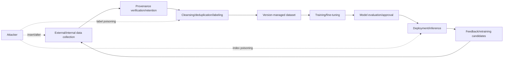
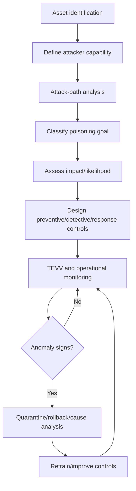

# AI Training-Data Poisoning Attacks (Data Poisoning) and Data-Integrity Defense

## 1. Overview

> **Definition:** AI training-data poisoning (Data Poisoning) is an adversarial attack in which an attacker intentionally inserts, alters, or deletes the data—or its metadata—used for pretraining, fine-tuning, embedding, or search indexing, in order to make a model's performance, fairness, safety, or behavior under specific conditions favorable to the attacker.

Recent AI systems depend more broadly on the data pipeline and external knowledge sources than on the model itself. Public web data, user feedback, internal documents, labeling-vendor outputs, open models and datasets, and vector indexes form a single continuous supply chain. Therefore, in an MLOps environment where data is not used just once at training time but is continuously collected and retrained, even small contamination can be amplified through repeated training.

In traditional software security, integrity was the property that a file or code had not changed without authorization. In AI, because the statistical distribution and semantic quality of input data are reflected in model parameters and decisions, integrity is compromised if the data is biased in meaning or has a specific trigger planted, even when the data is formally normal. That is, even a file whose hash matches cannot be deemed safe if it was created from an untrusted source.

Data poisoning differs from a confidentiality breach. The attacker can obtain the intended result without stealing data, and can degrade the model's availability, cause malfunctions only for specific inputs, or induce decisions unfavorable to a particular group. In particular, a backdoor-type attack that maintains high accuracy for normal inputs easily passes general quality evaluation, making early detection difficult.

The core of this topic is not simply deleting malicious records. It lies in designing a whole-lifecycle control system that proves the origin and transformation history of data, minimizes the privileges of the training pipeline, verifies behavior before and after model release, and reverts to clean data and models when anomalies occur.

## 2. Attack Surface and Lifecycle

The AI data supply chain consists of the stages of collection, cleansing, labeling, storage, training, deployment, and operational feedback. At each stage, an attacker can manipulate not only data content but also labels, timestamps, provenance, licenses, sampling ratios, embeddings, and index-update events. The defender must not inspect only model files but view the connections of data and pipeline together.

The first attack surface is the collection stage. If you trust and immediately store the results of public crawling or a third-party API, an attacker can contaminate the dataset through search-ranking manipulation, posting false documents, or creating many malicious accounts. It may look like normal text at collection time but can contain sentences that later induce specific model responses.

The second attack surface is the cleansing and labeling stage. Deliberately flipping labels shifts the classification boundary, and omitting samples of a specific group reduces representativeness. If an automatic labeling system learns rules crafted by an attacker, it can produce large volumes of poisoned samples without human review.

The third attack surface is the training and fine-tuning stage. Even controlling only a small fraction of samples, an attacker can link a rare trigger with a target output. Because the trigger is not included in a general validation set, a backdoor is possible in which the average accuracy looks normal while the model behaves as the attacker intends only under specific conditions.

The fourth attack surface is the embedding and RAG index. Because a retrieval-augmented generation system directly references the document store and vector database in operation, an attacker can insert a malicious document to change search results and answer bases without retraining. This attack differs from parameter poisoning in the strict sense, but it needs the same control principles in that it compromises the integrity of the runtime knowledge base.

The fifth attack surface is user feedback and online learning. If customer ratings, reports, and conversation logs are automatically incorporated into retraining data, an attacker can gradually shift the model's preferences or policies through repeated false feedback. If the approval stage is skipped for operational convenience, data poisoning disguises itself as a normal improvement process.

| Lifecycle stage | Main assets | Possible attacks | Representative impact |
|---|---|---|---|
| Collection | Source documents, API responses | Inserting false documents/accounts | Bias/error spread |
| Cleansing | Filters, deduplication rules | Filter bypass, sample deletion | Representativeness damage |
| Labeling | Labels and annotations | Flipping labels, boundary manipulation | Classification-performance degradation |
| Training | Dataset, parameters | Poisoned samples/backdoor | Malfunction under specific conditions |
| Embedding | Vectors and metadata | Inserting malicious documents/metadata | Wrong search basis |
| Operation | Feedback, retraining queue | Rating/log manipulation | Persistent model bias |

The important point in this table is that even the same attack has different evidence and response time depending on the stage. If found in the source data, you can quarantine the poisoned samples and regenerate them, but once already reflected in parameters, it is hard to trace back which data was the cause. Therefore, you must place both front-end preventive controls and back-end behavior verification.

## 3. Attack Types and Operating Principles

### 3.1 Indiscriminate, Targeted, and Backdoor Poisoning

Indiscriminate poisoning degrades overall performance or shifts the training distribution in a specific direction. An attacker can use large volumes of erroneous samples, duplicate samples, or oversampling of a specific group. Because a sufficiently large dataset may catch simple outlier detection, they may use multiple accounts and different variants to make it look like a normal distribution.

Targeted poisoning induces malfunction only for a specific class, specific customer, specific region, or specific business condition. For example, the training boundary can be manipulated to correctly classify most normal financial transactions while judging only transactions containing a specific merchant code as fraudulent. Targeted attacks are revealed by checking sub-group metrics rather than average metrics.

Backdoor poisoning makes the model execute the target behavior only when an attacker-defined trigger appears in the input. The trigger may be a feature that rarely appears in general evaluation, such as a specific word, pixel pattern, metadata value, document format, or user ID. Because the model looks normal in ordinary times, merely increasing test coverage is not sufficient.

| Type | Attack goal | Observed phenomenon | Detection difficulty | Priority defense |
|---|---|---|---|---|
| Indiscriminate | Degrade overall quality/availability | Accuracy/loss worsens | Medium | Distribution/quality monitoring |
| Targeted | Manipulate specific class/group | Partial metric worsens | High | Per-group evaluation/provenance analysis |
| Backdoor | Target behavior under trigger condition | Normal usually, conditional malfunction | Very high | Trigger search/behavior verification |
| Label poisoning | Shift decision boundary | Label-feature mismatch | Medium | Multiple review/label consensus |
| RAG poisoning | Manipulate search basis/response | Basis distortion for specific queries | High | Document signing/basis verification |

The reason for distinguishing attack types is that the effectiveness of the same defense technique differs. For example, monitoring overall loss makes indiscriminate poisoning easy to find but may miss a backdoor. Conversely, having people re-review all data can increase detection power but raises cost and processing time. You must differentiate data and evaluation on a risk basis.

### 3.2 Data, Label, and Metadata Attacks

Data attacks change the content the model reads directly, such as text, images, audio, and sensor values. Label attacks keep the input itself normal but change the answer to bend the training direction. Metadata attacks manipulate surrounding information such as provenance, time, trust level, permissions, and deletion status so that normal data passes through the wrong path.

Metadata is often treated as auxiliary information, but in an actual pipeline it becomes the criterion for filters and sampling. For example, if there is a policy that only passes the `trusted=true` field, merely changing this value lets a malicious document into training. Therefore, along with content hashes, you must also preserve the change history, change agent, and approval events of metadata.

Data duplication also becomes an attack element. Repeatedly inserting identical or highly similar samples causes the model to over-memorize a specific expression. As the total dataset size grows, the sample ratio looks small, but in reality the influence of the same meaning grows excessively and can move the model's decision boundary.

| Attack target | Example | Why it is dangerous | Verification method |
|---|---|---|---|
| Feature values | Manipulating image pixels/sensor readings | Distorts input-answer relationship | Range/distribution/physical-rule checks |
| Labels | Flipping normal/abnormal | Contaminates training boundary | Independent-labeler consensus |
| Provenance | False author/domain | Bypasses trust policy | Source reputation/signature check |
| Time information | Changing creation/update dates | Distorts time-series order | Original-log/timestamp comparison |
| Permission information | Manipulating approval flags | Inflow of prohibited data | Access control/immutable audit log |

### 3.3 Front-Running and Split-View

The front-running type is a method in which an attacker anticipates the data or evaluation criteria to be collected in the future and preemptively places poisoned data. Uploading a specific document to the next version of a public dataset in advance, repeatedly exposing it to a search engine, or placing data where labeling workers will encounter it are examples. The defender must prove not only the collection date but the point of first discovery and the original state.

The split-view type makes different data visible depending on the target, so that the verifier and the actual learner do not see the same world. For example, a clean document can be shown to a security-check account while a manipulated document is returned to the training-pipeline account. If caches, regional CDNs, or per-permission API responses differ, this attack can be concealed.

Such attacks are hard to detect with a single-snapshot inspection. You must re-collect the same dataset via an independent path and compare, or record not only hashes but the original text, response headers, authenticating subject, and collection time together. The premise that the data views of the verification and training environments are the same must also be tested periodically.

## 4. Threat Model and Risk Assessment

Threat modeling is the task of specifying the attacker's capabilities, accessible stages, goals, and impact scope. Whether you assume the attacker controls all the data or can insert only some records changes the defenses and residual risk. A professional engineer must organize attack scenarios as a chain of asset·path·impact·control·evidence.

Assets are subdivided into source data, cleansed data, labels, feature store, dataset versions, model weights, embeddings, search index, retraining queue, and evaluation set. Lumping them all into "training data" makes it impossible to trace which asset's integrity was compromised. For each asset, designate the owner, retention period, allowed modifiers, and recovery criteria.

The attacker's capability can be divided into levels: able to post to public data, having hijacked a labeling-vendor account, having write access to the pipeline repository, and able to see both the model and the evaluation set. The higher the privilege, the more important approval separation and independent verification become over encryption.

Risk assessment does not end with likelihood alone; you multiply business impact and detection delay. Even a 0.1% backdoor in a medical classification model can cause damage far larger than the average accuracy if concentrated in a specific patient group. Systems where automated decisions affect external rights and safety—finance, manufacturing, public services—must treat even a low occurrence probability as high risk.

| Assessment dimension | Question | Example metric |
|---|---|---|
| Impact | What changes upon poisoning? | Accuracy, safety incidents, monetary loss |
| Likelihood | Which stage does the attacker access? | Number of accounts, external dependence |
| Stealth | Can it hide in normal inspection? | Trigger rarity, detection time |
| Spread | Does it propagate in retraining/replication? | Number of derived datasets |
| Recoverability | Can you return to a clean state? | RTO, backup-recovery success rate |

## 5. Defense Architecture

### 5.1 Prevention: Provenance, Integrity, Permissions

The first line of defense is managing data provenance and lineage (Lineage). Record the original URL, collection subject, collection time, license, transformation-code version, labeler, and approver, and leave the relationship with the parent dataset for each transformation result. Lower the trust grade of data of unknown origin—even if its quality looks good—and use it only in a quarantine area.

The second line of defense is data version management and immutable retention. You must be able to reproduce the exact dataset and settings used for training so that, when an incident occurs, you can compare the point where poisoning began. Hashes are useful for change detection, but if key management is weak or a legitimate privileged user signs malicious data, hashes alone cannot prevent semantic poisoning.

The third line of defense is least privilege and approval separation. Prevent the collection service from writing directly to the operational model store, prevent labelers from changing approval flags, and separate the privilege to start retraining from the privilege to deploy the model. Automation is convenient, but require the approval of a person or an independent service when crossing the trust boundary of data and models.

### 5.2 Detection: Statistical, Semantic, and Behavioral Verification

Statistical detection finds distribution shifts, duplication rates, rare values, label imbalance, and embedding-cluster deviation. This method is strong against mass insertion or abnormal samples but weak against low-ratio attacks mixed into a normal distribution or semantically natural documents. Therefore, rather than using statistical metrics directly as blocking criteria, it is safer to create a risk score and a manual-review queue.

Semantic detection analyzes contradictions between documents, mismatches between provenance and content, incongruity between labels and features, and repetitive association of specific phrases. You can use an LLM for review, but if the review model itself is exposed to the same poisoned data, errors can chain. For high-risk samples, you must combine an independent model, rule-based checks, and human review.

Behavioral verification confirms whether the model keeps the expected policy under various conditions. Maintain a separate evaluation set including normal, boundary, adversarial, and trigger-candidate inputs, and compare output distributions and per-group performance before and after release. The fact that a model passed normal tests is not proof that there is no backdoor, so you must report the limits of verification and the possibility of misses together.

| Defense layer | Control example | Advantage | Limitation |
|---|---|---|---|
| Provenance | Signing/reputation/allowlist | Block before inflow | Trusted source can be hijacked |
| Integrity | Hash/immutable storage/DVC | Change tracking/reproducibility | Legitimately signed malicious content is missed |
| Quality | Duplication/outlier/distribution checks | Effective against mass poisoning | Vulnerable to low-ratio/normal-form attacks |
| Verification | Per-group performance/backdoor tests | Confirms behavioral impact | Searching all triggers is impossible |
| Permissions | Least privilege/approval separation | Reduces attack scope | Increases operational complexity |
| Response | Quarantine/rollback/retrain | Shortens damage duration | Requires tracing the causing data |

### 5.3 Response and Recovery

When anomaly signs are found, first stop or quarantine the use of the affected dataset, model, and index. Because deleting operational data before confirming the problem can erase evidence and reproducibility, preserve read-only copies and audit logs. For high-risk services, combine automatic blocking with human approval to reduce detection delay.

Cause analysis follows the path from the point of first poisoning through affected derived data, model releases, index updates, and user outputs. Without data lineage, you must re-review all data from scratch, greatly increasing recovery cost. Even after removing poisoned samples, the influence already learned into parameters may remain, so it is often safer to retrain from a clean snapshot.

The criterion for recovery completion is not merely that the service responds again. You must confirm the hashes of clean data and models, evaluation results, reproduction of vulnerable scenarios, recurrence-prevention controls, and approval records. Recovery drills that periodically restore rollback-capable models and datasets are also needed.

## 6. Comparison: Data Poisoning and Adjacent Attacks

Data poisoning transforms the model's default behavior by changing the training or knowledge-supply path. An evasion attack manipulates the input while the model is already trained to make it produce a wrong result, and model extraction focuses on replicating model functionality by observing outputs. Prompt injection shakes the runtime instruction priority, and RAG poisoning contaminates the search knowledge source.

This distinction is important in incident response. Because the recovery procedure differs depending on whether it is an incident requiring model retraining, one mitigable with input filters and policy verification, or one solvable by only rolling back the document index. Because a single incident can combine multiple attacks, you must not fix on a single classification from the start.

| Category | Occurrence timing | Main target | Typical response |
|---|---|---|---|
| Data poisoning | Before/during training, retraining | Data/labels/parameters | Data quarantine/retraining |
| Evasion attack | At inference | Input/sensor/query | Input validation/robustness evaluation |
| Model extraction | Repeated inference | Model functionality/parameters | API limits/output monitoring |
| Prompt injection | Runtime | Instructions/context | Privilege separation/output policy |
| RAG poisoning | Indexing/update | Documents/embeddings | Provenance verification/index rollback |

## 7. Case: Knowledge-Base Poisoning of a Call-Center RAG Model

Suppose a hypothetical financial call center collects product terms, FAQs, and consultation history to operate a retrieval-augmented generation model. To quickly reflect the latest terms, the operations team automatically collects documents from a partner portal and updates the vector index every hour. If they only check the document's source domain and do not verify the digital signature and approval status, an attacker can upload manipulated terms to the partner account or a public posting area.

The attacker can make a document that changes refund conditions into several similar files to raise search frequency, and can also insert an instruction within the document body telling the model to connect to internal systems. Because the index is poisoned without retraining the model, users receive incorrect refund guidance, and the agent may call a payment-cancellation tool, causing damage.

The response design is as follows. First, take the terms from a signed original repository rather than partner public documents. Second, store collected documents in a quarantine index after malicious-content checks and duplication/similarity checks. Third, present answers together with the document ID, version, approver, and validity period, and have a person give final approval for high-risk tasks.

Fourth, automatically run baseline queries before and after index updates to compare answer changes for core tasks such as refunds, cancellations, and personal-information requests. Fifth, enforce the boundary—via the system prompt and tool permissions—that documents are reference material, not something that changes policy. Sixth, on anomaly, roll back the index to the last approved snapshot and trace affected conversations and business handling.

| Control point | Implementation example | Verification evidence |
|---|---|---|
| Before collection | Allowed-domain/signature/account verification | Collection log/certificate |
| At storage | Immutable original storage/hash | Object version/hash |
| Before indexing | Malicious-document/duplication/similarity checks | Check results/quarantine queue |
| Before deployment | Baseline query/policy test | Evaluation report |
| At inference | Provenance display/tool-permission restriction | Answer/tool audit log |
| On incident | Index rollback/impact notification | Recovery record/approval record |

## 8. Deep Dive: Linkage with MLOps/LLMOps and Standards

Data-poisoning defense is not the sole task of the model-development team but a supply-chain governance task jointly performed by DataOps, security, privacy, legal, and operations. Beyond version-managing datasets and models individually, you must bundle "which source, through which transformation, was reflected into which model and index" at the release unit.

NIST's adversarial-machine-learning taxonomy provides a common language for analyzing poisoning together with evasion and privacy attacks. OWASP's generative-AI security guide distinguishes data- and model-poisoning at the pretraining, fine-tuning, and embedding stages and recommends provenance verification, sandboxing, anomaly detection, data version management, and red-team verification. MITRE ATLAS can be used to organize the attack paths of the data and model supply chain from the perspective of the attacker's tactics and techniques.

In practice, you can consider an SBOM-like artifact for datasets—a data BOM that records data composition, provenance, license, transformation, labeler, and verification results. A data BOM differs in purpose from an SBOM that provides a list of malicious code, but it shares the commonality of raising the reproducibility of model releases and incident-impact analysis. However, do not assume standards are fully unified; you must first set the organization's data contracts and metadata standards.

In LLMOps, RAG documents, the embedding model, the vector index, the system prompt, and tool permissions are released together. Therefore, model evaluation alone is insufficient; you must test "is the retrieved basis an approved latest document," "does the answer not exaggerate the basis," and "does a document's instruction not escalate to tool-call permissions." This verification reduces combined attacks of data poisoning and prompt injection.

In likely exam questions, a combined form of data-quality management, AI reliability, MLOps, SBOM, personal-information protection, and supply-chain security is likely. An answer should not write only definitions; it is better to compose it by connecting the attack surface and threat model, preventive/detective/response controls, a case architecture, performance metrics, and a professional engineer's governance perspective.

## 9. Considerations and Implications

### 9.1 Manage Accuracy and Integrity as Separate Metrics

High accuracy does not mean the data is trustworthy. You must manage overall average accuracy, per-group performance, the target-behavior rate on backdoor-candidate inputs, and the basis-document match rate as separate metrics. In particular, because targeted poisoning can be buried in the average score, set a minimum performance and anomaly-tolerance range per important task.

### 9.2 Balance Preventive and Detective Controls

Blocking all external data lowers currency and business usefulness, and allowing all raises poisoning risk. Differentiate paths of quarantine/sandbox/approval/direct-use according to trust grade and business impact. Concentrate costly human review on high-risk/high-impact data and apply automatic checks to low-risk data.

### 9.3 Explainable Lineage and Auditability

To explain "why the model answered that way" during an incident, you need the lineage of the input data and search basis. Record together the data version, transformation code, approver, model checkpoint, and index version, and observe retention periods and the minimal-collection principle. Separate access permissions so that the lineage log itself does not excessively retain personal information or trade secrets.

### 9.4 Evaluate Recoverability as a Design-Quality Attribute

Even with backups of data and models, if you do not verify whether they are in a clean state, you may re-restore the poisoning. Periodically test the last-normal snapshot, retraining procedure, index regeneration, and phased service return. Include, in AI operational metrics, not only RTO and RPO but also the MTTD and MTTR for removing poisoning.

### 9.5 The Boundary of Human Approval and Automation

Automated pipelines increase speed, but you must not unconditionally auto-approve changes that affect model behavior. New sources for high-risk datasets, label-policy changes, expansion of retraining scope, and external-tool connections require independent approval and post-audit. Ensure human review does not become a perfunctory click by recording the review basis and rejection reasons.

### 9.6 Simultaneous Consideration of Personal Information, Copyright, and Supply Chain

Excessively replicating originals during the process of cleaning data can cause personal-information infringement and license violations. Data-provenance verification must connect not only to security but to the basis of collection, purpose of use, retention period, and handling of deletion requests. Contracts with external data/model/labeling vendors should include integrity proof, incident notification, audit rights, and reuse restrictions.

## 10. One-Line Answer Composition Strategy

An exam answer should be developed along the flow of "definition and necessity → attack surface by lifecycle → comparison of indiscriminate/targeted/backdoor and RAG poisoning → threat model and concept diagram → prevention based on provenance/integrity/permissions → statistical/semantic/behavioral verification → quarantine/rollback/retraining response → call-center RAG case → standards linkage and professional engineer's implications."

## References

1. NIST, *Adversarial Machine Learning: A Taxonomy and Terminology of Attacks and Mitigations*, AI 100-2 E2025 (Final), https://csrc.nist.gov/pubs/ai/100/2/e2025/final
2. OWASP GenAI Security Project, *LLM04:2025 Data and Model Poisoning*, https://genai.owasp.org/llmrisk/llm042025-data-and-model-poisoning/
3. MITRE, *MITRE ATLAS: Adversarial Threat Landscape for Artificial-Intelligence Systems*, https://atlas.mitre.org/
4. NIST, *Adversarial Machine Learning: A Taxonomy and Terminology of Attacks and Mitigations*, https://csrc.nist.gov/pubs/ai/100/2/e2023/final

---

> **In one line**: AI data poisoning is an attack that compromises the integrity of the training/embedding/feedback supply chain, so it requires whole-lifecycle defense connecting provenance, versioning, permissions, behavior verification, and rollback.
