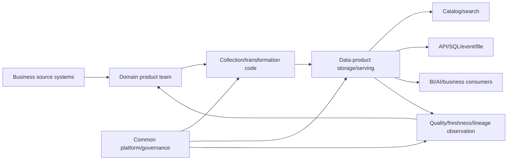
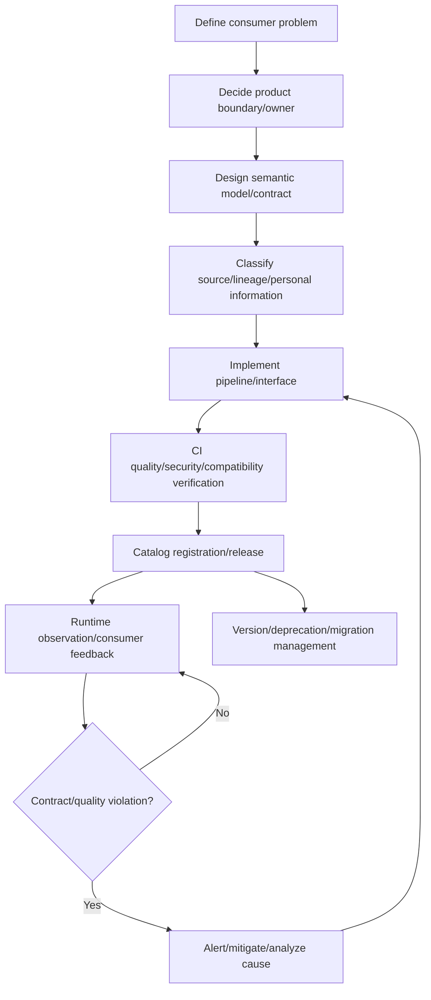

# Data Product Design and Operation

## 1. Overview

> **Definition**: A Data Product is a data asset that continuously provides value by bundling data, metadata, a semantic model, processing code, access interfaces, and quality/security/operational responsibility into a single deployment and management unit for specific consumers and business purposes.

A data product is not merely a well-organized table or an alias for a database.
It provides together a description that lets consumers interpret meaning, access methods for safe use, metrics for confirming quality, a version policy for anticipating changes, and an owner to contact when problems arise.
Therefore, a data product must be understood as a product unit that includes the data itself together with the surrounding capabilities to produce, verify, deploy, and observe the data.

In a traditional centralized data warehouse, it was common for a central data team to collect data from many business systems and create tables and reports on consumers' request.
This structure makes it easy to secure standardization and control, but domain knowledge concentrates in the central team, request queues grow long, and semantic changes in source systems are reflected late in analytical data.
The data-product approach reduces this bottleneck by having domain teams that best understand the data—such as orders, customers, payments, and logistics—take responsibility for analytical data as products, while the central platform team provides a common execution foundation and guardrails.

A data product is often discussed as the core implementation unit of Data Mesh, but the two concepts must not be equated.
Data Mesh is a combination of organizational/architectural principles: domain-oriented ownership, the mindset of treating data as a product, a self-service data platform, and federated computational governance.
A data product is the unit that concretizes those principles into a consumable deliverable.
You can make data products even in a centralized environment, and even if you adopt Data Mesh, without product criteria you may just end up with more per-domain tables.

In a professional engineer's answer, rather than repeating the slogan "manage data like a product," you must explain by connecting the product's customer, value, interface, quality promise, responsibility, and lifecycle.
In particular, because—unlike ordinary software—data is easy to copy and combine and its meaning differs by usage context, schema compatibility alone cannot guarantee product quality.
Only when business definitions, time bases, aggregation rules, personal-information-processing purposes, and source traceability are managed together does it become a trustworthy data product.

### A. Background and Necessity

First, the distance between data consumers and producers has widened.
With microservices, SaaS, multi-cloud, and streaming platforms, one domain's operational data passes through several analytical pipelines and is delivered to various consumers.
Even if the producing team knows which fields are important, consumers must guess their meaning or hunt for separate documentation and contacts.
Productization bundles the flows of discovery, understanding, access, use, and feedback into a single responsibility.

Second, silent data failures lead to business loss.
Even if a pipeline job succeeds, if sales abnormally drop versus the previous day or a customer identifier duplicates, decisions and settlement results can be wrong.
A product must specify quality goals such as completeness, validity, freshness, and duplication rate in addition to availability, and continuously measure them.

Third, as AI use expands, supplying data suitable for training/evaluation/inference has become a competitive advantage.
Model performance is determined not by algorithms alone but by label definitions, prevention of time leakage, data lineage, bias checks, and reproducible extraction conditions.
A reusable training dataset or feature set can also be operated as a data product with an owner and quality criteria.

### B. Distinction from Datasets and Data Services

A dataset refers to the technical result of a bundle of data, while a data product is a management concept that includes consumer value and operational responsibility.
For example, the fact that an `orders_daily` table exists does not automatically make it a data product.
Only with defined revenue-recognition rules, update-completion time, quality verification, access policy, change notification, and a support channel can consumers safely use it in their work.

A data service focuses on the touchpoint that provides data, such as an API or query.
A data product, by contrast, takes responsibility for the meaning and quality of the result regardless of whether an API, file, table, event, or dashboard is used.
That is, a data service can be the interface of a data product but is not identical to the entire data product.

| Category | Dataset | Data service | Data product |
|---|---|---|---|
| Focus | Stored data bundle | Provision interface | Consumer value and full lifecycle |
| Composition | Rows/columns/files/events | API/query/stream | Data/metadata/code/infra/policy |
| Quality promise | May be undocumented | Responsiveness-centered | Accuracy/freshness/availability/meaning/security |
| Responsibility | Storage-administrator-centered | Service-operator-centered | End-to-end responsibility of the domain product team |
| Change method | Risk of arbitrary changes | API version policy | Contract/impact analysis/notification/deprecation procedure |

## 2. Conceptual Model and Components of a Data Product

A data product must provide an information concept that is independently understandable within a specific domain.
Set boundaries such that the customer domain provides the customer's current state and consent history, and the payment domain provides the facts of approval, cancellation, and refund.
Consumers should access based on the product's business meaning, not the structure of the data's source system.

### A. Logical Components

**Data** can take many forms—batch tables, change events, time series, documents, graphs, feature vectors, and so on.
More important than the format is whether data appropriate to the product's purpose is selected and whether time, units, keys, and missing-value representation are consistently defined.
Rather than exposing a source copy as-is, it is safer to provide together a stable public model that consumers can use and source traceability.

**Metadata and meaning** are the product's user manual and search index.
Rather than merely listing field descriptions, you must specify business meaning that affects judgment, such as the definition of a customer, the point of order confirmation, the revenue-recognition basis, and the currency and tax-inclusion of amounts.
Technical metadata includes schema, partitions, format, location, owner, update cadence, lineage, and quality metrics.

**Code** executes collection, transformation, verification, service, and access policy.
Manage product code in a version-controlled repository, and declare schema and quality rules as code to validate them automatically before deployment.
Recording the versions of code and data together makes it easy to reproduce the same result and trace failure causes.

**Infrastructure** includes storage, processing engines, catalog, orchestrator, authentication/authorization, monitoring, and cost tracking.
This does not mean the domain team builds all infrastructure independently, but that the self-service platform provides standard templates and safe defaults, and the product team selects the needed configuration.

### B. Reference Concept Diagram

Source systems prioritize consistency for business processing, but for analytical consumers to use them directly, the joins, code values, and change history may be inconvenient.
The domain product team, understanding the meaning of the source, creates an analytical representation and exposes it to consumers through the product interface.
The common platform provides deployment/authentication/catalog/observation features so that domain teams do not build from the ground up each time.

Quality-observation results must not accumulate only on a central dashboard.
When freshness degradation or a contract violation is found, it must be automatically delivered to the product owner, and according to severity, consumer warnings, deployment blocking, or provision of alternate data must follow.
Only with this closed loop does a data product become an operated product rather than a static file.

### C. Quality Attributes of a Data Product

A data product must have **discoverability**.
Consumers should be able to find a product in the product catalog by business term, domain, tag, example, owner, and status, and compare similar and duplicate products.
Because exposing only technical table names in search results reduces the effect of productization, a glossary connecting business terms and technical terms is needed.

**Addressability** means being able to access it in a stable way after finding the product.
Provide per-environment endpoints, data-sharing zones, API paths, authentication methods, and usage examples, and guide the access-application procedure when there is no permission.
If the access path depends on a responsible person's personal account or a temporary file link, the product's reproducibility and operability decline.

**Understandability and interoperability** let consumers use the product without asking the producer every time.
Specify date/time-zone/currency/code-value/identifier rules, and use standard formats and a common domain model.
However, because forcing one giant schema on all domains can slow the pace of change, federate only the core of the meaning and manage detailed representation through product contracts.

**Trustworthiness and security** are broader concepts than the accuracy of a single number.
Consumers should be able to confirm the quality-measurement method and results, source lineage, known limitations, personal-information grade, purpose of use, and retention period.
Trustworthiness is not a promise that the data is always perfect, but includes the transparency that lets consumers judge the quality state and uncertainty.

| Quality attribute | Evidence the product provides | Representative metric |
|---|---|---|
| Discoverable | Catalog/glossary/examples | Search success rate, ratio of unregistered assets |
| Understandable | Meaning/units/time basis/samples | Number of inquiries, documentation completeness |
| Addressable | Stable endpoint and permission procedure | Access success rate, average approval time |
| Trustworthy | Lineage/quality results/limitations | Completeness, validity, duplication rate |
| Fresh | Update cadence and delay notification | Freshness delay, on-time deployment rate |
| Interoperable | Standard types/keys/contract | Number of compatible consumers, number of conversions |
| Secure/compliant | Grade/policy/audit log | Policy violations, excessive permissions, audit gaps |

## 3. Design Procedure and Architecture

### A. Product Discovery and Boundary Setting

The first step is not deciding which table the tech team wants to build, but defining the consumer problem to be solved.
Rather than a broad-scope request like "all customer data for marketing analysis," you must clarify the decision and time range, like "evaluate campaign performance together with customer-consent status on a weekly basis."
Set the product's success metrics as consumer value—such as reduced decision time, reduced manual work, model performance, and reduced settlement errors—not just query volume.

Set boundaries based on domains and information concepts.
If one product owns the customer's personal information, the order's status, and the shipment's location all together, change responsibility and personal-information purposes get mixed.
Conversely, making products too small forces consumers to combine dozens of products, raising combination cost.
Determine an appropriate size based on independent value and cohesion, reason for change, access permissions, and operational responsibility.

The product owner is not an alias for a single technical staffer but the responsible party who decides the product's meaning and quality promise.
Form a product team including domain experts, data engineers, analysts, security/privacy staff, and key consumers, and specify decision-making authority.
The central data team supports policy and platform but does not make the quality judgments that require domain knowledge on their behalf.

### B. Data Contracts and Public Interfaces

A data contract includes not only field names and types but also meaning, requiredness, allowable values, time basis, quality rules, update cadence, access policy, and change/deprecation procedures.
For example, if `COMPLETED` for `order_status` differs between the payment-approval point and the shipment-completion point, the same code value produces different conclusions.
The contract also records definitions and example records, prohibited uses, and known delays and missing-value handling.

Choose the interface according to the consumer type.
Tables/files/SQL views are convenient for dashboards and periodic analysis, while event streams suit real-time fraud detection or state propagation.
Model training values reproducible snapshots and version pinning, and external services need authenticated APIs and usage policies.
Even if one product provides multiple interfaces, the meaning and quality criteria must be kept common.

Set the compatibility policy according to the risk of the change.
Adding a new optional field is compatible with many consumers, but changing the meaning or units of an existing field is a logically breaking change.
A breaking change must go through new-version publication, parallel provision, consumer confirmation, a migration period, and a deprecation notice.
Contract validation checks samples/schema/quality rules in CI, and during operation observes the actual distribution and delays.

### C. Deployment and Operation Flow

If you do not classify personal and sensitive information at the design stage, it is hard to bolt on access policies after the product is complete.
Record as product attributes the collection purpose, minimal collection, pseudonymization/anonymization, retention period, whether there is cross-border transfer, and the allowed purpose per consumer.
Rather than replicating a sensitive source to all consumers, providing the necessary aggregation/pseudonymization result as a separate product reduces the exposure surface and the potential for misuse.

Treat deployment at the same level as an application release.
Review code and contract changes, confirm whether existing results change during backfill or reprocessing, and update the catalog and change log together.
Data-quality verification must separate deployment-blocking conditions from warning conditions.
Unconditionally blocking on a temporary delay can stop the business, while only warning about serious identifier duplication can spread incorrect settlement.

During operation, view data observability and service observability together.
Connect not only pipeline success/failure, processing time, cost, and storage volume but also freshness, row-count changes, value distribution, NULL ratio, referential integrity, and consumer query errors.
For products with high consumer impact, declare the incident grade and contact chain, alternate data, reprocessing target time, and post-incident-analysis procedure.

## 4. Governance and Organizational Operation

### A. Comparison of Centralized and Domain-Distributed

The centralized type is strong in common standards and control.
In small organizations or heavily regulated environments, it may be more efficient for one team to consistently operate the standard model and quality checks.
However, as the number of domains and consumers increases, the central team struggles to handle all requests, and the time for domain changes to be reflected in products grows long.

The domain-distributed type has the advantage that data and business knowledge are continuously managed by teams close to them.
Instead, quality criteria/tools/terms differ per team, cost and responsibility are dispersed, and enterprise-wide integrated analysis can become difficult.
Therefore, distribution does not mean no rules; it must be a federated model that shares global principles and automated policies.

| Judgment axis | Centralized data team | Domain-centric data products | Practical compromise |
|---|---|---|---|
| Meaning responsibility | Central team | Domain team | Domain definitions + enterprise glossary linkage |
| Standardization | Fast and consistent | Variance possible | Minimal standards and automatic checks |
| Change responsiveness | Request queue possible | Close to domain changes | Product roadmap and platform support |
| Operational burden | Concentrated in central team | Distributed to domain teams | Golden path/common templates |
| Integrated analysis | Easy | Requires combination contracts | Common keys/semantic model/catalog |
| Accountability | Relatively clear | Requires boundary negotiation | Designate product owner and data steward |

### B. Control Points of Federated Governance

Enterprise governance suits a method of controlling interoperability and risk rather than approving the internal implementation of every product.
Set required metadata, personal-information processing, access control, audit logs, retention, encryption, common data types, and contract format as global policies.
Uniformizing even a product's internal pipeline or storage engine can harm domain autonomy and innovation.

Do not leave policy only as documents people read; execute it on the platform.
Block deployment of products not registered in the catalog, automatically apply masking policies to fields with high personal-information grades, and fail breaking changes not in the contract during CI.
Access grant/revocation, data-use purpose, query audit, and the expiration date of policy exceptions must also be automatically recorded for post-audit to be possible.

Product portfolio management reduces duplication and neglect.
Products with no usage, products failing to keep their freshness promise, and products providing the same meaning differently should be consolidated or deprecated in consultation with consumers.
Increasing the number of products is not evidence of maturity; the ratio of products that consumers trust and reuse and their business value are the core of performance.

### C. Metrics and Accountability System

Quality metrics must be connected to the product's contract.
Completeness can be measured by the fill rate of required fields, validity by the pass rate of allowable-range/reference rules, freshness by the delay versus the promised time, and uniqueness by the duplication rate of business keys.
Because accuracy requires ground-truth data or a business-verification sample, do not conclude it with a single automatic metric; use sample review, comparison, and consumer feedback together.

Set the SLA realistically to match the product's criticality.
A real-time fraud-detection product may require second-level latency and high availability, while for a monthly management-report product, on-time deployment by the morning of the business day may be a more important goal.
Because declaring too many metrics only raises measurement/operation cost, start with the core metrics that have high consumer impact.

## 5. Comparison and Cases

### A. Relationship Between Data Products and Data Contracts

A data contract is a core component that defines the interface and quality promise of a data product, but a contract alone does not complete the entire product.
The contract decides what the producer and consumer will expect, and the product fulfills that promise through the actual pipeline/storage/serving/observation/support system.
Conversely, even if a product catalog exists, without a contract the description and quality depend on people's memory.

Suppose an order product provides `order_id`, `customer_id`, `ordered_at`, `status`, and `amount`.
The contract can specify that `ordered_at` is in UTC ISO 8601 format, that `amount` is in Korean won including VAT, and that `status=COMPLETED` means payment-approval completion, not shipment completion.
It can also declare that it provides the previous day's data by 06:00 daily, guarantees `order_id` uniqueness of 99.99% or more, and notifies meaning changes 30 days in advance.
Only with such a contract is the risk reduced of marketing/finance/logistics consumers interpreting the same data differently.

### B. Manufacturing, Finance, and Public Cases

The manufacturing domain can provide a predictive-maintenance product combining equipment events and quality-inspection results.
The product includes equipment identifiers, sensor observations, maintenance history, missing/correction flags, remaining-life estimates, and model versions.
The analytics team can query failure risk without knowing the source PLC format, but must confirm together the confidence interval and model-application scope so as not to mistake estimates for confirmed facts.

The payment domain in finance can separate a daily-transaction product and a real-time anomalous-transaction-signal product based on approval/cancellation/refund events.
The daily product values settlement reproducibility and account-item mapping, while the real-time product values sub-second delivery and duplicate-event removal.
Even using the same transaction source, if the consumption purposes differ, it is more appropriate to separate them into products with different contracts and operational characteristics than to bundle them into one giant product.

Public institutions must prioritize business purpose and personal-information minimization when linking civil-complaint, welfare, and facility data.
Rather than mass-sharing raw personal information between agencies, provide pseudonymous identifiers, aggregation of necessary attributes, and per-purpose access products, and leave the using agency, inquiry reason, and retention period as audit logs.
The product catalog must display the data-opening scope and limitations together, distinguishing "searchable" from "unconditionally accessible."

### C. Failure Cases and Improvement Directions

The first failure is a data dump with only a product name attached.
Without an owner, definitions, quality metrics, or an update promise, consumers ultimately ask the source contact and make personal copies.
To improve, a minimal product template should require filling in the purpose, consumers, core terms, quality criteria, and support channel before deployment.

The second failure is mistaking domain autonomy for freedom of tool choice.
If time zones and identifier rules differ per team, integrated analysis becomes impossible.
Rather than forcing enterprise standards on all internal schemas, set core common meaning, contract format, security policy, and required catalog items as federated rules and validate them automatically.

The third failure is measuring quality only from the producer side.
Even if the production pipeline succeeds, errors can occur in the consumer's join results or business classification.
For important products, operate production metrics and consumer-result verification together, and reflect quality issues in the product backlog and release plan.

## 6. Deep Dive: Linkage of Data Products with AI and Data Mesh

Data products can be a foundation that raises the reproducibility and accountability of the AI lifecycle.
A training-data product preserves, with versions, the source lineage, extraction time, label rules, exclusion conditions, personal-information processing, data-split method, and quality-verification results.
A model product connects the contract version of the input data product with the model file, evaluation set, bias/safety results, and inference interface.
This lets you investigate separately whether model-performance degradation is due to a data-distribution shift or a change in model code.

In a retrieval-augmented generation system, you can define a knowledge product including document collection, chunking, embedding, and permission filters, and a search-result contract.
You must manage—as product-quality and security criteria—whether documents are up to date, from which source they came, whether only documents the user can access are returned, and whether deletion requests are also reflected in the embedding store.
Simply operating a vector database differs from operating a search data product equipped with permissions, lineage, updates, and evaluation.

The cost of a data product also needs to be included in product metrics.
Replicating a high-resolution source to all consumers increases storage/processing/transmission cost and the personal-information exposure surface.
Analyze usage, value, and latency requirements to combine source retention, aggregate products, cache, stream, and batch products, and disclose the cost/quality trade-off to consumers.

In the future, the data-product catalog is likely to become a control plane that connects policy, contract, observation, and usage, beyond a simple asset inventory.
However, because automation cannot decide business meaning on people's behalf, you must clearly leave the limits of automatic quality judgment and the points of human approval.
Even AI-generated schema descriptions or classification results must not be treated as confirmed governance without the source owner's review and change history.

## 7. Considerations and Implications

### A. Product Strategy and Investment Priorities

Do not productize all data at once; select first the data with high consumer impact and reusability.
Core customer/sales/safety/regulatory data need high quality and strong access control, while experimental data can start with lighter documentation.
When creating a product portfolio and roadmap, evaluate not only build difficulty but also the business loss on failure and the number of consumers.

### B. Simultaneous Management of Quality and Meaning

Passing schema validation alone does not mean the data is correct.
Include business definitions, time zones, code values, aggregation rules, and source lineage in the quality criteria, and manage meaning changes at the same level as technical changes.
You must introduce a procedure to verify representative queries together with consumers and compare against actual business results.

### C. Balancing Security/Privacy and Usability

Excessive openness leads to personal-information infringement and use beyond purpose, while excessive restriction lowers the utilization value of the data product.
Embed least privilege, purpose-based access, field/row-level control, pseudonymization, retention/disposal, and audit logs into the product contract and the platform.
Permission application and revocation must be fast and transparent so that users do not make bypass copies.

### D. Platform Standards and Domain Autonomy

A self-service platform is not a project to unify storage engines into one but a capability that lets product teams deploy quickly with safe defaults.
Provide standard templates, contract checks, catalog registration, observation dashboards, and cost tracking as a golden path, while accommodating differences in per-domain processing methods.
Improve developer experience and exception-handling procedures together so the platform does not become a bottleneck for product teams.

### E. Continuity of Change, Deprecation, and Responsibility

A data product is not a deliverable that is published once and done, but a service that evolves as usage and quality are watched.
Specify versions, backward-compatibility periods, consumer impact analysis, deprecation notices, alternate products, and reprocessing/recovery goals.
Separate team-level responsibility from individual dependence so that the catalog, code, contract, and operation records continue even if the product owner changes or the organization is restructured.

### F. Exam and Answer Strategy from a Professional Engineer's Perspective

In the answer's introduction, present the definition of a data product and its difference from a dataset; in the body, connect components, quality attributes, design procedure, and governance with a concept diagram.
For comparison questions, do not merely list the pros and cons of the centralized and domain-distributed types; explain the reason for choosing according to organization scale, regulation, and data-change frequency.
In the conclusion, emphasizing a lifecycle perspective that includes phased adoption, quality/security automation, consumer-value measurement, and deprecation becomes the professional engineer's implication.

## References

- Martin Fowler, "Designing data products", https://martinfowler.com/articles/designing-data-products.html
- Google Cloud, "Architecture and functions in a data mesh", https://docs.cloud.google.com/architecture/data-mesh
- IBM, "What Is a Data Product?", https://www.ibm.com/think/topics/data-product
- AWS, "What is a Data Mesh?", https://aws.amazon.com/what-is/data-mesh/
- Martin Fowler, "Data Mesh Principles and Logical Architecture", https://martinfowler.com/articles/data-mesh-principles.html

---

> **In one line**: A data product is a product unit that goes beyond a dataset to bundle meaning, quality, security, interface, and operational responsibility into one, enabling a domain to continuously provide trustworthy business value.
