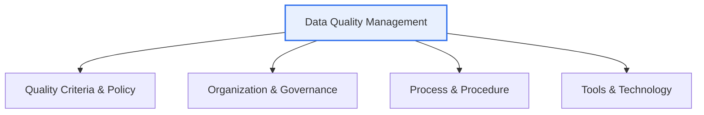

# Data Quality Management

## 1. Overview

### A. Definition
> A systematic activity that **continuously secures and manages the quality of data—its accuracy, completeness, consistency, timeliness, and so on**. It forms the foundation for turning data into a trustworthy asset for decision-making and AI.

Data quality management is decisively important because '**poor-quality data leads directly to bad decisions**'. A wrong customer address causes a delivery to fail, duplicated sales data distorts performance figures, and an AI trained on biased data produces flawed predictions. As data- and AI-driven management spreads, data quality has become a core factor determining the reliability of analytics and models. The key point is that data quality does not improve by chance. Quality is secured continuously only through a management system that combines architecture, process, organization, and technology. Cleansing data once is not the end; data keeps flowing in and must be managed on an ongoing basis.

### B. Necessity
When data is scattered across multiple systems and accumulates under differing standards, inconsistencies, duplicates, and errors pile up. Left unaddressed, trust in the use of data collapses, so a management system equipped with standards, quality, and governance is needed.

## 2. Data Quality Management Architecture

The quality management architecture consists of four layers that interlock organically. At the top are the **policy and criteria** that define what counts as quality (quality indicators and standards); beneath them is the **organization and governance** (data owners and stewards) responsible for owning and executing those criteria. Below that runs the **process** that actually secures quality (profiling, cleansing, validation, monitoring), supported by the **tools and technology** that enable it (quality diagnostic tools, MDM, metadata management). In particular, if the organization and governance dimension—'who is accountable for data quality'—is missing, even the best tools become useless.

| Layer | Composition |
|---|---|
| **Policy & Criteria** | Definition of quality criteria, indicators, and standards |
| **Organization & Governance** | Data owners and stewards, accountability structure |
| **Process** | Profiling, cleansing, validation, monitoring |
| **Tools & Technology** | Quality diagnostics, MDM, metadata management |

## 3. Data Quality Management Maturity

The level of quality management differs by organization, and a maturity model is used to diagnose the current position and set a direction for improvement. At the initial stage, quality management depends on individual capability; at the formalized stage, partial procedures emerge; at the standardized stage, enterprise-wide standards and processes take hold; and at the optimized stage, quantitative measurement, continuous improvement, and automation are in place.

| Stage | Characteristics |
|---|---|
| **1 Initial** | Quality management immature, individual-dependent |
| **2 Formalized** | Partial procedures and criteria exist |
| **3 Standardized** | Enterprise-wide standards and processes established |
| **4 Optimized** | Quantitative measurement, continuous improvement, automation |

## 4. Quality Criteria for Structured / Unstructured Data

Quality criteria differ by data type. **Structured data** such as tables and code values have clear rules, so they are validated against quantitative criteria such as accuracy, completeness, consistency, validity, and uniqueness. **Unstructured data** such as documents, images, and logs is hard to subject to formalized rules, so it is managed with relatively qualitative criteria such as reliability, relevance, comprehensibility, and usability, together with the quality of metadata and labeling.

| Category | Structured Data | Unstructured Data |
|---|---|---|
| **Criteria** | Accuracy, completeness, consistency, validity, uniqueness | Reliability, relevance, comprehensibility, usability |
| **Target** | Tables, code values | Documents, images, logs |
| **Method** | Rule-based profiling | Metadata & labeling quality |

## 5. Data Quality Management Strategy

An effective quality management strategy points in four directions. First, **standardization** of data lays the foundation for quality (no quality without standards). Second, a **prevention-centered** approach that controls quality at the source (input) stage is far more efficient than cleansing after the fact. Third, quality is raised in maturity by **measuring and monitoring it with quantitative indicators (KPIs)**. Fourth, establishing an **accountability structure** through data owners and stewardship secures sustainability.

## 6. Considerations and Implications

1. **Data quality is a precondition for the reliability of AI and analytics.** From a data-centric AI perspective, quality management often takes priority over model performance.
2. **For real-time and high-volume data, embed automated quality monitoring** in the pipeline. Quality must be validated automatically and anomalies detected each time data arrives.
3. **It links to regulatory compliance.** The Data 3 Acts, MyData, and similar regimes require accurate and trustworthy management of personal data, so quality management is directly tied to compliance.

---

> **In one line**: Data quality management raises maturity through a *policy–organization–process–tools architecture*, applies quality criteria for structured and unstructured data, and—via strategies of standardization, prevention, measurement, and accountability—turns data into a trustworthy asset for AI and decision-making.
