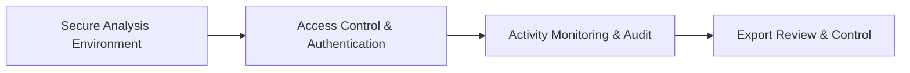

# Data Safe Zone

## 1. Overview

### A. Definition
> A **controlled physical and logical analysis environment** provided and designated by the government—grounded in laws such as the **Data Industry Act (Article 11)**—so that unreleased, sensitive data can be **safely analyzed and utilized without the original data leaking out**.

### B. Background and Necessity
The use of data carries a fundamental dilemma. Opening up data and handing it over promotes utilization but increases the risk that personal information and corporate secrets will leak or be re-identified; conversely, blocking release to protect data leaves it dormant. In particular, sensitive data containing an individual's detailed history cannot have its re-identification risk fully eliminated by pseudonymization alone, so it is difficult to release at all. The data safe zone resolves this dilemma through a shift in thinking: **"do not export the data; instead, have people enter the place where the data resides and analyze it there."** In other words, the original stays inside a controlled zone, only analysts are given access, and only the outputs are exported after review—thereby achieving utilization and protection at the same time. This is a core piece of infrastructure that reconciles the vitalization of the data economy with the protection of privacy.

## 2. Key Functions

The safe zone's functions are designed to block every path by which data could leak outside. The **secure analysis environment** is a closed space with controlled ingress and egress (a physical analysis room or a remote virtual desktop), which shuts off leakage channels such as the internet, USB, and printing at the source. **Access control and authentication** ensure that only authorized people enter, through user registration, screening, and approval procedures and identity verification. **Activity monitoring** logs which data the analyst viewed and manipulated, enabling after-the-fact audit and deterring misuse. The most central function, **export review**, examines only the analytical outputs (statistics, models, etc.) for re-identification risk and exports only what passes; the original data is never exported under any circumstance. Added to this is a **combined-analysis support** function that joins and analyzes pseudonymized or anonymized data from different institutions inside the zone.

| Function | Content | Purpose |
|---|---|---|
| **Secure analysis environment** | Closed space with controlled ingress/egress (physical/remote) | Block leakage channels at the source |
| **Access control & authentication** | User registration & approval, identity verification | Only authorized persons access |
| **Activity monitoring** | Analysis activity logs & audit | Deter misuse, enable tracing |
| **Export review** | Export only after re-identification review of outputs | Prevent leakage of originals |
| **Data combination support** | Combined analysis of pseudonymized/anonymized data | Multi-institution converged analysis |

## 3. Designation Requirements

For the government to designate a particular facility as a safe zone, it must satisfy all the physical, managerial, and organizational requirements that substantively guarantee the functions above. For **security facilities**, network separation isolated from external networks and ingress/egress control devices are required; for **access control**, identity verification, authorization management, and access logs must operate at all times. In particular, technical controls alone are insufficient, so on the **management-system** side—alongside operating staff and standard procedures—a **review committee** that examines export outputs must be established, because judging re-identification risk is a domain of expert judgment that is hard to automate. Finally, **facility and environment** requirements such as an independent space, CCTV, and access control complete the physical containment.

| Requirement | Description |
|---|---|
| **Security facilities** | Physical/network separation, ingress/egress control devices |
| **Access control** | Identity verification, authorization management, access logs |
| **Management system** | Operating staff & procedures, export **review committee** |
| **Facility & environment** | Independent space, CCTV, access control |

## 4. Related Systems and Linkages

The data safe zone does not operate on its own; it complements adjacent systems. When merging data from different institutions, it links with the **pseudonymized-data combination system (specialized combination agency)** by analyzing the combined data inside the zone; and it complements **MyData**, through which individuals proactively use their own data, in terms of the subject and scope of use. In addition, applying **PET (Privacy Enhancing Technologies)** such as differential privacy and homomorphic encryption inside the zone layers technical control (PET) on top of physical control (the zone), raising safety even further.

| Category | Linkage |
|---|---|
| **Pseudonymized-data combination** | Safe analysis site for data combined by a specialized combination agency |
| **MyData** | Complements individual-driven utilization |
| **PET** | Dual control via differential privacy & homomorphic encryption |

## 5. Considerations and Implications
- **Clarifying export-review criteria**: The trust placed in a safe zone depends on the consistency of its export review. Quantitative criteria for judging re-identification risk (e.g., level of k-anonymity, minimum cell frequency) should be codified to reduce the problem of results diverging from reviewer to reviewer.
- **Balancing accessibility and control**: On-site visits are safe but inconvenient, so remote safe zones should be expanded while maintaining the level of control in the remote environment through screen watermarking, behavior logging, and the like.
- **Infrastructure that reconciles openness and protection**: The safe zone is a leading example of the new paradigm of "utilizing without opening up," and it is expected to develop into a trust foundation for future cloud-based expansion and cross-border data movement (data spaces).

---

> **In one line**: A data safe zone is a designated environment that *controls sensitive data so it can be analyzed and used without the original leaking out*; equipped with a closed analysis environment, access control, monitoring, and export review functions—plus designation requirements such as security facilities and a review committee—it reconciles data openness with privacy protection.
