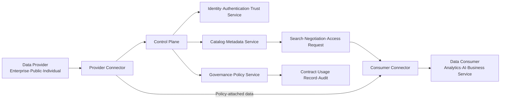
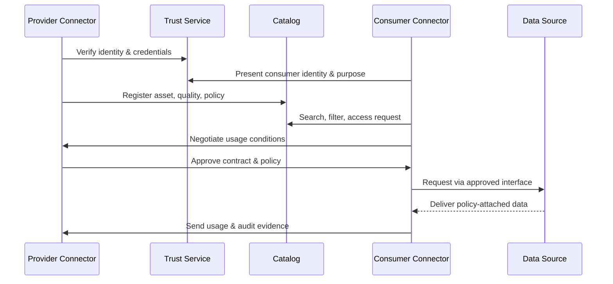

# Data Space and Sovereignty-Based Trusted Data Sharing

## 1. Overview

### 1.1 Definition

> A **Data Space** is a federated ecosystem in which participants in a particular industry or public domain share and reuse data on the basis of common rules, trustworthy identity, interoperable semantics, and technical controls.

A data space differs from the approach of pooling data in one place under a monopolizing central platform. Data providers keep possession of their source data while deciding who may use it, for what purpose, and for how long; consumers agree to those conditions and then access the data they need. Thus the essence is not mere data transfer but the joint exchange of trust, rules, semantics, and usage policies.

Whereas a data marketplace centers on listing, discovery, pricing, and settlement of goods, a data space deals more broadly with the participation rules and technical trust foundation that let different organizations collaborate on an ongoing basis. Whereas a data lake or data warehouse focuses on optimizing storage and analytics inside an organization, a data space designs the rights and responsibilities of situations in which data moves and is used across organizational boundaries.

### 1.2 Background and Necessity

First, the data held by companies and public institutions is fragmented by department, company, and country, so the social value of data is not fully realized. A manufacturer holds equipment data and a logistics firm holds transport data, but if they cannot trust each other's quality, security, and accountability standards, supply-chain optimization becomes difficult.

Second, centralized platforms are advantageous for rapid integration but come with the risks of loss of data sovereignty, vendor lock-in, a single point of failure, and use beyond the intended purpose. A data space reduces these risks by enabling standardized exchange among distributed parties without necessarily replicating data into a central repository.

Third, the quality of AI and analytics services depends not only on the model itself but also on the accuracy, currency, provenance, and usage rights of the data used for training and inference. A data space delivers a data asset's metadata and usage conditions together, creating a reusable data supply chain.

Fourth, data must be utilized while protecting personal information, trade secrets, industrial secrets, and country-specific regulations. Beyond authentication that merely decides whether access is permitted, this calls for usage control that also governs how permitted data is reused and for what purpose.

### 1.3 Goals and Characteristics

The goal of a data space is to enable ecosystem-level data utilization while preserving participants' autonomy. Here autonomy does not mean data is never disclosed; it means data providers can negotiate the scope of sharing and the conditions of use and enforce them through contracts, policies, and technology.

Its main characteristics are as follows.

| Characteristic | Meaning | Design question from an engineer's perspective |
|---|---|---|
| Federation | Data and operating parties are distributed across many organizations | How to build trust without centralization |
| Data sovereignty | The provider controls conditions for access, use, and re-sharing | Do policies align across the contract and enforcement layers |
| Trustworthiness | Participants, connectors, and data provenance are verified | Which identity and assurance levels to apply |
| Semantic interoperability | The same data is interpreted with the same meaning | How to operate a common vocabulary, identifiers, and ontology |
| Policy enforceability | Usage conditions are technically verified and recorded | Can violations be prevented, detected, and audited |
| Domain openness | Applicable to manufacturing, health, finance, mobility, etc. | How to separate the common foundation from domain-specific rules |

## 2. Data Space Reference Architecture

### 2.1 Overall Concept Diagram

It is important to distinguish the data plane from the control plane in a data space. The data plane conveys the actual data or access to it, while the control plane manages who may participate, what assets exist, and under what policy they may be transacted. This separation lets large-volume source data remain in the provider's repository while a standardized negotiation procedure is applied.

### 2.2 Participants and Roles

**The data provider** is the party responsible for creating or managing data. The provider defines the quality, provenance, refresh cycle, whether personal data is included, the intended purpose, and compensation conditions of the data asset. Because providing data does not mean surrendering ownership and all control, the boundaries set by contract and policy must be made clear.

**The data consumer** is the party that performs analytics, AI training, service operations, or decision-making with the data. The consumer explores data assets in the catalog, presents its identity, purpose, and security level, and then negotiates usage conditions. The consumer must put internal controls in place so that it does not resell or re-share to third parties beyond the permitted purpose.

**The connector** is the boundary component that lets provider and consumer communicate according to the data space protocol. The connector handles authentication, policy negotiation, data delivery, encryption, and audit events between the source system and the external network. By hiding each organization's differing repositories and APIs behind a connector, participants can use a common exchange method.

**The identity and trust service** verifies whether participating organizations, users, services, and connectors are trustworthy parties. It can combine certificate-based mutual authentication, token issuance, trust lists, and credential verification. The trust service is not a simple login server but a foundation that manages participation eligibility and assurance levels as rules of the ecosystem.

**The catalog and metadata service** lets participants search not the data itself but a data asset's description, endpoint, quality, price, license, refresh cycle, and access conditions. It should let consumers find suitable assets without placing sensitive raw content in the catalog. If metadata is poor, actual utilization is impossible even when a technical connection exists.

**The governance operator** runs participation eligibility, dispute procedures, common vocabulary, policy templates, security standards, audit, and sanctions. Rather than a central operator controlling all data, the role is closer to fairly enforcing rules that participants have agreed upon. In an industry-specific data space, the responsibilities of the operator, standardization body, data provider, and consumer must be made concrete by contract.

### 2.3 Data Assets and Metadata

A data asset does not mean a single file. A logical unit of provision that a consumer can use—such as a real-time API, a stream, a table, a document, a model input, or an aggregated result—can be defined as a data asset. Assets must have identifiers and versions, and even data with the same name must be treated as separate assets if their meaning, quality, or rights differ.

Required metadata includes the data asset's description, owning/managing party, provenance, creation time, latest refresh time, schema, units, quality indicators, retention period, personal-data classification, license, price or compensation, permitted purposes, and re-sharing conditions. This information lets the consumer judge suitability and risk before receiving the data.

Data quality is not evaluated by accuracy alone. Completeness, validity, timeliness, consistency, uniqueness, traceability, and so on must be defined per domain. For example, for a manufacturing equipment temperature stream, missing-value rate and latency are key, whereas for financial transaction data, integrity, duplication, and regulatory retention may be key.

### 2.4 Reference Technical Composition

| Layer | Main Components | Core Responsibility |
|---|---|---|
| Participation layer | Provider, consumer, intermediary, operator | Roles, rights, responsibilities, and joining conditions |
| Trust layer | Digital identity, certificates, tokens, trust anchors | Mutual authentication and credential verification |
| Discovery layer | Catalog, broker, search API | Asset discovery and condition checking |
| Negotiation layer | Contract templates, policy expression, consent | Agreement on usage conditions |
| Exchange layer | Connectors, APIs, streams, file transfer | Secure data delivery |
| Semantic layer | Common vocabulary, ontology, identifiers | Agreement on data meaning |
| Control & audit layer | Usage logs, policy decision/enforcement, monitoring | Post-hoc evidence and violation response |

Rather than forcing one particular product onto every data space, the interfaces and conformance conditions of each layer should be defined first. Only then can the ecosystem's data contracts and trust be preserved even when a particular cloud or a particular connector implementation is replaced.

## 3. Data Sharing Lifecycle and Usage Control

### 3.1 Sharing Process Concept Diagram

### 3.2 Registration and Discovery

The provider first connects its internal data catalog to the external data space catalog. Here it registers the asset description and access endpoint instead of the sensitive raw content, and the connector protects where the data actually resides. Without managing an asset's version and change history, it is hard to reproduce the consumer's analytical results.

The consumer should not search by keyword alone but should filter jointly by domain vocabulary, quality, region, time range, and legal usage conditions. Even if there are many search results, data that does not match its purpose and authorization is not a real candidate for a contract. Therefore, the discovery service must contain both technical metadata and business/legal metadata.

### 3.3 Trust Formation and Contract Negotiation

Participants present their organization's registration information, certificates, roles, security level, and proof of policy compliance. Mutual authentication confirms the communication counterpart but does not guarantee that the purpose of data use is lawful, so purpose, legal basis, retention period, and processing location must be verified as separate attributes.

Contract negotiation is the process of agreeing on the data asset, purpose of use, period of use, permitted operations, whether re-sharing is allowed, compensation, liability, and deletion/return procedures. For example, even if a manufacturer permits training a failure-prediction model, it may prohibit exporting source equipment identifiers externally or reselling them to competitors.

### 3.4 Policy Decision and Policy Enforcement

Policy decision is the process of evaluating the requesting party, the data, the purpose, and environmental attributes and judging among allow, deny, or additional approval. Policy enforcement is the process of enforcing the decided outcome at the actual API gate, connector, repository, and analytics runtime. Concentrating both decision and enforcement in one component makes policy change and audit difficult, so it is preferable to separate the roles.

Usage control is broader in scope than access control. Access control judges "can this data be read right now," whereas usage control also governs "was it processed only for the permitted purpose, was it deleted after the designated period, was the result not re-shared." Where technical control is incomplete, contracts, watermarking, output validation, audit, and sanctions must be applied together.

### 3.5 Delivery, Processing, and Audit

Data delivery uses transport-layer encryption and mutual authentication as a baseline and, where necessary, reduces exposure of source data by exporting only analytical results from the provider's environment. If data must move to the consumer's environment, the minimum necessary fields, pseudonymization, tokenization, and access-time limits are applied.

The connector must record the requester, data asset, policy version, contract identifier, processing time, and result status as audit logs. Logs should use hashes, identifiers, and summary values instead of copying raw personal information, and a tamper-resistant store and retention policy should be applied. Audit logs serve not only dispute resolution but also as a basis for data quality and cost settlement.

## 4. Governance and Interoperability

### 4.1 Multi-Layer Governance

Data space governance is not a matter of technical operations alone. The ecosystem is sustained only when participation eligibility, data rights, contract standards, fees and compensation, incident liability, dispute resolution, and withdrawal/data return are agreed upon. An engineer's answer should present, alongside the architecture, the responsibilities of a steering committee, domain committees, and audit functions.

| Governance Level | Decision Items | Deliverables |
|---|---|---|
| Ecosystem | Joining/withdrawal/sanctions/disputes/revenue sharing | Rulebook, participation agreement |
| Domain | Terminology, data model, quality criteria | Common vocabulary, data contract |
| Legal & ethics | Purpose, basis, personal data, cross-border transfer | Usage conditions, impact assessment |
| Technical | API, protocol, authentication, logs | Reference architecture, conformance testing |
| Operations | Failures, changes, security incidents, support | SLA, runbook, incident report |

If a central operator unilaterally changes all rules, participants' trust declines. Conversely, if every organization makes its own rules, interoperability breaks down. Therefore a standard change procedure—including change proposals, impact assessment, voting or consensus, a grace period, and backward-compatibility verification—must be operated.

### 4.2 Semantic Interoperability

Even when APIs are connected, if the definitions of "customer," "equipment," "incident," and "carbon emissions" differ, the results will not combine. Semantic interoperability is the activity of agreeing on common identifiers, code systems, units, time zones, data types, relationships, and constraints, and expressing them so machines can read them.

When building a domain common model, trying to unify every company's internal model into one drives up the cost of consensus excessively. It is realistic to standardize the core exchange concepts and mapping rules while allowing organizations' internal extension attributes as an extension area. The data contract should also include schema-change rules and backward-compatibility conditions.

### 4.3 Technical Interoperability and Conformance

Interoperability is not achieved just because formats are the same. The protocols for identity verification, catalog query, contract negotiation, data delivery, error handling, and log exchange must be mutually compatible. Between implementations of different versions, feature level, required fields, error codes, and security requirements are verified through conformance testing.

Early on, a sandbox and reference connector can be provided to lower the barrier to entry for participants. However, mistaking the reference implementation for the operational standard creates lock-in to a particular product, so normative requirements and example implementations must be distinguished in the documentation.

## 5. Comparison of Data Space with Similar Concepts

Data space, data marketplace, data mesh, data fabric, and data lakehouse all improve the use of data, but the boundaries they address differ. A data space is distinctive in that it places trust, rules, and sovereignty among multiple organizations at its center.

| Category | Main Boundary | Core Purpose | Party Controlling Data |
|---|---|---|---|
| Data space | Organizational/industry ecosystem | Trust-based sharing and usage control | Provider and agreed governance |
| Data marketplace | Market/transaction relationship | Discovery, pricing, trading, settlement | Platform and transaction parties |
| Data mesh | Internal enterprise domains | Autonomous operation of domain data products | Domain teams |
| Data fabric | Internal enterprise/hybrid | Metadata-based integration and access | Central data architecture and domains |
| Lakehouse | Storage/analytics platform | Integrated analysis of source and structured data | Platform operations organization |

For a data-mesh organization to exchange data with an external supply chain, the trust, contract, and policy layers of a data space may additionally be needed. Conversely, even if a data space is built, the sharing ecosystem will not work if each participant's internal data quality and product operations are poor. The two concepts are better seen as connecting internal data products with external data collaboration rather than as substitutes.

## 6. Application Cases

### 6.1 Manufacturing/Mobility Supply Chain

An automaker can use quality, delivery, and carbon data from parts suppliers to improve supply-chain risk and production planning. Parts suppliers can provide only contracted KPIs and aggregated results without disclosing all of their source production volumes and process details.

In this case, common part identifiers, delivery events, quality grades, and carbon accounting units must be defined first. The connector links to the supplier's ERP/MES, and the consumer queries aggregated data for the permitted period. The policy may include a ban on re-sharing to competitors and deletion after contract termination.

### 6.2 Health/Research Data

Hospitals and research institutions must protect patients' direct identifiers while sharing data for research purposes. A data space can separate the location of source data from access rights, verify a researcher's credentials, research plan, and approved scope, and then provide pseudonymized data or a secure analysis space.

In the health domain, consent scope, re-identification risk, retention period, and conditions for disclosing research results are as important as the accuracy of the data. Therefore, along with technical connectors, IRB approval, purpose limitation, output review, and withdrawal procedures must be included in governance.

### 6.3 Energy/Smart City

When power utilities, building operators, charging operators, and local governments share energy demand, charging, and weather data, they can create demand-response and carbon-reduction services. Data providers can reduce exposure of individuals' living patterns by providing hourly aggregated values instead of real-time raw metering values.

For interoperability between cities, location grids, time zones, metering units, device identifiers, and quality indicators must be made common. In emergencies, priorities and access scope different from normal times may apply, so emergency policies and after-the-fact audits must also be designed in advance.

## 7. Deep Dive: Standardization and Policy Trends

The International Data Spaces Association's IDS Reference Architecture Model presents a reference model for trustworthy data sharing in which the data provider controls usage. IDS-RAM centers on a role model, an information model, policy-based sharing, and authentication, and aims at a design space not locked into any single product.

In IDS-family implementations, connectors, trust services, metadata brokers, and policy-based contracts are used as important concepts. The Dataspace Protocol can be understood as a protocol layer for making catalog lookup, negotiation and contracting, and delivery of data assets interoperable between data spaces.

The European Commission is promoting common European data spaces by sector—health, manufacturing, mobility, energy, finance, public administration, and more. Importantly, it supports common infrastructure, governance, security/privacy protection, semantics, interoperability specifications, and data models together.

The EU Data Act emphasizes user access to data generated by connected products and fair sharing, and addresses the foundations of cloud-service switching and data interoperability. When domestic companies exchange data with European partners, they must review not only simple API integration but also contracts, cross-border transfer, security, and supply-chain responsibility.

In practice, the sequence "gather all the data first, then use it" needs to shift to "define purpose and rights first, then connect securely with minimal data." To this end, a staged approach is effective: validate an asset catalog, a minimal common model, connectors, policy templates, and audit metrics in a pilot domain, then expand the participants.

## 8. Considerations and Implications

### 8.1 Balancing Data Sovereignty and Business Value

Restricting sharing lowers data value, while excessive openness increases the risk to trade secrets and personal information. Public/restricted/private grades should be defined per data asset, and policies should be segmented by purpose, period, region, and output. An engineer should present data utilization rate and risk exposure together as KPIs.

### 8.2 Trust Model and Boundaries of Responsibility

A valid certificate does not guarantee data quality or legal compliance. Identity, credentials, quality, contract, and behavior logs should each be verified, and in the event of an incident, the responsibilities of the provider, connector operator, and consumer should be specified by contract.

### 8.3 Evolution of Semantic Standards

A common data model built early on expands as the industry changes and new participants make demands. Without operating version management, extension fields, deprecation notices, and mapping/transformation rules, the data space becomes a fixed dictionary frozen at a particular point in time. The backward compatibility of a standard change and the cost to participants must be evaluated together.

### 8.4 Limits of Policy Enforcement

Even if a connector verifies transfer conditions, it cannot perfectly control a consumer copying data or photographing the screen. Therefore, rather than claiming technical usage control is a cure-all, data minimization, a secure analysis environment, output review, watermarking, audit, and contractual sanctions must be combined in defense-in-depth.

### 8.5 Protection of Personal and Confidential Information

Pseudonymization does not automatically remove re-identification risk. The possibility of data combination, rare attributes, the accessing party, the retention period, and whether outputs are re-identifiable must be assessed. When sensitivity is high, federated analysis in the provider's environment, differential privacy, or confidential computing can be considered instead of exporting the source.

### 8.6 Performance, Availability, and Cost

Mutual authentication and policy evaluation can increase data-processing latency. Do not design real-time control data and batch analytics data at the same level; reflect latency, throughput, retries, caching, and failover paths in the data contract. TCO including connector operating costs and data usage fees must also be calculated.

### 8.7 Security and Supply Chain

Because the connector is a trust boundary exposed externally, it must defend against vulnerabilities, credential theft, policy bypass, log tampering, and denial of service. Making SBOM, patching, signing, and vulnerability-response SLAs for images, libraries, and protocol implementations a condition of participation can reduce supply-chain risk in a multi-vendor environment.

### 8.8 Staged Rollout and Performance Measurement

Rather than connecting an entire nation or industry from the start, select work where the value is clear and agreement on data rights is possible. Pilot performance should be evaluated not by the number of connected institutions alone but also by data discovery time, contract negotiation time, reuse rate, quality error rate, number of policy violations, and the business performance of the analytics service.

### 8.9 Strategy for Structuring an Engineer's Answer

A good flow is to present the limits of centralized sharing in the definition and necessity, then diagram the participant, connector, trust, catalog, policy, and semantic layers in the reference architecture. After that, explain the register → discover → authenticate → negotiate → deliver → audit lifecycle, and compare the differences with data marketplace, data mesh, and data fabric.

In the conclusion, do not end data sovereignty as a declaration but emphasize a strategy of enforcing it through contracts, policies, connectors, and logs. Also present as an implication that a sustainable data economy requires solving both the technical problem of interoperability and the governance problem of data rights and responsibilities.

## References

- International Data Spaces Association, "IDS Reference Architecture Model" — https://internationaldataspaces.org/offers/reference-architecture/
- International Data Spaces Association, "Where the future of data happens" — https://internationaldataspaces.org/why/data-spaces/
- European Commission, "Common European data spaces" — https://digital-strategy.ec.europa.eu/en/policies/data-spaces
- European Commission, "Data Act" — https://digital-strategy.ec.europa.eu/en/policies/data-act
- Data Spaces Support Centre — https://dssc.eu/

---

> **In one line**: A data space is not a platform that pools data centrally but a federated data-governance architecture in which participants retain data sovereignty and share data in a trustworthy way by combining identity, catalog, semantics, contracts, and policy enforcement.
