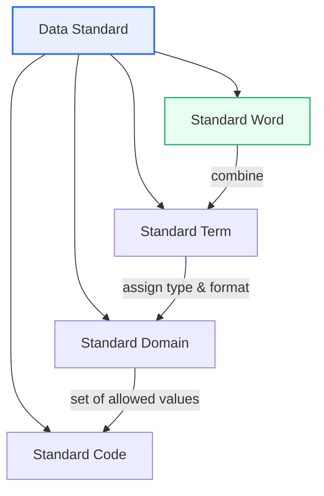
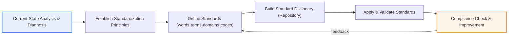

# The Necessity and Expected Benefits of Data Standardization

## 1. Overview

### A. Definition
> An activity that **unifies the naming, definition, format, and representation rules of the data used within an organization to a consistent standard**. By establishing standard words, terms, domains, and codes, it is a foundational data-governance activity that secures the consistency, interoperability, and quality of data.

The fundamental reason data standardization is needed is to eliminate the '**confusion of calling the same thing by different names**'. Even within one company, if the sales system expresses the same concept as '고객번호', the accounting system as 'CUST_NO', and a new app as 'client_id', then every time these data are integrated or compared, mapping work asserting that "this and that are the same" is required, and errors creep in during that process. Mixing dates as 'YYYY-MM-DD' and 'MM/DD/YY', or mixing gender as 'M/F' and '1/2', throws off the aggregation itself. Standardization blocks such inconsistencies from the very moment data is created, turning data into a trustworthy organizational asset.

### B. Background and Necessity
The rise of standardization has roots in the history of information systems. Systems were generally built separately by department and era, and each set its own naming and code system for its own convenience. As a result, across the organization, data scattered like islands—**data silos**—and naming inconsistencies accumulated over a long period. In normal times each system runs fine on its own, so the problem stays hidden; it explodes into confusion only the moment one tries to 'pull the data together and use it', as in enterprise integration, data warehouse construction, management dashboards, or AI training.

On top of this, as the use of big data and artificial intelligence came to determine an organization's competitiveness, the recognition spread that "**you can manage only what you can measure, and you can utilize only what is consistent**." The growing demand to exchange data across organizations and institutions—as in the Data 3 Acts amendment, MyData, and public-data opening policies—also pushed standardization up into an essential task. Non-standardized data is hard to use even internally, and exchanging it with outside parties becomes all the more impossible. In this way, data standardization has taken its place as the 'starting point' of data quality management and governance.

### C. Characteristics
Data standardization has the characteristics of: (1) **layering**, dealing with multiple levels from words to codes; (2) **enforceability and bindingness**, in that once set, the whole enterprise must follow; (3) **continuity**, in that it must be continuously applied to new and changed data; and (4) **governance dependence**, in that it is driven not by technology but by consensus and process. In particular, since standards are harder to 'enforce' than to 'create', standardization has a strong character as a matter of organizational discipline rather than tool adoption.

## 2. Targets and Framework of Data Standardization

Standardization unifies the names and values of data at several levels, and each level is assembled from the bottom up.

**Standard Word** is the smallest unit of meaning that makes up an item name. For example, the item name '고객번호' (customer number) breaks down into the words '고객' (customer) and '번호' (number). The organization fixes one representative word among mixed-up expressions such as 'account/customer/client' and manages the rest as forbidden words (banned terms). Since higher-level terms cannot be standardized without unifying words, words are the bricks of the standard framework. In practice, 'English abbreviations' are also decided together (customer → CUST, number → NO) so that physical column names do not diverge by system.

**Standard Term** is the 'item name (business term)' composed of standard words according to rules. By fixing the order and manner of combination—such as '고객' + '번호' = '고객번호'—the same concept gets the same name no matter who creates it. The practical value of term standards lies in letting developers and business users communicate with the same names, reducing misunderstandings of requirements. If '주문금액' (order amount) and '결제금액' (payment amount) are actually different concepts, distinguish them clearly by term; if they are the same concept, consolidate them into one.

**Standard Domain** defines the data type, length, and format each item may have. For example, the '금액' (amount) domain is nailed down as 'NUMBER(15)', the '주민등록번호' (resident registration number) domain as '13 characters', and the '날짜' (date) domain as 'YYYY-MM-DD'. The core effect of domain standards is consistency of physical design. If an item of the same nature is defined as 20 characters in one table and 10 in another, a value-truncation incident can occur during integration; standardizing the domain makes such physical inconsistencies disappear.

**Standard Code** unifies the value system of code-type data. Whether gender is 'M/F' or '1/2', and which set of code values represents a processing status, is decided by an enterprise-wide standard. Codes often become the axes of statistics and aggregation, so if codes are not unified, you cannot even sum aggregated results across departments. That is why code standards are the area where the effect of standardization is felt most immediately.

These four levels are not independent but form a hierarchy assembled from the bottom up. Words gather into terms; a domain combines with a term to determine physical format; and codes prescribe the allowable range of those values. Therefore, if the lower levels (words, domains) are shaky, the upper levels (terms, codes) cannot be standardized either, so standardization must firm up the foundational levels such as words and domains first. If only the upper levels are hastily set, they soon collapse for lack of a foundation.

| Target | Content | Example | If not unified |
|---|---|---|---|
| **Standard word** | Smallest unit of meaning in a name | Customer (CUST), Number (NO), Amount (AMT) | Proliferation of column names & terms |
| **Standard term** | Item name from combined words | Customer number, Order amount | Requirement misunderstandings, duplicate items |
| **Standard domain** | Definition of type, length, format | Amount: NUMBER(15), Date: YYYY-MM-DD | Value truncation & type-conversion errors on integration |
| **Standard code** | Allowed set of code values | Gender: M/F, Status: 01–09 | Aggregation impossible, statistical distortion |

## 3. Procedure for Establishing Data Standardization

Standardization should be understood not as a one-time definition but as a recurring management process. First, in the **current-state analysis and diagnosis** stage, collect the columns, terms, and codes of existing systems to grasp how much duplication and inconsistency exist. Making standards without this diagnosis produces an idealism detached from reality that goes unfollowed. Next, establish **standardization principles**: higher-level norms such as word-combination rules, abbreviation rules, and exception-handling policy must be agreed first so that individual standards do not waver.

Then, in the **standard-definition** stage, actually fix the words, terms, domains, and codes and register them in the **standard dictionary (data dictionary/repository)** so that anyone can look them up and use them. If a standard exists only as a document and cannot be searched or reused, it becomes a dead letter, so the dictionary is the lifeline of standardization.

Finally, in the **apply-and-validate** and **compliance-check** stages, enforce the standard in new development and data modeling, and periodically find violations to supplement the standard. If this feedback loop is broken, the standard will inevitably collapse over time. In particular, since new words and codes keep arising as the organization and its work change, standardization must be treated not as a project done once and finished but as a management system operated continuously. Without a procedure to receive, review, and reflect requests for new standards, and an organization in charge (a data administrator, DA), business users will bypass the standard and create data their own way.

## 4. Necessity and Expected Benefits — Reasons and Practical Implications

The effects of standardization ripple across all of data management, and each effect is causally intertwined with the others. Above all, as naming and format are unified, the **consistency and integrity** of data rise. This is not merely a matter of appearance; it creates trust that a '고객번호' in different systems really points to the same customer, providing the precondition for data integration.

On this consistency, data can be exchanged between systems without mapping, securing **interoperability**. For example, two systems unified by standard codes link without separate conversion logic, but without a standard, a conversion table must be built and maintained at every linkage point.

Since the number of linkage combinations grows exponentially with N systems, the cost-saving effect of standardization grows the more systems there are. This is precisely why standardization is treated as a core task in next-generation and re-platforming projects at large public and financial institutions. In large systems handling hundreds of tables and tens of thousands of columns, integration is close to impossible without standards, and integration carried out without standardization incurs enormous cost later in the maintenance stage.

In addition, duplicate data and duplicate items are eliminated, and developers no longer need to figure out the meaning of data each time, so development and maintenance **costs are reduced**. Finally, standardized data is easy to search, analyze, and reuse, raising data **usability**; in particular, the quality of AI training data is directly governed by the level of standardization, because a trustworthy model cannot be built from data whose formats are all over the place. In short, standardization is the first button in the value chain that runs 'quality → integration → cost → utilization'.

Let us gauge the effect with a concrete example. Suppose an organization's three systems—sales, accounting, and CRM—each define the customer identifier differently as '고객번호 (CHAR 10)', 'CUST_NO (NUMBER 8)', and 'client_id (VARCHAR 12)'. To link the three systems in this state, mapping and type-conversion logic is needed for each pair of systems, so for three systems up to three pairs (3×2/2) of converters must be built and maintained, and the number of combinations soars as N(N-1)/2 as systems increase. Unifying to the standard term '고객번호' and the standard domain 'CHAR(10)' makes this conversion logic vanish, and the three systems link directly under one common convention. Data incidents such as value truncation and digit errors that occurred during type conversion are also eliminated at the source. Thus, the effect of standardization grows exponentially the more systems there are and the more complex the linkages.

| Category | Content | Practical implication |
|---|---|---|
| **Consistency & quality** | Improved integrity and reliability through unified naming/format | Secures the precondition for data integration |
| **Interoperability** | Easy linkage/integration between systems (no mapping needed) | Exponential reduction in linkage cost |
| **Efficiency** | Duplication removed, development/maintenance cost reduced | Improves both productivity and quality of new development |
| **Usability** | Promotes search, analysis, reuse, and AI training | Enhances data-driven decision-making and AI reliability |

## 5. Deep Dive — Linkage with Data Governance and MDM, and Public-Sector Standardization Trends

Data standardization cannot stand alone; it takes effect only when meshed with the higher framework of **data governance** and the lower execution frameworks of **MDM (Master Data Management)** and **data quality management**. Governance provides the organizational, policy, and decision-making structure that sets standards and enforces compliance; standardization prescribes 'what to unify and how' within it; and MDM manages the core master data that many systems share—such as customers and products—to a single standard, realizing the effect of standardization in the physical world. For example, unifying the customer master through MDM makes standard terms and codes converge into a single 'golden record'. If standardization is the rule, MDM is the result of applying that rule.

A recent trend is that as distributed data architectures such as data mesh and data fabric spread, the recognition has grown that enforcing standards centrally alone has limits. Because each domain has different data characteristics and pace of change, if the center prescribes every standard in detail, it cannot keep up with reality. Hence **federated governance**, combining an enterprise-wide common standard (a minimal common convention set by federated governance) with per-domain autonomous standards, is proposed as an alternative. It is a two-tier structure that enforces only the minimum needed for cross-domain linkage as the enterprise standard, leaves the inside of each domain to autonomy, and ensures that even those autonomous standards do not violate the common convention.

Also, data catalog and metadata management tools are combining with the standard dictionary to evolve toward automatically tracking and verifying which data resides where and which standard it follows. In the past, compliance with standards was checked manually by people; now the check is automated by collecting column metadata automatically, comparing it with the standard dictionary, and reporting violating items. Techniques such as data contracts—in which producers and consumers agree in advance on the schema, format, and meaning of data and enforce it in the pipeline—are also emerging as the latest means of enforcing standardization automatically.

In the public sector, database standardization guidelines for administrative and public institutions and public-data opening policies have institutionally required standardization. Efforts continue to firm up the foundation for cross-institution data linkage and openness by establishing national-level standards such as common standard terms and common standard domains.

This shows that standardization has come to hold the status of infrastructure for inter-institution interoperability and the data economy, beyond an individual organization's efficiency problem. For services that safely move and combine data across institutions and companies—such as MyData—to hold together, the standard that participants express the same items in the same format must come first. Without standards, even opening and trading data offers little value because the receiving side cannot interpret it. (Specific guideline names and revision dates may vary depending on the time of publication, so this is described in general terms.)

## 6. Considerations and Implications

From an engineer's perspective, the considerations for successfully embedding data standardization are as follows.

1. **Standardization is the starting point of data governance and quality management.** Without standards, you can neither define quality criteria nor measure violations. As the saying goes, "no quality without standards," so when setting a data strategy, standardization should be positioned not as an isolated task but as the foundational groundwork for the entire governance framework. Pursued in isolation, standardization loses integrity.

2. **Enforcing is harder than creating — embedding it in the process is the key.** No matter how refined a standard is, if compliance verification is not forcibly inserted into new development, data modeling, and inspection procedures, new data will pile up again as non-standard. A standard is maintained only when a tool that automatically checks compliance and a governance organization that approves and manages exceptions are both present.

3. **Balance with reality — beware excessive idealism.** Immediately retrofitting all existing systems to the standard carries large cost and risk. A realistic roadmap is needed: apply the standard from new systems first, and for existing systems, map at the linkage layer or transition gradually at re-platforming time. A standard should start at a level the organization can bear and then expand.

4. **It must be materialized through an enterprise standard dictionary and MDM to sustain the effect.** When the standard is managed as a searchable, reusable dictionary (repository) and core master data is unified through MDM, the effect of standardization is maximized and sustained long-term. A standard that exists only as a document, without a dictionary and MDM, becomes a dead letter.

5. **The participation of business and users decides success or failure.** Standard words and terms are actually used only if they reflect the business users' working language. A standard set unilaterally by the IT department is shunned by business users, so business must be involved from the standard-setting stage to create an agreed common vocabulary. Standardization is a technical project and, at the same time, a project of organizational consensus.

## References
- Korea Data Agency (K-DATA), Data Quality & Standardization Guides — https://www.kdata.or.kr/
- Ministry of the Interior and Safety, Public Data Management Guidelines & Common Standard policies — https://www.data.go.kr/

---

> **In one line**: Data standardization is an activity that *unifies words, terms, domains, and codes to a consistent standard* to secure the consistency, interoperability, efficiency, and usability of data; it is the starting point of data governance and quality management, and its effect is sustained only when backed by MDM, a standard dictionary, continuous compliance management, and the participation of business users.
