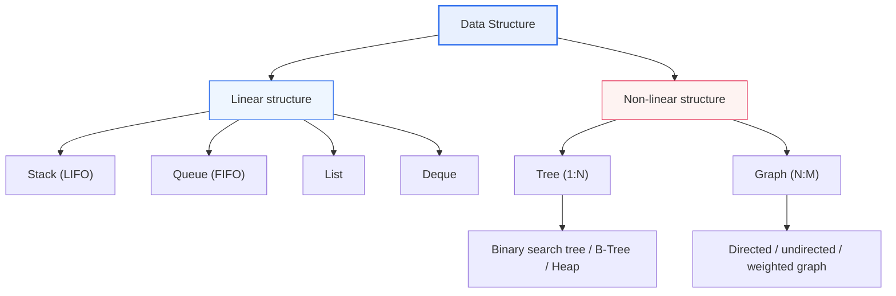
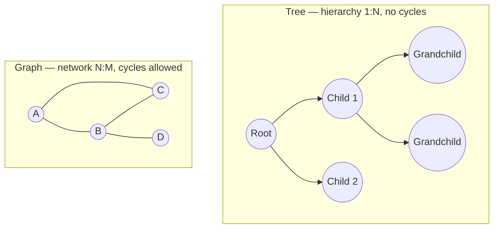

# Data Structures: Linear and Non-Linear Structures

## 1. Overview

### A. Definition
> A **Data Structure** is a logical way of organizing data to store, manage, and operate on it efficiently. Depending on how elements are connected, data structures are divided into **Linear Structures**, in which elements are arranged in a single line, and **Non-Linear Structures**, in which elements are connected in hierarchical or network forms.

The essence that separates the two structures is "**how the elements are connected to each other**." A linear structure is a 1:1 connection in which elements are lined up in a row and each element has only one neighbor before and after it. Except for the first and last elements, every element has exactly one predecessor and one successor. A non-linear structure, on the other hand, has one element connected to multiple elements (1:N or N:M), forming a hierarchy or mesh. It is a form in which one parent has multiple children, or one vertex is linked to multiple vertices by edges.

This difference in connection form is decisive because it determines **what relationships can be expressed and how efficient search, insertion, and deletion are**. Data where order matters (waiting queues, function call history, undo stacks) is naturally expressed with linear structures. On the other hand, complex relationships where one thing is entangled with many — such as reporting lines in an organization chart, transfer relationships in a subway map, or friend relationships on social networks — can be expressed without distortion only with non-linear structures. In other words, choosing a data structure is not simply a matter of storage convenience but **a modeling problem of translating the relationship structure of the problem domain into code**.

One point to note is that "linear/non-linear" is strictly a classification of **logical (abstract) structure**. Whether a linear array is laid out contiguously in memory, or a non-linear tree is scattered via pointers, is a matter of implementation (physical structure). For example, a Heap is logically a complete binary tree (non-linear) but is physically implemented as an array (linear). Understanding logical and physical structures separately in this way is the starting point of data structure design.

### B. Background and Necessity
Choosing a structure that does not fit the relational characteristics of the problem's data causes performance to deteriorate sharply. For example, if a hierarchical relationship such as an organization chart is forced into an array (linear), finding the sub-organizations of a particular node requires scanning the whole thing, increasing search to O(n). Conversely, implementing a work history — which only needs to be stacked and retrieved in order — as a tree merely adds unnecessary complexity.

Choosing the right data structure directly determines the time and space complexity of algorithms. Even the same "search" operation is O(n) in an unsorted linear list but O(log n) in a balanced binary search tree. With 1 million records, O(n) takes up to 1 million comparisons while O(log n) finishes in about 20. This gap translates directly into differences in response speed and throughput, so from a Professional Engineer's perspective, data structures are a **foundational technology inseparable from algorithm and performance design**.

## 2. Overall Classification of Data Structures

First, drawing an overall map of how data structures branch out makes it clear where linear and non-linear structures sit.

As the classification above shows, linear structures are subdivided by "input/output rules," and non-linear structures by "the topology of connection (hierarchy or network)." From the next chapter, the principles and actual uses of each branch are explained in prose.

## 3. Linear Structures

The character of a linear structure changes completely depending on the rule by which data is put in and taken out. The rule is the very identity of the data structure, and thanks to this rule, very fast O(1) operations are guaranteed in specific situations.

### A. Stack — Last-In-First-Out (LIFO)
A **stack** is a Last-In-First-Out structure in which the element inserted most recently is removed first. Like stacking plates and removing them from the top, both insertion (push) and deletion (pop) occur only at one place, the "top." Thanks to this constraint, both operations are processed in O(1).

The stack is powerful because it perfectly fits problems of "**returning to the most recent state**." The program's function call stack is the classic example. If function A calls B and B calls C, the returns must happen in exactly reverse order (C→B→A), which is LIFO. Undo in a document editor, the "back" button in a web browser, parenthesis matching in expressions, and postfix expression evaluation are all implemented with stacks. For example, in an expression with parentheses nested three levels deep, pushing each opening parenthesis and popping at each closing one allows determining in O(n) whether they match, based on whether the stack ends up empty.

What needs attention is managing the stack's size. If recursive calls become too deep, the call stack exceeds its limit and a stack overflow occurs. This is why, in practice, recursion is converted into loops with an explicit stack, or tail call optimization is considered.

### B. Queue — First-In-First-Out (FIFO)
A **queue** is a First-In-First-Out structure in which the element inserted first is removed first, like standing in line at a ticket office. Insertion (enqueue) occurs at the rear, and deletion (dequeue) at the front. The queue is the foundation of every situation where items must be "**processed fairly in the order they arrived**."

Printer job queues, OS process scheduling queues, network packet buffers, and message queues (Kafka, RabbitMQ) are all queues. Breadth-first search (BFS) on a graph also places nodes to visit in a queue and scans from the nearest ones. In practice, a **Circular Queue** that reuses an array circularly is used so that memory is not wasted when the front empties, and in producer-consumer problems, a bounded queue is used to control flow (backpressure).

### C. List and Deque
A **list** is a general-purpose structure that holds elements in order while supporting access, insertion, and deletion at arbitrary positions. Its character depends on the implementation: an **array-based (sequential) list** can access the i-th element immediately in O(1) by index, but mid-list insertion and deletion require shifting elements, costing O(n). In a **Linked List**, each node points to the address of the next node, so mid-list insertion and deletion take O(1) by merely changing pointers, but finding the i-th element requires traversing from the front, costing O(n). Because of this trade-off, the practical principle holds: "**arrays when lookups are frequent, linked lists when insertions and deletions are frequent**."

A **Deque (Double-Ended Queue)** is a structure that allows insertion and deletion at both ends, encompassing both stacks and queues. It is used when both ends must be handled freely, such as computing sliding-window maximums or managing a least-recently-used (LRU) cache.

The table below summarizes linear structures by rule, operation complexity, and usage. The table is only supplementary material condensing the prose explanation above.

| Type | Rule | Typical operation complexity | Typical uses |
|---|---|---|---|
| **Stack** | Last-in-first-out (LIFO) | push/pop O(1) | Function calls, undo, parenthesis checking, DFS |
| **Queue** | First-in-first-out (FIFO) | enqueue/dequeue O(1) | Job queues, scheduling, buffers, BFS |
| **List (array)** | Sequential by index | Access O(1), mid-insert O(n) | Lookup-oriented collections |
| **List (linked)** | Pointer-linked | Access O(n), insert O(1) | Collections with frequent insert/delete |
| **Deque** | Insert/delete at both ends | Both ends O(1) | Sliding window, LRU |

## 4. Non-Linear Structures

The representative non-linear structures are trees and graphs. Both have "one connected to many," but they differ in that a tree is a hierarchy with no cycles (1:N), while a graph is a network that allows cycles (N:M). Below is a detailed concept diagram showing the topological difference between trees and graphs.

### A. Tree
A **tree** is a hierarchical structure starting from a single root in which a parent has multiple children; it has no cycles, and the path between any two nodes is unique. Trees matter because of their power to "**express hierarchical relationships as they are while bringing search down to logarithmic time**."

The most widely used **Binary Search Tree (BST)** keeps data in sorted order by the rule "left child < parent < right child," performing search, insertion, and deletion in O(log n) on average. However, if input arrives in sorted order, the tree skews to one side and degenerates to O(n); to prevent this, balanced trees such as **AVL trees and red-black trees** automatically adjust their height through rotation operations. Disk-based databases and file systems use **B-Tree/B+Tree** indexes, in which a node has hundreds of children, minimizing the number of disk accesses to the tree height (typically 3–4 levels). This structure is the secret to finding a desired record with just a few block reads even in a table of millions of rows. Also, the **Heap**, which implements a priority queue, extracts the maximum or minimum in O(1) and reorders in O(log n) by the rule that a parent is always greater (or smaller) than its children.

### B. Graph
A **graph** is defined as a set of vertices and a set of edges connecting them; if relationships have direction, it is a directed graph, and if edges carry costs, it is a weighted graph. The graph is the most general tool for expressing "**complex interconnections among arbitrary entities**."

Shortest-path search in navigation is the result of treating intersections as vertices and roads as weighted edges and applying Dijkstra's algorithm. Friend recommendations on social networks are a problem of finding "friends of friends" in the user graph, and PageRank in web search is an importance calculation on the link graph. Graphs are implemented with an adjacency matrix (O(V²) space for V vertices) or an adjacency list (O(V+E) space proportional to the number of edges), and for real-world networks with sparse edges, adjacency lists are far more efficient. The basic traversals are depth-first (DFS, using a stack) and breadth-first (BFS, using a queue), which is a good example of the linear structures seen earlier serving as the search engine for non-linear structures.

| Type | Connection form | Key variants | Uses |
|---|---|---|---|
| **Tree** | Hierarchy 1:N, no cycles | BST, AVL, B-Tree, Heap | Indexes, file systems, priority queues |
| **Graph** | Network N:M, cycles allowed | Directed, weighted, bipartite graphs | Shortest path, social networks, recommendation, PageRank |

## 5. Linear vs. Non-Linear Comparison — Why the Differences Arise

The difference between the two structures stems not from their superficial shape but from "**the nature of the relationships they are meant to express**." Linear structures are optimized for relationships that can be lined up in a single row, such as time and order, and so search also flows sequentially from front to back. Non-linear structures were born to hold hierarchical and network relationships that cannot be lined up in a single row, and so they require searches that branch out in multiple directions, such as DFS and BFS. In other words, the difference in search method is a necessary consequence of the difference in connection form.

The practical implications also come from here. Logs, histories, and buffers that only need to preserve order are better implemented linearly to gain implementation simplicity and O(1) operations, while problems centered on many-to-many relationships or hierarchical search (recommendation, routing, organization) must be designed non-linearly from the start to avoid performance bottlenecks and redesign costs later.

| Category | Linear structure | Non-linear structure |
|---|---|---|
| **Connection** | 1:1 (single row) | 1:N, N:M (hierarchy, network) |
| **Relationships expressed** | Order and time relationships | Hierarchical and network relationships |
| **Search** | Sequential search | DFS, BFS (path and hierarchy search) |
| **Representative examples** | Stack, queue, list, deque | Tree, graph |
| **Suitable situations** | Ordered data, buffers, histories | Complex relationships, hierarchies, path data |
| **Implementation cautions** | Overflow, circular reuse | Maintaining balance, handling cycles |

## 6. Advanced — Applied Data Structures and Practical Application Strategies

Modern systems use **applied data structures** that combine or specialize the two rather than using pure linear or non-linear structures as is. Understanding these is the depth expected at the Professional Engineer level.

First, a **Hash Table** maps keys to array indexes via a hash function to achieve average O(1) lookup, combining it with linked lists (chaining) for collision resolution. It is an example of combining linear structures (array + list) to create a new property: "near-constant-time lookup." It is at the core of large-scale caches (Redis) and database joins.

Second, database index design is itself a choice of data structure. If range searches (BETWEEN) and sorting are frequent, a **B+Tree index** that maintains sorted order is chosen; if only equality searches are needed, a **hash index** is chosen. In practice, querying a 1-million-row table without an index requires a full scan, O(n), but with a B+Tree index it finishes in a few node traversals, commonly improving response time by tens of times.

Third, **graph databases (such as Neo4j)** that store and query graph relationships themselves have recently risen. They process "friends of friends of friends," which relational DBs express with multi-level joins, directly via graph traversal, showing performance advantages in domains dominated by relationship exploration such as recommendation, fraud detection, and knowledge graphs. This shows that choosing a store that fits the domain's relationship structure remains the fundamental principle.

## 7. Considerations and Implications

1. **Choosing a structure that fits the relational characteristics of the data determines performance.** Linear structures are natural and efficient for order and history, non-linear structures for hierarchies and relationships. A wrong choice goes beyond simple inefficiency and forces a complete redesign at the scaling stage, so the domain's relationship structure must be analyzed first at the beginning of design.

2. **Data structure choice is directly linked to algorithmic complexity (Big-O).** The same problem can be O(n), O(log n), or even O(1) depending on the structure used. Data structures and algorithms must be designed together; first determine "which of search, insertion, and deletion is the dominant operation," then choose a structure in which that operation is fast.

3. **The time-space trade-off must always be weighed.** Hash tables use spare memory for fast lookups, and adjacency matrices favor dense graphs but waste space on sparse ones. In embedded and mobile environments with strict memory constraints, space efficiency may take priority, while in large-scale servers, time efficiency may take priority.

4. **Logical structure and physical implementation must be judged separately.** Just as a heap is implemented as an array and a graph as an adjacency list, the optimal implementation of the same logical structure differs according to access patterns, cache locality, and disk characteristics. Especially on disk- and SSD-based systems, cache locality and the number of block accesses are as important as theoretical complexity.

5. **Constantly consider extension to applied and specialized structures.** Since solutions that combine and specialize basic structures — such as balanced trees, hash tables, and graph DBs — keep evolving, the choice of data structure must be re-evaluated when problem scale and access patterns change.

---

> **In one line**: Linear structures (stack, queue, list, deque) connect elements 1:1 in a row and handle order relationships with O(1) operations, while non-linear structures (tree, graph) connect elements in 1:N and N:M hierarchies and networks to support complex relationships and logarithmic-time search, and choosing a structure that fits the relational characteristics of the data determines search efficiency and algorithmic complexity.
