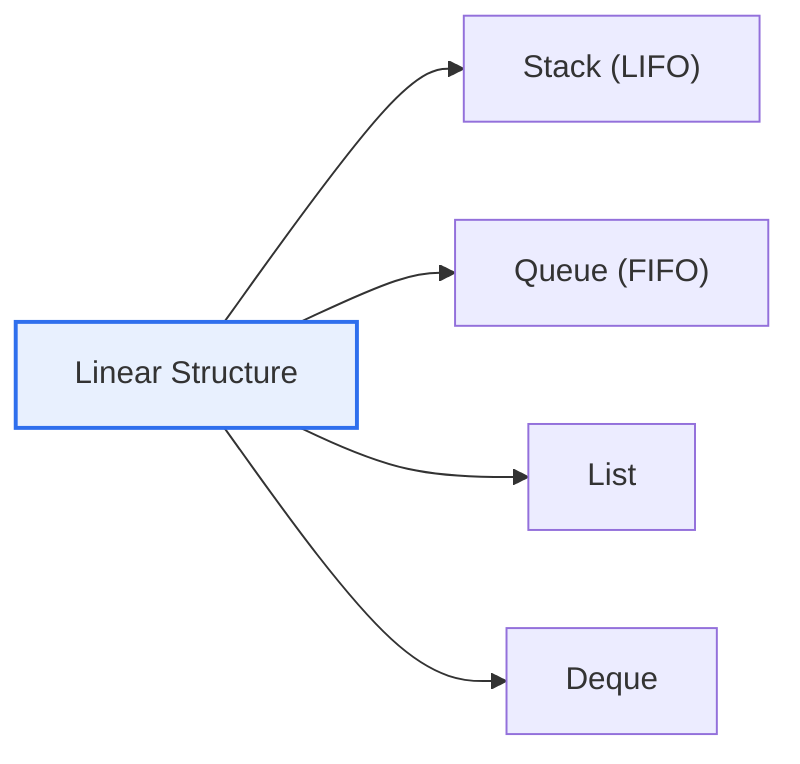

# Data Structures: Linear and Non-Linear Structures

## 1. Overview

### A. Definition
> A **data structure** is a logical way of organizing data for efficient storage and management. Depending on the form of connection between elements, it is divided into **linear structures** (elements in a line) and **non-linear structures** (hierarchical or network form).

The essence dividing the two structures is '**how the elements are connected**'. A linear structure is a 1:1 connection in which elements are lined up so that each element has exactly one neighbor before and after it. A non-linear structure, by contrast, has one element connected to multiple elements (1:N or N:M), forming a hierarchy or a web. This difference in the form of connection is decisive because it determines **what relationships can be expressed and how efficiently search, insertion, and deletion can be done**. Data where order matters (a waiting queue, an execution history) is naturally expressed by a linear structure, while complex relationships—such as an organization chart, a map, or SNS friendships—can only be expressed by a non-linear structure.

### B. Necessity
Using a structure that does not fit the relational characteristics of the problem's data degrades performance sharply. For instance, forcing a hierarchical relationship into a linear structure makes search inefficient. Choosing the right data structure directly governs an algorithm's time and space complexity.

## 2. Linear Structures

Linear structures are divided by their input/output rules. A **stack** takes out what was put in most recently first, that is, last-in-first-out (LIFO); it is used for situations that 'process the most recent thing first', such as a function-call stack or an undo feature. A **queue** takes out what was put in first, that is, first-in-first-out (FIFO); it is used for 'processing in order', such as a printer job queue or a buffer. A **list** supports random-position access and insertion via sequential or linked methods, and a **deque** allows insertion and deletion at both ends.

| Type | Concept | Representative Use |
|---|---|---|
| **Stack** | Last-in-first-out (LIFO) | Function calls, undo, expression evaluation |
| **Queue** | First-in-first-out (FIFO) | Job queues, buffers, BFS |
| **List** | Sequential/linked list | Sequential access, dynamic insertion |
| **Deque** | Insertion/deletion at both ends | Scheduling, sliding window |

## 3. Non-Linear Structures

The representatives of non-linear structures are trees and graphs. A **tree** is a hierarchical (1:N) structure in which one parent has multiple children and there are no cycles; it is used for hierarchical or sorted data, such as a file system's folder structure or a database index (B-Tree). A **graph** is a network (N:M) structure made of vertices and edges; it expresses complex interconnections, such as a subway map, SNS friendships, or navigation routes.

| Type | Concept | Use |
|---|---|---|
| **Tree** | Hierarchical structure (1:N), no cycles | File systems, indexes, org charts |
| **Graph** | Network of vertices and edges (N:M) | Networks, shortest path (maps, SNS) |

## 4. Linear vs. Non-Linear Comparison

The two structures contrast in the relationships they express and their traversal methods. Linear structures traverse order relationships sequentially, while non-linear structures traverse hierarchical/network relationships via depth-first (DFS), breadth-first (BFS), and other methods.

| Category | Linear Structure | Non-Linear Structure |
|---|---|---|
| **Connection** | 1:1 (in a line) | 1:N, N:M (hierarchy/network) |
| **Expressed relationship** | Order relationship | Hierarchical/network relationship |
| **Traversal** | Sequential | DFS/BFS (path search) |
| **Examples** | Stack, queue, list | Tree, graph |
| **Suited for** | Ordered data | Complex relational/hierarchical data |

## 5. Considerations and Implications

1. **Choosing a structure that fits the relational characteristics of the data governs performance.** Order and history are natural and efficient in linear structures; hierarchy and relationships in non-linear structures.
2. **Understand the extension into applied data structures.** Balanced trees (AVL, B-Tree) make search efficient, heaps handle priority, and graph algorithms (Dijkstra) optimize shortest paths.
3. **Data-structure choice is directly tied to algorithmic complexity (O-notation).** Even for the same problem, the choice of structure splits the outcome into O(n) versus O(log n), so data structures and algorithms must be designed together.

---

> **In one line**: Linear structures (stack, queue, list) connect elements 1:1 in a line, while non-linear structures (tree, graph) connect them in 1:N and N:M hierarchies and networks; choosing a structure that fits the relational characteristics of the data governs search efficiency and algorithmic complexity.
