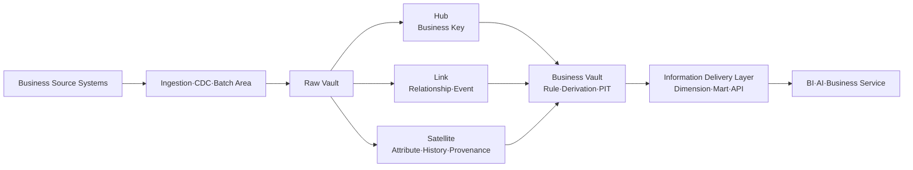
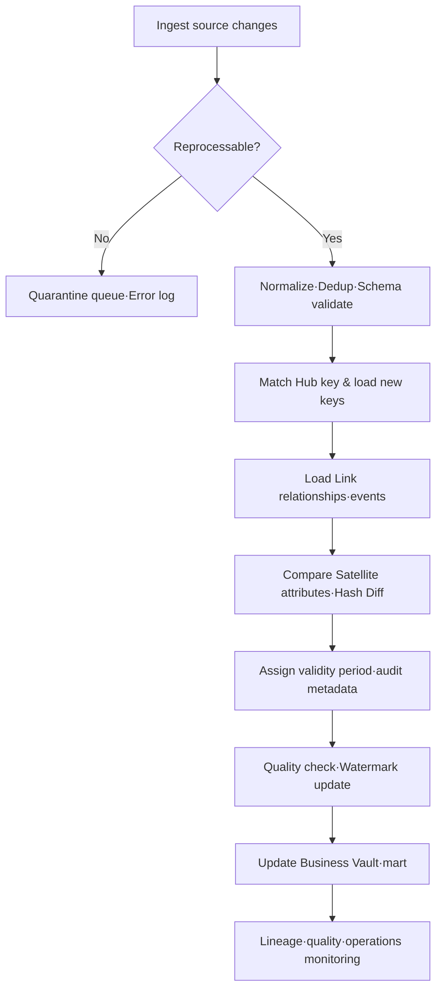

# Data Warehouse Modeling Based on Data Vault 2.0

## 1. Overview

### A. Definition

> **Data Vault 2.0** is a data modeling methodology that, for an extensible data warehouse that accommodates business change, separates data into Hubs that preserve business keys, Links that express relationships, and Satellites that store context and history, and designs a Raw Vault and a Business Vault centered on parallel loading, history preservation, and auditability.

Data Vault is not a particular database product or a mere table template.
In situations where business systems keep being added and source schemas keep changing, it loads source data with as little loss as possible and presents both a storage structure and loading principles so that business rules and analytical requirements can later be reproduced.
Therefore, merely memorizing the three table types—Hub, Link, and Satellite—misses the core of the answer.
The core lies in separating identifiers and relationships, context and history, by their differing rates of change so that changes are localized.

The traditional dimensional model provides a star schema that is convenient to use directly for analytical queries, but it often requires re-adjusting dimensions and fact tables when a new source or attribute comes in.
Data Vault, by contrast, records source facts in the Raw Vault first and performs the business rules and performance optimizations needed by consumers in the Business Vault and the information delivery layer.
This separation avoids over-demanding two different goals—source preservation and ease of use—from a single model.

Data Vault's history preservation differs from a simple backup.
It must be possible to trace which key and attributes came in from which source and at what time, when those values were valid, and which load batch created them.
Such temporality and provenance become the basis for reproducing results in financial, customer, and supply-chain analysis, tracing back the cause of data errors, and responding to regulatory audits.

### B. Background and Necessity

First, the enterprise data environment keeps growing in sources because of mergers and acquisitions, SaaS adoption, organizational restructuring, and microservice decomposition.
When a warehouse that initially integrated a single ERP comes to connect CRM, order platforms, IoT, and external partner data, the rules and refresh cycles for identifying the same customer diverge.
Trying to integrate every source perfectly from the start makes agreement on a common model a bottleneck, and the design may grow stale before requirements are finalized.

Second, if analytical results show only current values, past decisions are hard to reproduce.
When a customer grade or product classification changes, reclassifying past orders by the current criteria yields results different from the reports of that time.
Data Vault separates observation time, load time, source identifiers, and change history to distinguish "what the data was at that time" from "how it is interpreted in current business terms."

Third, data-loading pipelines need to be parallelized per source.
Cramming all transformations into a central integration table at once means that a delay or schema change in a particular source blocks the entire load.
Decomposing into Hub, Link, and Satellite by business key and relationship allows per-source ingestion and per-attribute history loading to run independently.

Fourth, in data lakes and cloud warehouses, change response and operational automation can cost more than storage.
Data Vault separates the source-preservation layer, the history layer, and the rule layer, making it easy to apply metadata-driven auto-generation and repeatable loading patterns.
However, storing all source data is not unconditionally good; personal-data minimization and retention-period policies must be designed together.

### C. Core Goals and Scope of Application

Data Vault's first goal is **resilience to change**.
New attributes can be accommodated by adding a Satellite or extending the history structure of an existing Satellite, and new relationships can be separated out as Links.
This lets you modify only the area where change occurred without rewriting the entire integration model each time.

The second goal is **auditability and reproducibility**.
Preserving technical metadata such as source system, load time, batch identifier, and record valid time on each row lets you explain where results came from.
But having technical metadata does not automatically make meaning consistent, so business terminology, data contracts, and quality rules must be linked separately.

The third goal is **parallelism and scalability**.
Loading customer information and contract information, and order and payment relationships, as mutually independent flows, and processing multiple sources' Satellites in parallel, lets you combine large-scale batch and streaming.
Here parallelism does not arise merely from finely splitting tables; it presupposes an idempotency design that controls duplicate events, out-of-order arrival, reprocessing, and key collisions.

Data Vault fits an integrated analytics platform where there are many sources, change is frequent, and long-term history and traceability matter.
Conversely, for a single-source simple report or a small operational database, the overhead of introducing Hub, Link, and Satellite can be greater.
In an engineer's answer, do not assert "applicable to every data warehouse"; judge applicability based on rate of change, audit level, analytical latency, and operational capability.

## 2. Components and Data Flow

### A. Overall Structure

Source systems—ERP, CRM, orders, payments, sensors, files, external APIs—have differing schemas and refresh cycles.
Rather than converting all data to business meaning at once, the ingestion layer passes it to the Raw Vault while preserving source identifiers and change events.
When using CDC, you must also manage the order of create/update/delete events and the reprocessing position; when using batch files, you must manage the file hash and receipt time.

The Raw Vault is a layer that preserves source facts with as little processing as possible.
Here, "no processing" does not mean storing all originals without limit; it means normalizing them by traceable rules without arbitrarily overwriting business meaning.
Technical processing such as character encoding, standard time, and key normalization may be necessary, but source values and transformation history must not be lost.

The Business Vault is a layer that combines multiple sources and applies derivation rules needed for business analysis.
Point-in-Time tables, Bridge tables, current-state flags, effectiveness determination, and deduplication results can be placed in this layer.
This keeps the Raw Vault stable against source change, while policy changes can be version-managed in the Business Vault.

The information delivery layer is composed of star schemas, wide tables, data marts, feature views, and so on, to match the performance of user queries and tools.
End users should use data products with clear meaning and defined quality SLOs rather than directly joining Hubs or Satellites.
The Raw Vault's normality and auditability and the mart's usability and performance are different optimization goals, so separating the layers is the crux of the design.

### B. Hub: The Stable Center of Business Keys

A Hub represents core business entities that are identified independently in the business—customer number, contract number, product code, account number.
At the center of a Hub is the business key; this needs to be an identifier that points to the same object in business terms even when the source changes, not a mere database auto-increment number.
If there are multiple sources, keep the source system code and source key together to prevent collisions, and make the integrated identifier and mapping relationship clear.

A Hub typically holds attributes such as Hub Key, Business Key, Load Date, and Record Source.
The Hub Key provides stability for joins and references, and the Business Key is the basis for business meaning and duplicate determination.
The Load Date is the time the data entered the platform; do not assume it equals the time the business event occurred or the valid-start time.

The reason not to put changing descriptive attributes such as a customer's name, address, and grade in the Hub is that their rates of change differ.
Putting such attributes in the Hub forces you to update the Hub row every time customer information changes, and mixing the roles of identifier and description makes history tracking difficult.
Put attributes in the Satellite so that a new version is added on change, and let the Hub focus on the existence and identification of the entity.

A business key should not be used as an integrated key just because it looks plausible.
To assert that customer number in system A and member number in system B mean the same customer, you need mapping rules, deduplication criteria, business-owner approval, and exception-handling procedures.
If a key is unstable or reused, preserve the source system identifier and validity period together, and manage integrated customer identification with a separate mapping model.

### C. Link: A Record of Relationships and Events

A Link expresses relationships between Hubs or business events.
Use a Link when two or more business entities together create meaning—the relationship between customer and contract, between order and product, between account and transaction.
Rather than overloading a Link with relationship attributes, the general principle is to preserve the occurrence of the relationship itself and the participating keys, and to separate changing descriptions into Satellites.

A Link means more than a simple many-to-many junction table.
Events that occur over time—orders, payments, shipments—become the center of analysis by combining the participating Hubs with the occurrence time.
If an event is one where the same Hub combination can occur multiple times, do not deduplicate by business key alone; consider event identifiers such as transaction number, event number, and occurrence sequence separately.

When a relationship spans three or more Hubs, be careful about how to decompose the link.
For example, in a transaction where order, customer, store, and product participate simultaneously, putting all keys into one link makes the meaning clear but can make change and reuse difficult.
Conversely, unconditionally decomposing into small links increases join complexity and the possibility of duplicate events, so design based on the atomicity of the business event and the analytical query.

A Link's Satellite can store attributes that belong to the relationship—status, role, quantity, contract terms, validity period.
A product's own color should be in the product Hub's Satellite, but the selling price and discount rate at the time of order should be in the order-product relationship's Satellite so that past transactions can be reproduced.
Wrongly assigning where an attribute belongs causes the problem of customer or product changes contaminating past orders.

### D. Satellite: Context, History, and Provenance

A Satellite stores the descriptive attributes dependent on a Hub or Link and their change history.
Customer name and address, contract status, product description, credit-rating results, and order status are representative examples.
A Satellite groups attributes with similar meaning and rate of change, and separates attributes with different security grades and owning organizations, to ease access control and change management.

A row in a Satellite generally consists of the parent key, Load Date, Hash Diff, Record Source, and attribute values.
Hash Diff can be used to quickly judge whether the set of attributes has changed from the previous version, but a matching hash does not prove that the business meaning is necessarily identical.
Without standardizing the hash algorithm, string normalization, null representation, column order, and encoding rules, the same value can produce different hashes, or different values can be treated by the same comparison rule.

Whether to put an attribute group in a single Satellite or split it into several is decided based on rate of change and security boundaries.
Putting a customer status that changes daily together with demographic attributes that rarely change causes large rows to be stored repeatedly even for small changes, and needlessly widens the scope of personal-data access.
On the other hand, over-fragmenting increases joins and complicates metadata management, so check the commonality of meaning, rate of change, ownership, and security grade.

It is important that a Satellite is a history table, not a current-value table.
A service that must provide only the current state is built by determining the latest row in the Business Vault or the information delivery layer.
Making the latest state by directly deleting or overwriting the Raw Vault's history loses past-report reproducibility and auditability, so separate the purposes of the source layer and the consumption layer.

## 3. Loading Procedure and Key Design

### A. Loading Order

First, ingest the source event or file, and store the receipt ID and checkpoint so the same input can be reprocessed.
Ingestion success and business-load success must be managed as separate states.
Marking that a file was received as though it were fully and correctly reflected in Hub, Link, and Satellite makes missing ranges hard to find during failure recovery.

In the next stage, perform key normalization, time-zone unification, required-field checks, schema-version verification, and duplicate-event determination.
Rather than unconditionally discarding source values at this stage, preserve error rows in a quarantine area and record the error code and whether reprocessing is possible.
Silently excluding rows that fail the quality check creates the more dangerous problem where the load count looks like a success while analytical results silently shrink.

For a Hub, first check whether the business key already exists, and if it is a new key, generate the Hub Key.
When using a Hash Key, standardize the key-generation function and the order of input fields so that different pipelines create the same key for the same entity.
The possibility of hash collision, algorithm replacement, key length, and case/whitespace normalization policy must be specified in the design document.

After the Hub is ready, loading the Link lets you reference the participating Hubs' keys.
Include the relationship's source event ID in the uniqueness criterion, and provide an idempotent key so that the same event is reflected only once even if retransmitted.
For a Satellite, compare the parent key and whether attributes changed, add a new history row only when there is an actual change, and avoid creating duplicate rows for the same event received repeatedly.

Finally, verify the load count, number of new Hubs, number of unmapped keys, number of orphan Link rows, Satellite change rate, and latency.
The verification results must be viewable not only in pipeline logs but also in the data quality store and the operations dashboard.
The Watermark indicates the last successfully processed input position, so manage the commit order and reprocessing range together so as not to skip the input of a failed step.

### B. Effectiveness / Point-in-Time Model

In Data Vault, the Load Date is the time observed on the platform, and the Effective Date is the time the value is valid in business terms.
For example, if a customer-grade change that occurred on September 1 arrived on September 3 due to a network failure, the two dates differ.
Whether the analyst wants "the value we knew as of September 2" or "the value applied from September 1 in business terms" changes the query rule.

Confusing these two points in time makes reports differ when late-arriving data is reflected into a past period, or makes the data used for a decision at the time inconsistent with data recalculated now.
Therefore, store the valid-start/end time, load time, and source-event time in the Satellite to the necessary degree, and specify the time basis in the data contract.

The logic for finding the current row may not be sufficient by simply picking the largest Load Date.
This is because future-valid rows, late-arriving corrections, multiple events at the same time, and deletion markers can coexist.
It is safer to generate PIT and current-state views in the Business Vault that specify business priority and point-in-time rules, and to prevent consumers from arbitrarily picking the latest row.

### C. Data Quality and Idempotency

Idempotency is the property that makes the final result the same whether the same input is processed once or multiple times.
Because Data Vault presupposes reprocessing and parallel loading, it creates a deduplication criterion by combining the parent key, source event identifier, attribute hash, and load-batch information.
Simply using the pipeline run ID as the key causes the problem where the same data piles up as new rows on every rerun.

Representative quality rules are the mandatoriness of the Hub business key, the uniqueness of the Hub Key, the referenceability of the Link's participating keys, the existence of the Satellite's parent key, validity-period overlap, an allow-list of Record Source, and Hash Diff reproducibility.
These rules should not end with post-load sample checks; they should be automatically verified per batch so that failures do not propagate to the consumption layer.

Source deletion is also an important quality item.
The model changes depending on whether a soft-delete flag is delivered, whether delete events arrive separately, or whether physical deletion is required due to retention policy.
A personal-data deletion request can take priority over the Raw Vault's "history preservation" principle, so reflect a policy that includes tokenization, separate storage, deletion evidence, and backup expiration in the data model and operational procedures.

## 4. Comparing Data Vault 2.0 with Other Models

### A. Differences from the Star Schema

The star schema has simple query paths centered on fact and dimension tables and is easy for BI tools to understand.
So if user-dashboard response time and business-term-centered usability are the top priorities, the star schema can be a direct choice.
However, trying to express multiple sources' source history and change process simultaneously in one model can increase dimension-change management and ETL complexity.

Data Vault preserves history and provenance first in the Raw Vault and generates a star schema for end-user convenience in a separate layer.
As a result, the Raw Vault has many joins and is hard to query directly, but it does not shake the entire dimensional model when accommodating a new source or attribute.
The two models are less competitors than potentially different roles in the storage/integration layer and the consumption/presentation layer.

| Comparison Item | Data Vault 2.0 | Star Schema | Practical Judgment |
|---|---|---|---|
| Basic purpose | Change resilience, history, audit | Simplify/speed analytical queries | Separate goals by layer |
| Central structure | Hub·Link·Satellite | Fact·Dimension | Consider number of sources and consumers |
| Schema change | Localize the scope of impact | Possible dimension/fact redesign | Vault favorable if change rate is high |
| User access | Generate marts rather than direct use | Friendly to BI tools | Suited to the final delivery layer |
| Storage/joins | Increased by history and technical metadata | Relatively simple | Compute storage and query cost together |
| Audit/reproducibility | Strong at tracing source, point-in-time, provenance | Varies by implementation | Evaluate regulatory/audit needs first |

For example, if a financial institution integrates customer, account, and transaction sources while products and regulations change yearly, it can preserve source history and relationships with Data Vault and provide the month-end P&L mart as a star schema.
Conversely, if one department only queries the daily sales volume of one system, a simple dimensional model or an aggregate table can be operationally more reasonable than inserting Data Vault in the middle.

### B. Differences from Data Lake / Lakehouse

A data lake is strong at storing source data of various formats at low cost, and a lakehouse combines transaction, schema, and table management on top of object storage.
Data Vault focuses on the integration model and history-management principles rather than the storage medium.
Therefore, combinations are possible—implementing a Raw Vault on top of a lakehouse, or implementing Data Vault on a warehouse engine.

A lake's raw area broadly holds structural change and unstructured data, but if the meaning of business keys, relationships, and history is not managed consistently, consumers each interpret it their own way.
Separately from source preservation, Data Vault makes business keys and relationships explicit, making it easy to build an integrated catalog and lineage.
However, replicating all sources into Vault tables can lose the lake's flexibility and cost advantage, so distinguish the roles of the raw area and the highly consistent integration area.

### C. Differences from the 3NF Model

The 3NF model normalizes business data through functional dependency and duplicate elimination and reduces update anomalies.
It is strong at accurately managing the state of business transactions, but maintaining the history and provenance of multiple sources from an analytical perspective requires a separate history design.
Data Vault also reduces duplication inside its components, but it prioritizes change isolation and history preservation over the minimum number of tables for analysis.

The choice between 3NF and Data Vault is not a matter of "is normalization good" but a matter of business purpose and the time axis.
3NF and strong constraints suit order processing in the operational system, while Vault can suit long-term source integration and change tracking.
Even within a single data platform, the operational system, Raw Vault, Business Vault, and mart can use different models.

## 5. Application Cases and Deep Dive

### A. Retail/Commerce Case

Suppose multiple online channels and offline stores manage customers, products, and orders with different keys.
The customer Hub preserves each source's source key and the integrated mapping, and the order Link connects the customer, product, sales channel, and order event.
Placing the price and discount at the time of order in the Link Satellite keeps past order amounts unchanged even when a product's current price changes.

The advantage of this structure is that when a new sales channel is added, you can add the channel source's Hub mapping and the related Link and Satellite without redesigning all the ETL of the existing order mart.
But if identifying the same customer is inaccurate, customer lifetime value is double-counted, so you must maintain the reliability of key mapping and a manual-review queue.
Also, order cancellation, partial refund, and reshipment are not simple current-state updates but a Link design challenge that must preserve the order and amounts of events.

### B. Manufacturing/Supply-Chain Case

A manufacturer has factories, equipment, materials, suppliers, and production orders in different systems, and equipment-sensor and quality-inspection data flow in continuously.
Placing an equipment Hub and a production-order Hub, an equipment-order Link, and separating status, maintenance history, and inspection results into Satellites, lets you accommodate sensor-system replacement and ERP overhaul separately.

In the Business Vault, combine production orders and inspection results to compute defect rate, uptime per equipment, and delivery metrics per supplier.
Here, because the sensor event time and the ingestion time differ, you must specify a rule for which production period a late-arriving event belongs to.
When real-time control is needed, it is safer not to use Data Vault as the direct store of the control loop, and to separate the operational system from the analytics platform.

### C. Public/Regulated-Data Case

Public institutions have many project-specific systems and delegated agencies, and the reproducibility of past statistics matters because laws, codes, and organizations change.
Recording the source institution, received file, applied code version, and load batch in the Raw Vault makes it easier to explain the basis of aggregated results.
In the Business Vault, version-managing the eligibility determination and statistical criteria under policy lets you distinguish results under the rules of the time from those under current rules for the same source.

However, public data may contain resident identifiers and sensitive information.
Access rights must not be widened on the grounds of source-history preservation; tokenization, encryption, column-level access control, access logs, retention periods, and destruction verification must be included in Data Vault operations.
An auditable model is not one that keeps data forever, but one that can explain the purpose of retention and the evidence of destruction.

### D. Latest Practical Extension Directions

Modern Data Vault 2.0 implementations are moving from people repeatedly writing SQL scripts to metadata-driven automation.
Managing the definitions of Hub, Link, and Satellite, source mappings, key rules, and quality rules as metadata lets you generate tables, loading code, documentation, and lineage together.
But auto-generation can rapidly propagate wrong business keys or wrong attribute assignment, so domain-expert approval and change history must always be kept.

When combining CDC and streaming, you must handle order, duplication, late arrival, deletion, and schema evolution together.
Rather than trusting only event arrival order, store the source log position, event time, watermark, and correction policy.
Even when real-time matters, rather than making all consumers read source events directly, providing verified Business Vault views and quality states is better for operational stability.

## 6. Considerations and Implications

### A. Business Keys and Integrated Identifiers

Selecting business keys determines the success or failure of the model.
Check whether a key is stable in business terms, whether its meaning is the same across systems, and whether it is reused, changed, or composite, and document key owners and exception-handling rules.
A Hash Key is useful for performance and distributed loading, but it does not replace the meaning of the business key, and it requires hash-input standardization and collision response.

### B. Balancing History Preservation and Personal-Data Minimization

The Raw Vault's preservation can conflict with personal data.
Separate sensitive attributes into a dedicated Satellite and permission area, provide only tokens or de-identified keys to the analytics layer, and manage destruction after the purpose is achieved and backup expiration.
When a deletion request occurs, confirm the processing scope of source, derived, cache, and backup via lineage, and keep the deletion result as audit evidence.

### C. Performance and Cost

Hub, Link, and Satellite store a lot of history and metadata, and the number of joins can increase.
Optimize frequently used point-in-time joins with PIT tables and aggregate views, but measure the refresh cycle and recomputation cost.
In the cloud, rather than deleting source history just to cut storage cost, combine partitioning, compression, clustering, storage tiers, and retention periods to optimize cost and reproducibility together.

### D. Data Quality and Operational Responsibility

Data Vault is not a model that automatically guarantees data quality.
Define key duplication, orphan Links, validity-period overlap, missing events, schema change, and late arrival as quality rules, and when thresholds are exceeded, deliver a warning/block/correction state to the consumption layer.
Define the boundaries of responsibility among each data product's owner, source-system owner, platform operator, and security officer using a RACI.

### E. Modeling Governance

Establish standards for in which situations to add a Hub, Link, or Satellite, how to split a Satellite, and who approves a business key.
Model changes should go through code review and automatic verification, and the pipeline should be organized so that schema, metadata, quality rules, and lineage all change together.
Making the standard too rigid slows adoption, while different interpretation by each team loses the benefit of integration, so provide an exception-approval procedure.

### F. Adoption Strategy and Success Metrics

Do not transform every enterprise domain from the start; select one domain where change is frequent and history/audit value is high.
Validate key mapping, reprocessing, a quality dashboard, and mart delivery as a single vertical slice in an area with clear effect—such as customers or orders—then expand.

Success is measured not by the number of tables but by new-source onboarding time, reprocessing success rate, lineage coverage, quality-error detection time, the reproducibility of core marts, consumer satisfaction, and cost.
If Data Vault is adopted yet all consumers still directly join source tables and maintain manual rules, the purpose of the model has not been achieved.

## 7. Answer-Structuring Strategy

In an exam answer, first define Data Vault as a methodology for change resilience, history, audit, and parallel loading.
Then present the roles of Hub, Link, and Satellite and the flow of Raw Vault → Business Vault → information delivery layer with a concept diagram.

After that, explain business key, Hash Key, Hash Diff, Load Date, Effective Date, Record Source, and idempotency in connection with the loading procedure.
Rather than merely listing terms, show with examples why attributes go in the Satellite and why event-bound values such as order price go in the Link Satellite.

At the end, compare with the star schema, 3NF, and lakehouse to present the conditions of application and the trade-offs.
Summarizing personal-data minimization, quality/lineage, cost/performance, and organizational governance and adoption strategy as considerations makes an engineer's conclusion.

## References

- Concept of the Data Vault model and the Hub·Link·Satellite structure: https://en.wikipedia.org/wiki/Data_vault_modeling
- Reference to Kimball Group's dimensional modeling techniques: https://www.kimballgroup.com/data-warehouse-business-intelligence-resources/kimball-techniques/

---

> **In one line**: Data Vault 2.0 separates business keys, relationships, and attribute history into Hub, Link, and Satellite to build an integration storage layer that withstands source change and audit demands, and it is a methodology that complements business rules, performance, and usability in the Business Vault and data marts.
