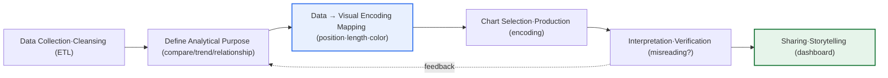
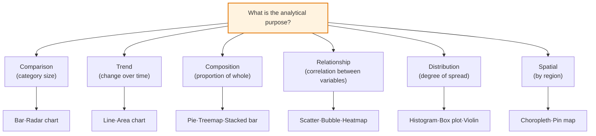

# Data Visualization

## 1. Overview

### A. Definition
> Data visualization is a representation and communication technique that **converts quantitative and qualitative data into visual encodings—position, length, angle, area, color, shape, and so on**, so that people can intuitively perceive patterns, trends, relationships, and outliers and draw out insight.

The power of visualization comes not from tools but from **the structure of human cognition**. The human brain is slow at reading and interpreting rows of numbers sequentially, but it perceives visual attributes such as color, position, and size **in parallel and instantly, before attention is even applied (preattentively)**. This is why a surge, an outlier, or a correlation that was invisible in a table of hundreds of rows becomes apparent at a glance in a single graph. Therefore, good visualization should be defined not as a 'nice-looking picture' but as a '**communication interface that conveys the meaning of data accurately and efficiently, without distortion**'.

A classic case that dramatically illustrates this point is **Anscombe's Quartet**. Four datasets with almost identical mean, variance, correlation coefficient, and regression equation reveal completely different shapes (linear, curved, outlier-driven) when drawn as scatter plots. This case—where data that looks identical under summary statistics diverges in essence when visualized—proves that visualization is not a mere supporting representation but **a methodology of analysis in its own right**. Conversely, wrong visualization (axis truncation, 3D distortion, inappropriate chart choice) can distort the facts and induce bad decisions, so with visualization, 'how not to distort' is as important as 'what to show'.

### B. Background and Necessity
Data is exploding, but the cognitive bandwidth people can absorb is limited. The log, transaction, and sensor data organizations collect grows exponentially, whereas the amount of information a decision-maker can understand in a single meeting is no different from decades ago. This **'imbalance between data supply and cognitive consumption'** makes visualization essential. Visualization compresses vast data so that decision-makers can quickly grasp a situation and act.

In particular, in the era of data-driven management and AI, it has established itself as the core means of **'data storytelling'**—conveying analytical results to stakeholders persuasively. No matter how sophisticated a machine-learning model is, if non-expert executives cannot understand its results, they do not lead to decisions. Indeed, Nightingale's visualization of the causes of death in the Crimean War with a 'rose diagram' to drive sanitary reform, and John Snow's plotting of cholera death locations on a map to identify a contaminated well (the Broad Street pump), are historical cases where **not data but visualization changed the decision**.

## 2. Principles and Production Procedure of Visualization

Data visualization is not the impromptu drawing of charts but **the design of a mapping that runs from the analytical purpose to the visual encoding**. The whole procedure can be expressed as a structure diagram as follows.

**First, in the data collection and cleansing stage**, missing values, outliers, and scale are sorted out. If this stage is poor, no matter how pretty a chart is layered on top, it cannot escape the principle 'garbage in, garbage out (GIGO)'. For example, drawing a bar chart from sales data with mixed units (won, thousand won, million won) without normalizing makes the axis meaningless.

**Second, defining the analytical purpose** is the most important stage that determines the success of visualization, because 'what you want to say' determines the chart. The visual encoding to choose differs depending on whether you want to compare sizes across categories (comparison), see change over time (trend), or see the relationship between two variables (correlation). If you skip the purpose and pick a 'cool chart' first, the message does not follow the data; the data gets dragged along by the chart.

**Third, map the data to visual encodings.** The key here is the **order of perceptual accuracy**. According to the experiments of Cleveland & McGill, people read values most accurately when represented by 'position (length along a common axis)', and error grows when represented by 'angle or area'. The very reason a pie chart is worse than a bar chart for comparison is that it encodes by angle and area. Therefore, if precise comparison is the goal, values should be mapped to 'length or position'.

**Fourth, after producing a chart, always interpret and verify it.** Check yourself whether there is room to read it differently from your intended message, and whether the axis, legend, and color invite misunderstanding. Only with this verification-feedback loop does visualization avoid degenerating into 'lying with data'.

The production principles running through this entire procedure can be summarized in four.

| Principle | Content | Problem if violated |
|---|---|---|
| **Truthfulness** | Represent data without distortion (axis starts at 0, no 3D) | Axis truncation exaggerates a 3% difference threefold |
| **Clarity** | The conveyed message is clear, emphasis specified | A cluttered chart where you can't tell what to look at |
| **Efficiency** | Maximum information with minimum ink (↑ data-ink ratio) | Grids, shadows, ornaments obscure the data |
| **Aesthetics** | Readable color, layout, alignment | Overuse of high-saturation colors causes fatigue and misreading |

In particular, **truthfulness** takes priority over the other three. Cutting the axis's starting point somewhere other than 0 (truncated axis), or distorting area by perspective with 3D effects, makes the picture tell a lie even when the data is true. Edward Tufte, who proposed the concept of the **data-ink ratio**, said to 'remove all ink that does not contribute to communication (chartjunk)', which is the theoretical basis of the efficiency principle.

## 3. Types of Visualization — Choosing Charts by Purpose

The type of visualization is, as emphasized above, determined by the analytical purpose of '**what you are trying to show**'. The combination of the data's structure (categorical/continuous/time-series/geographic) and the intent to convey (comparison/trend/composition/relationship/distribution/spatial) prescribes the chart. When purpose and chart mismatch (e.g., a time series as a pie chart), it invites misunderstanding no matter how beautiful it is.

For a **comparison** purpose, the bar chart is standard. Because it encodes values as length along a common axis, its perceptual accuracy is highest. When there are many categories or multiple dimensions (e.g., department × competency), a radar chart is also used, but if the scales of each axis differ, there is a risk of misreading, so it is used sparingly.

For **trend**, line and area charts are suitable. Along the time axis (x), they show the continuous change of the value (y) as the slope of the line. For example, drawing monthly visitor counts as a line chart makes seasonality, surges, and drops immediately apparent in the slope. However, **when overlaying multiple line charts, limit them to five or fewer** to avoid becoming a spaghetti chart.

**Composition** shows the proportion of parts against the whole. Pie, doughnut, and treemap belong here; because a pie chart encodes by angle, accurate comparison is hard, so it is recommended only when **there are 3–5 items or fewer and they sum to 100%**. When there are many items, a treemap that expresses the hierarchy by area is better.

**Relationship** is expressed with scatter, bubble, and heatmap charts. For example, drawing the correlation of advertising spend (x) and sales (y) as a scatter plot makes positive correlation, clusters, and outliers visible at a glance. Adding a third variable as point size (bubble) or color lets you fit a multidimensional relationship into one screen.

**Distribution** is handled by histograms, box plots, and violin plots. They show how data such as scores or income is spread, and where the median, quartiles, and outliers lie. In an A/B test, overlaying the response-time distributions of two groups as box plots catches tail differences that the mean alone would miss.

**Spatial** is map-based. Sales by region is expressed as a choropleth, and density by location as a heatmap. However, a choropleth has a bias where administrative regions of large area are visually over-represented, so it is sometimes corrected with a population-based cartogram.

## 4. Comparison and Cases — Good Visualization vs. Bad Visualization

Effective visualization aims not for 'flashier' but for 'clearer'. Even with the same data, the choice of encoding greatly changes communicative power.

| Category | Bad Visualization | Good Visualization | Why the difference arises |
|---|---|---|---|
| **Axis** | y-axis truncated to 90–100 | Start from 0 | Truncation exaggerates small differences (distortion) |
| **Chart** | 12-item pie chart | Sorted horizontal bars | Length is more accurate than angle for comparison |
| **Color** | Overuse of 7 rainbow colors | 1 emphasis color + gray | Too many colors lose the hierarchy |
| **Ornament** | 3D, shadows, grids | Minimum ink | Chartjunk obscures the data |

First, as a **case of chart selection**, take 'market share of 12 categories'. Drawing this as a pie chart makes it hard to distinguish the sizes of adjacent slices by angle, but drawing it as horizontal bars sorted by value makes the rank and gaps readable immediately. This is why, in practice, simply converting a pie chart into sorted bars noticeably reduces the misreading rate of a report.

Second, a **case of axis manipulation**. When the satisfaction of two products is 92 and 95 points respectively, truncating the y-axis to 90–96 makes the difference in bar height look like several times. A 3-point (about 3%) difference is visually exaggerated threefold. This is a distortion technique often abused in the press and advertising; starting the axis from 0 honestly reveals the actual, marginal difference.

Third, a **case of color and accessibility**. Considering red-green color blindness, which reaches about 8% of the total population (among men), a dashboard that expresses increase/decrease with a red-green contrast is meaningless to a considerable number of users. Switching to a colorblind-safe palette such as blue-orange (e.g., ColorBrewer, Viridis) greatly improves accessibility. To summarize the efficiency measures: (1) chart selection that prioritizes purpose and data characteristics, (2) removing chartjunk and minimizing and unifying colors and labels, (3) supporting users' self-directed exploration with dashboards and interactivity (drill-down, filters), and (4) securing accessibility through colorblind palettes, mobile responsiveness, and alt text.

## 5. Deep Dive — Recent Trends and Generative-AI-Based Visualization

Visualization technology is evolving from 'static charts → interactive dashboards → conversational/auto-generated'. Behind this flow is the demand for **data democratization**—broadening data access from experts to business users (citizen analysts).

**First, the self-service turn of BI tools.** Tools such as Tableau, Power BI, and Looker let people build dashboards by drag-and-drop without SQL or coding, changing visualization from the preserve of data teams into an everyday tool for business users. Recently, they are expanding into operational dashboards (operational KPIs, real-time monitoring) by connecting to real-time streaming data.

**Second, natural-language-based automatic visualization (NL2Chart/NLQ).** With advances in generative AI and LLMs, features that automatically generate an appropriate chart when queried in natural language—like 'show me sales by region last quarter'—are being embedded in major BI tools (e.g., Power BI Copilot, Tableau's natural-language query). This lets tools stand in for the expert knowledge of chart selection and encoding, lowering the threshold of visualization literacy. However, auto-generated charts are not always optimal or honest, so **human verification (axis, scale, whether misreadable)** is still needed.

**Third, code-based reproducible visualization.** Python's Matplotlib, Seaborn, and Plotly; JavaScript's D3.js; and ggplot2 and Vega-Lite, which implement the **'Grammar of Graphics'**, let visualization be defined as code so it can be version-controlled, automated, and reproduced. In particular, Vega-Lite declaratively describes data, encoding, and marks, bridging theory and practice by reflecting visualization design principles directly in code.

Besides these, geospatial, network, 3D, and VR visualization, and WebGL-based rendering (deck.gl, etc.) that processes large data in the browser, are spreading. However, the principle that visualization's essence (accurate, clear communication) is damaged the moment flashiness overwhelms clarity does not change with any new technology.

## 6. Considerations and Implications (Engineer's Perspective)

1. **Visualization is not the end of analysis but the start of communication.** To connect insight to decisions, BI tools (Tableau, Power BI) and data storytelling must be combined. An engineer should evaluate visualization deliverables by the criterion 'do decision-makers understand and trust the results' rather than 'which model was used', and should invest in visualization as the last mile of the analytics pipeline.

2. **Visualization ethics and governance must be institutionalized.** Inducing a particular conclusion through axis manipulation, cherry-picking, or inappropriate charts is 'lying with data'. Establishing organization-wide visualization guidelines (the axis-starts-at-0 principle, an approved color palette, chart-type standards) to enforce consistency and honesty is the way to manage the trade-offs.

3. **Accessibility and inclusiveness are not optional but requirements.** Colorblind-safe palettes, alt text, and mobile responsiveness link to accessibility standards such as WCAG, and can be legal requirements in public and financial services. Strategically, building accessibility into the initial design costs less than correcting it afterward.

4. **The balance of automation and human verification is the key.** Generative-AI-based NL2Chart raises productivity, but there is a risk of distortion and hallucination in auto-generated charts. An engineer should design a governance of 'auto-generation + human-in-the-loop' to secure both speed and honesty.

5. **Cognitive load and data literacy must be considered together.** No matter how good a visualization is, it is misread if the audience's data-interpretation capability is low. Pursuing an organization's data-literacy education alongside visualization standardization is the premise for a long-term shift in data culture.

## References
- Edward Tufte, "The Visual Display of Quantitative Information" — concepts of the data-ink ratio and chartjunk
- Cleveland & McGill, "Graphical Perception" (1984) — experiments on perceptual accuracy by visual encoding
- ColorBrewer color palettes: https://colorbrewer2.org
- Vega-Lite (declarative visualization based on the Grammar of Graphics): https://vega.github.io/vega-lite/

---

> **In one line**: Data visualization is a communication technique that, following the principles of *truthfulness, clarity, efficiency, and aesthetics*, maps data to visual encodings of high perceptual accuracy (position and length first) and selects charts by purpose (comparison, trend, composition, relationship, distribution, spatial) to convey insight intuitively; its keys are efficiency through chartjunk removal, interactivity, and accessibility, plus visualization ethics that reject axis manipulation and human verification in the era of generative-AI automation.
