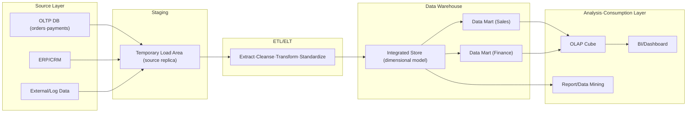
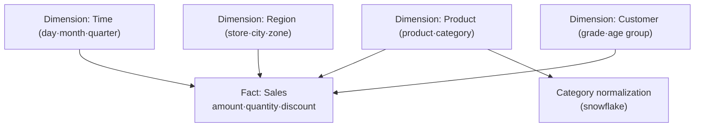

# Data Warehouse and OLAP

## 1. Overview

> A **Data Warehouse (DW)** is an integrated data store that consolidates and cleanses data scattered across multiple operational (OLTP) systems around subjects, accumulates it over the passage of time, and preserves it without deletion or update, thereby optimizing it for decision-support queries (analysis). **OLAP (Online Analytical Processing)** is an analytical-processing technology that supports rapid aggregation and exploration of this accumulated data from a multidimensional perspective.

Most information systems that enterprises operate are designed for OLTP (Online Transaction Processing) purposes—processing individual transactions such as orders, payments, and inventory accurately and quickly.
An OLTP database is normalized to prevent update anomalies and is advantageous for processing many short transactions, but it is unsuitable for broad aggregation queries such as "compare sales trends by region and quarter over the past three years by product group."
Such queries must join dozens of tables and scan hundreds of millions of rows, burdening the operational system, and above all, the operational system does not retain historical records for long.
The data warehouse emerged to fill this gap—it accumulates history in a separate store detached from the operational system and reconfigures it into a structure favorable for analysis.

Bill Inmon defined a DW as "a subject-oriented, integrated, time-variant, and non-volatile collection of data," and these four characteristics become the core criteria distinguishing a DW from an OLTP DB.
Subject-oriented means organizing data by business subject such as 'customer, product, sales'; integrated means consistently standardizing codes, units, and representations from multiple sources; time-variant means giving snapshots a point in time to leave history; and non-volatile means, after loading, operating read-centrically without update or deletion in principle.

In an essay answer, it is important not to reduce a DW to a mere "big database."
A DW should be described as a system combining four axes: (1) the difference in purpose and structure from OLTP, (2) the data-integration pipeline formed by ETL/ELT, (3) the design technique of dimensional modeling (star/snowflake schema), and (4) multidimensional analysis via the OLAP cube.
Recently, connecting to the relationship with data lakes and lakehouses, and the rise of cloud DW (MPP) and columnar storage, makes for a timely answer.

### A. Background and Necessity

First, separation of the operational and analytical systems is needed.
Throwing analytical queries directly at the operational DB worsens the response time of core transactions such as orders and payments due to lock contention and large scans.
A DW physically isolates the analytical workload to protect operational-system performance while providing a separate environment optimized for reads and aggregation.

Second, data integration and a 'Single Source of Truth' are required.
Even for the same 'sales', if the definitions and code systems of the sales, accounting, and logistics systems differ, the numbers diverge by department.
A DW standardizes codes, units, and criteria during the ETL process so that the whole enterprise interprets metrics with the same definition.

Third, history accumulation and trend analysis are needed.
The operational system keeps only the latest state, but management decisions require time-series analysis comparing past and present.
A DW preserves point-in-time snapshots non-volatilely so that long-term trends, seasonality, and anomalies can be tracked.

## 2. Overall Structure and Data Flow

A data warehouse passes through several layers from source to final analysis.
Operational and external data is extracted into a staging area, is loaded into the DW after cleansing and transformation, is partitioned into data marts tailored to specific departments or subjects, and is consumed by OLAP and BI tools.

**The source layer** provides the source data the DW will integrate.
It includes not only operational DBs but also ERP/CRM, external market data, and web logs—heterogeneous sources each with a different schema, code system, and refresh cycle.
Absorbing this heterogeneity is the core task of the subsequent ETL.

**The staging area** is a buffer zone that temporarily holds sources extracted from the sources.
It minimizes access time to the source systems and isolates them so that a failure mid-transformation does not affect the sources.
After cleansing, deduplication, and type conversion take place in staging, the data moves into the main DW.

**The ETL/ELT layer** is the heart of data integration.
Extract fetches data from the sources, Transform performs code standardization, unit unification, missing-value handling, aggregation, and surrogate-key generation, and Load puts the results into the DW.
Traditional ETL transforms in a separate engine and then loads, but as cloud-DW compute power grew, ELT—loading first and transforming with SQL inside the DW—has spread.

**The DW/data-mart layer** stores integrated data in a dimensional model.
With an enterprise-wide integrated store at the center, it derives data marts—subsets tailored to specific departments or subjects such as sales and finance—to improve query performance and access control.
Inmon's top-down (central DW → mart) and Ralph Kimball's bottom-up (mart integration → bus architecture) are the representative design philosophies.

## 3. Dimensional Modeling and OLAP Operations

The core technique of DW design is **dimensional modeling**.
Measures that are the subject of analysis (sales amount, quantity, etc.) are placed in a **fact table**, and the perspectives of analysis (time, product, region, customer, etc.) are separated into **dimension tables**, forming a **star schema** in which dimensions connect to the fact in a star shape.
Dimension tables are intentionally denormalized to reduce the number of joins and raise query performance.

Normalizing a star schema's dimensions again to split hierarchies into separate tables yields a **snowflake schema**.
The snowflake reduces storage duplication and makes hierarchy management clear, but joins increase, so queries become complex and performance can drop.
Therefore, it is common practice to choose the snowflake when storage efficiency and hierarchy integrity matter, and the star schema when query performance and simplicity take priority.
The **SCD (Slowly Changing Dimension)** technique for handling when dimension values change over time (e.g., a customer grade change) is also important; representative types are Type 1, which overwrites, Type 2, which adds a history row, and Type 3, which keeps the previous value in a column.
For example, to see "purchase patterns before and after VIP promotion" in marketing analysis, you must leave the grade-change history with Type 2.

**OLAP operations** are the standard manipulations for exploring the multidimensional cube thus constructed.
Users analyze data from various angles with operations such as the following.

| Operation | Meaning | Example |
|---|---|---|
| Roll-up | Aggregate to a higher level | Sum sales daily → monthly → quarterly |
| Drill-down | Detail to a lower level | Quarterly sales → month → day |
| Slice | Fix one dimension to extract a subset | Fix the time dimension to 'Q3 2026' |
| Dice | Apply range conditions on multiple dimensions | Select only a specific region and product group |
| Pivot (Rotate) | Rotate axes to switch perspective | Swap the dimensions of rows and columns |

These operations directly support the natural exploration process by which executives narrow from "whole → anomalous range → cause."
For example, when enterprise-wide sales decline, one perceives the anomaly at the roll-up level, drills down to dig into which zone or product is the cause, and slices/dices to isolate specific conditions and pinpoint the cause.

## 4. Comparison of OLAP Implementation Types and Differences from OLTP

OLAP is divided into three ways depending on where and how data is stored, each with different trade-offs in performance, scalability, and flexibility.
The crux of the comparison below is the principle that "precomputing is fast but poor in flexibility and scalability, while leaving it to the relational engine is flexible and scalable but slow to respond."

| Category | MOLAP | ROLAP | HOLAP |
|---|---|---|---|
| Storage | Multidimensional cube (precomputed) | Relational DB (star schema) | Summary = cube, detail = relational |
| Query performance | Very fast | Relatively slow | Medium (summary is fast) |
| Scalability/large volume | Limited by cube explosion | Excellent | Compromise |
| Flexibility | Low (predefined) | High (arbitrary SQL) | Medium |
| Representative | Essbase, SSAS (MOLAP) | Most SQL-based BI | SSAS (HOLAP) |

MOLAP precomputes aggregates and stores them in a cube, so response is fast, but it has the 'data explosion' problem where the amount of precomputed aggregation soars as dimensions and combinations grow.
ROLAP places data in a relational DB as a star schema and aggregates at query time, so it is strong for large volumes and arbitrary queries but can be slow to respond.
HOLAP compromises by keeping frequently used summaries as cubes and details in relational form.

Clearly contrasting the difference between DW/OLAP and OLTP makes the basis for design judgments clear.

| Perspective | OLTP (Operational) | OLAP/DW (Analytical) |
|---|---|---|
| Purpose | Transaction processing | Decision-support analysis |
| Query | Many short reads/writes | Few broad reads/aggregations |
| Design | Normalized (3NF) | Denormalized (star schema) |
| Data | Current state, detailed | Accumulated history, includes summaries |
| Storage method | Row-oriented (row-store) | Column-oriented (column-store) favorable |
| Update | Frequent update/delete | Periodic batch load, non-volatile |

In particular, the difference in storage method directly affects performance.
Because analytical queries aggregate a few columns across a large number of rows, **column-oriented (columnar) storage**, which stores the same column's values contiguously, is overwhelmingly favorable in I/O and compression.
Cloud DWs such as Amazon Redshift, Google BigQuery, and Snowflake combining columnar storage and MPP (Massively Parallel Processing) to process billions of rows of aggregation in seconds is the industrial realization of this principle.

## 5. Deep Dive — Evolution to Cloud DW and Lakehouse

The traditional DW was built on-premises at fixed capacity, so it had the problem of over-investing to match peak analytical load or, conversely, running short of resources.
Since the 2010s, the **cloud data warehouse** has changed this limitation.
Snowflake introduced **decoupled storage/compute** so that multiple virtual warehouses can scale and be billed independently for the same data—so that bulk loading and interactive analysis do not interfere with each other, and you pay only for what you use.
BigQuery supports petabyte-scale queries serverlessly without infrastructure management, and Redshift decoupled compute/storage with RA3 nodes.

Meanwhile, since a structured DW alone struggles to hold unstructured/semi-structured data such as logs, images, and text, the **data lake** was adopted in parallel; but a lake, weak in governance, schema, and transactions, easily became a 'data swamp'.
What integrated these is the **data lakehouse**, which, on top of cheap object storage, grants ACID transactions, schema evolution, and time travel via open table formats such as Delta Lake, Apache Iceberg, and Hudi, combining the DW's reliability with the lake's flexibility.
That is, the flow of DW → lake → lakehouse can be understood as an evolution toward gathering "the reliability of structured analysis" and "the accommodation of diverse data" into one.

Also, as demand for real-time decision-making grows, streaming ingestion (CDC, Kafka) and near-real-time aggregation are being combined into the batch-centric traditional DW.
A DW that used to refresh once a day by nightly batch is moving toward reflecting the latest state in minutes through change data capture.

## 6. Considerations and Implications

- **Choice of modeling philosophy (Inmon vs. Kimball)**: If enterprise-wide standardization and governance matter, the top-down approach (Inmon) of building a central DW first is favorable; if rapid value realization matters, the bottom-up approach (Kimball) of building department marts first and integrating via a bus architecture is favorable. The two are not opposites but options depending on organizational maturity and priorities, and in practice a hybrid is common.
- **Trade-off between performance and flexibility**: Precomputation (MOLAP), summary tables, and materialized views speed up response but incur storage/update cost and cube explosion. A balanced design is needed that analyzes query patterns to selectively precompute only frequently used aggregations and handles the rest with columnar storage and MPP.
- **Data quality and single source of truth**: A DW's value comes from integrated metric definitions. Along with standardization and validation at the ETL stage, data governance, master data management (MDM), and data contracts should be linked to organizationally guarantee the consistency of metric definitions. Set a clear SCD strategy to secure the accuracy of history as well.
- **Cost, governance, and outlook**: Because cloud DWs are usage-based, indiscriminate large queries cause cost surges—workload monitoring, query optimization, and lifecycle policies from a FinOps perspective are needed. Since history containing personal data is retained long-term, access control, masking, and retention-period management are also essential. Going forward, the DW is expected to evolve toward convergence into the lakehouse, real-time operation, and generative AI (natural-language query) combined with BI, and an engineer must judge this comprehensively alongside the organization's analytical maturity, regulation, and cost constraints.

## References

- Kimball Group, "Dimensional Modeling Techniques", https://www.kimballgroup.com/data-warehouse-business-intelligence-resources/kimball-techniques/dimensional-modeling-techniques/
- Snowflake, "What Is a Data Warehouse?", https://www.snowflake.com/guides/what-data-warehouse
- Databricks, "What is a Data Lakehouse?", https://www.databricks.com/glossary/data-lakehouse
- AWS, "What is OLAP?", https://aws.amazon.com/what-is/olap/

---

> **In one line**: A data warehouse is an analysis-dedicated store that, separated from the operational system, accumulates history under the principles of subject-oriented, integrated, time-variant, and non-volatile; it supports multidimensional analysis with dimensional modeling (star/snowflake) and OLAP operations (roll-up, drill-down, slice, dice, pivot), and has recently been evolving into columnar-storage, MPP-based cloud DWs and lakehouses.
