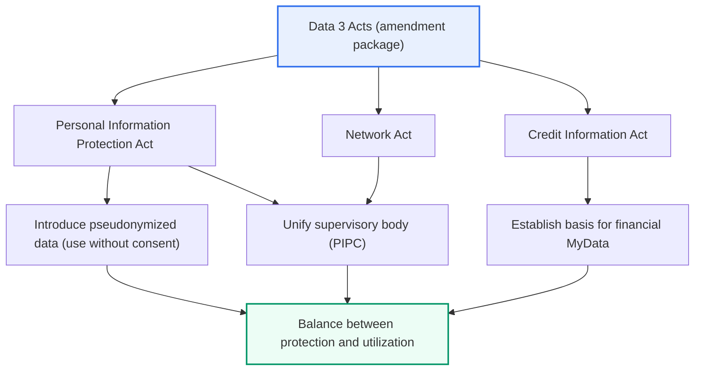
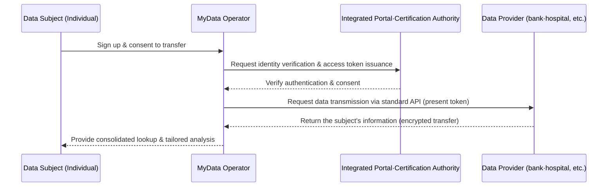

# The Data 3 Acts and MyData

## 1. Overview

### A. Definition
> The **Data 3 Acts** is the collective name for the Personal Information Protection Act, the Network Act, and the Credit Information Act, and refers to a legislative amendment (effective 2020) that strengthened the protection of personal information while **opening the way for data utilization through means such as introducing the concept of pseudonymized data**. **MyData** is a service, grounded in the **right to informational self-determination**, that lets a data subject **directly manage** their own personal information scattered across multiple institutions and **demand its transmission (the right to data-transfer requests)** to a place of their choosing so as to consolidate and use it.

The core aim of the Data 3 Acts amendment is the '**balance between protection and utilization**'. In the era of the Fourth Industrial Revolution, data became a core factor of production, likened to crude oil, but there was a dilemma: if regulation of personal information is too strict, data-based industry shrinks, while if regulation is too loose, privacy is violated. Before the amendment, Korea in principle required the data subject's prior consent to use personal information (opt-in), and in industries requiring the combination and analysis of large volumes of data—such as big data and AI training—this cost of obtaining consent effectively acted as a barrier to utilization. The Data 3 Acts resolved this dilemma with the institutional device of **pseudonymized data**. Information pseudonymized so that an individual cannot be directly identified is opened for use without the data subject's consent, limited to the purposes of statistics, scientific research, and public-interest record preservation, while **re-identification**—recognizing a specific individual again—is strictly prohibited and violations are sanctioned by administrative fines and criminal penalties.

At the same time, the personal-information supervisory bodies that had been dispersed were unified into the **Personal Information Protection Commission (PIPC)**, tidying up overlaps and blind spots in the regulatory framework. Before the amendment, the Personal Information Protection Act (Ministry of the Interior and Safety), the Network Act (Korea Communications Commission), and the Credit Information Act (Financial Services Commission) regulated similar matters by different standards, causing great confusion for the regulated; these were gathered into one independent supervisory body. MyData operates on this tidied-up foundation. Gathering 'my information', fragmented across multiple institutions, to a provider I designate, so I can receive personalized services such as consolidated asset lookup, tailored financial recommendations, and health management, is MyData—the concrete realization of **data sovereignty**.

### B. Background and Necessity of the Amendment
The Data 3 Acts amendment resulted from three strands of conflicting and overlapping demands meshing together. The first is the demand for **vitalizing the data economy**: as the EU laid the foundation of the data industry by institutionalizing the right to data portability along with the GDPR in 2018, Korea too needed a basis for utilization for international alignment and industrial competitiveness. The second is the demand for **strengthening privacy protection**: as data combination increases, the risk of re-identification and leakage grows, so safeguards had to be strengthened in proportion to opening up utilization. The third is the aforementioned **resolution of the dispersion of supervisory bodies**. Institutionalizing a balance point that trades 'the path to use without consent (pseudonymized data)' for 're-identification prohibition and unified supervision (protection)', by bundling these three demands into a single amendment package, is the essence of the Data 3 Acts.

## 2. The Structure of the Data 3 Acts and Key Amendments

### A. Overall Structure
The overall structure diagram below shows how the Data 3 Acts encompasses the three laws and converges on the two axes of pseudonymized data and unified supervision.

The key point of this diagram is that the three laws, while each addressing a different area (general personal information, online, credit information), ultimately converge on the single goal of the 'balance between protection and utilization'. The Network Act's personal-information provisions were transferred to the Personal Information Protection Act to resolve overlaps, and the Credit Information Act established the legal basis for financial MyData, so the scattered regulation gained coherence.

### B. Key Amendments by Law
The table below organizes the gist of the amendments to the three laws as supporting material; the background of each item is explained in the prose above and below.

| Law | Key Amendments |
|---|---|
| **Personal Information Protection Act** | Introduce the concept of pseudonymized data (use without consent for statistics/research/public-interest purposes), unify supervision under the Personal Information Protection Commission, newly establish re-identification prohibition and penalties |
| **Network Act** | Transfer personal-information provisions to the Personal Information Protection Act (resolve regulatory overlap), consolidate online personal-information special provisions |
| **Credit Information Act** | Establish the basis for financial MyData (personal credit information management business), permit pseudonymized-data and data-combination use, introduce the right to data-transfer requests |

The practical center of gravity of the amendment lies in **permitting the use of pseudonymized data** and **institutionalizing data combination**. To combine pseudonymized data held by different institutions, they cannot be merged arbitrarily; the combination must pass through a state-designated **data specialized agency (specialized combination agency)** to be combined safely, and the re-identification risk must be verified. For example, research that combines a medical institution's treatment data with an insurer's claims data to build a disease-prediction model became legally possible through this procedure. In this way, by placing a safeguard of 'through a designated agency under controlled conditions' rather than 'anyone at will', the amendment took a structure that opens up utilization while preventing misuse.

### C. The Three-Way Classification of Personal Information
After the Data 3 Acts, personal information is divided into three stages according to the scope of processing possible. Understanding this classification is the core of the pseudonymized-data system.

| Category | Identifiability | Utilization |
|---|---|---|
| **Personal information** | Directly identifiable | Consent required in principle |
| **Pseudonymized information** | Identifiable only when combined with additional information | Use without consent for statistics/research/public-interest purposes (re-identification prohibited) |
| **Anonymized information** | Non-restorable (unidentifiable) | Not personal information, freely usable |

It is important that pseudonymized information is a middle ground between 'use without consent' and 'complete protection'. Anonymized information can be used freely but cannot be restored, so its analytical value drops sharply; original personal information requires consent to use, so its cost is high. Pseudonymized information is an institutional invention placed at the meeting point of utilization and protection—retaining much of the analytical value while prohibiting re-identification to control risk.

## 3. The Concept and Operating Structure of MyData

### A. The Right to Data-Transfer Requests and the Data Flow
The legal heart of MyData is the **right to data-transfer requests (right to personal-information transmission)**. It is the right of a data subject to demand that their information held at a particular institution (a data provider) be sent to another institution (a MyData operator), corresponding to the GDPR's 'right to data portability'. The detailed architecture diagram below shows MyData's actual data flow.

The core of this flow is that 'the individual directs the movement of their own information, and that movement is safely mediated by standard APIs, authentication, and encryption'. The data provider returns information only when the individual's consent and a valid access token are confirmed; the consent must specify purpose, items, and period, and can be withdrawn at any time. In other words, MyData is not a simple data copy but a **transmission system that procedurally guarantees the data subject's control**.

### B. Provided Information by Industry
MyData differs by industry in the scope of provided information and the timing of implementation. Finance moved furthest ahead with full implementation in January 2022, and it is spreading to the medical and public sectors.

| Industry | Key Provided Information | Use Examples |
|---|---|---|
| **Finance** | Account, card, loan, investment, insurance records | Consolidated asset lookup across financial firms, tailored loan/product recommendations |
| **Medical** | Treatment, prescription, health checkup, medication records | Personal health management (PHR), chronic disease management |
| **Public** | Tax, welfare, eligibility, administrative information | Automatic notice of welfare eligibility, simplification of administrative documents |
| **Telecom·Retail** | Telecom usage, consumption, subscription records | Rate-plan optimization, recommendations based on consumption patterns |

The reason financial MyData led is that the Credit Information Act first institutionalized a licensed business type called **personal credit information management business** and a standard API framework. A representative case is a service that consolidates assets scattered across many banks and card companies in one app and analyzes net worth and spending; after implementation, a subscriber base in the tens of millions formed, and it established itself as the standard for personalized finance. In contrast, medical MyData (e.g., the 'Health Information Highway') is spreading relatively slowly because data standardization and sensitive-information-protection requirements are stringent, which is a result of differences in each industry's data characteristics and regulatory level being reflected in the order of implementation.

## 4. Domestic and International Comparison and Implications

The ideational origin of MyData is the MyData movement in Europe and Finland and the GDPR's right to data portability. However, whereas the GDPR's portability right is closer to a declaration of the right that individuals can 'download or move' their own data, Korea's MyData is distinctive in that, through the Credit Information Act, it was concretized into an **industry-type model equipped even with standard APIs, licensed operators, and a fee framework**. This difference arose because Korea, beyond guaranteeing the right, institutionally mandated a standard transmission specification and cost-settlement structure between data providers and operators to create a 'working market'. As a result, service diffusion was fast, but it also came with practical challenges—the burden on data providers of building APIs and the coordination of interests around the compensation for providing data.

## 5. Deep Dive — MyData 2.0 and Expansion to All Sectors

The recent policy trend is toward broadening MyData, which had been confined to finance, to all industries. As the **right to personal-information transmission** was introduced as a general provision in the 2023 amended Personal Information Protection Act, a legal foundation was laid to apply MyData not only to finance but to all sectors—medical, public, telecom, and more (enforcement decrees and standardization are being pursued as follow-up). The so-called 'MyData 2.0' aims at (1) expanding the scope of provided information, (2) strengthening data subjects' control (improving the effectiveness of transfer history and withdrawal), (3) expanding data standardization and interoperability, and (4) expanding MyData operators' concurrent and combined services.

However, the expansion to all sectors also has clear challenges. Because data formats and meanings differ by sector, **standardization (ontology, API specifications)** must be settled first, and sensitive information such as medical and telecom data causes large harm if leaked, so **strengthened security and consent management** is needed. Also, if a few large platforms oligopolize data, data sovereignty could instead be hollowed out, so institutionally safeguarding **data-subject-centricity** is the crux. This point is a good example, from a data-management engineer's perspective, of how 'technical standardization, security architecture, and governance' must mesh organically.

## 6. Considerations and Implications

1. **Standardization and safe transmission infrastructure are the premise of vitalization.** MyData works in practice only when data that differs by institution is standardized via APIs and a safe transmission specification based on authentication, encryption, and access tokens is in place. Without standards, each institution provides data its own way, so interoperability breaks down and diffusion stalls.

2. **Security and privacy are the foundation of trust.** The more scattered information is gathered in one place, the more the harm concentrates upon leakage or re-identification, so minimal collection, strong authentication (MFA), transmission and storage encryption, and effective guarantee of consent withdrawal are essential. The benefits of MyData hold only on top of 'trust that it is safe'.

3. **Managing pseudonymized-data re-identification risk and governance must proceed in parallel.** The more data combination and pseudonymization increase, the more the possibility of re-identification from combined data must be constantly checked, and combination control through data specialized agencies, compliance with the re-identification prohibition, and regular risk assessment must function as institutional safeguards against misuse.

4. **We must move toward realizing data-subject-centered data sovereignty.** What technology and institutions ultimately aim at is for individuals to become the owners of their own data and reclaim its value, so a design is required that checks the data oligopoly of a few platforms and lets individuals substantively exercise transfer history and control.

5. **International alignment and cross-border data issues must be considered.** Alignment with global regulations such as the GDPR and the issue of cross-border data transfer (adequacy decisions) are directly tied to the international competitiveness of the data industry, so when designing and operating the MyData and pseudonymized-data systems, governance that also considers linkage with international standards and mutual-recognition frameworks is needed.

## References
- Personal Information Protection Commission, "Personal Information Protection Act and Guidelines on Processing Pseudonymized Information"
- Financial Services Commission & Financial Security Institute, "Standard API Specifications for MyData in the Financial Sector"
- EU, "General Data Protection Regulation (GDPR)", Art. 20 Right to data portability

---

> **In one line**: The Data 3 Acts is an amendment that institutionalized the *balance between protection and utilization through the introduction of pseudonymized data and unified supervision*, and MyData is a data-sovereignty service that *consolidates and uses one's scattered information via standard APIs, authentication, and encryption through the right to data-transfer requests*; standardization, security, re-identification management, and data-subject-centricity are the premises of its vitalization.
