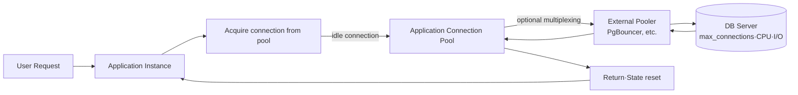
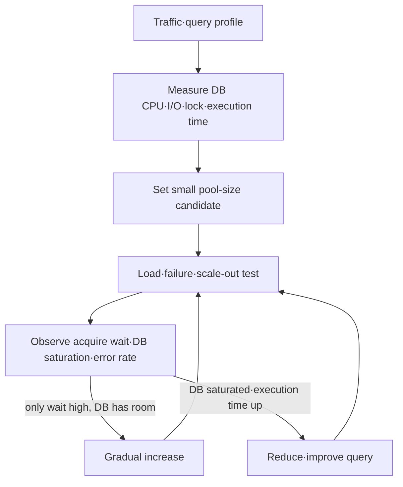

# Design and Tuning of Database Connection Pools

## 1. Overview

> A **database connection pool** is a resource-management technique that, instead of creating a new connection every time an application requests a database connection, reuses a limited set of connections that were created in advance or returned after use.

A connection between an application and a database is not a single socket. DNS lookup, TCP connection, TLS negotiation, user authentication, session initialization, and protocol negotiation between driver and server are performed in sequence. If this procedure is repeated every time just to run one short SQL statement, the cost of establishing the connection can exceed that of the query itself. A pool separates this cost from the request path and reduces average latency and connection storms by lending an already-authenticated connection and receiving it back.

However, a pool is not a device that provides connections without limit. The number of connections in a pool must be determined together with the database's capacity for CPU, memory, disk, and lock processing. Making a pool large makes the queue look short, but as the work executing concurrently on the database increases, context switching, buffer contention, lock contention, and lower cache hit rates can appear. Conversely, making it too small makes application threads wait for the pool, so users experience timeouts.

Therefore, in an engineer's answer, a connection pool should be interpreted not as a mere framework option but as **a control plane that safely admits demand into finite DB resources**. The core is to tie sizing, waiting/timeout, connection validation, state reset on return, failover, observability, and security into a single operational design.

The goals of a connection pool can be summarized in four. First, amortize the cost of establishing connections. Second, cap the database's amount of concurrent execution. Third, absorb peak traffic with a short queue while blocking infinite waiting. Fourth, prevent failures, leaks, and session-state contamination from spreading to the whole service.

## 2. Operating Principle and Overall Structure

A connection pool can reside inside the application process, or it can be separated into an external pooler in front of multiple instances. An application pool separates request threads from actual DB connections to reuse them quickly, and an external pooler multiplexes many client connections into fewer server connections. When using both layers together, do not treat each layer's cap as a multiplication; calculate it as a total connection budget.

When a request comes in, the application first looks for an idle connection in the pool. If there is an idle connection, it lends it immediately; if not, it checks whether the pool has reached its maximum size. If there is still room to expand, it creates a new connection; if it has reached the cap, it enters the wait queue. The wait time must always have a limit such as `connectionTimeout`, and when the limit is exceeded, it must return a failure so that the upper layer's retry and alternative paths work.

After borrowing a connection, it starts a transaction, executes SQL, and then commits or rolls back. Even if the application uses the expression "closing the connection object," in many cases it does not actually terminate the physical connection but returns it to the pool. Therefore, omitting a `close()` call does not keep the physical connection alive; from the pool's standpoint, the connection remains as a lent-out connection, causing pool exhaustion.

The return process is not a simple queue insertion. It requires ending the transaction, restoring auto-commit mode, resetting session variables, checking whether to roll back, discarding warning/error states, cleaning up prepared statements, and removing user/tenant context. If state reset is omitted, a session-contamination problem occurs where the next request inherits the previous request's privileges or isolation level.

## 3. Components and Lifecycle

### A. Pool Manager and Connection States

The pool manager is a state machine that creates, lends, validates, returns, and discards connection objects. A connection generally passes through the states `creating`, `idle`, `lent out`, `validating`, and `pending discard`. Managing state explicitly reduces errors such as putting a failed connection back into the idle list or double-returning an already-returned connection.

An idle connection is a healthy connection ready for immediate use. A lent-out connection is owned by one request or transaction, and its maximum lending time must be monitored. If a creating connection fails, fail only that request and control the failure count and retry interval so that the whole pool is not locked. A pending-discard connection is closed—not reused—after the request using it finishes.

The pool's minimum idle count and maximum size have different meanings. Making the minimum idle count large reduces the connection-creation delay just before a peak but occupies DB connections and memory even in normal times. The maximum size is the cap on connections that can be made to the DB simultaneously, so it is directly connected to the database's resource budget. The HikariCP official documentation also explains that a fixed-size pool should generally be considered first, and that setting a large number of connections does not guarantee performance.

### B. Lending/Return and Timeouts

`connectionTimeout` is the maximum time the pool waits to lend a connection. This value must be distinguished from the SQL execution timeout. If a slow query keeps running after a connection is acquired, the pool becomes exhausted, so design the query timeout, transaction timeout, and lending timeout hierarchically.

If the wait queue grows infinitely, user requests, threads, and message consumers all get tied up in a cascading failure. Therefore, limit the queue length and maximum wait time, and on exceeding it, choose fast failure or priority-based rejection. Retries, if exponential backoff and jitter are not applied, make requests that retry simultaneously pressure the pool again.

A connection that raises an exception on return is not regarded as a healthy idle connection. When a network disconnection, protocol error, transaction rollback failure, or session reset failure is confirmed, discard it and replenish a new connection asynchronously. Reusing a connection based only on the request's success propagates a latent error to the next request.

### C. Connection Validation and Lifetime Management

A connection idle for a long time may already have been dropped due to the idle timeout of a firewall, load balancer, or DB. Validation methods include a ping or validation query on lending, periodic keepalive, and the driver's socket-exception detection. Validating every time is safe but incurs a round-trip cost, so set the policy reflecting the last-used time and network characteristics.

`maxLifetime` is a cap that keeps a connection from being reused forever. If the pool replaces a connection just before the DB or a proxy drops it first, request interruptions can be reduced. If multiple instances discard connections at the same time, a reconnection storm can occur, so in real implementations it is advantageous to add a small variation to the expiration time.

A connection leak means a state where a connection is not returned after being lent. Set the leak-detection threshold shorter than a normal long-running transaction, but record the call stack, request ID, and transaction ID together so that a simple warning is not mistaken for a failure. Leak prevention must use `try-finally` in code or language-specific automatic resource management together with operational metrics.

## 4. Pool Sizing and Capacity Planning

Pool size is not a value set by directly copying the number of users or application threads. First measure the number of CPU/I/O operations the DB can actually process concurrently, and make a starting point using the average and percentile execution times of queries and the target throughput. From a queuing standpoint, throughput is roughly limited to the amount of concurrent execution divided by the service time, so if adding connections worsens the DB service time, total throughput can actually decrease.

The formula `(number of CPU cores × 2) + effective number of disks`, often mentioned in practice, is only a starting point, not a universal law. The optimum differs depending on SSDs, cache hit rate, query type, replication structure, CPU overprovisioning, and container limits. HikariCP's pool-sizing guidance emphasizes starting small, centered on the amount of work the DB can process concurrently rather than the number of front-end users.

For multiple instances, calculate the total connection amount as follows.

`total connection cap = number of instances × max pool size per instance + batch/admin/replication connections`

For example, if 12 pods each open up to 20 connections, the application alone is 240. Even if the DB's `max_connections` is 300, there is no room for admin, monitoring, replication, and migration connections, so it is not safe. The point that the number of connections doubles the moment autoscaling doubles the number of pods must also be reflected in capacity planning.

Pool-size adjustment must be done in stages. First set the max pool small and measure acquire wait time, DB CPU, disk wait, lock wait, and the p95/p99 of request latency. If the DB has room and only the wait time is high, you can increase it slightly, but if the DB execution time also rises, the bottleneck is likely not the number of connections but a query, index, or storage bottleneck.

A small pool is not a bad setting. It can limit concurrent execution so the DB can process stably, and it can be backpressure that absorbs excessive contention into a queue. However, if a single pool is shared by all workloads, a long batch query can monopolize connections for online requests, so separate pools by business importance or isolate read/write/batch resources.

## 5. Transaction/Session State and Consistency

The biggest logical risk of pool reuse is that session state is maintained while the physical connection is maintained. `SET search_path`, time zone, isolation level, roles, temporary tables, server-side prepared statements, and advisory locks can remain after a request ends. Therefore, the application must explicitly reset session state, and apply an especially strict return policy when storing tenant identifiers or privileges in session variables.

Transaction boundaries are not the same as connection boundaries. Before returning a connection to the pool, a commit or rollback must be completed, and even in exception paths, a rollback must be done. Reusing a connection with an incomplete transaction makes the next request inherit the previous request's locks and snapshot, causing data contamination or long waits.

Even when using read-only replicas, distinguish the target and failover policy per pool. The write pool points to the current leader while the read pool monitors replication lag, and after failover, existing connections must be discarded quickly. Simply changing the DNS does not make already-established sockets and internal pool objects move to the new leader immediately.

An external pooler's transaction pooling reassigns connections between transactions, so the meaning of session-based features changes. If you use session variables, session-level advisory locks, and some temporary tables and prepared statements, verify compatibility first. Because it is a choice of giving up features to gain connection efficiency, changing only the mode during operation is dangerous.

## 6. Comparing Application Pools and External Poolers

An application pool is close to the request code, so it can naturally connect lending, return, transactions, and metrics. But because it exists independently per instance, DB connections increase linearly as service instances increase. An external pooler, by contrast, centrally multiplexes many instances' client connections to reduce the DB's actual number of connections, but it adds a network hop and a separate operational point of failure.

| Category | In-Application Pool | External Pooler |
|---|---|---|
| Location | Inside each process/pod | Between application and DB |
| Advantages | Low latency, easy code/transaction linkage | Centrally limits many instances' connections |
| Limitations | Connections multiply as instances increase | Session-feature compatibility and operational complexity |
| Failure impact | Centered on that instance | Depending on configuration, affects multiple services at once |
| Application | General services, few instances | Serverless, large-scale pods, connection storms |

Do not view the difference simply as performance superiority. An application pool quickly reuses already-existing connections to optimize the local path, and an external pooler provides a global cap on the number of connections. In a large-scale environment, the two can be layered, but unconditionally setting the application pool's size larger than the external pooler's merely moves the bottleneck to the external queue.

For example, if a serverless function scales to hundreds in a short time, a structure where each function connects directly to the DB creates a connection storm. Here, if an external pooler receives the client connections and limits the DB server connections, it can protect the DB's connection resources. Instead, transaction pooling and session-feature compatibility, the pooler's own high availability, the TLS segment, and the reconnection policy on failure must be reviewed together.

## 7. Observability, Failure Response, and Security

The core metrics of a connection pool are not simply the current number of connections. Max pool size, active connections, idle connections, number of waiting requests, connection acquire time, number of timeouts, number created/discarded, number of suspected leaks, and number of connection-validation failures must be collected together with request latency. If using an external pooler, distinguish client waiting from server-connection waiting to show which layer is the bottleneck.

Separate the following symptoms by cause. If active connections are at the maximum and acquire waiting is increasing, look together at query delay, transaction prolongation, and insufficient pool size. If active connections are few but waiting is high, suspect the pool manager's lock, connection-creation failure, or wrong state tracking. If DB CPU is saturated and execution time rises, pool expansion is forbidden and queries and indexes must be checked first.

In a failure, preventing a retry storm comes first. If all requests immediately reconnect while the DB is recovering, connection creation and authentication amplify the failure. Combine exponential backoff, jitter, a circuit breaker, readiness checks, and a read-only alternative path, and keep reserved connections for administrator access. Even after recovery, it is safe to warm up the pool gradually rather than filling it all at once.

On the security side, do not leave credentials in code or logs; inject them from a secret-management system. Check TLS verification, least-privilege accounts, per-tenant privilege boundaries, prevention of connection-string exposure, and the encryption state of idle connections. Because a connection pool reuses authentication, clearly decide when to discard existing connections during credential rotation.

## 8. Comparisons, Cases, and Anticipated Failure Scenarios

### A. Pool Exhaustion and Connection Leaks

Suppose an online order service lends a connection per request but does not return it in an exception path. In normal requests the problem does not surface, but on a day when payment failures increase, lent-out connections accumulate. Eventually, even though the DB is alive, new requests fail with a pool-wait timeout.

The response is to apply together a `finally`-based return, automatic transaction rollback, leak-detection logs, a lending-time dashboard, and verification of exception paths in load tests. Enlarging the max pool only delays the symptom, not solving the leak. Secure the call stack of long lendings and connect it to an actual code fix.

### B. Connection Surge Due to Autoscaling

If there are 10 pods and a pool cap of 20, the normal maximum connections are 200. If a CPU-usage-based autoscaler increases to 40 pods due to a failure, DB connections can become 800. Even if the DB accepts the connections, actual throughput can drop due to work scheduling and memory contention.

In this case, lower the per-instance pool cap and reflect the total connection budget in the autoscaling policy. If needed, place an external pooler to fix the number of DB server connections, and monitor the application's client waiting and the DB server waiting separately. The assumption that scale-out immediately means increased DB throughput must be verified by load testing.

### C. Stale Connections After Failover

If the leader DB is replaced due to a failure but the application pool keeps holding the existing TCP connection, new requests are delivered to the stale socket. If, even after a connection error occurs, retries happen immediately, the new leader can meet a connection storm.

The solution is immediate discard of connections that detect a failure signal, use of a logical endpoint, reconnection backoff, safe retry of transactions, and duplicate-execution prevention. For a request where it is unknown whether it was already committed, do not re-execute unconditionally; use an idempotency key and result lookup to prevent double orders.

## 9. Deep Dive: Design Directions for Cloud/Container Environments

In a container environment, the CPU limit and the actual node CPU can differ, so putting the physical server's total cores into the pool-size formula can overestimate. You must use together the per-service CPU quota, the actual query type, the DB's shared resources, and changes in the number of pods. In particular, in serverless with many short-lived tasks, separate the roles of a traditional pool that keeps connections long and an external pooler.

A cloud-managed DB often provides a proxy, pooler, read replicas, and per-workload endpoints rather than directly raising `max_connections`. Evaluate whether increasing the number of connections is favorable to both cost and performance, and whether the proxy's additional hop and failure domain are acceptable. An operator must budget not only the number of connections but also per-connection memory and log/audit costs.

Observability must look at the correlation between application metrics and DB metrics. Track whether the DB's lock wait increases, whether query p99 increases, and whether the number of pods changed at the moment pool-acquire delay rises. In a tracing system such as OpenTelemetry, distinguishing the `pool.acquire`, `db.query`, and `pool.release` segments lets you separate application waiting from DB execution time.

The recent practical direction emphasizes **a small fixed pool, explicit timeouts, layered backpressure, workload isolation, and verifying the connection budget before horizontal scaling** rather than an unconditionally large pool. This is based on the recognition that the number of connections is not the cause of performance but the result of contention over DB work.

## 10. Considerations and Implications

1. **The basis of capacity planning must shift from the number of users to DB processing capacity.** Increasing connections just because there are many users can heighten internal DB contention. In load tests, confirm the changes in CPU, I/O, locks, and execution time, and adjust in stages from small values.

2. **Timeouts must be layered.** Design the order of pool-acquire timeout, SQL execution timeout, transaction timeout, and HTTP request timeout so that one layer does not occupy the next layer forever. Merely increasing timeouts only hides failures.

3. **A connection's logical state must be managed together with its physical lifecycle.** Guarantee rollback and session reset before return, and test that tenant privileges, session variables, and temporary objects do not remain for the next request. This is also an item connected to the problems of data isolation and privacy protection.

4. **Autoscaling and the connection budget must be tied into a single policy.** Reflect the fact that the total connection cap also rises as the number of pods increases, and calculate the actual available capacity excluding reserved and admin connections. If necessary, fix the DB-side cap with an external pooler.

5. **Failover does not end with a DNS change alone.** Rehearse failure scenarios including discarding existing sockets, the pool-refill rate, retry backoff, duplicate-execution prevention, and reserved administrator connections. The RTO is the combined result of DB promotion time and application reconnection time.

6. **Isolating pools by workload raises availability.** If batch and online transactions share the same pool, a long job can starve core requests. Separate read/write/batch/admin pools and set each one's priority and cap.

7. **Observable evidence matters more than standard setting values.** Do not apply a framework's defaults as-is; change them based on acquire waiting, active/idle ratio, leaks, creation failures, DB saturation, and p95/p99. Record the load and failure results before and after changes to secure the reproducibility of the settings.

8. **From an engineer's perspective, the connection pool can be answered as the intersection of backpressure, resilience, and security.** Rather than stopping at the simple reuse effect, connecting resource caps, failure isolation, session state, observability, cost, and the operations organization lets you present a design judgment for the whole system.

## References

- HikariCP official repository and configuration documentation: https://github.com/brettwooldridge/HikariCP
- HikariCP official pool-sizing guidance: https://github.com/brettwooldridge/HikariCP/wiki/About-Pool-Sizing
- PgBouncer official usage manual: https://www.pgbouncer.org/usage.html
- PgBouncer official features and pooling modes: https://www.pgbouncer.org/features.html
- PostgreSQL official connection configuration documentation: https://www.postgresql.org/docs/current/runtime-config-connection.html

---

> **In one line**: A connection pool is not a technique for creating many connections but a resource-management device that measures the concurrency the DB can bear and controls everything up to waiting, timeouts, state reset, and failover.
