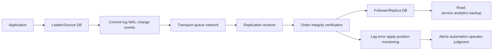
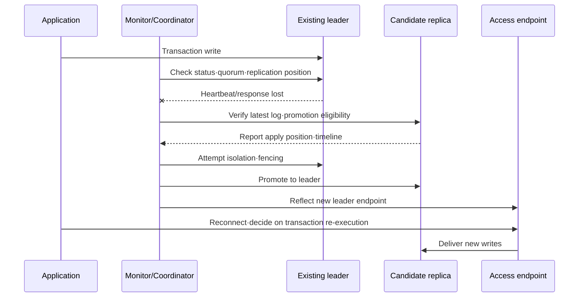

# Database Replication and High Availability Design

## 1. Overview

> **Definition**: Database replication is a technique that delivers and replays a single logical data change to other database instances so as to maintain multiple copies, while high availability (HA) is an operational goal of continuing to provide service, even when a failure occurs, within an agreed time window and data-loss limit.

When an online service depends on a single database, a server crash, storage corruption, network partition, operator error, or overload immediately turns into a business outage. Replication is a means of separating fault domains and distributing read load by placing data in multiple locations, but simply configuring replication does not automatically achieve high availability. Replication lag, failure detection, leader election, connection failover, data consistency, and backup-and-recovery verification must all be designed together.

In a professional-engineer answer, you must go beyond merely listing "set up a primary and a standby server" and first define which failures will be detected within what time, and up to which point in time and to what degree data will be preserved. For example, if a financial ledger's target is close to RPO 0, synchronous replication may be appropriate, but synchronous replication across a wide-area network creates a trade-off between latency and availability. Conversely, asynchronous replication is favorable for performance and geographic distribution, but the most recent changes may be lost at the moment of failure.

The purposes of replication fall broadly into three categories. First, **securing availability** by switching to an alternate instance during a failure. Second, **securing scalability** by separating workloads into read-only replicas or analytics replicas. Third, **securing resilience and usability** by maintaining copies in other regions to prepare for disasters and to support backup, auditing, and data utilization. Even when using the same technology, a different goal leads to a different topology and consistency policy.

### 1.1 Background and Need

Vertical scaling, which adds CPU and memory to a database, is a quick initial response, but it has the limits of a hardware ceiling and a single point of failure. For services with many read requests, keeping a single write authority while sending queries to multiple replicas can be cost-effective. However, when an application must immediately read data it just stored, a path that guarantees read consistency is required.

Service availability is not judged solely by whether the database process is alive. It also includes whether the application connects to the correct leader, whether transactions are not executed twice, whether DNS, connection pools, and load balancers recognize the failover, and whether monitoring and on-call systems can complete recovery. Replication is therefore both a data-layer technology and, at the same time, a matter of operational architecture and organizational procedure.

### 1.2 Core Goals and Evaluation Metrics

- **RPO (Recovery Point Objective)**: the acceptable range of data loss at the time of a failure. If asynchronous replication lag is 5 seconds, it means that in the worst case the most recent 5 seconds of changes may be lost, not that 5 seconds are always lost.
- **RTO (Recovery Time Objective)**: the acceptable time from failure recognition to service normalization. Even with automatic failover, it must be measured including connection-retry and cache-invalidation time.
- **Replication lag**: the time until a source's change is reflected in a replica, or the volume of unprocessed changes. It must be clear whether you are measuring time or log position.
- **Availability**: the ratio of service provided, including planned and unplanned downtime. Fault domains and the actual failover success rate matter more than the number of replicas.
- **Consistency**: the degree to which reads and writes for a single logical datum do not violate business rules. Not every screen requires strong consistency, so decompose it into per-business policies.

## 2. Principles and Components of Replication

### 2.1 Logical Flow

Replication generally follows a flow in which the source database records change events, a replication transport layer delivers them to the replica, and the replica's apply process reflects them after verifying order and integrity. Depending on the implementation, change events are expressed as transaction logs, change-data-capture records, logical row changes, document events, and so on.

The leader is the reference point that determines write order. When a single transaction changes multiple tables, the replica must not reflect individual rows in an arbitrary order; it must preserve transaction boundaries and commit order. This property is what distinguishes replication from a simple file copy.

The commit log is the foundation of both failure recovery and replication. Synchronous vs. asynchronous semantics are defined by how far the replica must have received before the leader returns a commit response. If the log retention period is short, resynchronization may become impossible when a replica is briefly stopped, forcing a switch to a full copy, so disk and retention policy must also be included in capacity planning.

The replication receiver reads events from the network, and the applier reflects them into the actual data files or storage engine. Separating the receive position from the apply position lets you distinguish a situation where the network is fine but applying is slow due to CPU, locks, or disk I/O. An operator must not conclude that everything is fine merely from a "connected" status.

### 2.2 Replication Topology Types

The most common structure is the **primary-replica** approach, with a single leader and one or more followers. Write conflicts are simple and the leader-election procedure is easy to design, but write scaling and failover on leader failure become the core challenges. When followers are used for read-only queries, traffic routing must be controlled with replication lag in mind.

A multi-leader structure allows multiple nodes to accept writes, which is favorable for accepting regional writes and reducing latency. However, changing the same key at different leaders causes conflicts, so you must specify conflict-avoiding key design, conflict-resolution rules, and the user experience of eventual consistency. Applying it while seeing only the advantage that "you can write in many places" magnifies problems for data with high conflict cost, such as inventory or balances.

Chained or hierarchical replication is an approach in which the leader does not transmit directly to every replica; instead, an intermediate replica relays to downstream replicas. It can reduce inter-regional circuits or the number of connections, but the intermediate node becomes a bottleneck or an additional point of failure, so lineage and log position must be checked during failover.

| Type | Write method | Advantages | Main risks | Suitable situations |
|---|---|---|---|---|
| Single leader-follower | Leader-centric | Few conflicts, simple operating model | Leader failure, replication lag | General OLTP, read scaling |
| Synchronous multi-replica | Multiple acks before commit | Low RPO, strong protection | Increased latency, write restriction on network partition | Core operations with high loss cost |
| Asynchronous replication | Deliver after leader commit | Low write latency, wide-area distribution | Loss of undelivered logs on failure | Analytics, disaster recovery, read scaling |
| Multi-leader | Writes on multiple nodes | Accept regional writes, reduce regional latency | Conflict and resolution complexity | Distributed operations with limited conflicts |
| Hierarchical replication | Relay via intermediate node | Reduced connections·circuit burden | Intermediate failure·lag propagation | Environments with many regions·branches |

The types in the table should be understood as decision axes, not product names. For example, a single-leader structure can also have synchronous replicas, and an asynchronous replica can be operated separately for disaster recovery. Therefore, do not assume that a single replication policy exists for one system; separate the requirements by core ledger, query model, and analytics store.

### 2.3 Synchronous and Asynchronous Replication

Synchronous replication requires confirmation that a designated replica has received and recorded the change before the leader finalizes the commit. This approach increases the likelihood of continuing with the latest data on a confirmed replica even if the leader is suddenly lost. However, round-trip network latency affects all write latencies, and without a setting that tolerates replica failure, a replica problem can even halt the leader's writes.

Asynchronous replication has the leader respond after recording its own log and then deliver the change to the replica afterward. Responsiveness is good and it suits long-distance replication, but on leader failure, logs not yet transmitted may be lost. "Asynchronous = unsafe" is inaccurate. Combining log retention, multiple replicas, disaster recovery, and application reprocessing design can achieve a business-acceptable RPO.

The semi-synchronous approach is a compromise that allows a commit once at least one designated replica—rather than all replicas—confirms log receipt. Here, the protection level differs depending on whether "receipt" means arrival in memory or durability on disk, and after how many seconds it switches to asynchronous on a network partition. The design document should specify the confirmation point and the behavior on failure concretely, rather than the terminology.

### 2.4 Replica Reads and Consistency

In a structure that writes to the leader and reads from a follower, a phenomenon can occur where a user re-queries a value they just changed but sees the old value. This is called a read-after-write inconsistency, and it is especially problematic in flows that require immediacy, such as a payment-completion screen, order status, or permission change. Solutions include forcing leader reads for a certain time, waiting until the replica catches up to the session's read position, or having the application hold the value immediately after the change.

Sending all queries to the leader makes consistency simple but loses the benefit of read scaling. Conversely, sending all queries to replicas increases latency and stale reads during failures. You must classify the acceptable ranges of strong consistency, session consistency, and eventual consistency per business function and reflect the routing policy consistently in code, middleware, and the data-access layer.

## 3. High-Availability Failover and Failure Handling

### 3.1 Failover Structure

For high availability, you must draw the failure path before the normal path. A health checker observes the leader's process, port, transaction response, and replication status; a coordinator or consensus group determines the failure and then decides whether to promote a candidate replica. After that, the endpoint must point to the new leader and the application connection pool must reconnect, and when the old leader returns, it must be isolated so that it does not accept writes again.

Faster failure detection is not necessarily better. Misjudging a case where the network was briefly cut but the leader is alive as a failure can cause a split-brain in which two nodes each accept writes. Therefore, rather than the judgment of a single monitor, means of ensuring mutual exclusion—such as quorum, leases, fencing devices, and cloud instance isolation—are needed.

The promotion target is chosen not simply as the nearest server but by considering data loss and recoverability together. You must check whether the replica's apply position is up to date, whether the necessary logs are retained, whether it is compatible with the schema version the application requires, and whether the network to other regions is normal. Distinguishing automatic-promotion criteria from manual-approval criteria makes operations controllable even in emergencies.

### 3.2 RPO·RTO and Replication Design

For operations with an RPO close to 0, data must remain in at least one other fault domain the moment the commit completes. That said, applying synchronous replication to all regions can cause wide-area latency and reduced availability during a partition. A realistic design combines synchronous replication within the same region with asynchronous replication to another region, and separately defines the RPO to be tolerated during a disaster.

RTO is not reduced by data replication alone. It is the combined result of DNS TTL, service discovery, connection-pool retry backoff, transaction timeouts, cache and message-consumer reprocessing, and operator-approval time. For example, even if a database promotion finishes within 30 seconds, if the application keeps stale connections for 2 minutes, the actual RTO is more than 2 minutes.

| Requirement | Design choice | Verification question |
|---|---|---|
| Near-zero loss | Synchronous or semi-synchronous replication, multiple fault domains | Where is the confirmed commit point, and what happens to writes on a partition? |
| A few seconds of loss allowed | Asynchronous replication, log retention, reprocessing | How do you measure maximum replication lag and worst-case log loss? |
| Recovery within minutes | Automatic failover, fixed endpoint, short reconnection policy | How quickly do clients and connection pools find the new leader? |
| Regional disaster response | Cross-region replication·backup·recovery runbook | Have you rehearsed recovery assuming a full regional failure? |

### 3.3 Response by Failure Type

A process failure can be restarted on the same host, but storage corruption must isolate the node from the replication set and resynchronize it. A network partition is the hardest. Even if nodes cannot see each other, the write path can differ depending on which side the client connects to, so quorum and fencing must leave only one write authority.

When replication lag increases, decompose the cause rather than immediately removing the replica. The action differs depending on whether it is insufficient network bandwidth, the replica's disk-write latency, a large transaction/DDL/lock contention, or a different index and query pattern. Placing a circuit breaker that excludes a replica whose lag exceeds a threshold from read traffic can lower the risk of serving stale results to users.

After failure recovery, do not immediately reintroduce the old leader. Reattach it as a replica only after checking which logs it received while it was separated, whether its timeline matches the new leader, and whether it passes a data-integrity check. Skipping this procedure can cause a recurrence of the dual-leader problem, in which the former leader again accepts writes.

## 4. Design and Build Procedure

### 4.1 Business Requirements and Data Classification

The first step is not to choose a database product but to classify business transactions. Data with high cost from loss and duplicate processing—such as orders, inventory, balances, and permissions—needs strong protection and a clear failover policy. Data that tolerates some latency—such as recommendations, search, and statistics—may be more efficiently handled by asynchronous replication or a separate analytics pipeline.

Record RPO, RTO, read consistency, locality, retention period, and personal-data location restrictions per data object. Binding the entire database into one policy may degrade core write performance because of unimportant queries, or general log data may dilute the protection level required for the core ledger.

### 4.2 Topology and Fault-Domain Design

Placing two servers in the same rack alone does not prevent rack power, switch, or storage failures. Analyze at least hosts, availability zones, regions, and account or project boundaries as fault domains, and decide where to place replicas. Physically separated locations are favorable for disaster protection, but network latency, regulation, and cost must be considered together.

More leaders and replicas is not better. As replicas increase, the operational cost of log transport, monitoring, patching, backup, security permissions, and failover-candidate verification grows. Determine a minimal configuration based on the workload's read volume and failure tolerance, and automate the scale-out procedure for capacity growth and regional expansion.

### 4.3 Initial Synchronization and Resynchronization

A new replica can be initialized by taking a snapshot at a baseline point in time and then applying the subsequent logs in order. To avoid load on the leader during initialization, use a backup, snapshot, or dedicated replication source, and check that the database version, extension modules, encoding, and time-zone settings match.

If a replica is briefly stopped, it can catch up using only the retained logs. If logs have been deleted or data files are corrupted, you must create a new full baseline copy rather than a partial resynchronization. Using a node that is being resynchronized for read traffic can expose a state where only some tables or partitions are up to date, so clearly indicate the service status.

### 4.4 Connection·Routing·Retry Design

The application must not hardcode a specific IP as the leader; it must use an abstracted access point such as a logical endpoint, a proxy, or service discovery. However, even if the endpoint changes, already-established TCP connections and connection pools do not change automatically, so connection lifetime, idle-connection validation, reconnection time, and DNS cache must be configured together.

Retries are not a cure-all. If the connection is cut before the commit response is received, the transaction may actually have been applied, so unconditional re-execution causes duplicate orders or payments. Use a request identifier and an idempotency key, and distinguish retryable errors, errors that require retry after confirmation, and non-retryable errors.

### 4.5 Observability and Alerting

Essential metrics are replication connection status, transport lag, apply lag, log-retention headroom, replica disk usage, leader-election count, failover success rate, read-routing ratio, and connection error rate. Looking at trends and correlations is more important than a single value. For example, even if CPU is low, an increase in disk fsync latency can cause apply lag to accumulate.

Do not set alerts on a single replication-lag threshold alone; link them to business impact. Whether the core order replica is 10 seconds behind or the analytics replica is 10 minutes behind can differ in severity. Include the current leader, candidates, last apply position, expected RPO, and a link to the responsible runbook in the alert so the operator can judge immediately.

### 4.6 Testing and Operational Runbook

Before inducing failures in the normal state, first verify—in a reproducible test environment—leader-process termination, network partition, disk full, replication lag, wrong credentials, clock skew, and regional-connection loss. Record detection time, promotion time, application error rate, data loss, and manual vs. automatic actions in the test results.

The runbook must specify the order of failure determination, whether to stop writes, fencing, candidate verification, promotion, endpoint switchover, application reconnection, data verification, releasing the old leader from isolation, and post-incident analysis. Without defining the point at which humans intervene when automation fails and who has authority to approve, different judgments may be executed simultaneously in an emergency.

## 5. Comparison of Replication Methods and Practical Judgment

Replication and backup have different purposes. Because a replica can quickly follow even a leader's deletions, corruption, or wrong updates, it is not a protection against logical errors. A backup is a separate recovery path that can roll back to a specific point in time, and treating replication and backup as substitutes for each other leaves you vulnerable to ransomware or operator error.

Synchronous replication reduces data loss but depends on network quality between fault domains. Asynchronous replication is favorable for service responsiveness and regional expansion, but replication lag must be managed as RPO. Multi-leader can provide a nearby write point to regional users, but the business rules of conflict resolution must be reflected in the data model.

| Comparison axis | Synchronous replication | Asynchronous replication | Multi-leader |
|---|---|---|---|
| Commit latency | Increases with replication ack | Relatively low | Can be low per region |
| Data loss | Low after confirmed point | Lag portion may be lost | Conflict·ordering issues possible |
| Network partition | Write halt or policy switchover | Writes can continue | Conflict possible after both-side writes |
| Operational complexity | Failover·quorum management | Lag·RPO management | Conflict·reconciliation management |
| Representative judgment | Loss cost exceeds latency cost | Latency cost exceeds some loss | Regional autonomy and conflict rules are clear |

When using replicas for horizontal read scaling, you must remove the assumption that data is up to date. Do not handle, under the same routing policy, queries where a slightly stale value is acceptable (like a product listing) and queries where freshness matters (like inventory just before payment). Pass read-consistency hints to the application, or explicitly separate the strong-consistency path from the eventual-consistency path.

## 6. Industry·Business Application Cases

### 6.1 E-Commerce Orders and Inventory

Order creation can be handled on the leader, while order history and product lookups can be distributed to read replicas. However, inventory deduction is directly tied to competing transactions, so the final deduction decision must not be based on a replica's stale inventory value. It is safer to make the inventory-deduction transaction a conditional update on the leader and deliver the resulting event asynchronously to the search and recommendation systems.

If an order request times out during failover, the client may request again. Storing the order number or payment approval number as an idempotency key and checking whether the same key has already been processed can reduce duplicate orders. This case shows that replication technology must be combined with application-level duplication prevention.

### 6.2 Financial Ledger and Balance Lookup

Because the cost of loss, duplication, or ordering errors is high for the ledger and balances, consider synchronous replication or a comparable commit-confirmation policy. Sending both ledger writes and the customer screen's lookups over a single strong-consistency path is safe, but the cost can grow as the lookup volume increases. Therefore, set a policy where a balance lookup reads from a replica that has applied up to or beyond the ledger commit position after confirming that position, or reads from the leader immediately after important transactions.

Asynchronous replication to a disaster-recovery region prepares for a regional failure, but a procedure is needed to identify and reprocess the last undelivered ledger events during a regional failover. After failover, business authority must be limited to a single region so that two regions do not write to the ledger simultaneously. Recovery rehearsals must verify balance totals, ledger sequence numbers, and duplicate transactions to confirm effectiveness.

### 6.3 Separating Analytics·Reporting

Running large aggregation queries on the OLTP leader can let locks and I/O interfere with business transactions. Using an analytics-only replica or a change-data-capture-based analytics store can separate the business DB from query load. In this case, indicate on the dashboard that the analytics data is not at the latest point in time, and record the report cutoff time and the replication baseline time together.

Even if the analytics replica lags, the order service itself must not stop. Separate the analytics pipeline from the business request path, and apply an isolation policy that delays analytics jobs or switches to a separate snapshot when replica lag exceeds a certain level.

## 7. Deep Dive: Modern Design Perspectives in Distributed·Cloud Environments

In the cloud, even if a managed database provides replication and automatic failover, application connections, permissions, backup retention, and regional failover often remain the user's responsibility. You must verify what the service's "high-availability option" actually means—whether it is synchronous replication, how far its failure detection and automatic promotion extend, and whether it covers both planned maintenance and regional disasters.

In container environments, a database must not be treated like a simple stateless workload. Persistent volumes, node failures, scheduling, storage replication, shutdown order, and backup-operator permissions must all be designed together. Trying to solve database failover with only the orchestrator's restart policy may fail to guarantee data lineage and quorum.

Change data capture is a way to use the replication log as an event stream. It can deliver changes in the operational DB to a data warehouse, search index, cache, or messaging system, but you must manage event ordering, duplication, schema changes, and reprocessing positions. Rather than assuming exactly-once delivery, design for at-least-once delivery and idempotent consumption by default, and secure the replayability of ledger events and derived models.

Multi-region active-active looks resilient to latency and regional failures, but the cost of global ordering and conflict resolution is high. Pinning users to a region or partitioning data ownership by key range can reduce conflicts. Even so, for data that needs a single authority—such as global inventory, balances, and permissions—maintaining a separate coordination layer or a single write region may be realistic.

## 8. Considerations and Implications

### 8.1 Priority Between Availability Goals and Consistency

Because you cannot simultaneously maximize availability, consistency, and latency, leave per-business priorities in a decision document. Rather than using the phrase "zero downtime," define which functions may be limited for how many seconds under which failure. The professional engineer must explain the trade-off by linking replication mode to user experience.

### 8.2 Fault Domains and Fencing

Placing replicas in different fault domains matters more than having many replicas. In particular, without fencing that definitively blocks the old leader from writing during a network partition, data corruption can be automated. Also verify the failure of the fencing device itself and the manual fallback procedure.

### 8.3 Managing Replication Lag as an SLO

Replication lag is not merely an operational metric but a reliability metric that governs read accuracy and RPO. Define a lag SLO per important replica, along with alerts, read-exclusion criteria, and a recovery owner. Do not look only at averages; also look at the maximum, percentiles, and lag duration.

### 8.4 Separating Backup·Recovery from Replication

Performing backups from a replica can reduce leader load, but if a logical error has already been replicated, it can be corrupted along with it. Operate offline·immutable backups, point-in-time recovery, separate recovery accounts, and regular recovery tests. Recovery tests must verify all the way to whether the application actually processes business.

### 8.5 Application Idempotency and Retries

Database failover creates timeouts at boundary moments. To safely repeat a request whose commit status is unclear, you need an idempotency key, business-level duplicate checking, and handling of duplicate event consumption. An approach that only increases the retry count amplifies failures, so combine exponential backoff and circuit breakers.

### 8.6 Security and Access Permissions

Apply transport encryption and mutual authentication to the replication channel, and operate the replication account with least privilege, holding only the necessary log and schema permissions. If a replica is in another region, verify requirements for cross-border transfer of personal data, retention period, and access auditing. When opening a replica to analytics, apply masking and permission separation so that sensitive information is not exposed to a wider set of users than the ledger.

### 8.7 Change Management and Version Compatibility

Schema changes require phased deployment that considers the apply order on the leader and replicas and the compatibility between the old and new applications. A destructive column drop or large index creation can worsen replication lag and failover feasibility. Review online changes, expand-then-switch, and rollback paths in advance.

### 8.8 Organizational·Operational Capability and Automation

Automatic promotion reduces operator burden but can magnify the ripple effect of a wrong failure determination. Include preconditions, approval steps, audit logs, a kill switch, and post-verification in the automation. Conduct regular game days and recovery drills so that developers, DBAs, infrastructure, and security staff share the same failure scenarios and terminology.

## 9. Conclusion

Database replication is an architecture that goes beyond the function of copying data to multiple places, binding write authority, commit confirmation, replication lag, read consistency, failover, and recovery verification into a single operational system. Neither synchronous vs. asynchronous nor single-leader vs. multi-leader is always superior; the choice must be made according to the data's loss cost, latency tolerance, regional requirements, and conflict likelihood.

From the professional-engineer perspective, you must first quantify RPO·RTO and business impact, then present a roadmap connected through fault-domain separation, fencing, endpoint switchover, idempotent retries, backup·point-in-time recovery, security·regulation, and operational drills. Moreover, the success criterion should be not "we have a replica" but "which data do we serve, in a verified state, within what time during a failure."

## References

- PostgreSQL Documentation, "High Availability, Load Balancing, and Replication": https://www.postgresql.org/docs/current/high-availability.html
- PostgreSQL Documentation, "Streaming Replication": https://www.postgresql.org/docs/current/warm-standby.html
- MySQL Documentation, "Replication": https://dev.mysql.com/doc/refman/8.4/en/replication.html
- MongoDB Documentation, "Replica Set Members": https://www.mongodb.com/docs/manual/core/replica-set-members/
- NIST, "Contingency Planning Guide for Federal Information Systems (SP 800-34 Rev. 1)": https://csrc.nist.gov/pubs/sp/800/34/r1/final
- Google SRE Book, "Addressing Cascading Failures": https://sre.google/sre-book/addressing-cascading-failures/

---

> **In one line**: High availability based on database replication is a data-service resilience strategy that designs not only the choice between synchronous and asynchronous replication but also RPO·RTO, fault domains, fencing, consistency, idempotent retries, and backup·recovery together with operational drills.
