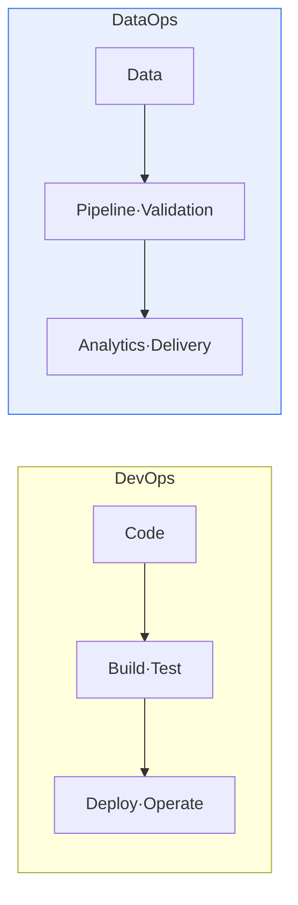
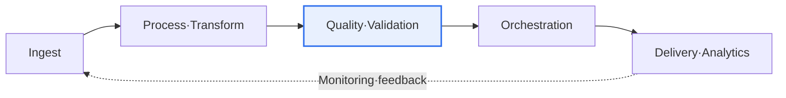

# DataOps and DevOps

## 1. Overview

### a. Definition
> **DevOps** is a methodology that integrates development (Dev) and operations (Ops) to automate and accelerate software delivery, and **DataOps** is a methodology that applies these principles to **data pipelines and analytics** to increase the speed and quality of data delivery.

The background for DataOps is that, just as DevOps revolutionized code deployment, a need arose to '**revolutionize data delivery too, through automation and collaboration**'. In data-analytics practice, a data engineer builds a pipeline, an analyst receives it and analyzes it, and operations manages it; when this process is manual and disconnected, data delivery is slow and error-prone. When an analyst says "the data looks wrong," it can take days to find the cause. DataOps introduces DevOps's CI/CD, automation, and collaboration culture into data pipelines to supply reliable data quickly. The key difference is the object being managed. DevOps deals with application code, but DataOps must manage, in addition to code, the **quality of the constantly changing data itself**—a fundamental distinction.

### b. Need
As data-driven decision-making and AI spread, how fast and accurately you supply data has become a competitive advantage. Relying on manual work without DataOps causes data bottlenecks and quality degradation, collapsing trust in analytics and AI.

## 2. Comparison of DataOps and DevOps

The two methodologies differ in goal and object. DevOps's goal is to deploy application code quickly and reliably, while DataOps's goal is to provide reliable data promptly. If DevOps's collaboration is Dev + Ops, DataOps extends it to data engineers + analysts + operations. The test object also differs: DevOps tests code, while DataOps includes data quality.

| Category | DevOps | DataOps |
|---|---|---|
| **Object** | Application code | Data·pipelines·analytics |
| **Goal** | Fast and reliable SW delivery | Prompt delivery of reliable data |
| **Collaboration** | Dev + Ops | Data engineers + analysts + operations |
| **Core** | CI/CD, IaC | Data-pipeline automation·quality |
| **Testing** | Code testing | Data quality·validation |

## 3. DataOps Architecture and Key Technologies

DataOps architecture automates and monitors the pipeline from data ingestion to delivery for analytics. It ingests and stores data (Kafka·data lake), processes and transforms it (Spark·dbt), validates quality, orchestrates workflows (Airflow), and then delivers it to analytics. This entire process is monitored with data observability to track the freshness, quality, and lineage (where the data came from and how it changed) of the data.

| Component | Key technologies |
|---|---|
| **Ingest·Store** | Kafka, data lake/warehouse |
| **Process·Transform** | Spark, dbt, ETL/ELT |
| **Orchestration** | Airflow, workflow automation |
| **Quality·Testing** | Data validation·profiling, lineage |
| **Monitoring·Governance** | Data observability, catalog |

## 4. Considerations and Implications

1. **DataOps combines data quality and governance with DevOps.** Beyond code automation, data validation, quality, and lineage management must be added to continuously supply reliable data.
2. **Data observability is the core of reliability.** Monitor data freshness, quality, and lineage in real time to catch problems early, before they spread downstream (to analytics·AI).
3. **It evolves in connection with MLOps and data mesh.** The high-quality data pipelines secured through DataOps become the foundation for MLOps, and combined with a data mesh that distributes ownership and management of data by domain, they develop into a data-centric organization.

---

> **In one line**: DevOps revolutionizes code deployment and DataOps revolutionizes data pipelines·analytics through automation and collaboration; DataOps, with its ingest→transform→quality-validation→orchestration→delivery architecture and data observability, promptly supplies reliable data and becomes the foundation for MLOps and data mesh.
