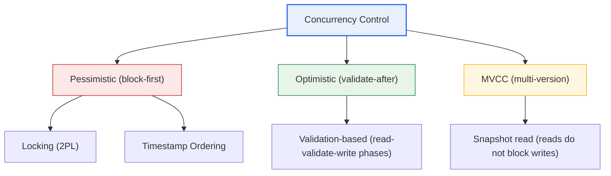
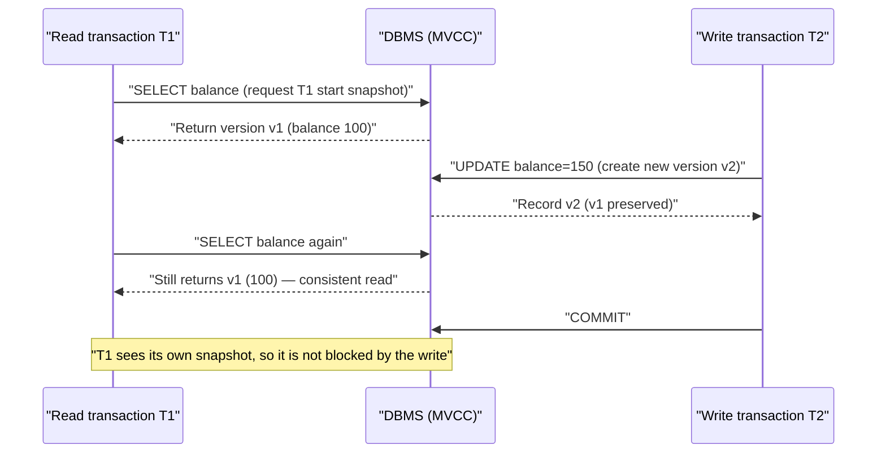

# Database Concurrency Control

## 1. Overview

### a. Definition and Need
> Concurrency control is a technique that governs the mutual interference that arises when multiple transactions **access the same data simultaneously**, so as to **guarantee data consistency and transaction isolation** while maximizing the benefits of concurrency.

The fundamental reason concurrency control is needed is that concurrency directly pits two values—'performance' and 'consistency'—against each other. Allowing many users and applications to access a single DBMS simultaneously reduces idle CPU and disk time, greatly increasing throughput and responsiveness. However, mixing operations without any control lets transactions intrude on each other's intermediate results, so **data consistency collapses**. In other words, the goal of concurrency control is to find a balance point: "process as many transactions concurrently as possible, while guaranteeing a result equivalent to executing them one at a time in some serial order (serializability)."

A representative case is the lost update on a bank account. Suppose two tellers (transactions T1·T2) simultaneously perform "read the balance (100) → withdraw 500,000 won → update to 50" on an account with a balance of 1,000,000 won. If both transactions read the original balance of 100 and each updates it to 50, then although 1,000,000 won was actually withdrawn, the final balance becomes 500,000 won, and one entire withdrawal disappears. Because concurrency, if left unchecked, immediately leads to monetary errors, concurrency control is an essential safeguard for the safety of transaction-processing systems.

### b. Relationship with Transaction ACID
Concurrency control is the mechanism that implements, among the four properties of a transaction—**ACID (Atomicity·Consistency·Isolation·Durability)**—especially **Isolation**. If atomicity is guaranteed by logging and recovery and durability by disk reflection and logging, then isolation is handled by concurrency control. When isolation is ideally maintained, each transaction behaves as if it monopolizes the system, and as a result consistency is preserved. Thus concurrency control is a core pillar of ACID that sustains consistency through isolation.

### c. Anomalies in the Absence of Concurrency Control
Uncontrolled concurrent execution produces four representative anomalies. Understanding these phenomena makes clear why concurrency control and isolation levels are needed. A lost update, as seen above, is when one update is overwritten and disappears by another; a dirty read is reading a value that has not yet been committed and could be canceled at any time, and making a wrong decision based on it. Non-repeatable read and phantom read are phenomena where reading twice with the same condition within one transaction yields different results because another transaction changed a value or a row in between; and cascading rollback is the problem in which one transaction's rollback triggers a chain of rollbacks in other transactions that read its intermediate values, magnifying waste.

| Anomaly | Description | Example situation |
|---|---|---|
| **Lost Update** | One transaction's update is overwritten by another and disappears | Concurrent withdrawal·inventory deduction |
| **Dirty Read** | Reading data not yet committed (cancelable) | Approval based on an unconfirmed balance |
| **Non-repeatable·Phantom Read** | The same query is repeated but a value·row changed in between | Data change during aggregation |
| **Cascading Rollback** | One rollback triggers rollbacks of other transactions in a chain | Cancellation after referencing an uncommitted value |

## 2. Overall Structure of Concurrency-Control Techniques

There are several techniques for concurrency control with different access philosophies. Broadly, they divide into a **pessimistic approach that blocks conflicts in advance** (locking·timestamps), an **optimistic approach that proceeds first and checks later**, and a **multi-version (MVCC) approach that separates reads and writes by versioning**. The structure diagram below shows this classification.

### a. Locking and Two-Phase Locking (2PL)
Locking is the most intuitive method, controlling other transactions' access by placing a lock on data before accessing it. For reads, a **shared lock**, which multiple transactions can hold together, is distinguished from, for writes, an **exclusive lock**, which only one can hold. Shared locks are compatible with each other, but an exclusive lock is compatible with no lock, so during a write other accesses wait.

Because simply acquiring and releasing locks does not guarantee serializability, the **Two-Phase Locking (2PL)** protocol is used. 2PL divides a transaction into a 'growing phase' in which it only acquires locks and a 'shrinking phase' in which it only releases them, with the rule that once it begins releasing locks, it cannot acquire new ones. This rule guarantees serializability. However, releasing locks early before commit can cause cascading rollback, so in practice **Strict 2PL**, which holds all locks until the commit·rollback point, is adopted as the standard.

Locking's representative side effect is **deadlock**. It is a situation where two transactions wait forever for the lock the other holds; for example, if T1 locks A and waits for B while T2 locks B and waits for A, neither can proceed. There is also a trade-off in which concurrency and overhead vary depending on whether the lock scope is set at the row, page, or table level (lock granularity). A smaller lock unit gives higher concurrency but greater management burden.

The trade-off of lock granularity is a problem frequently encountered in practice. Row-level locks give high concurrency because transactions handling different rows do not interfere, but if a batch that updates hundreds of thousands of rows holds a lock per row, the lock-management overhead grows. In this case, when the number of locks exceeds a threshold, the DBMS performs **lock escalation**, promoting many row locks into a single table lock; this reduces management cost but lowers concurrency. So when a bulk-update batch and online transactions contend over the same table, a design that splits the batch into smaller commits or separates their execution time windows to reduce lock conflict is important.

### b. Timestamp Ordering
The timestamp technique assigns each transaction a start time (timestamp) and forces data access to always follow that time order. Each datum records the timestamp of the last transaction that read it (read-TS) and the last that wrote it (write-TS), and if a later transaction tries to go against an already-processed order, that transaction is **aborted and restarted**.

The advantage of this method is that, since it uses no locks, **deadlock fundamentally cannot occur**. This is because transactions never wait for each other. However, since it immediately rolls back any transaction that violates the order, in a high-contention environment the drawback is that **frequent rollbacks and restarts increase waste**. It also requires management to prevent a transaction that proceeded based on an already-committed value from being belatedly canceled (preventing cascading rollback).

### c. Optimistic Validation
The optimistic technique starts from the assumption that "conflicts are rare." It executes a transaction freely at first (read phase) but does not immediately reflect it in the actual DB—working on a local copy—then, just before commit, checks whether it conflicted with another transaction (validation phase), and only reflects the result to the actual DB when there is no conflict (write phase). If a conflict is found in validation, that transaction is rolled back.

The optimistic technique has the advantage of high concurrency without lock overhead in read-oriented, low-conflict-frequency environments. Conversely, in an environment with frequent write contention, re-execution due to validation failures explodes, making it inefficient instead. The 'optimistic lock that detects conflicts by version number', commonly used in web·NoSQL·distributed systems, is the practical implementation of this idea.

Concretely, an optimistic lock places a version column (e.g., `version`) on each row and, on update, conditions on the version it read using a form like `UPDATE ... SET version=version+1 WHERE id=? AND version=?`. If another transaction updated first and the version went up, the affected row count of this UPDATE becomes 0, immediately detecting the conflict, and the application re-reads the latest value and retries. JPA·Hibernate's `@Version` is a representative implementation, and it is especially useful in situations where holding a transaction under a lock for long is difficult, such as a web environment where a user keeps a screen open for a long time before saving. This is a way of handling conflicts logically at the application layer instead of the DB engine's physical locks.

### d. MVCC (Multi-Version Concurrency Control)
**MVCC (Multi-Version Concurrency Control)** is a technique in which, when modifying data, the existing version is not overwritten but kept while a new version is created, so that a read transaction sees a consistent snapshot (a past version) from the point at which it started. As a result, **reads do not block writes, and writes do not block reads.** Today, most commercial and open-source DBMSs—such as Oracle·PostgreSQL·MySQL InnoDB—are built on MVCC.

The core value of MVCC is its overwhelming concurrency in read-oriented workloads. However, since old versions keep accumulating, there is a cost to cleaning them up. For example, PostgreSQL needs a **VACUUM** operation that reclaims dead tuples that are no longer referenced, and Oracle must manage **undo segments** that hold old images. This storage·cleanup cost is the price MVCC pays.

## 3. MVCC and Transaction Isolation Levels

Concurrency control does not operate alone; it is coordinated together with **transaction isolation levels**. An isolation level is a policy that decides "up to what degree of anomaly will be allowed," and standard SQL defines four levels. The sequence diagram below shows how, in an MVCC environment, a read transaction reads a snapshot without being blocked by a write transaction.

The lower the isolation level, the higher the concurrency and the more anomalies allowed; the higher the level, the stronger the consistency but the lower the concurrency. **Read Uncommitted** is the loosest level, allowing even dirty reads; **Read Committed**, which reads only committed values to prevent dirty reads, is the default of Oracle·PostgreSQL. **Repeatable Read** guarantees the consistency of repeated reads within one transaction and is the default of MySQL InnoDB, and **Serializable** provides complete isolation as if executed sequentially but has the lowest concurrency.

| Isolation level | Dirty read | Non-repeatable read | Phantom read | Characteristics |
|---|---|---|---|---|
| **Read Uncommitted** | Allowed | Allowed | Allowed | Loosest·highest concurrency |
| **Read Committed** | Prevented | Allowed | Allowed | Practical default (Oracle·PG) |
| **Repeatable Read** | Prevented | Prevented | Allowed (prevented depending on engine) | InnoDB default |
| **Serializable** | Prevented | Prevented | Prevented | Strongest consistency·lowest concurrency |

## 4. Deadlock Management

In lock-based concurrency control, deadlock is a core challenge that must be handled with a separate strategy. It is standardly approached along four branches: Prevention·Avoidance·Detection·Recovery. **Prevention** predefines the order of resource requests (resource ordering) or has all locks acquired at once to fundamentally block circular wait, while **avoidance** decides whether to allow waiting or roll back—using timestamps as in Wait-Die·Wound-Wait—to prevent a cycle.

**Detection** finds a cycle in the **Wait-for Graph** that depicts the waiting relationships among transactions to discover a deadlock, and if there is a cycle, it selects the transaction with the smallest rollback cost among them as the **victim** and rolls it back (recovery). Practical DBMSs periodically inspect the wait-for graph or, more simply, use a **lock timeout** that automatically cancels a transaction if it fails to obtain a lock for more than a certain time. For example, if a bulk batch and online transactions update the same table in opposite orders and deadlocks recur, unify the access order or separate the batch time window for a fundamental solution.

## 5. Deep Dive: Concurrency Control in Distributed·Cloud Environments

Whereas traditional concurrency control assumed a single-node DBMS, today's distributed·cloud databases must handle concurrency that spans nodes, so new techniques have emerged. Google Spanner assigns global timestamps on top of clock synchronization (including an uncertainty interval) called **TrueTime**, implementing serializability with external consistency even among geographically distributed nodes. This is a case of extending the timestamp-ordering idea to a planetary scale.

Another trend is **SSI (Serializable Snapshot Isolation)**. Snapshot isolation (MVCC-based) performs well but allows a subtle anomaly called 'write skew'; PostgreSQL provides complete Serializable at low cost with SSI, which adds conflict detection to snapshot isolation. In distributed transactions, **two-phase commit (2PC)** guarantees atomic commit, but variant·consensus protocols (Paxos·Raft) are used together to mitigate the blocking problem when the coordinator fails. A key insight from the professional-engineer perspective is that, as the **CAP·PACELC theorems** state, in a distributed environment a trade-off between consistency and availability·latency is unavoidable, and thus many systems intentionally choose a relaxed consistency model fit for the purpose instead of strong serializability.

## 6. Considerations and Implications

1. **The essence is the balance between concurrency and consistency.** The goal of concurrency control is not strong isolation at all costs, but maximizing concurrency to the extent that it satisfies the consistency level the business requires. If strong consistency is needed—as in payments·accounting—choose Serializable; if performance matters—as in queries·statistics—choose a lower isolation such as Read Committed, adjusting the trade-off.

2. **Deadlock is managed proactively at the design·operation level.** Combine prevention·avoidance·detection·recovery and timeouts to suit the situation, unify the order of resource access in the application, and keep transactions short to reduce lock-holding time—these are the fundamental prescriptions. Deadlock is reduced not by algorithms alone but by transaction design.

3. **Understand why MVCC has become the mainstream of modern DBMSs.** It is because, in read-oriented workloads, reads and writes do not block each other, giving excellent concurrency; the price is the cost of cleaning up old versions (VACUUM·undo management). In an MVCC environment, long transactions can cause old-version accumulation and degrade performance, so managing transaction lifetime is important.

4. **Apply isolation levels differentially by workload.** Even within one system, it is practically effective to set different isolation levels by transaction nature, protecting only the few transactions where consistency is decisive with high isolation and processing the rest with low isolation to secure throughput.

5. **Keep expansion to distributed·cloud in mind.** Single-node techniques cannot be applied directly to a distributed setting; you must consciously design the target consistency model considering TrueTime·SSI·consensus protocols and the CAP·PACELC trade-off. It is desirable to define concurrency-control·consistency requirements together at the architecture-selection stage.

## References

- PostgreSQL Documentation — Transaction Isolation / Concurrency Control: https://www.postgresql.org/docs/current/mvcc.html
- Oracle Database Concepts — Data Concurrency and Consistency: https://docs.oracle.com/en/database/oracle/oracle-database/
- ANSI/ISO SQL standard isolation levels (Read Committed·Repeatable Read·Serializable) overview: https://en.wikipedia.org/wiki/Isolation_(database_systems)

---

> **In one line**: Concurrency control is a technique that prevents anomalies (lost update·dirty read, etc.) caused by interference among concurrent transactions to guarantee isolation·consistency; it balances concurrency and consistency with *locking (2PL)·timestamps·optimistic validation·MVCC*, and must be designed together with deadlock management, isolation-level adjustment, and further the consistency model of distributed environments.
