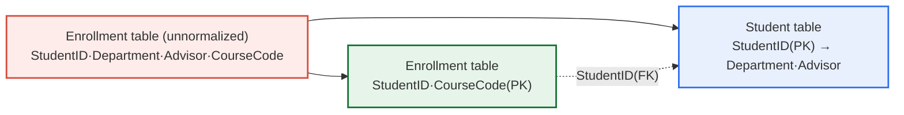
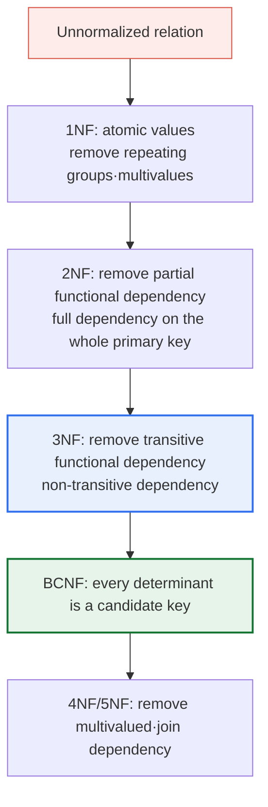

# Database Normalization

## 1. Overview

### a. Definition
> **Normalization** is a systematic design process in relational databases that, to **eliminate data redundancy and prevent anomalies**, performs a lossless decomposition of a relation (table) into several smaller relations according to **functional dependencies**.

The fundamental reason normalization is needed lies in the fact that '**cramming information about different subjects into one table creates redundancy, and that redundancy immediately invites anomalies**'. For example, if a student's department and advisor information is placed together in the enrollment table, then every time the same student enrolls in multiple courses, the department and advisor values are repeatedly stored per row. At first it looks like a trivial waste of storage space, but this redundancy creates potential errors at every moment of inserting, deleting, and changing data. E. F. Codd, the founder of the relational model, proposed the concept of normal forms in the 1970s precisely to solve mathematically the integrity problem of "how data should be arranged so that no contradiction arises on update."

The core idea of normalization is summarized as **"one fact is stored in only one place (One Fact, One Place)."** If data of different subjects (entities) is separated into distinct tables and connected by foreign keys (FK), then any fact is recorded only once across the entire database. When changing a value, you only fix one place, so contradiction fundamentally cannot arise. In other words, normalization is not a simple table-splitting technique but a **design principle that places data in its logically correct location**, and it is the most basic measure that determines schema quality.

Normalization is also a **process of clarifying the meaning of entities**. If two concepts—student and enrollment—are mixed in one table, it becomes ambiguous "what that table represents." Decomposing the table through normalization makes each table hold only one clear subject, so that the schema itself reflects the conceptual structure of the business domain. In this sense, normalization can also be seen as the final refinement stage of data modeling (from conceptual to logical design).

### b. Need
When redundancy is left unchecked, it goes beyond wasting storage space: on update, only some of the many rows are changed, causing a serious integrity problem in which **data contradicts itself**. Redundancy is especially fatal for data where accuracy directly connects to service trust, such as account balances, inventory quantities, and customer grades. Normalization is the starting point of trustworthy database design that guarantees this logical integrity (consistency) at the schema-structure level. Conversely, in analytical systems where query performance is the top priority, normalization is sometimes relaxed (denormalization); to judge this balance point, you must first accurately understand the principles of normalization.

## 2. How Anomalies Arise

The fastest path to understanding normalization is to see "what happens if you do not normalize." The `<Enrollment table>` below (primary key: {StudentID, CourseCode}) is an unnormalized design that mixes student information and enrollment information in one table.

| StudentID | Department | Advisor | CourseCode |
|---|---|---|---|
| 221571 | Computer Science | K1 | C412 |
| 221571 | Computer Science | K1 | C511 |
| 221572 | Computer Science | M1 | C412 |
| 211561 | Mathematics | P2 | C324 |

Looking at this table, the student with StudentID 221571 enrolls in two courses (C412, C511), so the **department (Computer Science) and advisor (K1) are stored identically twice**. This is exactly where the root cause of anomalies lies. The non-primary-key attributes department·advisor depend not on the whole primary key {StudentID, CourseCode} but only on **part of it, the StudentID (partial functional dependency)**, yet they are needlessly stored repeatedly as many times as the rows produced by the other part of the primary key (CourseCode). This structural defect manifests as the three anomalies of insertion, deletion, and update.

First, an **insertion anomaly** is the problem of being forced to insert unwanted data together. Even if you want to store the department information of a new student who has not yet registered for any course, you cannot create a row if the part of the primary key, CourseCode, is NULL, so you cannot insert the student information itself. In other words, the unrealistic constraint that "you must enroll to be registered as a student" is forced by the data structure.

Second, a **deletion anomaly** is the problem of losing unrelated information while trying to delete one thing. If student 211561 cancels the only course they took, C324, and that row is deleted, then the department (Mathematics) and advisor (P2) information stored together also disappears, so the student's very existence vanishes from the database. This is because two separate facts—enrollment history and student personal information—are bound in one row.

Third, an **update anomaly** is the most dangerous type: the problem in which only some of the duplicated values are modified, leaving the data contradictory. If student 221571's department changes from Computer Science to Software Engineering, you must fix every row related to that student (C412, C511) without omission. If you fix only one row and miss another, the same student's department is recorded as two different values simultaneously, leaving a state where you cannot tell "which is the real one."

| Anomaly | Symptom | Root cause |
|---|---|---|
| **Insertion anomaly** | Cannot insert student information without enrollment | If part of the primary key (CourseCode) is NULL, no row can be created |
| **Deletion anomaly** | Deleting the last enrollment also erases student information | Two facts—student·enrollment—coexist in one row |
| **Update anomaly** | On department change, only some rows are fixed → contradiction | Department information is duplicated across multiple rows |

## 3. Solution — Lossless Decomposition According to Functional Dependencies

The solution to anomalies is clear. **Separate the table so as to remove the partial functional dependency.** Detach department·advisor, which depend only on StudentID, into a separate student table, and leave only the primary key {StudentID, CourseCode} in the enrollment relationship table. Below is a structure diagram of the original table being decomposed into two clear subject tables.

The decomposition result is as follows. In the **student table**, department·advisor are stored only once per student, and the **enrollment table** purely expresses only the relationship of "who takes what."

**Student table** (primary key: StudentID)

| StudentID | Department | Advisor |
|---|---|---|
| 221571 | Computer Science | K1 |
| 221572 | Computer Science | M1 |
| 211561 | Mathematics | P2 |

**Enrollment table** (primary key: {StudentID, CourseCode})

| StudentID | CourseCode |
|---|---|
| 221571 | C412 |
| 221571 | C511 |
| 211561 | C324 |

Separating in this way resolves the three anomalies simultaneously. A new student is registered in the student table with only a department, so the **insertion anomaly** disappears; even if all enrollments are canceled, the personal information remains in the student table, so the **deletion anomaly** is gone; and a department change only requires fixing a single row in the student table, so the **update anomaly** is fundamentally eliminated. The important point is that this decomposition is **lossless**. Joining the two tables again by StudentID can accurately restore the original information, so the data is divided while losing none of its meaning. This is why normalization is not a simple deletion but a "safe decomposition."

## 4. Normal Forms and the Progression Procedure

Normalization is not done all at once; it proceeds progressively in the stages 1NF→2NF→3NF→BCNF→4NF→5NF, according to the kind of dependency being removed. In practice most anomalies are resolved at 3NF or BCNF, so **3NF/BCNF is usually set as the target**. Each stage has a cumulative structure that additionally requires a new condition on top of satisfying the previous stage.

**First Normal Form (1NF)** requires that every attribute have an atomic value that can no longer be divided. Putting multiple values in one cell with commas, like "C412, C511," or having repeating columns (Course1, Course2), violates 1NF. In this case, unfold each value into a separate row to remove the repeating group. 1NF corresponds to the minimum qualification of a relational table.

**Second Normal Form (2NF)** is a state that satisfies 1NF while **removing partial functional dependencies**. As in the earlier example, when the primary key is a composite key ({StudentID, CourseCode}), separating attributes (department·advisor) that depend only on part of the primary key (StudentID) yields 2NF. If the primary key is a single attribute, partial dependency itself cannot hold, so 1NF automatically implies 2NF.

**Third Normal Form (3NF)** is a state that satisfies 2NF while **removing transitive functional dependencies**. For example, if (StudentID→Department) and (Department→College), then a transitive dependency StudentID→College exists. In this case, changing the department requires also managing the college together, creating redundancy, so department-college is separated into a distinct table. The target line for most practical schemas lies here.

**BCNF (Boyce-Codd Normal Form)** strengthens 3NF and requires the condition that **every determinant be a candidate key**. It is a stage for removing anomalies that remain even when 3NF is satisfied, in special situations where there are multiple candidate keys that overlap (are nested); it frequently appears in reservation systems (assignments where students·courses·instructors are intertwined). However, BCNF decomposition can break dependency preservation, so in practice the trade-off between 3NF and BCNF is reviewed before deciding the level to apply.

The procedure for actually performing normalization is summarized as follows. First, derive all attributes of the target relation and the functional dependencies among them without omission. Second, determine the candidate keys and the primary key. Third, starting from 1NF, find in order the violating dependencies of each stage (repeating group→partial dependency→transitive dependency→determinant that is not a candidate key) and separate the relevant attributes into a new relation. Fourth, verify whether the original is restored when the separated relations are joined again (lossless join) and whether the original dependencies are preserved. Rather than following this procedure mechanically, the key to obtaining a correct schema is to also confirm that each decomposition matches the business rules (domain meaning).

| Stage | Satisfying condition | Target of removal |
|---|---|---|
| **1NF** | Every attribute is atomic | Repeating groups·multivalues |
| **2NF** | Full functional dependency on the whole primary key | Partial functional dependency |
| **3NF** | No transitive dependency | Transitive functional dependency |
| **BCNF** | Every determinant is a candidate key | Residual anomaly from candidate-key overlap |
| **4NF** | No multivalued dependency | Multivalued dependency (MVD) |
| **5NF** | No join dependency | Join dependency (PJNF) |

## 5. Deep Dive — The Practical Trade-off Between Normalization and Denormalization

In theory, the higher the normalization stage, the better the integrity; but in practice a higher normal form is not always the answer. Because normalization splits tables into small pieces, the number of cases where you must **join** multiple tables to build a single screen or report increases. Joins consume CPU·memory, and in high-volume·high-frequency query environments they become the chief cause of response delay. This is where **denormalization** comes in—a reverse-direction design technique that intentionally allows redundancy or merges tables for performance.

A representative case is the **star schema** of a data warehouse (DW). Analytical systems are dominated by large aggregation queries, like "sales totals by region·product for last quarter," and joining dozens of normalized tables every time does not yield performance. So, dimension tables are placed around a fact table, and values such as region names and product categories are deliberately stored redundantly (denormalized) within the dimension tables to minimize the number of joins. Precomputing and storing a "review count" or "average rating" in the product table on an e-commerce product-listing screen is denormalization by the same principle. Instead of aggregating the review table on every query, the count is updated only when a review is added, dramatically improving read performance.

The key point is that **denormalization is not a failure of normalization but a conscious choice premised on normalization**. First secure a correct logical structure through normalization, then apply denormalization only to parts where a measured performance bottleneck is confirmed. Leaving redundancy unchecked from the start without normalization is entirely different from introducing controlled redundancy after normalization. In the latter case, the responsibility for maintaining the consistency of duplicated values (triggers·batches·application logic) is clearly managed. Because the two goals of performance and integrity conflict, the professional engineer must be able to judge this balance point according to the nature of the system (whether it is transaction-centric OLTP or query-centric OLAP).

## 6. Considerations and Implications

1. **Judging the trade-off between normalization and performance is the core of design capability.** Normalization raises integrity but can lower query performance through increased joins. It is desirable to take a dual approach: normalize to 3NF/BCNF for account·ledger systems where integrity is the top priority, and strategically apply denormalization (star schema, aggregate columns) for analytical·statistical systems where query performance is the top priority.

2. **Accurate functional-dependency analysis is the premise of correct decomposition.** If you cannot accurately identify, at the business-rule level, "which attribute is determined by what," you may split tables with the wrong key and instead break lossless decomposition or create unnecessary joins. Drawing a dependency diagram (FD Diagram) and domain-expert validation must be included in the design procedure.

3. **Separate the architecture by the criterion of normalization for OLTP, denormalization for OLAP.** Operational systems where transaction integrity matters accumulate data safely with a normalized schema, and queries·analytics are loaded into a separate denormalized analytics store (DW/data mart) via ETL for processing. Separating the workloads this way lets you achieve integrity and performance simultaneously.

4. **When denormalizing, you must always design a consistency-maintenance mechanism for the duplicated data.** If you introduce aggregate·duplicate columns, you must explicitly provide triggers·CDC·batches or application logic that synchronize them when the source data changes. Denormalization with unclear synchronization responsibility results in artificially reviving the update anomaly.

5. **Even in the era of NoSQL·document DBs, the principles of normalization remain valid.** Document DBs such as MongoDB recommend embedding data (denormalization) for query performance, but this does not mean you can ignore the principles of normalization; rather, it means you make a deliberate choice according to the access pattern, on top of understanding the trade-off between normalization and denormalization. Only by knowing the principles can you judge whether to choose reference or embedding.

## References
- Codd, E. F., "A Relational Model of Data for Large Shared Data Banks", CACM, 1970. https://dl.acm.org/doi/10.1145/362384.362685
- Wikipedia, "Database normalization". https://en.wikipedia.org/wiki/Database_normalization

---

> **In one line**: Normalization is a design principle (1NF→2NF→3NF→BCNF) that performs lossless decomposition of tables according to functional dependencies to *eliminate redundancy and prevent anomalies (insertion·deletion·update)*; it removes partial·transitive dependencies to secure integrity, while strategically balancing with denormalization in analytical systems that need query performance.
