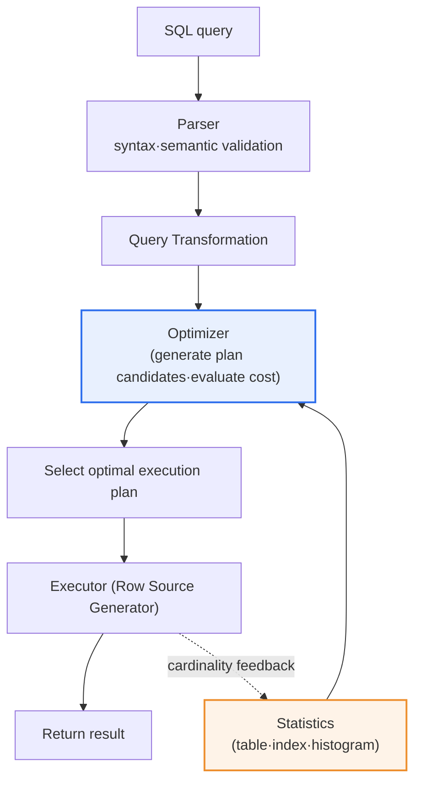
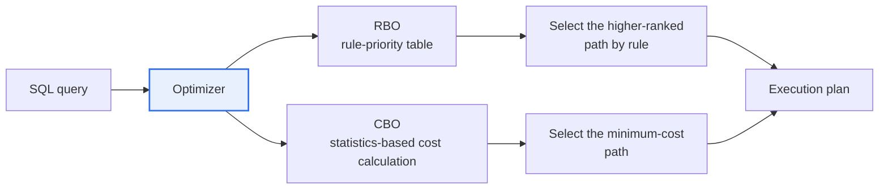

# Database Optimizer (RBO·CBO)

## 1. Overview

### a. Definition
> The **optimizer** is the core engine of a DBMS that, when executing a SQL query, **selects the most efficient execution plan among the many execution paths (access path·join order·join method) that can produce the same result**. When a user expresses '**what**' they want with declarative SQL, it is the optimizer's role to decide '**how**' to process it.

The key to understanding the optimizer lies in the fact that '**a single SQL statement has tens to thousands of ways to execute, and which one you choose makes a difference of hundreds to tens of thousands of times in response time**'. For example, even a simple query joining two tables A·B has execution times that diverge to extremes depending on the combination of which table to read first (driving table), whether to use an index or a full scan (access path), and which join method (Nested Loop·Hash·Sort Merge) to use. Because SQL is a 'declarative language' in relational DBs, the user does not specify the processing procedure; the intelligence that automatically decides exactly that procedure is the optimizer.

Without an optimizer, a developer would have to hand-craft the optimal physical execution order for every query and re-tune it every time the data volume·distribution changes. The optimizer absorbs this burden into the DBMS internals, so the user focuses only on the logical query and leaves the physical optimization to the engine. But depending on 'by what criterion it judges optimality', the optimizer splits into two branches. There is the **RBO (Rule-Based Optimizer)**, which follows the priority of predetermined rules, and the **CBO (Cost-Based Optimizer)**, which calculates cost based on actual data statistics. Today, virtually all commercial·open-source DBMSs adopt the CBO as the standard.

### b. Need and Position
The larger the data and the more complex the query, the more the 'choice of execution method' governs performance. The optimizer handles the **optimization stage** among the SQL-processing pipeline (parsing → optimization → execution); once the parser validates syntax·semantics and produces logically equivalent query forms, the optimizer selects the physically cheapest plan among them and hands it to the executor (row source generator). In other words, the optimizer is the 'brain of the DBMS' that finds the optimal path to secure performance without the user having to worry about it.

The importance of the optimizer increases nonlinearly as the system scale grows. With small data, whatever plan is made, the perceived difference is small; but in high-volume·high-concurrency environments, a single wrong plan can monopolize CPU·memory·I/O and collapse the responsiveness of the whole system. Therefore, understanding the optimizer is not merely performance-optimization knowledge but a matter of dealing with the foundations of stable service operation and resource efficiency, and it is a core capability directly tied to DB tuning·capacity planning·SLA management.

## 2. The Optimizer's Position in the SQL Processing Flow

To understand when and on what basis the optimizer intervenes, you must see the whole flow by which a single SQL statement is processed. The detailed process diagram below shows the stages from parsing to execution·statistics feedback.

The physical choices the optimizer considers when creating candidate plans fall broadly into three axes. First is the **access path**: it judges which is cheaper, a full table scan that reads the whole table, or an index scan that goes through an index. If only a small amount is filtered, an index is favorable; if a large amount is filtered, a full scan is favorable. Second is the **join order**: subsequent cost differs depending on which table (driving table) is read first to reduce the result set. Third is the **join method**: it chooses the one that fits the data scale among Nested Loop, favorable for small sets, Hash Join, favorable for large equi-joins, and Sort Merge, suited to sorted large sets. The combination of these three axes explosively increases the number of possible execution plans, and finding the lowest-cost point in that vast space is the optimizer's job.

Unpacking this flow in prose: first the **parser** validates the SQL's syntax and the existence·permission of objects. Next, in the **query transformation** stage, the optimizer rewrites the query into a form that is logically equivalent but easier to optimize, using view merging, predicate pushing, OR expansion, and so on. Then, in the full-fledged **optimization** stage, it generates several execution-plan candidates, estimates the cost of each, and picks the lowest-cost plan. What it references decisively here is the **statistics**, and if the actual number of rows processed after execution differs greatly from the estimate, that information is fed back into the statistics (cardinality feedback) to improve the next execution. In short, the quality of the optimizer's judgment depends absolutely on the 'accuracy of the statistics'.

## 3. RBO vs CBO: The Difference in Judgment Criterion

The two optimizer methods diverge fundamentally on 'on what basis they choose the execution path'. The structure diagram below shows how the same SQL reaches a plan on different grounds in the two methods.

### a. RBO (Rule-Based Optimizer)
**RBO** builds an execution plan according to a predetermined list of rules and priorities. For example, a rank is fixed per access path, like 'single-row index access > unique index > range index > full table scan', and the optimizer unconditionally selects the higher-ranked path, regardless of the actual volume·distribution of data. The advantages are that it is simple and the result is predictable. It works even without statistics, and the same SQL always produces the same plan.

However, RBO's fatal limitation is that it '**does not look at the actual data**'. Because it unconditionally takes an index if one exists, even for a query that must read 900,000 of 1,000,000 total rows, it takes the index and instead causes an explosion of random I/O, resulting in the paradox of being far slower than a full scan. It worked in the era when data was small, but in modern environments with large volumes and varied distributions, wrong choices are frequent, so it has effectively been retired. In Oracle's case, even after the CBO was introduced, it was used only when there were no statistics or on explicit request, and in later versions it was cleaned up as an **obsolete·deprecated** method.

The more fundamental reason RBO was retired lies in the structural contradiction that '**data changes, but the rules are fixed**'. Even if a table that had thousands of rows at service launch grows to hundreds of millions after a few years of operation, RBO still produces the same plan by the same rule priority. As data growth·distribution change, the optimal path should change, but RBO has no means of reflecting this. By contrast, CBO, merely by refreshing the statistics, builds a different plan fit for the data scale even for the same SQL. The presence or absence of this 'ability to adapt to change' divided the fates of the two methods, which is why modern DBMSs, without exception, adopt CBO as the default.

### b. CBO (Cost-Based Optimizer)
**CBO** actually calculates the cost of each execution path **based on statistics** such as table size·data distribution·index selectivity·clustering factor, and selects the cheapest plan. Here, cost is roughly a normalized estimate of 'CPU usage + I/O count', and the optimizer estimates and compares the expected number of rows to process (**cardinality**) and cost for each candidate plan. Because it is based on statistics, an intelligent choice fit for the data situation is possible, and this is why it has become the standard of all major DBMSs today.

CBO's performance hinges on the 'freshness of the statistics'. If the statistics are old and diverge from the actual data (stale statistics), the optimizer builds a wrong plan based on incorrect cardinality. For example, if the statistics of a recently surging table remain based on an old, small volume, the optimizer misjudges that 'this table is small' and chooses an inappropriate Nested Loop join, and as a result a query that should finish in a few seconds takes tens of minutes. So the core of CBO operation is regular·automated statistics collection.

| Category | RBO (rule-based) | CBO (cost-based) |
|---|---|---|
| **Judgment criterion** | Fixed rules·priorities | Statistics-based cost calculation |
| **Data reflection** | No (ignores data) | Yes (size·distribution·statistics) |
| **Advantages** | Simple·predictable | Intelligent optimization fit for the data situation |
| **Disadvantages** | Inefficiency from ignoring the actual situation | Performance governed by statistics accuracy |
| **Current status** | Obsolete | The de facto standard |

## 4. CBO's Cost Calculation and Practical Tuning Factors

The process by which CBO estimates cost is, in the end, a '**chain of cardinality estimates**'. For each predicate, it estimates how many rows will be filtered as a selectivity, and passes the resulting row count as input to the next operation (join·sort) to calculate cost again. If the selectivity estimate—the first button of this chain—goes wrong, all subsequent estimates go wrong in a chain, so the **histogram**, which accurately tells the data distribution, is important. In a column whose value distribution is not uniform (e.g., a specific code accounts for 95% of the total), without a histogram the optimizer misjudges each value as uniformly distributed. Recent versions support, in addition to frequency·height-balanced, top-frequency·hybrid histograms to represent skewed distributions more precisely.

The elements of practical tuning are all consistently organized if understood as means of 'helping the optimizer build a good plan'. Each item in the table below is not independent; they form a single flow: keep statistics up to date, read the execution plan to diagnose the problem, and intervene with hints only when necessary.

| Tuning factor | Content and reason |
|---|---|
| **Statistics management** | CBO depends on statistics → automatic statistics collection to keep them current is essential |
| **Execution-plan analysis** | Diagnose bottlenecks (excessive I/O·wrong join) with EXPLAIN PLAN·actual execution statistics |
| **Histogram** | Prevent selectivity misjudgment for skewed-distribution columns |
| **Hint** | When the optimizer misjudges, the developer explicitly guides access path·join method |
| **Bind variable** | Reduce hard-parsing burden by reusing the execution plan (soft parse) |

A trade-off to watch here is the interaction between bind variables and histograms. Bind variables reduce parsing cost by reusing the execution plan, but using a bind variable on a skewed-distribution column can cause inefficiency (the bind-peeking side effect) where 'a plan optimized for the first value that came in' is reused for other values afterward. In such cases, a feature like adaptive cursor sharing complements it by diverging the plan according to the value distribution. In other words, one optimization technique can backfire in another situation, so the habit of actually reading and verifying the execution plan is the starting point of tuning.

### a. A Performance Incident Caused by Wrong Cardinality Estimation (case)
A typical scenario where CBO's misjudgment spreads to an actual failure is the case of '**choosing a Nested Loop join on a large table mistaken for a small table**'. For example, suppose a nightly batch loaded millions of rows into the order table, but the statistics were not refreshed, so the optimizer estimated 'this table has a few thousand rows'. The optimizer chooses a Nested Loop (repeatedly probing the inner table for each outer row) favorable for a small set, but in reality millions of repeated probes occur, so a query that should finish in a few seconds occupies CPU and I/O for tens of minutes. Had it been a daytime business query, it would immediately lead to a service delay.

The diagnosis and prescription for this incident follow the optimizer's principles directly. First, confirm in the execution plan the **gap between the estimated cardinality (E-Rows) and the actual row count (A-Rows)** to pinpoint where the optimizer misjudged. If the root cause is stale statistics, re-collecting statistics is the standard fix; if the cause is a specific value skew, create a histogram to correct the selectivity estimate. Only in an emergency where the plan must be reverted immediately do you take a temporary measure with a hint that forces the join method, and afterward you resolve the root cause with statistics·indexes and remove the hint dependence. This case shows both the proposition that 'CBO's performance depends on statistics accuracy' and the principle that 'reading the execution plan to compare estimate against actual is the first step of tuning'.

## 5. Deep Dive: Adaptive Query Optimization

CBO's fundamental weakness is that '**an estimate made before execution can differ from reality**'. No matter how good the statistics, cardinality estimation goes astray in complex joins·conditions, and as a result a wrong plan can become fixed. What emerged to complement this is **Adaptive Query Optimization**, which was organized as a feature group in Oracle Database 12c.

First, **Adaptive Plans** is a method that, for joins where cardinality estimation is difficult, 'defers the plan decision until execution time'. The optimizer embeds a statistics collector in the execution plan, and if the number of rows actually processed differs greatly from the estimate, it switches the plan mid-execution—for example, changing the join method from Nested Loop to Hash Join. Second, **Automatic Reoptimization** and its predecessor **cardinality feedback** (introduced in 11gR2) store the actual cardinality after one execution and, at the next execution, reflect that value to recompile into a better plan. Third, **SQL Plan Management** fixes a verified plan as a baseline to prevent 'plan regression', in which a plan suddenly worsens due to statistics changes.

The practical implication of this trend is clear. Whereas in the past the optimizer processed 'only according to the plan it built once before execution', modern CBO is evolving toward 'learning while executing and correcting itself'. Furthermore, recently, autonomous DB features that estimate cardinality with machine learning (learned cardinality estimation) or learn from execution history to automatically suggest tuning are being commercialized, so the optimizer is drawing a trajectory of rules (RBO) → statistics-based cost (CBO) → in-execution adaptation (adaptive) → learning-based autonomy.

## 6. Considerations and Implications (Professional-Engineer Perspective)

1. **Keeping statistics current is the lifeblood of CBO.** Because CBO calculates cost based on statistics, if the statistics are old (stale) or inaccurate, performance plummets due to a wrong execution plan. Operate automatic statistics-collection jobs, and immediately after bulk data loads (batch·migration), manually refresh statistics to always keep the basis of the optimizer's judgment aligned with the actual data.
2. **Trust the optimizer, but always verify.** For most queries CBO finds the optimum, but in complex multi-joins·skewed distributions misjudgment occurs. Make it the standard of SQL tuning to compare the execution plan (EXPLAIN PLAN) with actual execution statistics to confirm the gap between estimated cardinality and actual row count, and correct large-gap points with histograms·hints.
3. **Use hints prudently, as a last resort.** Forcing a plan with a hint improves things right now, but if the data distribution changes, that forced plan can instead become a shackle. Solve the root cause (statistics·index design) first, and apply hints only limitedly to exceptional situations where correcting the cause is difficult, to preserve maintainability.
4. **Build a plan-stability and regression-prevention system.** 'Plan regression', in which a well-running query's plan suddenly worsens due to statistics changes or a version upgrade, directly leads to operational failures. Use SQL Plan Management (plan baselines)·adaptive-optimization features to protect verified plans, and require governance that goes through performance-regression testing before switching when making changes.
5. **Reflect the evolution toward adaptive·autonomous optimization in the design.** Because modern CBO develops toward correcting plans during execution and automating tuning through learning, when designing a new system, turn on these features and secure monitoring metrics (plan-change·reoptimization history) to reduce dependence on DBAs' manual tuning and continuously manage performance in large-scale query environments.

## References
- Oracle, "Query Optimizer Concepts (Database SQL Tuning Guide 19c)", https://docs.oracle.com/en/database/oracle/oracle-database/19/tgsql/query-optimizer-concepts.html
- Oracle Blogs, "Optimizer Adaptive Features in Oracle Database 12c Release 2", https://blogs.oracle.com/optimizer/optimizer-adaptive-features-in-oracle-database-12c-release-2
- ORACLE-BASE, "Cost-Based Optimizer (CBO) And Database Statistics", https://oracle-base.com/articles/misc/cost-based-optimizer-and-database-statistics

---

> **In one line**: The optimizer is the brain of the DBMS that *selects the optimal execution plan among a query's many execution paths*; it divides into the fixed-rule RBO (obsolete) and the statistics-based cost-calculating CBO (current standard), CBO's performance depends on keeping statistics current and on accurate cardinality estimation, it is tuned via execution-plan analysis·histograms·hints, and it is evolving into adaptive·autonomous optimization that corrects itself during execution.
