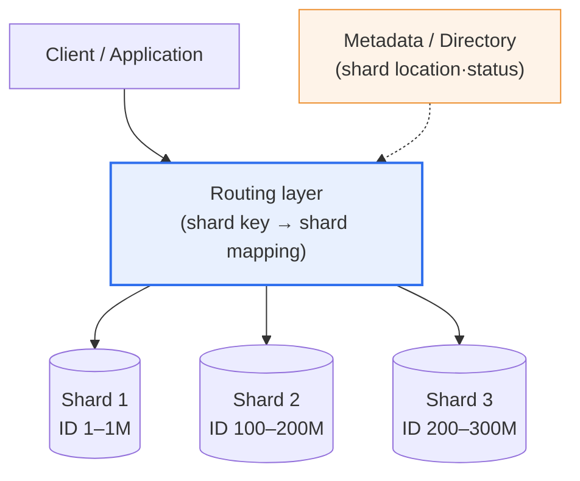
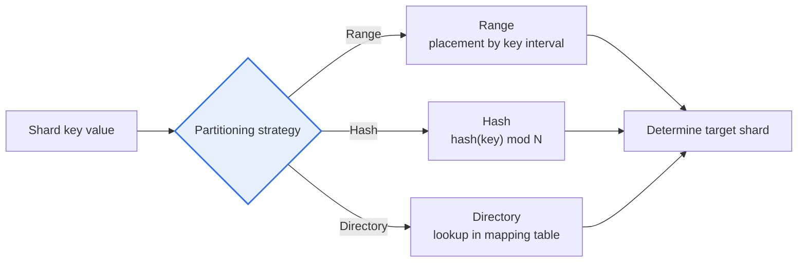

# Database Sharding

## 1. Overview

### a. Definition
> **Sharding** is a data-distribution technique that stores large volumes of data by **horizontally partitioning it across multiple independent databases (shards)**, thereby distributing a single database's storage·processing load across multiple servers and securing linear scalability (scale-out).

The core idea of sharding is '**let us split data that a single DB cannot handle and store it across many**'. When a service grows and data and traffic surge, a single database server hits its limits simultaneously across multiple resources—storage capacity, CPU, memory, disk I/O, connection count, and so on. At this point, **vertical scaling (scale-up)**, which increases server specs, is simple at first, but the higher the hardware spec the more the price rises exponentially, the physical ceiling (the cores·memory a single server can have) is clear, and ultimately the fundamental limit that a single point of failure (SPOF) remains.

Sharding overcomes this limit with **horizontal scaling (scale-out)**. Because it splits data **by row** and stores it distributed across multiple servers, you can keep adding cheap servers to increase capacity and throughput almost linearly. For example, if you split user data by user ID and store 1–1,000,000 in shard 1 and 1,000,000–2,000,000 in shard 2, then each shard handles only part of the total, so individual load drops and the more servers you attach the greater the total throughput. Which data is in which shard is determined by the **shard key** and the routing rule for it.

However, this benefit comes at a cost. Because data is physically scattered, queries·joins·aggregations spanning multiple shards are difficult, guaranteeing atomicity becomes complex when a single transaction spans multiple shards, and the burden of data redistribution (rebalancing) and operational management grows when adding a shard. Therefore, sharding is a last-resort scaling card, introduced 'when a single DB can no longer handle it', and the practical lesson is that indiscriminate early application only magnifies complexity.

### b. Background and Need
Sharding took off in earnest as web services became widespread and user·content data exceeded terabytes. Early large services (the Google Bigtable idea, Facebook's MySQL sharding, Instagram's PostgreSQL sharding, etc.) sharded relational DBs at the application level to handle surging traffic. Today this pattern has been absorbed as a built-in feature into NoSQL·NewSQL·cloud managed DBs, evolving so that developers can obtain scalability without implementing low-level distribution themselves.

## 2. Overall Structure of Sharding

A sharding system consists broadly of three layers. The **routing layer** looks at the shard key in the request and decides which shard to send it to. Depending on where you place this routing—inside the application code (client-side), a separate proxy/middleware (e.g., MySQL's ProxySQL·Vitess, MongoDB's mongos), or inside the DB engine—the architecture differs. The **shards** are mutually independent (shared-nothing) DB instances, each of which completely handles storage·queries for its own subset of data. The **metadata/directory** manages which key range is in which shard and what each shard's status·replica location is, becoming the basis for routing.

An important design principle here is **shared-nothing**. Only when each shard is independent, not sharing resources, does load or failure on one shard not propagate to others, enabling true linear scaling. Conversely, if shards depend on shared storage or a shared lock, that point becomes a new bottleneck and the benefit of sharding disappears.

**Where you place the routing layer** also determines the character of the architecture. First, **client-side routing** has the application code or DB driver directly compute the shard location and connect to that shard. With no intermediate hop, latency is low, but changes to the shard topology must be reflected in all clients, so deployment coupling is high. Second, **proxy/middleware routing** (mongos, ProxySQL, Vitess's VTGate, etc.) places a dedicated routing layer between the application and the shards. Because the application only needs to know a single endpoint, coupling is low and resharding is transparent, but the proxy layer itself must be made redundant·scalable. Third, **DB-engine-embedded routing** (Cassandra's coordinator node, etc.) delivers a request to the correct node no matter which node you connect to, simplifying operations. The larger the scale, the more the tendency to move from client-side to proxy·engine-embedded methods.

## 3. Partitioning (Sharding) Strategies and Routing

The partitioning strategy determines 'by what rule data is placed on shards', and each strategy has distinct pros and cons.

**a. Range-based sharding.** Data is divided by intervals of the shard key value (e.g., date 2026-01 to shard 1, 2026-02 to shard 2). It has the advantages of intuitive implementation and efficient range queries (querying a specific period) that touch only a few shards. However, in time-series services where writes concentrate on recent data, a **hot spot** where traffic concentrates on only the 'last shard' easily arises. For example, if you range-shard log·order data by creation time, always only the latest shard is busy while the rest are idle, so the distribution effect collapses.

**b. Hash-based sharding.** The shard is determined by the value that comes out of putting the shard key through a hash function (e.g., `hash(user_id) mod N`). Its biggest advantage is that the key distribution becomes even, making it easy to avoid hot spots. On the other hand, because adjacent keys are scattered to different shards, range queries scatter across all shards (scatter-gather) and are inefficient; above all, **when the number of shards N changes (`mod N`), almost all data's membership changes, causing large-scale redistribution**.

To mitigate this redistribution explosion, **consistent hashing** is widely used. Consistent hashing places keys and nodes on a single hash ring (a circular space like 0–2³²−1) and assigns each key to the nearest node clockwise. When adding·removing a node, only the data of the adjacent interval moves, so the amount of relocation is limited to about K/N on average (total keys K, nodes N). Adding to this by scattering one physical node across the ring as multiple **virtual nodes** can even reduce load skew among nodes. The DynamoDB·Cassandra family adopts this principle.

Concretely by the numbers, the difference is clear. With 4 nodes under a simple `mod 4`, increasing to 5 nodes theoretically requires about 80% of all keys to change their shard membership (redistribution explosion). By contrast, with consistent hashing, the new node takes over only one interval of the ring, so on average only about 1/5 (20%) of the total moves. At the scale of hundreds of millions of records, this difference becomes the decisive factor dividing 'whether zero-downtime scaling is possible'.

The hot spot of range sharding is commonly observed in actual services. For example, if you shard order data by `order_id` (monotonically increasing) range, new orders always pile up only in the last shard, so only that shard's write IOPS is near 100% while the rest are idle. To avoid this, in practice one redesigns the key—for instance, by prefixing it with a hash of the user ID instead of a sequential key—or uses a mixed strategy where the time axis is handled by partitioning and load distribution by hash sharding.

**c. Directory-based sharding.** A separate lookup table (directory) explicitly manages 'which key is in which shard'. Because the mapping can be changed freely, operational flexibility—such as redistribution·isolating a specific customer—is greatest. In exchange, every query must first consult the directory, so caching·redundancy is essential to prevent the directory itself from becoming a bottleneck·single point of failure. It is useful in SaaS that needs fine-grained placement, such as separating a specific large customer (tenant) into a dedicated shard.

The three strategies are not exclusive and can be combined. Representatively, ultra-large services use a two-tier structure that '**maps logical shards (virtual buckets) to physical shards via a directory**'. First they hash the shard key into one of thousands of fixed logical buckets (even distribution), and which physical server handles that bucket is managed by the directory. Then, when increasing physical servers, you only move the 'bucket-assignment table' rather than the data, making online rebalancing much easier. Instagram's early approach of placing thousands of logical shards on top of PostgreSQL and mapping them to a few physical servers is a well-known example of this pattern.

| Strategy | Advantages | Disadvantages | Representative cases |
|---|---|---|---|
| **Range** | Range-query efficiency, simple implementation | Hot spots occur easily | HBase, MongoDB (range) |
| **Hash** | Even distribution, hot-spot mitigation | Range-query inefficiency, redistribution burden (→consistent hashing) | Cassandra, DynamoDB |
| **Directory** | Flexible placement·redistribution | Directory bottleneck·SPOF risk | Custom sharding, some SaaS |

Since the table alone does not reveal the selection criterion, let us add practical implications. The service's **dominant query pattern** governs the strategy choice. A workload that repeatedly queries a specific user's data (e.g., a social service's 'my timeline') favors user-ID hash sharding, while a workload where periodic reporting is central (e.g., log analysis) favors range sharding. In other words, the key to performance is to take 'the key you most often query by' as the shard key so that **most queries finish within a single shard**.

## 4. The Difference Among Sharding·Partitioning·Replication

Sharding and partitioning are the same in that they 'divide data', but they differ in the **scope of division**. **Partitioning** splits a large table into several logical partitions within a single DB server to improve management·performance, and **sharding** distributes those pieces across **multiple physical DB servers** entirely. In other words, sharding can be seen as the concept of extending horizontal partitioning to multiple nodes. So partitioning cannot exceed a single server's resource limit, but sharding exceeds that limit itself by adding servers.

Another concept to distinguish is **replication**. Replication **copies the same data identically** to multiple servers to gain availability and read scaling, while sharding stores **different data** split across servers to scale writes·capacity. In practice, large-scale systems combine the two. Replicating each shard again (master-replica) is the standard architecture, increasing writes·capacity with sharding while securing each shard's availability and read performance with replication.

For example, if you place 2 replicas on each of 4 shards, you get 12 instances in total, where writes scale 4× across 4 masters, reads distribute across 12 nodes, and even if any master dies, a replica is promoted so availability is maintained. Scaling by the product of 'sharding (write scaling) × replication (read scaling·availability)' is the basic skeleton of modern large-scale DB architecture, and one must also consider that the number of instances to manage and operational complexity likewise grow by the product.

| Category | Partitioning | Sharding | Replication |
|---|---|---|---|
| **Data** | Split (within same server) | Split (across servers) | Copy (identical data) |
| **Physical distribution** | None (one server) | Yes (multiple servers) | Yes (multiple servers) |
| **Main purpose** | Management·performance | Write·capacity scaling | Availability·read scaling |
| **Complexity** | Low | High (distributed routing·transactions) | Medium (replication lag·consistency) |

## 5. Deep Dive — Cross-Shard Problems and Managed DB Automation

The hardest problems encountered in practice after introducing sharding are **cross-shard operations** and **rebalancing**.

**Cross-shard joins·aggregations.** To join or aggregate (COUNT, SUM, ORDER BY) data scattered across multiple shards, the routing layer must scatter the query to all relevant shards and gather and merge the results. This scatter-gather is governed by the slowest shard for the overall response time (tail latency), and resource consumption grows in proportion to the number of shards. So in practice, one reduces cross-shard operations themselves through **data colocation** that gathers commonly-queried data into the same shard (e.g., placing an order and its order details in the same order_id shard) or by designing a pre-aggregated·denormalized view for read-only use.

**Distributed transactions.** If a single transaction must update multiple shards, a distributed transaction like two-phase commit (2PC) is needed, but this has a high risk of performance degradation and coordinator failure. So many systems give up strong atomicity and choose an eventual-consistency model that reverses each step with a compensating transaction, like the **Saga pattern**. This is the result of reflecting the CAP theorem's trade-off (the compromise between consistency and availability in a distributed environment) in practice.

**Rebalancing.** Adding a shard requires moving some data to the new shard, and moving the data without service downtime (online) and refreshing the mapping is tricky. The aforementioned consistent hashing or the technique of mapping logical shards (virtual buckets) to physical shards (e.g., MongoDB's chunk, Vitess's vindex) localizes the range of movement.

**Automation of managed·distributed DBs.** Today, much of this burden is absorbed by products. **MongoDB** has a built-in shard-key-based automatic chunk split·balancer, and **Cassandra** automatically redistributes on node addition via consistent hashing. **Vitess** (developed by YouTube for scaling MySQL, a CNCF graduate) layers sharding·routing·resharding on top of MySQL to minimize application changes. NewSQL such as **CockroachDB·Google Spanner** provides automatic range splitting and distributed transactions (TrueTime, etc.) to make it look like a single DB to developers. Thus sharding is moving from 'a low-level technology developers implement themselves' to 'a managed feature the platform provides'.

## 6. Considerations and Implications (Professional-Engineer Perspective)

1. **Shard-key design governs success or failure.** To avoid hot spots where data·traffic concentrates on a specific shard, you must carefully choose a key that is high in cardinality, evenly distributed, and aligned with the dominant query pattern. A poorly chosen shard key is very hard to change later (full redistribution), so it is a core decision at the initial design stage.

2. **Data modeling that minimizes cross-shard operations.** Design so that most queries finish within a single shard through colocation that gathers commonly-queried·updated data into the same shard, denormalization, and read-only aggregate tables. Since this is a trade-off with normalization principles, strike the balance to suit the domain characteristics.

3. **Choice of consistency·transaction strategy.** In a distributed environment, the CAP trade-off between strong consistency (2PC) and availability·performance (eventual consistency·Saga) is unavoidable. A realistic strategy is to distinguish areas that need strong consistency, like payments, from areas that tolerate latency, like statistics, and apply consistency levels differentially.

4. **Operations·observability and the timing of adoption.** Sharding entails operational complexity in which backup·monitoring·schema changes·failure response all multiply. Therefore, a phased approach is desirable: first hold out with vertical scaling·read replicas·caching, and introduce sharding only when a single write node truly reaches its limit. When adopting it, first review the option of delegating the low-level burden to a managed·distributed DB.

5. **The evolution direction of scaling strategy.** As NoSQL·NewSQL·serverless DBs (Aurora·Spanner·CockroachDB) provide automatic sharding·rebalancing·distributed transactions by default, the burden of applications sharding themselves is gradually decreasing. From the professional-engineer perspective, the key is to judge the cost·flexibility trade-off of 'self-implement vs. delegate to managed' according to data scale·team capability·cost structure.

## References
- MongoDB Sharding official documentation: https://www.mongodb.com/docs/manual/sharding/
- Vitess (Scalable MySQL) documentation: https://vitess.io/docs/
- AWS "Database sharding" concept explanation: https://aws.amazon.com/what-is/database-sharding/

---

> **In one line**: Sharding is a technique that *horizontally partitions large volumes of data across multiple DB servers* to linearly scale writes·capacity (scale-out); range·hash (consistent hashing)·directory strategies and shard-key design govern performance, it is distinguished from partitioning within a single server and replication of identical data, and managing cross-shard operations·distributed transactions·rebalancing is the core challenge.
