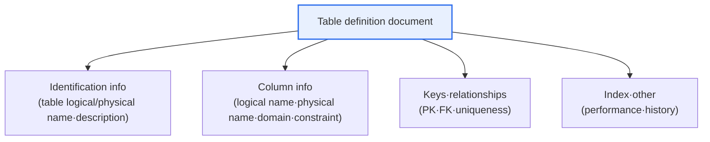
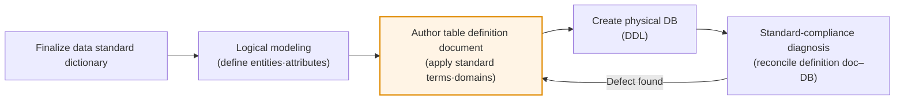
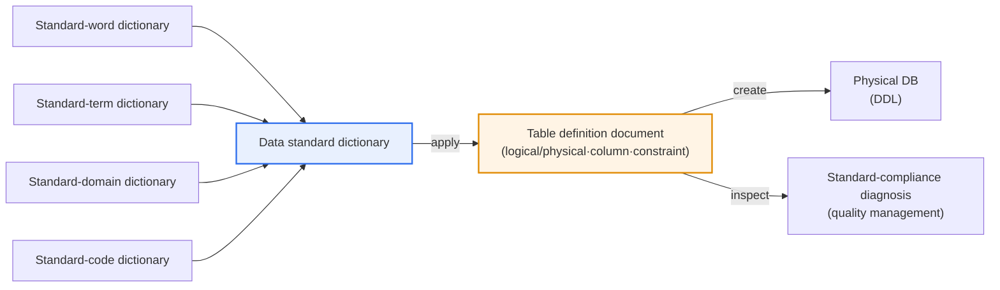

# Public-Sector Database Standardization Guideline — Table Definition Document

## 1. Overview

### a. Concept
> A **table definition document** is a design artifact that, according to the database standardization guideline, **documents a table's structure·meaning·constraints in a standard format**; it is a core metadata document that serves as the reference for DB construction·maintenance·quality management·data integration.

The reason a table definition document is important lies in the fact that it '**leaves the design intent of the database as an official record, guaranteeing consistency and communication**'. In a public institution, multiple departments and multiple vendors build and modify systems over several years. If each creates tables without a standard, then a 'resident registration number' column with the same meaning is defined variously—by one system as `RESIDENT_NO CHAR(13)` and by another as `JUMIN VARCHAR(20)`. When the name·type·length diverge like this, data becomes tangled, and inter-institutional integration or unified querying becomes virtually impossible. In fact, the biggest obstacle in shared use of administrative information or in opening public data is precisely this 'standard mismatch'.

To prevent this, the standardization guideline first standardizes terms·domains·codes and has the result recorded as a standard artifact such as a table definition document. Looking at a table definition document, anyone can immediately grasp what that table holds and what meaning·format·constraint each column has. This becomes the common reference for communication among developers, impact analysis during maintenance, and data-quality diagnosis. In other words, the table definition document is the document that realizes on the ground the data consistency·interoperability that the standardization guideline aims for, and it is the starting point of subsequent metadata management and data governance. [[data-standardization]]

### b. Background and Institutional Position
Standardization of data in the public sector is hard to achieve if left to the autonomy of individual institutions. So the government has, through the 'Public Institution Database Standardization Guideline' and the 'Public Data Management Guideline', institutionally required the definition of data standards (terms·domains·codes) and the creation of design artifacts reflecting them. Within the standardization-guideline framework, the table definition document occupies the position of a **result** that applies the data standard dictionary (standard words·standard terms·standard domains·standard codes) to actual physical design.

This trend has become even more important since the amendment of the three data laws and the enforcement of the Public Data Act. As data becomes the object of 'opening·linking·utilization', each institution's tables must be designed in compliance with standards before datasets can be reliably released and linked with other institutions. When standardized table definition documents accumulate, they become the institution's metadata asset and the foundation of data catalogs·quality management.

## 2. Recorded Items of the Table Definition Document

A table definition document is a 'design specification' for a single table. The overall structure diagram below shows the major branches of information the document holds, and the following detail diagram shows how the standard dictionary is reflected in the document.

The document's identification info defines what the table is. The **table logical name (Korean name)** must be a standard term that reveals its business meaning, and the **table physical name (English name)** is the actual name in the DBMS, made according to the standard-abbreviation·naming rules. For example, the logical name 'user basic information' follows a prefix·standard-word combination rule, becoming a physical name like `TB_USER_BASE`. Added to this is a **description** narrating the purpose and scope of the data the table stores, so that even someone seeing this table for the first time understands the context.

Column info is the core of the document. For each column, along with a logical name·physical name, a **domain (data type·length·format)** is brought from the standard dictionary and applied. When a domain standard exists, 'amount' is always `NUMBER(15)` and 'yes/no' is always `CHAR(1)`, unified so that data of the same nature does not differ from system to system. Also, each column's **constraints** (NOT NULL, default value, CHECK, etc.) and **key info** (PK·FK·uniqueness) are specified to fix the data-integrity rules as a document.

| Item | Content | Standardization linkage |
|---|---|---|
| **Table logical name** | Standard term revealing business meaning | Standard-term dictionary |
| **Table physical name** | Actual name based on standard-abbreviation·naming rules | Standard-word·abbreviation dictionary |
| **Table description** | Stored data·purpose | — |
| **Column list** | Column logical·physical name, domain (type·length) | Standard-term·standard-domain |
| **Key info** | Primary key (PK)·foreign key (FK)·uniqueness | Integrity rules |
| **Constraints** | NOT NULL·default·CHECK constraints | Domain constraints |
| **Standard code** | Allowed values of code-type columns | Standard-code dictionary |
| **Index** | Index definition for performance | Physical design |

### a. The Data Standard Dictionary — the Material of the Definition Document
A table definition document is not made from nothing. Its material is the four **data standard dictionaries** that the standardization guideline finalizes first. **Standard words** are the smallest units for naming; they define business vocabulary that cannot be further divided—like 'registration/date/amount/yes-no'—and their English abbreviations (REG, DT, AMT, YN, etc.). **Standard terms** are the actual column·item names combining these words (e.g., registration date = REG_DT), and **standard domains** define the data type·length·format the term will have (e.g., the 'date' domain = `DATE` or `CHAR(8)`). Finally, **standard codes** define the set of allowed values for code-type items (e.g., gender = `M/F`).

Because these four dictionaries interlock with each other, the definition-document author does not invent column names but 'assembles' them from the dictionaries. As a result, 'registration date' appears with the same name·same type in any system. This is the fundamental principle by which standardization guarantees data consistency, and the table definition document is the final artifact of this dictionary application.

### b. Authoring·Verification Procedure
A table definition document is usually authored at the stage of moving from logical modeling to physical modeling, and then leads to physical DB creation and quality inspection. The procedure below shows the flow from finalizing the standard dictionary to quality diagnosis.

## 3. Authoring Guidelines (Principles)

A table definition document acquires its value only when it mechanically follows the rules set by the standardization guideline, not an individual's intuition. The first principle of authoring is **compliance with standard terms·words**. Column names are not named arbitrarily but made by combining standard words (e.g., 'date', 'amount', 'yes-no') and standard terms. Doing so prevents a proliferation of columns that mean the same thing but are written differently, like 'reg day', 'registration date', 'registration datetime'.

The second principle is **applying domain·code standards**. The data type and length must follow the standard domain, and code-type values (e.g., gender·processing status) must use standard code values. This is a safeguard that prevents the format and meaning of values from diverging when data is later combined across institutions. The third principle is **consistency of logical-physical mapping**: correspond the Korean logical name and the English physical name 1:1 and apply that mapping rule identically across all systems. Finally, because standards and design change over time, on any change you must **manage history·versions** so that when, what, and why something changed can be traced.

| Guideline | Content | Problem if violated |
|---|---|---|
| **Compliance with standard terms** | Naming based on standard-word·term dictionary | Proliferation of synonym columns |
| **Domain application** | Use standard data type·length | Integration failure due to type mismatch |
| **Use of standard codes** | Apply common code values | Value-meaning misinterpretation |
| **Logical-physical mapping** | Consistency of Korean logical name ↔ English physical name | Design-implementation gap |
| **History management** | Manage change history·versions | Change tracking impossible |

## 4. Cases and Practical Implications

Here is an example of what difference standard compliance actually makes. Institution A and institution B each built a civil-complaint system; standard-compliant institution A defined the 'processing status' column with a standard code (`01: received, 02: processing, 03: complete`) and a standard domain (`CHAR(2)`). Non-compliant institution B, on the other hand, put the same concept into `STATUS VARCHAR(10)` as free-form strings like 'received', 'in progress', 'done'. When linking·integrating the two institutions' data, institution A's data maps directly, but institution B's data requires newly building value cleansing and a mapping table, and in this process omissions·misclassifications occur. Thus, standard compliance of the table definition document directly affects integration cost and data quality.

The lesson this case gives is that the benefit of standardization is that 'a little discipline at design time' prevents 'a large cost at integration time'. Standard-compliant institution A only spent the effort of referencing the standard dictionary at the definition-authoring stage, but in return almost no mapping·cleansing work occurs during integration. Conversely, the initial effort institution B saved comes back as several times the cost later—developing cleansing scripts, maintaining mapping tables, and verifying misclassifications. The more data travels among multiple institutions, the more exponentially this gap grows, so standard compliance must be understood not as 'document formality' but as 'an investment that lowers total cost of ownership (TCO)'.

Also from the quality-management perspective, data-quality diagnosis inspects whether the actual DB's columns and tables match the table definition document·data standard. If the definition document says `NOT NULL` but the actual data has missing values, or if a non-standard-code value is stored, it is flagged as a 'standard non-compliance' defect. Therefore, the table definition document does not end as a document but serves as the baseline for quality measurement. Using a data-modeling tool (e.g., a standardization-management solution) allows automatic checking of standard-dictionary violations at the design stage and continuous maintenance of consistency among the model·definition document·actual DDL.

## 5. Deep Dive — Linkage with Data Governance·Opening

The table definition document extends beyond a single artifact into the organization-wide data governance system. When individual table definition documents accumulate, they become the institution's **metadata repository**, and adding the data's source·owner·utilization history develops it into a **data catalog**. Recently, the public sector has been building data maps based on this metadata to grasp at a glance the data the institution holds and to use it as a foundation for finding necessary data and linking·opening it. In other words, a well-authored table definition document becomes the cornerstone of opening through public-data portals and of MyData·shared use of administrative information. [[public-db-standardization]]

Furthermore, internationally, this idea connects to the ISO/IEC 11179 (metadata registry) standard. This standard prescribes registering·managing data elements with clear names·definitions·value domains, and our public standardization guideline's standard-word·term·domain·code system is precisely the domestic-practice implementation of this principle. Therefore, authoring a table definition document can be seen not as a mere domestic administrative procedure but as the on-the-ground application of the principle the international standard aims for: 'registering·managing the meaning of data so that machines and humans understand it together'.

From the professional-engineer exam perspective, this topic tends to be set in the 'database' and 'public data·data quality' areas, bundled with data standardization·metadata·data governance. When composing an answer, developing it hierarchically—① the definition of the table definition document and its position within the standardization guideline, ② the recorded items and their linkage with the standard dictionary (word·term·domain·code), ③ authoring guidelines and problems if violated, ④ practical implications in quality diagnosis·linkage, and ⑤ expansion into data catalog·governance—can show depth beyond a simple listing of items.

## 6. Considerations and Implications

1. **Consistency between the standard and the artifact is the key.** A table definition document has meaning only when it faithfully reflects the data standard (terms·domains·codes). If the standard dictionary, the definition document, and the actual DDL diverge from each other, it is flagged as a defect in quality diagnosis, so a system that continuously verifies the consistency of the three layers is needed.
2. **Secure consistency with automation tools.** At the scale of hundreds of columns and thousands of tables, manual inspection is impossible. Use data-modeling·standardization-management tools to automatically check standard violations at the design stage and to automatically maintain·report the consistency of the model·definition document·physical DB.
3. **Use it as the foundation of data governance.** When standard artifacts such as table definition documents accumulate, they develop into metadata·data catalogs·data maps. A strategic perspective that makes these the foundation of public-data opening·linking·quality management is required.
4. **Run change management and governance in parallel.** Standards and tables change with business change. Only by clearly establishing the procedure for change request·approval·reflection·history management (the data standard management process) and the responsible organizations (data manager·standard manager) does the standard not collapse over time.
5. **Link with privacy·security standards.** Because public tables include sensitive information such as resident registration numbers, you must identify·mark personal-information items at the table-definition-document stage and designate targets for encryption·masking, reflecting privacy by design from the design stage.

## References
- Public Data Portal (data.go.kr) — public-data provision·standard guidance: https://www.data.go.kr
- Ministry of the Interior and Safety, public-data management guidance (public-data system): https://www.mois.go.kr

---

> **In one line**: A table definition document is an artifact that *documents a table's structure·meaning·constraints in a standard format according to the standardization guideline*; by authoring logical/physical names·columns·keys·constraints in line with standard words·terms·domains·codes, it realizes data consistency·interoperability and becomes the foundation of metadata·data governance.
