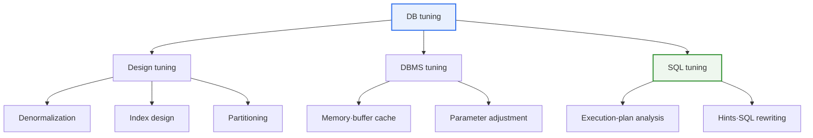

# Database Tuning

## 1. Overview

### a. Concept and Purpose

> **Database tuning** is the activity of **diagnosing the causes of performance degradation and optimizing across the multiple layers of design·DBMS·SQL to improve response time and throughput**. The need for it grows as data volume increases and concurrent users increase.

The fundamental reason DB tuning is important lies in the fact that "**even with the same data·same hardware, performance differs by tens to hundreds of times depending on how you design and query**". A system that ran well when data was small suddenly slows down as data accumulates and users flock, leading to a service outage. At this point, indiscriminately adding servers (scale-up) is expensive and not a fundamental solution. If you create an appropriate index for a query that used to scan a million-row table in full every time (a full table scan) because it had no index, the same query reads only a few thousand rows and finishes, making the response instantly fast. Performance improves dramatically even though the resources (hardware) stay the same.

Concretizing the purpose of tuning into performance metrics, it splits into two axes. One is response time, which looks at how quickly an individual query finishes, and the other is throughput, which looks at how many transactions are processed per unit time. In online transactions (OLTP), short response time matters more, while in large batch·analytics (OLAP), high throughput matters more. Because the direction of tuning differs by purpose, clearly defining the goal of "what to improve" before tuning is the first step. Goalless tuning easily falls into the trap of improving one side while sacrificing the other.

### b. The Layers Targeted by Tuning

Tuning is approached broadly at three layers. First, **design tuning** makes the data structure itself—table structure·indexes·partitioning, etc.—favorable to performance; it is the most fundamental, but the change cost is high for a system already in operation. Second, **DBMS tuning** adjusts memory allocation·buffer cache·various parameters to optimize the DBMS engine's resource utilization. Third, **SQL tuning** improves individual query statements and their execution plans; with a narrow change scope and small risk yet large effect, it has the highest cost-effectiveness. In practice, a small number of inefficient SQL statements often account for most of the total load, so finding and improving these "problem SQL" becomes the core of tuning.

## 2. The Layers of Tuning and the Overall Structure

DB tuning is not a one-off task of fixing a single point but a cyclical process that repeats diagnose→analyze→improve→verify. The structure diagram below shows the three layers and representative techniques of each layer.

The three layers are complementary. No matter how well you write SQL, there is a limit without an index; and even with an index, if the buffer cache is insufficient, disk I/O becomes the bottleneck. However, the priority of improvement is generally economical in the order "**identify problem SQL through diagnosis → SQL·index tuning → design·DBMS tuning if needed → hardware augmentation as a last resort**". This is because the principle is to start with what has low risk and cost.

### a. Tuning Process: Measurement and Diagnosis

Tuning must be done with "data," not "gut feeling." Touching here and there without accurately finding the bottleneck only piles up ineffective changes and instead causes side effects. So the starting point of tuning is always measurement and diagnosis. A representative tool is the execution plan. The execution plan is the processing path the optimizer set up to process the query; it shows which index is used, how and in what order joins are done, and what the estimated number of rows to process is.

The signals to watch in diagnosis boil down to a few: a full table scan on a large table, the phenomenon of not taking an index even though one is created, cases where the join order is reversed and the intermediate result becomes bloated, and cases where statistics are old so the optimizer misjudges the actual data distribution. Adding to this, if you rank which SQL consumes many resources (CPU·I/O·time) with tools like SQL trace or AWR·performance views, you can intensively deal with the top queries that yield the greatest improvement effect. Thus the cycle of "measure→identify top problems→improve→re-measure" is the backbone of tuning.

## 3. Design-Stage Tuning Techniques

Design-stage tuning makes the data structure itself favorable to performance; it is the most fundamental and has the greatest effect, but requires correspondingly greater caution. Changing the structure of an operational system where data has already accumulated entails migration cost and consistency risk.

| Technique | Content | Trade-off |
|---|---|---|
| **Denormalization** | Allow intentional redundancy to reduce joins (query performance↑) | Consistency-management burden on update↑ |
| **Index design** | Create indexes on frequently queried columns | Index-update cost on insert·update↑ |
| **Partitioning** | Split a large table to narrow the access range | No effect if partition-key design fails |
| **Proper data type** | Optimize size·format to improve storage·I/O efficiency | Excessive shrinkage hinders scalability |

### a. Denormalization

Denormalization is a technique that, for query performance, intentionally re-merges tables split finely by normalization or places duplicate columns. Normalization removes data redundancy to raise consistency, but it requires joining multiple tables on every query, so the cost grows for large queries. For example, if an order-list screen must join the customer·product tables every time to fetch names, you can store the customer name·product name redundantly in the order table to eliminate the join. However, this creates the burden of also updating the duplicate when the original changes, so it must be applied selectively to data that is "frequently queried and rarely updated." Denormalization is a clear trade-off between query performance and consistency-management cost, and indiscriminate application invites the bigger problem of data inconsistency.

### b. Index Design

An index is a structure that, like a book's index, lets you quickly find the location of data, and it is mostly in B-Tree form. With an index, only a few rows matching the condition are selected and read, so querying becomes dramatically faster than a full scan that scans the whole thing. Important concepts in index design are cardinality (the variety of values) and selectivity. A column with few kinds of values (low cardinality), like gender, has little index effect, while a column whose values are nearly unique, like a resident number·account number, has a large index effect. In a composite index that bundles multiple columns, the column order matters, so you must place columns that are frequently used in conditions and have high selectivity at the front. A covering index, which processes a query with the index alone (reading only the index without accessing the table), gives an additional performance benefit.

### c. Partitioning

Partitioning is a technique that divides one large table into several pieces—logically one but physically several. For example, if you partition several years of order data by month, then when querying a specific month's data, only that partition is accessed and the rest are skipped (partition pruning). Choose the division criterion among range·list·hash, etc., to suit the workload. The effect of partitioning is maximized when the partition key and the query condition match; if the condition does not use the partition key, all partitions are searched and the effect disappears. It is also easy to delete·archive an old partition wholesale, which is advantageous for managing large volumes of historical data.

### d. DBMS-Layer Tuning (Memory·Resources)

If design·SQL tuning deals with "what to read and how," DBMS-layer tuning deals with "how efficiently to hold the data once read." The core is the balance between memory and disk I/O. The DBMS puts frequently used data blocks in the buffer cache to reduce disk access; if this cache is insufficient, already-read data must be repeatedly re-read from disk (cache miss), degrading performance. Conversely, it cannot be grown infinitely, so finding the right size while watching a metric like the cache hit ratio is the essence of DBMS tuning.

Operations that need intermediate work space, such as sort·hash joins, create a temporary area on disk to process (disk sort) when the work memory (sort/hash area) is insufficient, and this is far slower than in-memory processing. Therefore, a batch-type workload with frequent large sorts·aggregations benefits from allocating ample work memory. Thus DBMS parameter tuning is the task of adjusting memory·parallelism·commit method, etc., to suit the workload nature (whether OLTP or OLAP), and it has the advantage of raising overall performance without touching application code. However, since a single parameter affects the whole system, it must be verified with sufficient load testing before reflecting it in the operational environment.

## 4. SQL Tuning and the Optimizer·Hints

SQL tuning is the activity of improving query statements and execution plans; with a narrow change scope so the risk is small yet the effect large, it is the core of tuning. The central role here is played by the optimizer. Most modern DBMSs use a cost-based optimizer (CBO), which estimates the cost of several processing paths based on statistics (table row count, column value distribution, etc.) and picks the cheapest path. Therefore, if statistics diverge from the actual data, the optimizer builds a wrong plan. This is why the case of performance plummeting because statistics were not refreshed after a bulk data change is common.

The optimizer does not always find the optimal path. When the optimizer builds a wrong plan due to inaccurate statistics, complex joins, skewed data distribution, and so on, the developer corrects it by directly instructing the execution method with a **hint**. However, a hint forcibly overwrites the optimizer's judgment, so it can instead become poison if the data distribution changes, and abuse is forbidden. If possible, induce the optimizer to build a good plan on its own through statistics refresh·SQL rewriting, and use hints as a last resort.

| Hint type | Content | Usage context |
|---|---|---|
| **Access path** | Specify index use/non-use (INDEX, FULL) | When the optimizer does not take, or wrongly takes, an index |
| **Join method** | Specify join method (Nested Loop, Hash, Sort Merge) | Force a join fit for the data size |
| **Join order** | Specify table join order (ORDERED, LEADING) | When trying to keep the intermediate result small |
| **Parallel processing** | Specify parallel execution (PARALLEL) | Throughput↑ in large batch·aggregation |

### a. Join Method and SQL Rewriting (concrete cases)

The choice of join method greatly governs performance depending on the data scale. When joining a small table with a large table that has a good index, a Nested Loop join is favorable. Conversely, if both are large, a Hash join that makes one side into a hash table for matching is much faster. A typical tuning case is changing, with a Hash-join hint, a query that took tens of minutes because the optimizer chose Nested Loop for a large join due to a statistics error, shortening it to a few seconds.

SQL rewriting is also a powerful technique. For example, changing a correlated subquery (which repeatedly executes the subquery for each row) into a join, or, where an index was neutralized by wrapping a function around an index column (`WHERE SUBSTR(col,1,2)='AB'`), rewriting it without the function (`WHERE col LIKE 'AB%'`) so the index is taken. Thus, refining a query "to yield the same result but let the optimizer build a better plan" is the essence of SQL tuning.

## 5. Deep Dive: The Double-Edged Nature of Indexes and a Practical Tuning Strategy

An index is often regarded as "the master key of tuning," but it is also the point most misunderstood in practice. An index speeds up queries (SELECT) but, in exchange, incurs the cost of having to update the index too on every insert·update·delete (INSERT/UPDATE/DELETE). If you put five indexes on one column, then every time you insert a row into that table, all five indexes must be updated, greatly degrading write performance. Therefore, use indexes aggressively on tables that are overwhelmingly read, but select only the truly necessary indexes on tables with frequent writes. The common belief that "the more indexes the better" is wrong, and an unused index only wastes storage space and write cost, so it must be periodically inspected and removed.

Summarizing a practical tuning strategy: First, per the Pareto principle, focus on the top few SQL that account for most of the total load. Extracting and improving the top resource-consuming queries with performance views yields a large effect with little effort. Second, keep statistics up to date. After a bulk data change·load, always refresh statistics so the optimizer makes a correct judgment. Third, always compare before and after tuning quantitatively. Measure the execution plan·response time·logical read-block count before and after improvement to verify the effect and confirm there are no side effects (performance degradation of other queries). Fourth, also look at problems at the application layer. An N+1 query (the anti-pattern of firing a query one at a time inside a loop) or connection-pool shortage is not solved by DB tuning alone, so you must diagnose the application-DB together.

## 6. Considerations and Implications

From the professional-engineer perspective, DB tuning must be approached not as a listing of fragmentary techniques but as a diagnosis-based, systematic·economical performance-management strategy.

1. **Measurement·diagnosis is the starting point of tuning.** You must touch things only after accurately finding the bottleneck (slow queries·full scans·statistics errors) through execution-plan analysis·SQL trace·performance views. Tuning by gut feeling is ineffective or causes side effects. The principle "you cannot improve what you do not measure" runs through all of tuning.

2. **An index is a double-edged sword.** Queries become faster, but the update burden increases, so you must synthesize the query·update pattern and cardinality·selectivity to select only truly necessary indexes. Excessive indexes harm write performance and unused indexes merely waste resources, so periodic inspection is needed.

3. **Prioritize tuning over hardware augmentation.** Adding only servers while leaving inefficiency (full scans·inefficient SQL) unattended only raises cost and soon hits a limit. It is economical to fully utilize resources through SQL·index tuning first, and augment only when it is still insufficient. Especially in cloud environments, inefficient queries directly translate into billing (compute·I/O cost), so the economic value of tuning is even greater.

4. **Manage statistics and the optimizer.** Because the cost-based optimizer depends on statistics, automate·routinize statistics refresh after bulk changes so the optimizer always judges accurately. Use hints limitedly as a last resort, and fundamentally, inducing the optimizer through statistics·SQL rewriting is sustainable.

5. **Look at application-DB together.** Application-layer factors such as N+1 queries·connection pools·caching strategy are not solved by DB tuning alone. You must also diagnose inefficient queries arising from ORM use, unnecessary repeated queries, and so on, to fundamentally improve overall performance.

## References

- Oracle Database SQL Tuning Guide: https://docs.oracle.com/en/database/oracle/oracle-database/
- Use The Index, Luke (index·SQL performance): https://use-the-index-luke.com/

---

> **In one line**: DB tuning is the activity of *finding bottlenecks through execution-plan-analysis-based diagnosis and optimizing across the design (denormalization·index·partitioning)·DBMS·SQL (query rewriting·hints) layers*; balancing the query·update trade-off of indexes and the management of optimizer statistics, it is an economical performance-improvement measure that comes before hardware augmentation.
