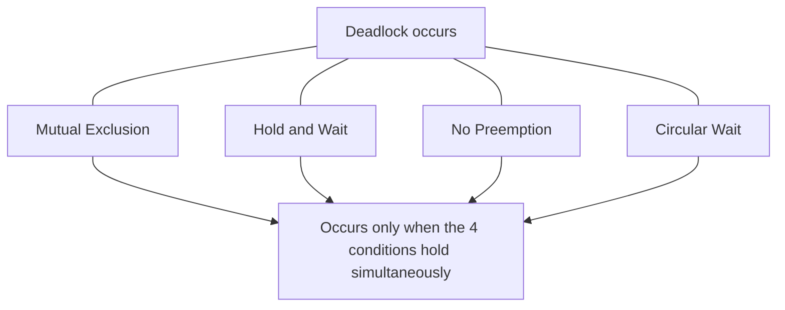
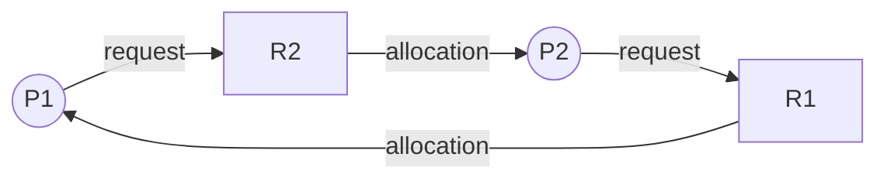
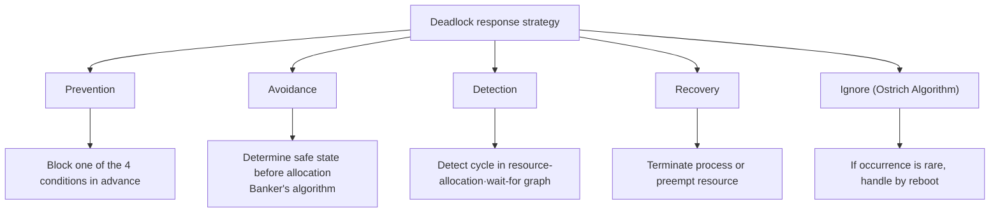

# Deadlock

## 1. Overview

> A **deadlock** is a state in which two or more processes (or threads·transactions) wait indefinitely for resources that the others hold, with neither able to proceed and stuck forever.

As multiprogramming and concurrent processing have become common, it has become routine for multiple execution flows to simultaneously share finite resources such as a single CPU·memory·I/O device·database record. To share resources efficiently, **mutual exclusion** is needed, whereby one flow grabs a resource first and others wait for a while; but when this very "waiting" becomes entangled, a circular wait is created in which no one can move forward. A deadlock is not a simple performance degradation but directly leads to an availability incident in which part or all of the system halts, so it is a core topic that must be addressed in operating-system·database·distributed-system design.

The reason deadlocks are especially tricky is that they occur **non-deterministically**. Even with the same code, depending on scheduling order·timing·load, it sometimes passes without a problem and sometimes hangs. Being a typical "Heisenbug" that does not reproduce in the test environment but intermittently bursts under the high concurrency of the operational environment, prevention at the design stage matters as much as post-hoc detection·recovery. From the professional-engineer perspective, you must accurately understand the conditions for occurrence and be able to explain, in a practical context, the trade-offs of the four handling strategies: prevention·avoidance·detection·recovery.

Deadlock must be distinguished from starvation. In a deadlock, all involved flows wait for each other and halt **forever**, whereas in starvation, only a specific flow keeps being pushed back and cannot get a resource while the rest proceed normally. Livelock is also to be distinguished. A livelock is a state where flows are not halted but keep yielding to each other repeatedly with no substantive progress. All three phenomena share the similar symptom of "work not getting done," but their causes and solutions differ, so they must be accurately distinguished at the diagnosis stage.

The impact of a deadlock grows the larger the system scale. In fact, when transactions that lock multiple resources simultaneously—like inventory deduction in e-commerce, account transfer in finance, seat reservation in a booking system—flock, deadlocks occur intensively. At such times, many transactions are rolled back·retried in a chain, response delay explodes, and in the worst case it spreads into a failure where the whole service effectively halts. Therefore, a deadlock must be handled not as a bug of a single process but as **an architectural concern directly tied to system availability**.

## 2. The Four Necessary Conditions for a Deadlock

A deadlock occurs only when the following four conditions **all hold simultaneously** (Coffman conditions, 1971). In other words, breaking even one of them makes a deadlock fundamentally impossible, and this is the theoretical basis of the prevention strategy.

**a. Mutual Exclusion.** A resource must be usable exclusively by only one flow at a time. Resources that cannot be shared simultaneously, like a printer or a DB record with a write lock, fall here. A resource that can be shared read-only (a shared lock) does not satisfy this condition, so it does not cause a deadlock. In other words, mutual exclusion is an intrinsic property of the resource, making it the hardest condition to remove artificially.

**b. Hold and Wait.** A situation where a flow, while already holding some resource, additionally requests and waits for another resource held by another flow. For example, if process P1 requests B while holding resource A, and P2 requests A while holding B, they end up locked in a standoff. Having them secure all needed resources at once from the start can break this condition.

**c. No Preemption.** A resource held by some flow cannot be forcibly taken away until that flow voluntarily returns it. If a higher-priority flow could forcibly reclaim a lower flow's resource (preemption), then even if circular wait holds, a deadlock could be resolved by resource reclamation. However, resources whose state is easy to save·restore, like CPU·memory, are easy to preempt, while resources that break consistency if preempted—like mid-printing or mid-DB-transaction—are hard to preempt.

**d. Circular Wait.** The condition where a circle (cycle) is formed when the waiting relationships are drawn as a graph. A closed loop is created in the form P1→P2→P3→…→P1, where each flow waits for a resource held by the next flow. Even if the above three conditions hold, if this cycle alone is absent, a deadlock does not occur, so in practice the most-used method is to "force all flows to acquire resources in the same order" to fundamentally block the cycle.

These four conditions are all **necessary conditions**, and the important point is that only when the four are together do they become a sufficient condition. If even one does not hold, a deadlock never occurs. This is exactly why the prevention strategy focuses on "breaking one of the four." For example, purely read-only data without mutual exclusion, a batch job that secures all needed resources at the start, a resource like CPU that can be preempted at any time, and code that grabs locks only in a global sequence—each breaks one condition and is structurally free of deadlock.

It helps to understand these four conditions as a layered structure in which the first three (mutual exclusion·hold and wait·no preemption) create an **environment where a deadlock is possible**, and the last, circular wait, is the trigger that actually **causes** a deadlock. As a real case, in bank account-transfer logic, if an A→B transfer thread and a B→A transfer thread each grab the other's account lock first, a typical circular wait is created. In practice, this is prevented by **resource ordering**, locking from the smaller account number first.

## 3. Resource Allocation Graph

A representative tool for visually determining a deadlock is the **Resource Allocation Graph (RAG)**. It sets processes (circles) and resources (rectangles) as vertices, and draws directed edges: process→resource (request edge) when a process requests a resource, and resource→process (allocation edge) when a resource is allocated to a process. The figure below shows a deadlock situation where P1 requests R2 while holding R1, and P2 requests R1 while holding R2, forming a cycle (P1→R2→P2→R1→P1).

The core determination rule differs according to the number of instances of a resource. **If each resource has a single instance, the existence of a cycle in the graph is a necessary and sufficient condition for a deadlock.** By contrast, **if a resource has multiple instances, a cycle is only a necessary condition for a deadlock, not a sufficient one.** Even if there is a cycle, if some process will soon return another instance of that resource, it may not be a deadlock. So for a lock with only one instance, simple cycle detection suffices, but for a resource pool with multiple instances, precise detection of the Banker's-algorithm family is needed. The Wait-for Graph is a reduced form that collapses the resource vertices in this RAG to leave only the waiting relationships among processes, and it is the data structure that a DBMS's deadlock detector actually uses.

## 4. Deadlock Handling Techniques

Deadlock handling divides into static strategies that prevent occurrence (prevention·avoidance) and dynamic strategies that allow occurrence but respond after the fact (detection·recovery). Adding to these the ostrich algorithm, which simply ignores it, we organize it into four axes.

**a. Prevention.** The most powerful strategy, making one of the four necessary conditions unable to hold at the design stage. Mutual exclusion is mitigated by virtualizing a resource to make it shareable, as in spooling; hold and wait is forced to request all needed resources at once, or to request only when holding no resource. No preemption has a flow release its already-held resources if it cannot obtain an additional resource, and circular wait numbers all resources globally so they are acquired only in ascending order.

Among the four condition-breaking methods, the most widely used in practice is **resource ordering (global lock-order designation)** to eliminate circular wait. This is because mutual exclusion is the physical nature of a resource and thus hard to remove, the batch request of hold and wait grabs even resources that will not actually be used, greatly lowering utilization, and the forced reclamation of no preemption easily breaks transaction consistency. By contrast, eliminating circular wait is simple to implement and has few side effects with the single rule "locks are always acquired only in the ascending order of a predetermined sequence," so most application coding guides adopt this method.

However, prevention, being certain, comes at a great cost. Grabbing all needed resources in advance leaves resources idle even while not in use, lowering utilization; and in a large codebase where the global ordering rule is complex, paths that violate the order easily creep in, so continuous verification is needed. Therefore, prevention is especially effective in systems where the kinds of resources are clear and the lock hierarchy is organized.

**b. Avoidance.** A strategy that allows the conditions under which a deadlock could occur, but on each resource allocation checks whether that allocation keeps the system in a **safe state** and refuses risky allocations. A safe state is a state in which at least one resource-allocation order (safe sequence) exists such that all processes can complete without deadlock. A representative technique is Dijkstra's **Banker's Algorithm**.

The core insight of avoidance is that, without sacrificing utilization by removing conditions as prevention does, it forces waiting only at risky moments by checking, at every moment, only "does a path remain for everyone to finish safely if this allocation is made." Thanks to this, there is no need to grab resources in bulk in advance, so utilization is higher than with prevention. In exchange, each process must **declare in advance the maximum amount of resources it will need**, and a safety check (at the O(m·n²) level) must be run on every allocation, so it suits embedded·real-time systems where the kinds of resources·number of processes are limited and predictable, rather than a general-purpose OS where these are fluid.

**c. Detection.** Without preventing deadlocks, it allows occurrence and then periodically inspects the system state to determine whether a deadlock exists. If resource instances are one each, it finds a cycle in the **Wait-for Graph**; if there are several, it runs a detection algorithm similar to the Banker's algorithm. Making the inspection interval short finds it quickly but with high overhead; making it long delays discovery, wasting the resources waited on in the meantime.

There are two approaches to the inspection timing. Inspecting each time a resource request cannot be immediately satisfied catches the deadlock the instant it occurs and makes it easy to pinpoint the causing process, but the inspection frequency is high so the burden is great. Conversely, inspecting only at fixed time intervals or when CPU utilization drops below a certain threshold has low overhead, but multiple cycles may be entangled within one inspection interval, making it hard to discern which process is the root cause. A database management system (DBMS) representatively uses this detection method, and in practice a lock-wait timeout is set together to prepare for detection failure or delay.

**d. Recovery.** The stage that actually resolves a detected deadlock. There are two methods. One is **process termination**, killing all processes involved in the deadlock (certain but with large loss) or killing them one by one, repeating until the deadlock is resolved. The other is **resource preemption**, choosing a victim, taking its resources, and rolling that process back to a previous safe point.

Victim selection is not simply killing anyone but an **optimization problem that minimizes the total cost**. It synthesizes priority, CPU time already consumed, remaining work, the kind and number of resources held, the cost required for rollback, and so on to choose the target that "resolves the deadlock with the least loss." For example, killing a transaction that has just started and has little work has a small rollback cost, while a long-running transaction that is nearly finished is kept alive if possible.

A risk that must be managed together here is **starvation**. If only rollback cost is used as the criterion, the same low-cost process is repeatedly sacrificed and may never complete. To prevent this, one cumulatively reflects the number of times sacrificed in the cost function, or uses aging to gradually raise the priority of a process pushed back several times, guaranteeing fairness so that it will surely finish someday.

## 5. The Banker's Algorithm and a Comparison of Handling Techniques

The Banker's algorithm is named after the principle that a bank lends out only as much as it can always satisfy all customers' requests. Based on each process's declared maximum demand (Max), current allocation (Allocation), the amount still needed (Need = Max − Allocation), and the system's available resources (Available), it uses a safety algorithm to check whether, upon accepting some resource request, a safe sequence still exists. If safe, it allocates; if not, it makes the requesting process wait.

For example, if the total resources are 10, the maximum demands of P1·P2·P3 are 7·4·9 respectively, current allocation is 2·2·2, and available is 4, then Need becomes 5·2·7. If you finish P2 first, which has Need 2, with the available 4, then 4 resources are reclaimed and available becomes 6; then you can finish P1 (Need 5) to make available 8, and finally finish P3 (Need 7), so a safe sequence <P2, P1, P3> exists. In other words, this state is a safe state. If, in this state, some request would leave no safe sequence at all, that request is refused.

| Technique | Timing | Prior-info requirement | Resource utilization | Representative application |
|------|------|----------------|-------------|-----------|
| **Prevention** | Block condition at design time | Not needed | Low | Resource ordering (lock layering) |
| **Avoidance** | Safety check at allocation | Maximum demand needed | Medium | Embedded·real-time systems |
| **Detection·Recovery** | Inspect·resolve after occurrence | Not needed | High | DBMS transactions |
| **Ignore (Ostrich)** | No response | Not needed | Highest | General-purpose OS (rare occurrence) |

The Banker's algorithm is theoretically elegant but has clear limits for real application. First, each process must **know its maximum resource demand accurately in advance**, but in interactive·server workloads this is hard to know beforehand. Second, if the number of processes and resources **changes dynamically**, the inspection cost grows every time. Third, there is no guarantee that resources are always available (failure·reclamation), so it may not match actual system assumptions. For these reasons, the Banker's algorithm is almost never used in a general-purpose OS, and is used as a conceptual foundation in limited high-reliability domains where demand is specified, such as aviation·aerospace·industrial control.

A concept that must be distinguished here is the relationship among **safe state·unsafe state·deadlock state**. A safe state surely has no deadlock, but **an unsafe state is not the same as a deadlock.** An unsafe state is merely a state where "a safe sequence cannot be guaranteed"; depending on the processes' actual request patterns, it may luckily finish without a deadlock. In other words, a deadlock state is a subset of the unsafe state, and the avoidance strategy conservatively controls resource allocation so as not to set foot in this unsafe region at all. Because of this conservatism, avoidance actually pays the price of refusing even requests that would not cause a deadlock, lowering resource utilization. In the earlier example, if P3 requested Need 7 but available was only 4 so completion is impossible in any order, that request induces an unsafe state, so it is immediately refused and P3 waits.

Prevention is safe but expensive, and ignore (the ostrich algorithm) is cheap but risky. General-purpose OSs like Linux·Windows have extremely rare kernel-level deadlocks and high prevention·avoidance costs, so they are designed largely close to the ignore strategy, leaving problems to be resolved by reboot. By contrast, a DBMS where many transactions contend over locks requires detection·recovery, so it has a built-in wait-for-graph-based deadlock detector and, upon finding a deadlock, automatically chooses the transaction with the smallest rollback cost as the victim and rolls it back as a `deadlock victim`.

## 6. Deep Dive: Deadlocks in Practice

**a. Database deadlocks.** A relational DBMS commonly experiences deadlocks in the process of guaranteeing serializability with two-phase locking (2PL). Oracle·SQL Server·MySQL (InnoDB) all detect deadlocks with a wait-for graph, automatically roll back one transaction, and return an error to the application (e.g., SQL Server 1205 "deadlock victim"). There are three practical response principles. First, **unify across the whole application the order of accessing tables·rows** within a transaction to eliminate circular wait. Second, keep transactions **short and small** to reduce lock-holding time. Third, since deadlock errors can occur normally, put **retry logic** in the application to secure resilience. In fact, there are many cases where introducing an ascending-order lock-acquisition rule by account·product ID in bulk batch transfer·inventory-deduction systems greatly lowered deadlock frequency. For example, in a payment system where thousands of transfers per second flock, before unifying lock order, deadlock rollbacks occurred hundreds per minute during peak hours; there is a reported improvement case where, after applying the ID-ascending-order rule together with a 3-time exponential-backoff retry, final failures due to deadlock were reduced to nearly zero.

**b. Application thread deadlocks.** In multithreaded applications like Java·C++·Go, a deadlock occurs if two threads grab two locks in opposite orders. Java provides "Found one Java-level deadlock" diagnostic information via `jstack` or a thread dump, and prevents infinite waiting with a lock acquisition that has a timeout, like `tryLock(timeout)`. The fundamental measure is again **consistent lock ordering**. The Go language recommends channel-based communication to reduce shared-state locks themselves, but if all goroutines wait for each other's channel responses, the runtime detects "all goroutines are asleep - deadlock!" and raises a panic.

Concrete principles for preventing thread deadlocks in practice include: ① if multiple locks are needed, always acquire them only in a predetermined global order, ② minimize the lock-holding section and do not call an external service while holding a lock, ③ change infinite waiting into a time limit with a `tryLock` timeout, and ④ where possible, reduce shared mutable state itself with immutable objects·message passing·concurrent collections. These principles correspond to practical methods of breaking, at the code level, the four conditions seen earlier.

**c. Distributed deadlocks in distributed systems.** In microservices or distributed transactions, a **distributed deadlock** occurs where circular wait arises among resources scattered across multiple nodes, and detection is far trickier because you cannot immediately observe a global wait-for graph as in a single node. For this, the **edge-chasing** technique, where each node passes a probe message carrying waiting information to trace a cycle, or the **Wait-Die·Wound-Wait** methods, which give transactions timestamps and kill young transactions, are used. In practice, avoiding it with **timeout-based abort then retry** and the compensating transactions of the Saga pattern is more realistic than perfect detection.

**d. The essence of deadlock seen through the Dining Philosophers problem.** The **Dining Philosophers problem** presented by Dijkstra is a classic example that compactly shows deadlocks and their solutions. If five philosophers seated at a round table each pick up the left fork first and then try to pick up the right fork, then the moment all simultaneously hold the left, they fall into a circular wait (deadlock) waiting forever for the right. The solutions to this problem are a miniature of prevention strategies. ① Having odd-numbered philosophers pick up the left first and even-numbered the right makes the **resource-acquisition order asymmetric**, breaking circular wait. ② Limiting the number of philosophers who can eat simultaneously to N−1 (a semaphore) mitigates hold and wait. ③ Having them pick up both forks atomically at once removes hold and wait itself. Practical problems of connection-pool exhaustion and thread-pool mutual waiting are essentially the same as this structure, so the same solution principles apply directly.

## 7. Considerations and Implications (Professional-Engineer Perspective)

1. **The choice of strategy is a cost-risk trade-off.** Prevention·avoidance block deadlocks at the source but sacrifice resource utilization and throughput, while detection·recovery·ignore keep performance alive at the cost of accepting incident occurrence. It is practical to synthesize the system's availability requirement level (SLA), resource-contention frequency, and whether retries are possible, and combine different strategies by layer — for example, applying detection·recovery at the DB layer and lock-ordering prevention at the application layer together.

2. **Design-stage prevention is more cost-effective than post-hoc response.** Deadlocks are hard to reproduce, so the debugging cost during operation is very high. Enforcing rules such as lock-acquisition-order standardization, transaction minimization, and timeout enforcement from early development via coding guides·static-analysis tools·code-review checklists lowers total cost of ownership (TCO).

3. **Resilience design may be more realistic than perfect prevention.** In a distributed environment, it is hard to eliminate deadlocks completely. Equipping recovery mechanisms premised on failure—timeout·retry·exponential backoff·circuit breaker·compensating transactions—lets the system absorb rarely occurring deadlocks on its own.

4. **They must be managed integrally together with starvation·livelock.** Blocking only deadlocks while neglecting victim selection can leave a specific transaction repeatedly rolled back into starvation, or turn into a livelock where they keep yielding to each other. Comprehensive resource management that includes fairness—reflecting rollback count in cost and raising the priority of long-waiting requests via aging—is needed.

5. **Securing observability is the core of operations.** Monitor deadlock·lock-wait metrics (e.g., a DB's lock wait, blocking session, application thread dumps) to catch anomalies early, and embed into the operational process a feedback loop that post-analyzes deadlock logs to remove recurring causes.

6. **In the cloud·container era, resource boundaries widen and the forms of deadlock evolve too.** Logical resources like connection pools·thread pools·distributed locks (Redis Redlock, ZooKeeper) become new deadlock points. For example, if a circular dependency where service A synchronously calls B and B calls A back exhausts the thread pool, the system effectively falls into a deadlock even though individual processes are alive. Design principles such as async non-blocking architecture, bulkhead isolation, and eliminating cycles in the call graph become preventive measures.

7. **Discover latent deadlocks early with automated verification.** It is desirable to expose deadlock possibilities before operation through static analyzers (e.g., lock-order-violation detection), concurrency-testing tools, and load injection via chaos engineering. Especially given the hard-to-reproduce nature, test coverage alone is insufficient, so an approach that proves deadlock-freedom of the concurrency protocol with formal verification·model checking (TLA+, etc.) is also used in high-reliability systems.

## References
- Silberschatz, Galvin, Gagne, "Operating System Concepts" (Deadlocks chapter)
- E. G. Coffman et al., "System Deadlocks", ACM Computing Surveys, 1971
- Microsoft SQL Server Docs — Deadlocks guide: https://learn.microsoft.com/en-us/sql/relational-databases/sql-server-deadlocks-guide
- Oracle Database Concepts — Locks and Deadlocks: https://docs.oracle.com/en/database/oracle/oracle-database/
- MySQL Reference Manual — Deadlocks in InnoDB: https://dev.mysql.com/doc/refman/8.0/en/innodb-deadlocks.html
- E. W. Dijkstra, "Hierarchical Ordering of Sequential Processes" (the original source of Dining Philosophers)

---
> **In one line**: A deadlock occurs when the four conditions of mutual exclusion·hold and wait·no preemption·circular wait hold simultaneously; the prevention·avoidance (Banker's algorithm)·detection·recovery strategies must be combined to suit the system's characteristics and handled together with resilience design such as lock ordering·timeout·retry.
