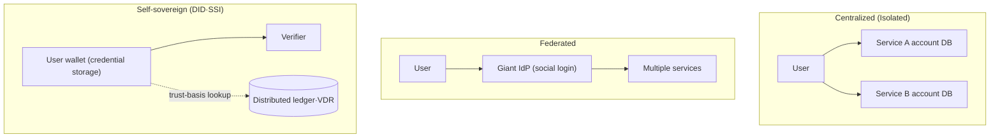
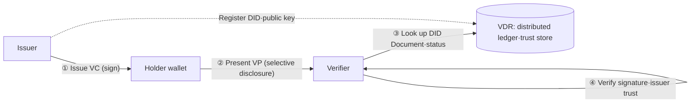

# Decentralized Identity (DID)

## 1. Overview

### a. Definition

> **Decentralized Identity (DID)** is an identity-management paradigm that attributes the authority to issue·store·present identity information to the **user themselves**, rather than to a central authority. The user keeps their verifiable credentials in their own wallet (digital wallet), presents only the information needed for verification **selectively**, and the verifier cryptographically confirms whether it has been forged·tampered with, without directly querying the issuing authority.

DID is a term encompassing both the **Decentralized Identifier** specification standardized by W3C and the **SSI (Self-Sovereign Identity)** philosophy that seeks to handle identity "self-sovereignly" using it. Narrowly, it refers to a single URI scheme in the form `did:method:identifier`, but broadly it means the **entire identity ecosystem** in which verifiable credentials are exchanged among issuer·holder·verifier. If existing login is a structure of "proving my account, stored by the service, to the service," DID is a structure of "presenting my proof, stored by me, to anyone," which fundamentally shifts control of identity.

### b. Background and Need

The dominant models of digital identity have long been **centralized (isolated)** and **federated**. In the centralized model, the user must create a separate account and password per service, so they manage dozens of credentials, and each service redundantly accumulates personal information. This accumulation becomes a target for large-scale breaches, and in fact breaches of personal information on the scale of tens of millions of records have recurred at home and abroad. The federated model (social login·OIDC) raised convenience by reducing the number of accounts, but it created privacy·dependency problems in which a few **giant identity providers (IdP)** observe·concentrate the user's login history.

The common limitation of these models is that identity information exists **in the institution's database**, not with the user. As a result, the user cannot control when and how their information is used, and even in a situation like adult verification where only "whether one is an adult" is needed, **over-collection** of the entire resident registration number·date of birth becomes routine. **Data minimization** and the **data subject's right to self-determination**, which privacy norms emphasize, conflict with this structure.

DID is an attempt to resolve this conflict by moving identity information into the user's wallet and circulating only **cryptographically verifiable proofs** instead of the original data. Since the issuing authority, once it issues a credential, does not intervene in the subsequent verification process, it cannot track the user's activity (issuer-verifier unlinkability), and the verifier can request only the necessary attributes, so over-collection is structurally suppressed. Recent developments—mobile driver's licenses·mobile IDs unfolding on a DID basis domestically, and the EU mandating a digital identity wallet (EUDI Wallet) for all member states through **eIDAS 2.0**—show that DID is entering national identity infrastructure beyond the experimental stage.

## 2. The Evolution of Identity-Management Models and the Overall Structure

To understand DID's position, it is useful to view it on the axis of the evolution of identity models. The centralized model was disadvantageous to the user in both control and privacy, and the federated model created dependency on a few IdPs in exchange for convenience. DID (self-sovereign) returns control to the user but places the basis of trust not on a specific institution but on a **distributed trust foundation (blockchain·distributed ledger, etc.)**, distinguishing it from the two models.

The actual operation of the DID ecosystem is summarized by three parties and two artifacts. The three parties are the **issuer** who issues a credential, the **holder** who stores·presents it, and the **verifier** who confirms it, commonly called the **Trust Triangle**. The two artifacts are the **Verifiable Credential (VC)**, which the issuer signs and issues, and the **Verifiable Presentation (VP)**, which the holder reconstructs by selecting only the needed part and presents.

The core of this structure is that the verifier **does not ask the issuer directly**. The issuer registers its DID and public key in a **Verifiable Data Registry (VDR)** such as a distributed ledger, and the verifier verifies the signature contained in the VP with the public key in the VDR. Thanks to this, the issuer cannot know the verification time, so user tracking is blocked at the source, and the verifier can confirm trust without the burden of offline·real-time lookup.

## 3. Detailed Core Components

### a. Decentralized Identifier (DID) and DID Document

A DID is a URI in the form `did:method-name:method-specific-id`. For example, as in `did:web:example.com` or `did:ion:EiClk...`, the **method** in the middle prescribes on which trust basis that DID is created·interpreted. Resolving a DID yields a **DID Document**, which contains the **public key (authentication means)** of the subject controlling that DID, the verification methods used for signing·authentication, and the **service endpoints** that tell where to interact. In other words, the DID is a "name tag," and the DID Document is a "specification in which the owner of that name tag has written down how they prove themselves."

An important property of a DID is that it is **self-certifying**. Because the identifier itself is generated in association with a public key (or its hash), to prove that you are the controller of that DID you only need to sign with the corresponding private key, and no central registration authority to issue it is needed. This is the decisive difference from existing identifiers like email·phone numbers.

### b. Verifiable Credential (VC) and Selective Disclosure

A VC is a data structure in which the issuer asserts (claims) specific attributes of the holder (name·date of birth·qualification·affiliation, etc.) and **digitally signs** it with its own private key. Because a signature is attached, verification fails if it is forged·tampered with, and through the issuer's DID it is revealed "who vouched for it." The true value of a VC is realized when the holder, rather than handing it over as is, **reconstructs it into a VP**. The holder extracts only the needed items from several VCs into a single presentation, and signs it with their own private key to also prove that "this presentation is mine."

In particular, combining **Selective Disclosure** and **Zero-Knowledge Proof (ZKP)** techniques makes it possible to prove only condition satisfaction without exposing the original. Representatively, using SD-JWT or BBS+ signatures makes it possible to prove only the fact "aged 19 or over" without revealing the "date of birth" itself. This dramatically reduces personal-information exposure in real situations where **only a single attribute is needed**, such as buying alcohol·tobacco or accessing adult content.

| Category | Existing identity proof | DID-based VC |
|------|---------------|-------------|
| Information storage | Service·institution DB | User wallet |
| Verification method | Real-time query to issuing authority | Signature·VDR-based offline verification |
| Disclosure scope | Entire ID (excessive) | Only necessary attributes (selective disclosure) |
| Issuer tracking | Possible (query logs) | Impossible (unlinkability) |
| Breach risk | Concentrated in central DB | Distributed·minimized |

The table above organizes the gist of the comparison, but the fundamental reason the difference arises lies in the design philosophy of "whether you move the original data, or move a verifiable proof." The existing method moves·concentrates data for trust, while DID moves **only trust** without moving data. As a result, the attack surface and privacy risk become structurally different.

### c. VDR and the Trust Basis

A VDR is a store that shares the issuer's DID·public key and the **revocation** status of credentials so that the verifier can confirm them. It need not necessarily be a blockchain, but for forgery·tamper resistance and decentralized trust, a distributed ledger is widely used. However, putting personal information (the VC original) on a blockchain makes exercising the right to erasure impossible, so in practice the principle is to **not store personal information on-chain** (keeping it off-chain in the wallet) and put only the public key·hash·status values needed for verification on-chain.

## 4. Comparison — Federated Identity (OIDC) and DID

DID is often compared with social login (OAuth 2.0/OIDC). In OIDC, the IdP intervenes every login to connect the user to the service, so the IdP can know the user's access point·time, and if the IdP fails, logins are paralyzed in a chain. By contrast, in DID the issuer does not participate in verification after issuance, so there are no such observation·single-point-of-failure problems. However, in exchange, the responsibility arises for the user to **safely manage their own private key·wallet**. In short, OIDC "delegates trust to the IdP for convenience," while DID has "the user bear the management responsibility in exchange for gaining control"—opposite trade-offs. For this reason, in reality OIDC and DID are seen not as opposites but as **complements**, and the hybrid (OpenID for Verifiable Credentials, OID4VC) method of combining VC presentation on top of OIDC is spreading.

## 5. Deep Dive — Standard·Policy Trends and Practical Application

On the technology·standards side, W3C provided the backbone of interoperability through **DID Core 1.0 (2022 Recommendation)** and the **Verifiable Credentials Data Model**, and recently the VC 2.0 and SD-JWT VC, and the OpenID camp's **OID4VCI (issuance)·OID4VP (presentation)** protocols are establishing themselves as the de facto standard for the issuance·presentation procedures. On the policy side, the EU, through **eIDAS 2.0**, mandates the provision of a per-member-state EUDI Wallet by 2026 and is pushing its application to banking·telecom activation·public-service login; domestically, the Ministry of the Interior and Safety's **mobile ID (mobile driver's license)** is issued on a DID basis and has the same legal effect as a physical ID, with proof-of-concept underway in the public sector.

Looking at practical application cases, in finance a consortium-type DID with multiple participating banks simplifies **non-face-to-face account opening·qualification confirmation**, and in universities·qualification institutions, diplomas·certificates are issued as VCs to support forgery·tamper-free instant verification. A representative benefit is that the days-long confirmation procedure for verifying education·career during hiring is shortened to a single wallet presentation. As for expected exam directions, "describing DID's Trust Triangle and the VC/VP procedure," "comparison with existing PKI·federated identity," "the reason personal information must not be put on a blockchain and its conflict with the GDPR right to be forgotten," and "data-minimization measures through selective disclosure·ZKP" can be the core axes of an answer composition.

## 6. Considerations and Implications

From the professional-engineer perspective, the adoption of DID must be reviewed together with the following strategic judgments.

- **Private-key·wallet recovery strategy (availability vs. self-sovereignty)**: Loss of the private key means loss of identity. Provide recovery means such as mnemonic backup, social recovery, hardware wallets, and key splitting (MPC·Shamir Secret Sharing), but design a balance to suit the business nature, considering the trade-off that the easier recovery is, the weaker self-sovereignty·security becomes.
- **Consistency with privacy regulations (the no-on-chain-storage principle)**: Recording personal information on a distributed ledger makes it impossible to fulfill the GDPR·Personal Information Protection Act obligations of destruction·correction. A design that keeps the original in an off-chain wallet and puts only minimal metadata such as public key·hash·revocation status on-chain, along with securing a revocation mechanism, is essential.
- **Interoperability and avoiding ecosystem lock-in**: If you become locked into a specific vendor's DID method·wallet, the purpose of self-sovereignty is nullified. Secure interoperability among issuer·verifier·wallet through compliance with international standards such as W3C DID Core·VC 2.0·OID4VC and alignment with a Trust Framework, and also organize governance of a Trusted Issuer List.
- **Phased transition and hybrid operation**: Rather than full replacement, a gradual roadmap that starts as a hybrid running in parallel with existing authentication (OIDC·PKI) and prioritizes areas with high data-minimization benefit—like adult verification·qualification confirmation—is realistic. Building an ecosystem that also considers user acceptance·the speed of verifier-infrastructure spread governs success or failure.
- **Quantum resistance·legal effect**: Since signature-based trust is the core, in the long term you must secure the flexibility to switch algorithms to post-quantum cryptography (PQC), and linkage with the Electronic Signature Act·related systems must proceed in parallel so that a VC has legal effect equivalent to a physical proof.

## References

- W3C, "Decentralized Identifiers (DIDs) v1.0", https://www.w3.org/TR/did-core/
- W3C, "Verifiable Credentials Data Model v2.0", https://www.w3.org/TR/vc-data-model-2.0/
- European Commission, "European Digital Identity (eIDAS 2.0)", https://commission.europa.eu/strategy-and-policy/priorities-2019-2024/europe-fit-digital-age/european-digital-identity_en
- OpenID Foundation, "OpenID for Verifiable Credentials", https://openid.net/sg/openid4vc/

---

> **In one line**: DID is a self-sovereign identity model that returns control of identity information from institutions to the user; through the Trust Triangle of issuer·holder·verifier and VC/VP·selective disclosure, it cryptographically verifies forgery·tampering without over-collection.
