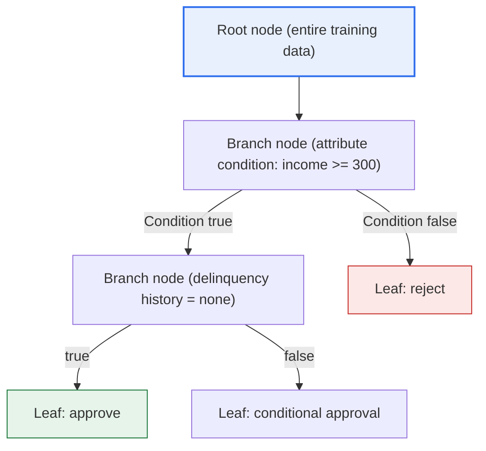
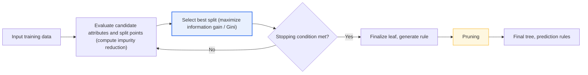

# Decision Tree

## 1. Overview

### A. Definition
> A supervised machine learning model that performs classification and regression by repeatedly splitting data based on attributes (variables) through **recursive partitioning** to build a tree-shaped set of rules. Its defining feature is that the learned result is expressed as if-then rules that a human can read directly.

The greatest strength of the decision tree lies in its "**interpretability (explanatory power)**." Just as in a rule such as "if monthly income is at least KRW 3 million and there is no delinquency history in the last 12 months, approve the loan," the reason why the model made a given decision is transparently revealed in the form of rules. This is the exact opposite of a deep neural network (a black box), in which millions of weights are nonlinearly entangled and the basis of a judgment is hard to trace after the fact. This is why decision trees continue to be favored in finance (lending, credit scoring), healthcare (diagnostic support), and law and public administration (administrative dispositions), where the basis of a judgment must be explained in preparation for regulation, supervision, or litigation.

The fact that the way it works resembles "twenty questions" also has great practical value. Starting from the root, it narrows the data by posing questions (attribute conditions) one at a time until it reaches a final answer. Even a field practitioner who does not know much about statistics or machine learning can follow the tree downward and accept the result. The rules can be transferred directly into a work manual or a review checklist, so the gap between the model and operational regulations is small, which distinguishes it from other models.

### B. Background and Necessity of Its Emergence
As data-driven decision-making has spread, there is a growing number of areas where "why it made that prediction," namely **accountability**, matters as much as "what it predicted." The EU GDPR's "right to explanation for automated decision-making," and the provisions on explanation and objection to automated decisions in Korea's Credit Information Act and Personal Information Protection Act, effectively make it mandatory to present the basis for prediction results. The decision tree, as a representative model that provides prediction and explanation simultaneously, forms the theoretical and practical foundation of the recently prominent **eXplainable AI (XAI)**.

Moreover, in the finance, manufacturing, and retail domains, where structured (tabular) data dominates, tree-based models (especially the ensembles discussed later) often achieve high performance with less data and preprocessing than deep learning. The fact that many top solutions in structured-data competitions such as Kaggle are tree ensembles like XGBoost and LightGBM shows that this family is an industry-standard tool beyond a mere teaching model.

## 2. Overall Structure and Learning Principle

A decision tree begins with the entire dataset at the root node, splits the data into two or more branches at each branch (internal) node using a specific attribute condition, and produces the final prediction (a class or a numeric value) at a leaf (terminal) node that is no longer split. The essence of learning is to greedily and repeatedly search for "**which attribute, split at which threshold, best separates the data.**" At each step, it selects the split that makes each resulting child group as pure as possible (concentrated into a single class).

In the structure above, each element means the following. The **root node** holds the entire sample before splitting, and it is here that the first question (the most informative attribute) is posed. A **branch node** is the point at which the data is split by a single attribute condition, and a **branch** represents the result of that condition (true/false, or a categorical value). A **leaf node** is the point where the split ends and the prediction is finalized; in classification, the prediction is the majority-vote class of the samples remaining at that node, and in regression, it is the sample mean.

| Component | Role | Meaning in prediction |
|---|---|---|
| **Root/branch node** | Attribute condition that splits the data | The condition part of a rule (if) |
| **Branch** | Result of a condition (true/false, category) | The branching of a rule |
| **Leaf node** | End of split, final prediction | The result part of a rule (then) |

Viewed as a sequence, the learning procedure is: (1) for every candidate attribute and split point at the current node, compute the reduction in impurity after the split; (2) adopt the split with the largest reduction and create child nodes; and (3) recursively repeat (1)-(2) for each child node until a stopping condition is met (a pure node, falling below the minimum number of samples, reaching the maximum depth, etc.). Because this is a greedy strategy that selects a local optimum at each step, it does not always guarantee a globally optimal tree, but its good balance of computational efficiency and performance means it is widely used in practice.

As the process detail diagram above shows, the tree growing stage and the pruning stage are clearly distinguished. In the growing stage, the tree is grown in the direction that reduces impurity as much as possible, and in the subsequent pruning stage, excessively subdivided branches are cut to recover generalization performance. The separation of these two stages is a core design directly tied to the overfitting problem discussed later.

## 3. Split Criterion

The criterion for choosing which attribute to split a node on determines the identity of the algorithm. The common goal of a split criterion is to "**minimize the impurity of each child node after the split,**" and the representative algorithms diverge according to how impurity is defined.

**Information Gain based on entropy** uses entropy (uncertainty) from information theory as its impurity measure and selects the attribute whose reduction—the entropy before the split minus the weighted entropy after the split—is greatest. The early algorithm ID3 uses this approach. However, information gain has a bias toward overvaluing attributes with many distinct values (e.g., a customer ID), so the successor algorithm C4.5 corrects this with the **Gain Ratio**, which normalizes it by the split information. C4.5 handles both continuous and categorical attributes and has built-in missing-value handling and pruning, raising its practical maturity.

The **Gini Index** defines impurity as the probability that two randomly drawn samples belong to different classes and selects the split that most lowers it. CART (Classification And Regression Trees) adopts this approach; because it has no logarithm operation, it is computationally lighter than entropy and always produces binary splits. In a **regression tree**, instead of impurity, the criterion is the reduction in variance (or mean squared error, MSE), selecting the split that minimizes the dispersion of the target value within the child nodes.

| Algorithm | Split criterion | Tree shape | Characteristics |
|---|---|---|---|
| **ID3** | Information gain (entropy) | Multi-way split | Categorical only, has bias |
| **C4.5** | Gain Ratio | Multi-way split | Supports continuous, missing values, pruning |
| **CART** | Gini index / variance reduction | Binary split | Unified classification and regression, lightweight computation |

The practical implication of the three criteria is not a simple ranking of performance but rather "which is suited to which data and requirement." For example, for data with many attributes having a very diverse range of categories, ID3's information gain is prone to distortion, so it is safer to use gain ratio or Gini; and if the predicted value is continuous, one should use the variance-reduction criterion (a regression tree) rather than Gini, which is for classification. The reason scikit-learn's `DecisionTreeClassifier` adopts Gini as its default is also its computational efficiency and solid performance.

## 4. Characteristics (Pros and Cons) and Overfitting

A decision tree has the advantages of being easy to interpret, requiring almost no preprocessing such as normalization or scaling (splits use only ordinal information), and being able to handle numeric and categorical data together. On the other hand, if the tree is grown deeply without constraints, it is highly vulnerable to **overfitting**, in which it memorizes even the noise of the training data as rules. In the extreme, it grows until only a single sample remains in each leaf, so the training accuracy becomes 100%, but performance on new data drops sharply.

Another weakness is **instability**. If even a slight change in the training data alters an upper-level split, the structure of the entire tree beneath it can change drastically. This is a factor that undermines the reliability and reproducibility of the rules, making it difficult to use a single tree directly in operations.

| Category | Content |
|---|---|
| **Advantages** | Easy rule-based interpretation, minimal preprocessing, mix of numeric and categorical, produces feature importance |
| **Disadvantages** | Vulnerable to overfitting, sensitive to data changes (unstable), axis-aligned splits limit representation of diagonal boundaries |
| **Countermeasures** | Pre- and post-pruning, depth and minimum-sample constraints, ensembles (Random Forest, boosting) |

There are two main directions for addressing overfitting. The first is **pruning**, which includes pre-pruning that halts growth in advance (limiting maximum depth or the minimum number of samples per leaf) and post-pruning that first grows the tree large and then cuts branches based on validation performance (e.g., CART's cost-complexity pruning). The second is the **ensemble**, which combines multiple trees, covered in the next in-depth section.

## 5. Application Cases and Numeric Examples

The practical value of decision trees and ensembles becomes clear when viewed through concrete cases.

**Case 1 — Financial credit scoring (loan review).** Suppose a bank builds a model to predict whether to approve a loan. A single tree produces rules directly such as "income at least KRW 3 million → no delinquency history → debt ratio under 40% → approve," so they can be used directly in the review criteria submitted to the supervisory authority and in adverse action notices for rejections. In practice, boosting such as XGBoost is used to raise accuracy, but for each individual rejection, the contribution of each variable is quantified with SHAP values—e.g., "the debt ratio lowered the approval probability by 12 percentage points"—to satisfy accountability.

**Case 2 — Telecom/subscription service churn prediction.** The churn probability is predicted from inputs such as the rate of usage decline over the last three months, the number of customer center inquiries, and the history of plan changes. Combining hundreds of trees with a Random Forest mitigates the instability of a single tree, so the predictions do not fluctuate greatly even when the data is refreshed each month. If feature importance analysis finds that a "surge in customer center inquiries" is a key signal of churn, this connects to a marketing action of sending preemptive retention offers to that customer segment.

**Case 3 — Manufacturing process quality prediction.** When predicting defects from dozens of sensor values such as temperature, pressure, and speed, LightGBM quickly learns large-scale sensor data through histogram-based splits and leaf-wise growth. Its training time is short compared with deep learning and its hyperparameter tuning is easy, so on sites where process conditions change frequently, the retraining and deployment cycle can be shortened. Here too, feature importance is used to indicate which process variables are strongly associated with defects, feeding back into on-site improvement activities.

What these cases show in common is that the "rule interpretability" of a single tree and the "prediction accuracy" of an ensemble are each needed in different situations, and in practice one either chooses between them according to the purpose or combines them with SHAP.

## 6. In-Depth — Ensembles and Explainable AI (XAI) Trends

The **ensemble**, which emerged to overcome the limitations of a single decision tree, is today the de facto standard in the structured-data field. It is broadly divided into two families. The representative of the **bagging family**, the **Random Forest**, resamples the data with replacement into bootstrap samples multiple times and also randomly restricts the candidate attributes at each split to build hundreds of different trees, then combines their predictions by majority vote or averaging. Because the direction of errors differs from tree to tree, combining them reduces variance and greatly mitigates the instability of a single tree.

The **boosting family** builds trees sequentially, training each subsequent tree to focus on correcting where the preceding tree was wrong (the residual). Representative examples include **XGBoost** (2016; regularization, second-order approximation, parallelization), which optimized gradient boosting (GBM) to practical scale; **LightGBM** (Microsoft), which improved speed and memory with leaf-wise growth and histogram-based splits; and **CatBoost** (Yandex), which strengthened categorical handling. These frequently show performance rivaling or surpassing deep learning on structured data, so they are widely used for credit scoring, churn prediction, demand forecasting, and more.

While ensembles greatly boost performance, they become a collection of hundreds of trees and thus lose much of the interpretability of a single tree. To fill this dilemma, post-hoc explanation techniques are used alongside them, such as **Feature Importance**, **Partial Dependence Plots (PDP)**, and **SHAP**, which quantifies the contribution of each variable to an individual prediction based on Shapley values from game theory. In particular, tree ensembles have the TreeSHAP algorithm, which efficiently computes SHAP values, so the combination of "performance from boosting, explanation from SHAP" has become widely established in industry. In the end, the decision tree is itself a white-box model, and it is evolving into an axis that captures both performance and explanation by combining with ensembles and XAI.

## 7. Considerations and Implications (Professional Engineer's Perspective)

1. **Controlling overfitting determines success or failure in practice.** A single tree must secure generalization performance by limiting depth and the minimum number of samples per leaf and applying cost-complexity pruning, while an ensemble must tune the number of trees, the learning rate, and the subsampling ratio via cross-validation. Deploying based only on training accuracy will certainly lead to a drop in performance.

2. **Design the trade-off between performance and explanatory power to fit the purpose.** In areas where regulation and supervision are strict and the rules themselves must be presented (loan review criteria, medical protocols), a shallow single tree is appropriate; in areas where prediction accuracy is the top priority, a boosting ensemble + SHAP combination is appropriate. The key is a requirements-based choice, not a single correct answer.

3. **Data quality and bias management determine the fairness of the rules.** If the training data has biases in sensitive attributes such as gender or region, the tree may entrench these as rules and reproduce discriminatory decisions. Removing sensitive attributes, checking for proxy variables, and monitoring fairness metrics must be operated together, and this is directly tied to AI ethics and governance.

4. **It is established as a first candidate to consider for structured data.** Deep learning is overwhelmingly dominant for images, speech, and natural language, but for tabular data, tree ensembles are still a powerful baseline. For a new prediction task, it is practically reasonable to try XGBoost or LightGBM before deep learning and verify cost-effectiveness.

5. **Operation and reproducibility from an MLOps perspective must be secured.** Because the tree structure is sensitive to the training data and the random seed, one should track how the model changes over time through seed fixing, version control, and monitoring of feature-importance drift, and judge when retraining is needed.

## References
- scikit-learn, "Decision Trees" — https://scikit-learn.org/stable/modules/tree.html
- XGBoost Documentation, "Introduction to Boosted Trees" — https://xgboost.readthedocs.io/en/stable/tutorials/model.html
- LightGBM Documentation — https://lightgbm.readthedocs.io/en/stable/
- SHAP Documentation — https://shap.readthedocs.io/en/latest/

---

> **In one line**: A decision tree is an interpretable (white-box) model that builds an *if-then rule tree through repeated attribute-based splitting*, splitting by information gain, gain ratio, or Gini; being vulnerable to overfitting and instability, it complements accuracy and stability with pruning and ensembles (Random Forest, XGBoost, LightGBM) and secures both performance and explanatory power by combining with XAI techniques such as SHAP.
