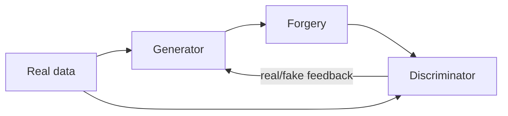
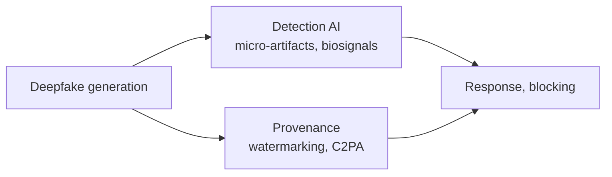

# Deepfake

## 1. Overview

### A. Definition
> A portmanteau of **Deep Learning + Fake**, it is a technology that uses generative AI such as GANs and diffusion models to synthesize and manipulate a specific person's face, voice, or actions so precisely that it is hard to distinguish from reality.

The essence of deepfakes lies in **learning the distribution of a person's features from vast amounts of source data (facial images, audio) and then generating new forgeries that follow the learned distribution**. Whereas past synthesis (Photoshop) was a human manually manipulating pixels, deepfakes are qualitatively different in that the AI itself learns "what looks real" and generates it automatically—making them all the more precise and capable of mass production.

### B. Background and Necessity of Its Emergence
There are two axes behind the rise of deepfakes as a social problem. One is the **technical maturity** whereby the advent of GANs (2014) and diffusion models pushed generation quality beyond human visual discrimination; the other is the **explosion in accessibility** whereby anyone can easily create them with open-source tools and apps. Combined with the ultra-fast diffusion channel of social media, a sophisticated forgery is spread without verification the moment it is created, leading to serious harm such as **manipulation of public opinion, financial fraud, and sexual exploitation content**. For this reason, with deepfakes, the key challenge—more than the technology itself—is how to break the chain of "creation-diffusion-abuse."

## 2. Generation Principle

The most representative principle is the **GAN (Generative Adversarial Network)**, which pits a **Generator** that creates forgeries against a **Discriminator** that distinguishes real from fake. The generator makes increasingly sophisticated forgeries to fool the discriminator, and the discriminator improves to catch them better; at the equilibrium point of this **adversarial learning (a minimax game)**, forgeries emerge that even the discriminator cannot distinguish. Face swapping uses an **autoencoder** that compresses and reconstructs the faces of two individuals while swapping their features, and recently **diffusion models**, which create images by progressively removing noise, have become mainstream by offering higher quality and text-based control. For example, a voice deepfake that clones a specific person's voice from just a few seconds of audio sample to forge a call demanding "send money urgently" has been reported as abused in actual financial fraud.

| Technology | Principle |
|---|---|
| **GAN** | Refines forgeries through adversarial learning of generator and discriminator |
| **Autoencoder** | Face swap by extracting and reconstructing facial features |
| **Diffusion model** | High-quality, text-controlled generation via a noise-removal process |

## 3. Uses and Abuses

A dilemma of deepfakes is that the same technology divides into beneficial and harmful functions depending on how it is used. On the beneficial side, it creates creative and industrial value, such as de-aging and multilingual dubbing in film, restoring the deceased, virtual-human marketing, and educational and medical simulations. Harmful functions, on the other hand, stem from **stealing someone's identity without their consent**, and their harm is direct and hard to recover from—manipulating elections and public opinion with false information, committing financial fraud through voice cloning, or creating defamation and illegal sexual exploitation content through face synthesis. In particular, risk has become universal in that not only celebrities but also ordinary people can become victims with just a few photos from social media.

| Beneficial functions | Harmful functions (abuse) |
|---|---|
| Film, dubbing, restoration; virtual humans | Disinformation, fake news; election and opinion manipulation |
| Educational and medical simulation | Voice-clone phishing (financial fraud) |
| Advertising and content production | Defamation, illegal sexual exploitation content |

## 4. Detection and Countermeasure Technologies

Countermeasures are broadly divided into two directions: **post-hoc detection** and **pre-emptive provenance**. Detection technology uses AI to catch minute traces left by the forgery process—for example, unnatural eye blinking, the absence of subtle skin blood-flow signals (rPPG), and artifacts in the frequency domain. However, detection is inherently a **chasing defense**, with the limitation that as generation technology evolves it is breached again. So the fundamental alternative that has emerged is **provenance**. **C2PA and digital watermarking**, which cryptographically sign content as genuine at the generation or capture stage, flip the concept—"proving what is real" instead of "finding the fake." Only when legislation with labeling obligations and penalties, plus media literacy education, are added to this is an effective response completed.

| Category | Countermeasure |
|---|---|
| **Technology (detection)** | Deepfake detection AI (biosignals, frequency artifacts) |
| **Technology (provenance)** | Digital watermarking, content provenance certification (**C2PA**) |
| **Institutional** | Legislating labeling obligations and penalties for generated content, platform takedown obligations |
| **Awareness** | Blocking uncritical diffusion through media literacy education |

## 5. Considerations and Implications (Professional Engineer's Perspective)
- **Asymmetric competition of spear and shield**: Because generation evolves faster than detection, relying on detection alone leads to certain defeat. Strategy must shift toward **provenance**, embedding signatures in the original.
- **Linkage with generative AI regulation**: The EU AI Act and others are trending toward regulating labeling obligations for deepfake-generated content, and along with amendments to Korea's Public Official Election Act and Act on Sexual Violence Punishment, institutional arrangements for labeling, punishment, and takedown are needed.
- **Platform responsibility and international cooperation**: Platforms, the channels of diffusion, should be given prompt detection and takedown obligations, but because of the cross-border nature, effectiveness is low without international cooperation.
- **AI trustworthiness perspective**: Responding to deepfakes is ultimately a matter of protecting "a society that can trust what is real," and it calls for building a societal response system encompassing technology, institutions, and education.

---

> **In one line**: A deepfake is a technology that *precisely forges a person's face and voice with generative AI such as GANs and diffusion models*; amid the asymmetric competition of generation vs. detection, detection AI alone has limits, so a multilayered response combining **provenance (C2PA, watermarking), legislation, and media literacy** is needed.
