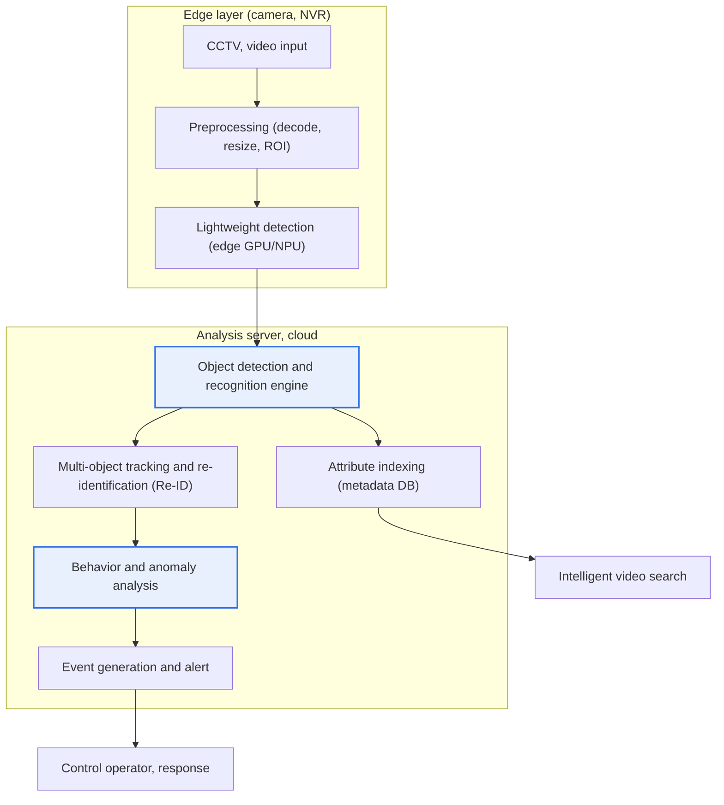
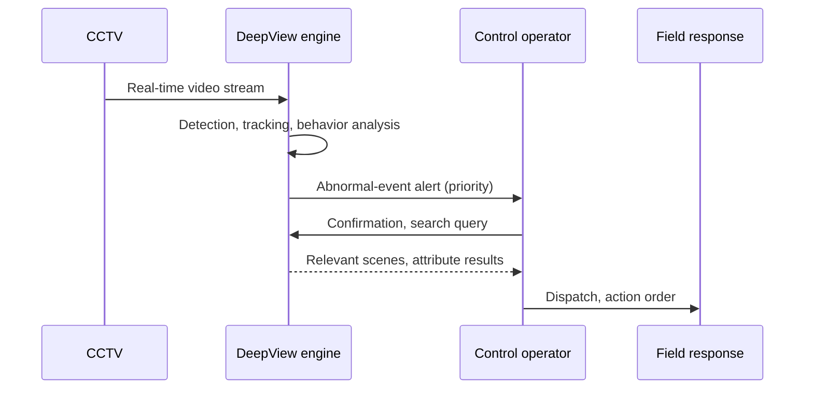

# DeepView

## 1. Overview

### A. Definition
> DeepView is a deep-learning-based **intelligent video and object recognition analysis technology**. It belongs to the intelligent video surveillance (VCA, Video Content Analysis) family that automatically detects, recognizes, searches, and predicts people, vehicles, actions, and abnormal situations in large-scale video streams from CCTV and the like.

The core value of DeepView lies in having **AI monitor and analyze, on behalf of humans, vast amounts of video that no person can fully watch**. Today a single integrated control center of a local government is responsible for thousands to tens of thousands of CCTVs, but a persistent field problem is that a single control operator can meaningfully watch only a few dozen screens at a time. Human attention drops sharply after 20-40 minutes, and the probability of missing an abnormal situation rises greatly when monitoring multiple screens at once. As a result, most video has functioned only as a passive recording device that is "played back after an incident occurs."

DeepView fundamentally changes this structure. Deep-learning neural networks "understand" the objects in video frames and the temporal action patterns those objects create, detecting situations such as intrusion, loitering, abandonment, crowding, and collapse in real time and immediately raising alerts. It also searches vast amounts of video within seconds based on attributes—such as "an adult male wearing a red top" or "a black SUV"—dramatically shortening the tracking of suspects and suspect vehicles that used to take hours. In other words, DeepView is a technology that converts CCTV from a "recording device" into a "**control subject that perceives and judges situations on its own**," aiming to prevent incidents in advance and raise response speed in the fields of crime prevention, traffic, industrial safety, and disaster.

### B. Background and Necessity of Its Emergence
The background to DeepView's rise is explained by the intersection of three currents. First, the **explosive increase in CCTV**. Public-institution CCTVs in Korea have grown at double-digit rates every year since the 2010s and are now estimated to number in the millions; adding private CCTVs and vehicle dashcams, the count has already far exceeded what humans can handle. The structural imbalance of "installations increasing while monitoring personnel stay the same" made the need for automatic analysis urgent.

Second, the **leap in deep-learning video recognition performance**. After CNN-family models beat existing techniques by a wide margin at the 2012 ImageNet competition, performance in video classification, object detection, and re-identification improved rapidly, approaching human-level recognition accuracy under certain conditions. Rule-based methods (background subtraction, optical flow) had low practicality due to frequent false alarms under changes in lighting, shadows, and crowd situations, but deep learning, which learns from data, is far more robust to such noise and cleared the threshold for real-world application.

Third, **strategic investment at the national R&D level**. DeepView is known as a flagship brand of national R&D projects on intelligent video analysis led by Korea's Ministry of Science and ICT and ETRI (Electronics and Telecommunications Research Institute), promoted under the goal of localizing real-time multi-object analysis technology targeting large-scale, real-environment CCTV. Thus DeepView is used not merely as a commercial product name but as a term that jointly denotes the technology category of "intelligent video analysis" and the national R&D achievement.

## 2. Overall Structure and Processing Pipeline

The overall structure of DeepView can be understood as a pipeline running from "video acquisition → preprocessing → deep-learning analysis engine → event/alert → search/storage." The structure diagram below shows the typical arrangement in which the camera side (edge) and the server/cloud divide roles to secure both real-time performance and accuracy.

In this pipeline, the front end (edge) performs primary lightweight detection at the camera or NVR to reduce bandwidth and latency, sending only meaningful frames and objects to the server. The server/cloud handles heavy recognition, tracking, behavior analysis, and large-scale indexing. The reason for dividing layers this way is directly connected to the trade-off between real-time performance and cost discussed later under "Considerations."

### A. Object Detection
Object detection is the starting point of DeepView; it is the stage that simultaneously finds the "location (bounding box)" and "type (class)" of objects of interest—people, vehicles, bicycles, bags—in a single frame. The early two-stage approach (the R-CNN family), which first extracts candidate regions and then classifies them, was accurate but slow. The one-stage approach that emerged afterward, the YOLO (You Only Look Once) and SSD families, divides the image into a grid at once and regresses the location and class simultaneously, enabling real-time processing of tens of frames per second without greatly sacrificing accuracy.

The real-environment video DeepView handles constantly faces adverse conditions such as lighting changes, backlight, rain and fog, distant small objects, and heavy occlusion within crowds. For this reason, simply importing a model that works well on public datasets is insufficient; domain-specific retraining and data augmentation tailored to the actual CCTV field of view, resolution, and installation angle determine performance. For example, at a camera installed obliquely above an intersection, people are captured as viewed from above, so the accuracy of a model trained mainly on frontal pedestrians plummets.

### B. Object Tracking and Re-Identification (Tracking & Re-ID)
If detection is looking at "a photo of a single frame," tracking is the work of "stitching the same object together along the time axis." Multi-object tracking (MOT) links the boxes detected in consecutive frames by the same object to form movement trajectories. Only with these trajectories does behavior analysis such as "where it appeared and where it moved" and "how long it stayed" become possible.

Re-Identification (Re-ID) goes one step further, recognizing the same person or vehicle again across multiple non-overlapping cameras. For example, when a target that disappeared from camera A is captured again at camera B 200 m away, whether it is the same person is estimated from the similarity of appearance feature vectors such as clothing color, body shape, and gait. Because Re-ID works even when the face is not visible, it is useful for wide-area tracking, but it is vulnerable to differences in lighting and image quality and to similar clothing, so managing mismatches is important.

### C. Behavior and Anomaly Analysis (Behavior/Anomaly Analysis)
This is the stage where DeepView adds the most value. It interprets "patterns over time" that cannot be known from the object information of an individual frame alone, and judges them as meaningful events. Representative examples include intrusion crossing a set line (virtual line crossing), loitering staying long in a specific zone, abandonment of a bag or object left behind, falling to the ground, and abnormal density such as sudden crowding or dispersal.

This analysis runs two families of approaches in parallel. One is rule-based, in which an administrator defines rules (e.g., "if someone stays inside this polygon for more than 30 seconds, judge it as loitering"); the other is learning-based (anomaly detection), which learns normal patterns and flags deviations from them as anomalies. Rule-based approaches are easy to understand and control but miss unexpected anomalies, while learning-based approaches catch even unknown anomalies but make it hard to explain "why it is an anomaly"—so the two are in a complementary relationship. Recently, methods that extract a person's joint movements via pose estimation to more precisely judge behaviors such as assault and falls have been spreading.

### D. Intelligent Video Search (Intelligent Search)
If the detection and recognition results are indexed as "metadata," conditional search becomes possible without replaying the original video. For a query such as "yesterday between 14:00 and 16:00, the front-gate camera, an adult in a red top carrying a bag," the system queries the indexed attributes and picks out only the relevant scenes within seconds. Cases have been reported at several local-government integrated control centers where the work of a control operator rewinding tens of hours of video to find a specific person or vehicle in past investigations was shortened to the level of minutes after introducing DeepView. This is the point that most directly demonstrates DeepView's effectiveness.

The table below organizes the above technology elements. The table is merely a supporting means, and the "why" of each element is as described in the paragraphs above.

| Technology element | Core function | Representative technique | Practical difficulty |
|---|---|---|---|
| Object detection | Detect location + type | YOLO, SSD, R-CNN | Small size, occlusion, bad weather |
| Tracking, Re-ID | Link trajectories, wide-area identity | MOT, Re-ID | Mismatch on similar appearance |
| Behavior, anomaly analysis | Judge temporal patterns | Rules + anomaly detection, pose | Balance of false alarm/miss |
| Intelligent search | Attribute-based lookup | Metadata indexing | Indexing accuracy |
| Edge/accelerated processing | Real-time large-volume processing | GPU, NPU, edge | Cost, heat, bandwidth |

## 3. Application Fields and Cases

Viewing DeepView's processing flow from an incident-response perspective, it can be summarized as the process below. This detail flow diagram emphasizes the closed loop in which "detection leads directly to response."

In the crime prevention and public safety field, it detects signs of intrusion, loitering, and assault around schools and crime-prone areas to induce preemptive patrols and dispatches, and when an incident occurs, it quickly tracks suspects and suspect vehicles across a wide-area camera network. For example, a representative use is reconstructing a movement path in a missing-child search by simultaneously searching many cameras with descriptive attributes.

In the traffic field, it automatically detects vehicle flow, congestion, wrong-way driving, illegal parking, and traffic accidents and links them with signal control and emergency response. By tallying directional traffic volumes at a specific intersection in real time to optimize signal cycles, congestion is eased—serving as a core sensor of smart-city traffic infrastructure.

In the industrial safety field, it detects non-wearing of helmets and safety belts, entry into hazardous zones (the radius of heavy equipment), and signs of falling or entrapment at construction and manufacturing sites to prevent serious accidents. As regulations related to serious accident punishment have recently been strengthened, demand for such intelligent safety monitoring is rapidly increasing. In addition, in retail, it analyzes visitor traffic lines, dwell time, and age/gender estimation (de-identified statistics) to use for store layout and marketing.

| Field | Representative use | Expected effect |
|---|---|---|
| Crime prevention, public safety | Detecting intrusion, loitering, assault; tracking suspects | Prevention, shorter arrest time |
| Traffic | Detecting congestion, accidents, illegal parking, wrong-way driving | Signal optimization, accident response |
| Industrial safety | Detecting non-use of protective gear, entry into hazardous zones | Preventing serious accidents |
| Disaster, environment | Detecting fire, smoke, water level, crowd risk | Early warning |
| Retail | Analyzing traffic lines, dwell, demographics | Store operation optimization |

## 4. In-Depth: Latest Trends and Distinction from Existing Rule-Based Approaches

In terms of technology trends, the DeepView family is evolving in several directions. First, the **move to edge AI**. Initially all video was gathered at a central server for analysis, but due to bandwidth, storage cost, and latency issues, "edge intelligent cameras" that mount an NPU in the camera itself and perform primary inference on site are spreading. This also has a privacy-side advantage in that original video containing personal data is transmitted only to a minimum.

Second, the **combination with vision-language models (VLM) and generative AI**. Recently, research on summarizing and querying video scenes in natural language has been active. In a form where the system generates a summary answer to a natural-language question such as "was there anything unusual in the past hour," there is significant potential to greatly improve the usability of control. However, because there are risks of hallucination and misjudgment, it is reasonable to understand that limited application after verification is being cautiously discussed in areas with high error cost, such as public safety and safety.

Third, the **arrangement of standards and governance**. A testing and certification system to objectively evaluate the performance of intelligent video analysis, along with discussions of the social acceptability and legal frameworks of face and behavior recognition, are proceeding in parallel. With a regulatory environment forming—such as the EU AI Act treating real-time biometric identification in public spaces as a high-risk, restricted category—the DeepView family of technologies has entered a phase where it must secure both "technical accuracy" and "legal and ethical legitimacy."

The fundamental difference from existing rule-based VCA lies in "what the human defines." In rule-based approaches, a human designed features such as background subtraction and motion thresholds, so false alarms were frequent with lighting, shadows, and swaying leaves, and readjustment was needed when the environment changed. In contrast, deep-learning-based approaches learn the features themselves from vast data, so they are robust to environmental changes and can handle new situations by adding data for further training. This difference was the decisive factor that lowered the real-environment false-alarm rate and made intelligent control—which used to be neutralized by "alarm fatigue"—actually usable.

## 5. Considerations and Implications (Professional Engineer's Perspective)

1. **Balancing privacy and human rights with technology**: Because DeepView recognizes and tracks faces, behaviors, and traffic lines at large scale, concerns about personal-data infringement and a surveillance society are inherently attached. Under the principles of purpose limitation and minimal collection, always-on masking (de-identification), selective de-identification that an authorized person restores only when necessary, access control, audit logs, and retention-period limits must be reflected from the design stage (privacy by design). The legitimacy of introducing the technology is judged not by "how well it catches" but by "how it prevents abuse."

2. **Trade-off between real-time performance and cost (edge vs. cloud)**: Processing multi-camera video of tens of frames per second with low latency requires substantial computing resources. Sending everything to the cloud raises problems of bandwidth, storage cost, and latency, while pushing everything to the edge increases camera unit cost, heat, and maintenance. Designing a hybrid architecture that allocates edge-cloud roles according to camera density, required latency, and analysis difficulty becomes a key decision.

3. **Managing accuracy, bias, and explainability**: If there are many false alarms, control operators come to ignore alerts and the system is neutralized, while a miss leads directly to neglecting an incident. The balance point of these two errors must be adjusted to fit the risk cost of the application domain. Also, recognition bias toward a specific race, gender, or age can lead to social discrimination, so one must train and validate with diverse real-environment data and leave an explainable (XAI) basis for why a given judgment was made to secure accountability.

4. **Standards, interoperability, and localization strategy**: In an environment where cameras, NVRs, analysis engines, and control platforms are all different, interface standards such as ONVIF and open metadata linkage are important to avoid vendor lock-in. In addition, given that DeepView is a national R&D achievement, localizing the core recognition engine and building a performance verification system also have strategic significance for technological sovereignty and supply-chain stability.

5. **Operational governance and continuous improvement (MLOps perspective)**: DeepView is not a system that ends at deployment but a living model whose performance degrades (model drift) with seasonal, lighting, and installation-environment changes. Without an operational system that continuously collects and retrains on false-alarm cases, monitors performance metrics, and manages model versions, the initial performance degrades quickly. A perspective of "continuous operation," not "build once," is essential.

## References
- ETRI, Introduction to intelligent video analysis (DeepView) research, https://www.etri.re.kr
- Korea Internet & Security Agency (KISA), Guide to the intelligent CCTV certification scheme, https://www.kisa.or.kr
- Personal Information Protection Commission, Policy on the operation and management of video information processing devices, https://www.pipc.go.kr
- Redmon et al., "You Only Look Once (YOLO): Unified, Real-Time Object Detection," https://arxiv.org/abs/1506.02640

---

> **In one line**: DeepView is a *deep-learning-based intelligent video analysis technology* that, through object detection, tracking/re-identification, behavior analysis, and intelligent search, converts CCTV into an active control subject; it is used in crime prevention, traffic, and industrial safety, but privacy protection, the balance of real-time performance and cost, accuracy and bias management, and continuous operation are the key challenges.
